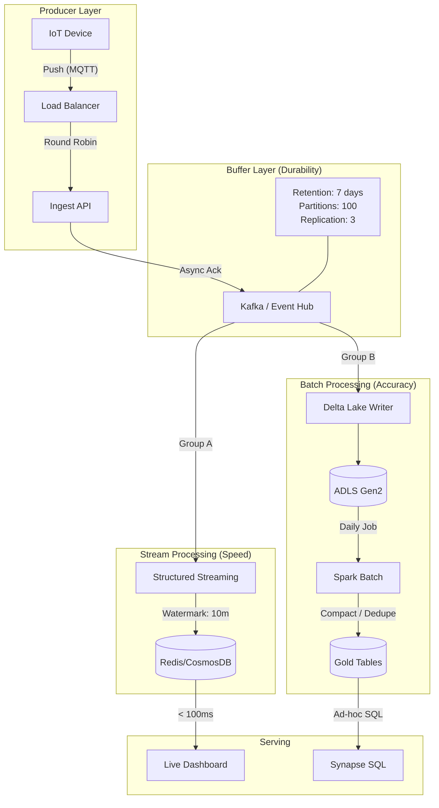

# Architecture Design Patterns & Framework

> **Senior Staff Level Guide**: Moving from "drawing boxes" to "designing systems".
> This framework is modeled after "Designing Data-Intensive Applications" (Kleppmann) & Principal Engineer interviews.

---

## 🏗️ The Senior Staff Mindset

**Junior/Mid-level Engineer**: "I'll use Kafka and Spark."
**Senior/Staff Engineer**: "Given the 500ms latency requirement and 99.99% availability target, we need an event-driven architecture. A pulled-based batch model won't meet the SLA. We should use a log-based message broker for durability, but we must discuss the trade-off of eventual consistency."

**The Framework:**
1.  **Clarify Constraints** (Volume, Velocity, Variety, Veracity, Value)
2.  **Estimate Capacity** (Back-of-the-envelope math)
3.  **Define Access Patterns** (Read-heavy vs Write-heavy, Latency sensitive?)
4.  **Component Selection with Trade-offs** (Why X and not Y?)
5.  **Operational Excellence** (Failure modes, Observability)

---

## 1. Clarifying Constraints (The 5 Vs + SLAs)

Before drawing a single box, define the boundary conditions.

| Constraint | Interview Question to Ask | Why It Matters |
| :--- | :--- | :--- |
| **Volume** | "What is the daily ingestion rate and retention period?" | TBs vs PBs determines Storage (HDFS vs Object Store) and Compute (SMP vs MPP). |
| **Velocity** | "What is the max allowing latency from event to dashboard?" | < 1s (Flink/Speed Layer), < 1min (Micro-batch), > 1hr (Batch). |
| **Variety** | "Is the schema fixed, evolving, or unknown (schemaless)?" | Schema-on-Write (SQL DB) vs Schema-on-Read (Data Lake/NoSQL). |
| **Availability (SLA)** | "Can the system be down for maintenance? (99.9% vs 99.999%)" | Redundancy strategy, Active-Active vs Active-Passive DR. |
| **Consistency** | "Can users see slightly stale data?" (CAP Theorem) | Strong Consistency (HBase/RDBMS) vs Eventual Consistency (Cassandra/DNS). |

---

## 2. Capacity Planning (Back-of-the-Envelope Math)

*Interviewers love this. Do the math out loud.*

**Scenario**: Ingesting user clicks.
-   **100 Million DAU** (Daily Active Users).
-   Avg 10 clicks per user/day.
-   Each click = 1 KB.
-   Peak traffic = 5x average.

**Calculations**:
1.  **Total Events/Day**: $100M \times 10 = 1 \text{ Billion events/day}$.
2.  **Requests Per Second (RPS)**:
    -   $10^9 / 86400 \approx 11,500 \text{ RPS (avg)}$.
    -   Peak $\approx 57,000 \text{ RPS}$.
3.  **Throughput**:
    -   $11,500 \times 1 \text{ KB} \approx 11.5 \text{ MB/s}$.
    -   Peak $\approx 57.5 \text{ MB/s}$.
4.  **Storage**:
    -   $1 \text{ Billion} \times 1 \text{ KB} = 1 \text{ TB/day}$.
    -   3 year retention = $1 \text{ TB} \times 365 \times 3 \approx 1.1 \text{ PB}$.

**Design Implication**:
-   **57k RPS?** A single HTTP server can't handle this safely. Need a Load Balancer + Auto-scaling Group.
-   **57 MB/s Ingest?** Kafka is perfect (handles GB/s). RDBMS inserts might choke (B-Tree splits).
-   **1 PB Storage?** RDBMS is too expensive ($$$/GB). Must use Object Storage (ADLS/S3).

---

## 3. Ingestion Patterns: Push vs Pull

### Pattern A: Push-Based (Event Driven)
*Source pushes data to Ingestion as it happens.*
-   **Example**: IoT Device -> MQTT -> Event Hub.
-   **Pros**: Lowest latency (Real-time).
-   **Cons**: Backpressure risk. If ingestion is slow, source might crash or drop data. **Must** use a buffer (Kafka).

### Pattern B: Pull-Based (Batch/Schedule)
*Ingestion polls source periodically.*
-   **Example**: ADF -> JDBC Select -> ADLS.
-   **Pros**: Easier flow control. Downstream controls the speed.
-   **Cons**: Higher latency (Poll interval). Redundant load (Polling unchanged data).

### Decision Matrix
| Feature | Push (Streaming) | Pull (Batch) |
| :--- | :--- | :--- |
| **Latency** | Low (ms/sec) | High (min/hr) |
| **Complexity** | High (State management, out-of-order) | Low (Stateless jobs) |
| **Load on Source** | Constant (smoothing spikes) | Spiky (heavy query at 2 AM) |
| **Interview Choice** | Use **Push** + **Buffer** for modern Scalable systems. Use **Pull** for legacy DB sources. |

---

## 4. Storage Engine Internals (LSM vs B-Tree)

*Deep dive: Why is Cassandra/HBase write-optimized vs MySQL read-optimized?*

### Log-Structured Merge (LSM) Trees
*Used by: Kafka, Cassandra, HBase, RocksDB.*
-   **Mechanism**: Writes go to In-Memory Buffer (MemTable). When full, flushed to disk as Sorted String Table (SSTable) (Immutable). Background compaction merges SSTables.
-   **Trade-off**:
    -   **Writes**: 🚀 **Extremely Fast** (Append-only seq write).
    -   **Reads**: 🐢 Slower (Check MemTable + multiple SSTables + Bloom Filters).
-   **Use Case**: High velocity ingestion (Telemetry, Logs).

### B-Trees
*Used by: PostgreSQL, SQL Server, Oracle.*
-   **Mechanism**: Data stored in fixed-size pages. Updates require modifying the page in-place (random I/O).
-   **Trade-off**:
    -   **Writes**: 🐢 Slower (Random I/O, Page Splits, Locking).
    -   **Reads**: 🚀 **Extremely Fast** (Index seeks).
-   **Use Case**: Transactional systems, flexible queries.

**Interview Win**: "Since we calculated 57k write RPS, an LSM-based storage (like Cassandra or Kafka) is superior to a B-Tree RDBMS because it avoids random disk I/O penalties during ingestion."

---

## 5. Processing Patterns (Unifying Batch & Stream)

### The "Watermark" Concept (Handling Late Data)
*Essential for correctness in distributed time.*

-   **Event Time**: When the user clicked (embedded in JSON).
-   **Processing Time**: When the server saw the click.
-   **Skew**: The difference.
-   **Problem**: Mobile user goes into a tunnel at 10:00, clicks "Buy". Signal reaches server at 10:15.
-   **Solution**: **Watermarks**. "We will process the 10:00-10:10 window, but wait until 10:15 for stragglers. Data arriving after 10:15 is 'Too Late' (dropped or side-output)."

### Distributed Join Strategies
*How to join 1 Petabyte with 1 Gigabyte?*

1.  **Broadcast Hash Join (Map-Side Join)**:
    -   Small table (Dimensions) sent to ALL nodes.
    -   Large table (Fact) stays partitioned.
    -   **No Shuffle** = massive speedup.
    -   *Condition*: Small table fits in memory.

2.  **Shuffle Hash Join**:
    -   Both tables partitioned by Join Key.
    -   Rows with same Key move to same executor.
    -   **High Network I/O**.
    -   *Condition*: Both tables are large.

3.  **Sort Merge Join**:
    -   Sort both partitions, then iterate.
    -   Default in Spark for large tables.
    -   Robust against memory OOMs, but CPU heavy (sorting).

---

## 6. Failure Modes & Recovery (The "What If")

*The Interviewer will try to break your system.*

| Scenario | Component | Impact | Mitigation Strategy |
| :--- | :--- | :--- | :--- |
| **Broker Failure** | Kafka | Partition leader unreachable. | **Replication Factor 3**, `min.insync.replicas=2`. Leader Election takes over. |
| **Worker Crash** | Spark | Task fails mid-processing. | **Lineage**. Driver reschedules task on another executor. Data re-read from source. |
| **Corrupt Data** | Storage | Bad schema arriving. | **Dead Letter Queue (DLQ)**. Don't crash the pipeline, quarantine the bad record. |
| **Thundering Herd** | API/DB | Service recovers, 10k clients retry at once. | **Exponential Backoff + Jitter**. Circuit Breakers. |
| **Region Outage** | Cloud | Data Center burns down. | **Geo-Replication** (RA-GRS). Active-Passive DR plan (RPO/RTO defined). |

---

## 7. Putting It Together: The Comprehensive Diagram

Don't just draw boxes. Annotate with **Decisions**.

## Review Checklist for Your Design
1.  Did I mention **Scale**? (Partitions, Sharding).
2.  Did I handle **Failure**? (Retries, DLQ).
3.  Did I justify **Storage**? (Cost, Access Pattern).
4.  Did I consider **Late Data**? (Watermarks).

---

## 📖 Next Topic
Continue to [Databricks Notebook Orchestration](./03-databricks-notebook-orchestration.md) to see how to implement the processing layer logic.
