# Orchestration Patterns & Workflow Management

> **Senior Staff Level Guide**
> It's not just about "running notebooks." It's about Dependency Management, Idempotency, and SLA Guarantees.

---

## 🏗️ The Orchestrator's Role

In a distributed data system, the Orchestrator has 4 critical jobs:
1.  **Schedule**: "Run this every hour."
2.  **Dependency Management**: "Run B only after A succeeds."
3.  **State Management**: "Did yesterday's run fail? Should I retry?"
4.  **Backfilling**: "Re-run the last 30 days because logic changed."


> **Staff Level Insight**: Notice the separation of concerns. The **Control Plane** (Airflow) manages the logic and state, while the **Data Plane** (Spark) handles the heavy lifting. The **DLQ** ensures that a single bad record doesn't block the entire pipelin—a critical pattern for SLA guarantees.

### Architecture Decision: Pure Orchestrator vs Hybrid

| Type | Example | Role | Trade-off |
| :--- | :--- | :--- | :--- |
| **Simple Scheduler** | Cron | Just prevents drift. | No dependency mgmt. "Fire and forget." |
| **Orchestrator** | Airflow | Manages State + Dependencies. | "Central Brain." Can become a bottleneck. |
| **Hybrid** | ADF + Databricks | ADF triggers; Databricks manages compute. | Separation of concerns. Best practice for Azure. |

---

## 1. Tool Selection Framework (Staff Level Choice)

"Why did you choose Airflow over ADF?" is a guaranteed interview question.

| Feature | **Apache Airflow** | **Azure Data Factory (ADF)** | **Databricks Workflows** |
| :--- | :--- | :--- | :--- |
| **Paradigm** | **Code-as-Configuration** (Python) | **Low-Code / UI-Based** (JSON) | **Native Integration** |
| **Dynamic DAGs** | ✅ Excellent (Python loops) | ❌ Hard (ForEach logic limited) | ⚠️ Moderate |
| **Connectivity** | Infinite (Custom Python Operators) | Limited to Azure Services | Databricks ecosystem only |
| **Learning Curve** | High (Deployment, K8s) | Low (Drag & Drop) | Low (Simple UI) |
| **Cost** | Compute (AKS/VM) overhead | Pay-per-activity run | Included in DBU price |
| **Use Case** | Complex logic, Cross-cloud | Azure-native, ETL mostly | Spark-heavy pipelines |

**The Senior Answer:**
"We chose **ADF** for the high-level trigger because it integrates natively with Azure Event Grid for file arrival events. However, we delegate the complex dependency logic to **Databricks Workflows** (via the ADF Linked Service) because it offers better visibility into Spark tasks and 40% lower cost than running interactive clusters via ADF directly."

---

## 2. DAG Design Patterns

### Pattern A: The "Sensor" Pattern (Event-Driven)
Instead of starting at 9:00 AM, the DAG waits for a condition.
-   **Airflow**: `S3Sensor`, `ExternalTaskSensor`.
-   **ADF**: `Storage Event Trigger`.
-   **Architecture**: Decoupled. Downstream doesn't run until upstream confirms data availability.

### Pattern B: The "Generator" Pattern (Dynamic DAGs)
*Problem*: You ingest data for 500 different partners.
*Junior Approach*: create 500 static DAG files.
*Senior Approach*: One Python file that **generates** 500 DAG objects based on a config list.
-   **Pros**: DRY (Don't Repeat Yourself). Update logic in one place.
-   **Cons**: Parse time overhead in Airflow.

### Pattern C: The "Controller" Pattern (Orchestration vs Choreography)
-   **Orchestration (Conductor)**: Central server (Airflow) tells Service A, then Service B what to do.
    -   *Pros*: clear visualization, easy error handling.
-   **Choreography (Dancers)**: Service A completes, emits event `TaskFinished`. Service B subscribes and starts.
    -   *Pros*: Highly scalable, loose coupling.
    -   *Cons*: "Distributed Monolith". Hard to debug "Why didn't Service C run?"

---

## 3. Idempotency & State

**The Golden Rule**: *Running a pipeline twice should produce the same result as running it once.*

### Determining "Time"
Never use `datetime.now()` in your pipeline code.
-   **Logical Date (Execution Date)**: The date the run was *scheduled* for (e.g., "Data for Jan 1st").
-   **Run Date**: The date the run *actually happened* (e.g., "Jan 2nd due to delay").
-   **Architecture Rule**: Always pass **Logical Date** as a parameter.
    -   File Path: `/data/date={logical_date}/`
    -   Query: `SELECT * FROM source WHERE created_at = {logical_date}`

### Handling Reprocessing (Backfills)
To backfill 1 year of data:
1.  **Delete/Overwrite Strategy**:
    -   `INSERT OVERWRITE PARTITION (date='2023-01-01')`.
    -   Safe. Downstream sees atomic swap.
2.  **Merge Strategy**:
    -   `MERGE INTO target USING source ON key`.
    -   Slower, but handles updates within the partition.

---

## 4. Failure Handling & Recovery

### Retry Policies
-   **Transient Errors** (Network blip): Retry immediately (3 times).
-   **Resource Errors** (OOM): Retry with delay (Exponential Backoff).
-   **Logic Errors** (Bad Code): **Do Not Retry**. Fail fast.

### Dead Letter Queues (DLQ)
When DAG fails on 1 bad record out of 1 Million:
-   **Bad**: Fail the whole job.
-   **Good**: Route bad record to `/dlq/date=.../errors.json` and proceed. Alert the team.

### SLAs (Service Level Agreements)
-   **Missed SLA**: If job hasn't finished by 8:00 AM, fire PagerDuty alert.
-   **Airflow**: `sla_miss_callback`.

---

## 5. Databricks-Specific Implementation

Even if using ADF/Airflow, the **Databricks Workflow** entity is the unit of work.

```mermaid
graph TD
    %% Staff Level Insight: Separation of Loop (Control) vs Heavy Lifting (Data)
    
    subgraph Control_Plane ["Control Plane (Airflow / ADF)"]
        style Control_Plane fill:#f9f9f9,stroke:#333,stroke-width:2px
        Start([Start Daily Job]) --> Sensor{File Arrived?}
        Sensor -- "Wait (Sensor)" --> Sensor
        Sensor -- "Yes" --> Submit[Submit Spark Job]
        
        Submit --> Monitor{Poll Status}
        Monitor -- "Running..." --> Monitor
        Monitor -- "Success" --> Success([End Success])
        
        Monitor -- "Failure" --> Retry{Retry Count < 3?}
        Retry -- "Yes (Backoff)" --> Submit
        Retry -- "No" --> Alert[🔥 PagerDuty Alert]
    end

    subgraph Data_Plane ["Data Plane (Databricks Cluster)"]
        style Data_Plane fill:#e1f5fe,stroke:#01579b,stroke-width:2px
        direction TB
        Read[Read Raw Files] --> Valid{Schema Check}
        
        %% Resilience Pattern: Handling Bad Data without failing the job
        Valid -- "Pass" --> Transform[Transform Logic]
        Valid -- "Fail" --> DLQ[("⚠️ Write to DLQ (JSON)")]
        
        Transform --> Write[Atomic Write to Delta]
    end

    %% Wiring Control to Data
    Submit -.-> |"Async Trigger API"| Read
    Write -.-> |"Return Exit Code 0"| Monitor
    Alert -.-> |"Return Exit Code 1"| Monitor
```


```

**Why Job Clusters?**
-   **Cost**: ~40% cheaper than Interactive Clusters.
-   **Isolation**: Every job gets a fresh environment (No library conflicts).
-   **Stability**: No "noisy neighbor" problems.

---

## 🎯 Interview Battle Cards

### Q: "How do you handle a backfill for the last 6 months while the daily job is still running?"
**A:** (The "Catch-up" Pattern)
1.  **Idempotency**: Ensure the job takes `date` as a parameter and overwrites that partition.
2.  **Concurrency**: If the daily job writes to `date=2024-01-01`, and backfill writes to `date=2023-06-01`, they are writing to different partitions. Safe to run in parallel.
3.  **Capacity**: Does the cluster have quota for the extra load? Maybe run backfill with lower priority (Spot instances).

### Q: "Airflow scheduler is down. How do you recover?"
**A:**
1.  Airflow stores state in a **Database** (Postgres/MySQL). The Scheduler is stateless.
2.  Restart Scheduler -> It reads DB -> Sees queued tasks -> Resumes.
3.  *Risk*: If DB is lost, state is lost. Backup the Metadata DB!

### Q: "A task fails halfway through. How do you restart?"
**A:**
1.  **Checkpointing**: Spark Structured Streaming manages this automatically.
2.  **Batch**: If writing specific partitions, just re-run.
3.  **Transactional Write**: Use Delta Lake `COPY INTO` or `INSERT OVERWRITE` which are ACID transactions. Partial writes are never visible.

---

## 📖 Next Topic
Continue to [Late-Arriving Data](./04-late-arriving-data.md) to understand how orchestration handles delayed events (The "Business Time" vs "System Time" problem).
