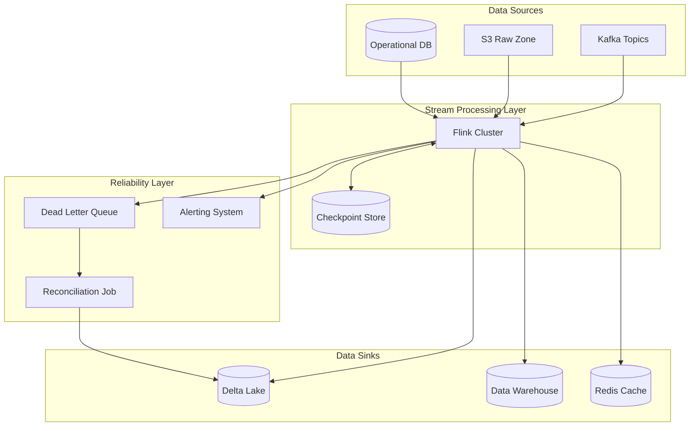
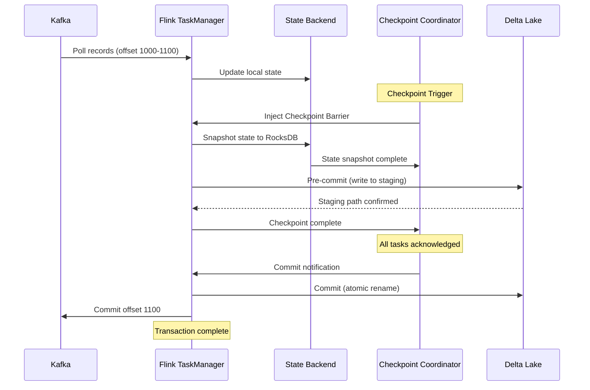
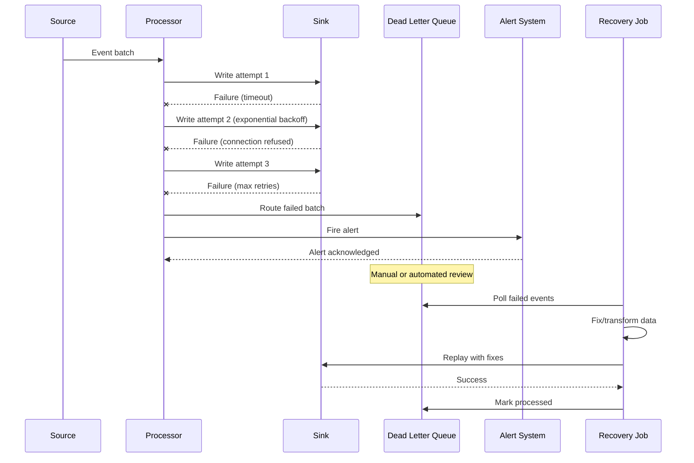
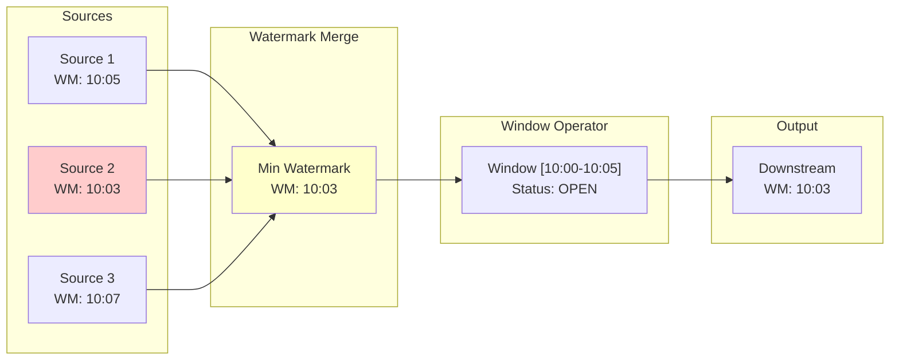

# Data Correctness and Reliability Patterns in Distributed Data Pipelines

> **FAANG Principal Data Architect / Staff Engineer Guide**

---

## Table of Contents

1. [Concept Breakdown](#1-concept-breakdown)
2. [Multiple Analogies](#2-multiple-analogies)
3. [Architecture & Design Variants](#3-architecture--design-variants)
4. [UML / Sequence / Architecture Diagrams](#4-uml--sequence--architecture-diagrams)
5. [Real-Time Issues & Failure Modes](#5-real-time-issues--failure-modes)
6. [Real-Time Scenarios & Interview Questions](#6-real-time-scenarios--interview-questions)
7. [Code Snippets](#7-code-snippets)
8. [Comparisons With Related Concepts](#8-comparisons-with-related-concepts)
9. [Production Best Practices](#9-production-best-practices)
10. [What to Remember for Interviews](#10-what-to-remember-for-interviews)

---

## 1. Concept Breakdown

### What Is Data Correctness and Reliability?

**Data Correctness** ensures that data in a distributed pipeline accurately reflects the source truth at any point in time. **Reliability** guarantees that the pipeline will eventually produce correct results despite failures, network partitions, or system outages.

### The Core Problem

In distributed systems, the **CAP theorem** forces trade-offs. Data pipelines must handle:

| Challenge | Description |
|-----------|-------------|
| **Partial Failures** | Node A succeeds, Node B fails mid-transaction |
| **Network Partitions** | Messages delayed, duplicated, or lost |
| **Clock Skew** | Distributed clocks diverge by milliseconds to seconds |
| **Out-of-Order Events** | Event with timestamp T+10 arrives before T+5 |
| **Exactly-Once Semantics** | Ensuring each record is processed precisely once |

### Deep Technical Internals

#### 1. Idempotency

The foundation of correctness. An operation is idempotent if applying it multiple times produces the same result as applying it once.

```
f(f(x)) = f(x)
```

**Implementation Patterns:**
- **Deduplication Keys**: Hash of `(event_id, timestamp, partition_key)`
- **Upsert Operations**: `MERGE INTO` or `INSERT ON CONFLICT`
- **Idempotent State Machines**: State transitions that converge regardless of replay

#### 2. Checkpointing & Write-Ahead Logs (WAL)

Checkpoints capture pipeline state at consistent boundaries:

```
┌─────────────────────────────────────────────────────────────┐
│  Offset 0    Offset 100   Offset 200   Offset 300          │
│     │            │            │            │                │
│     ▼            ▼            ▼            ▼                │
│  ┌──────┐    ┌──────┐    ┌──────┐    ┌──────┐              │
│  │ CP-1 │    │ CP-2 │    │ CP-3 │    │ CP-4 │              │
│  └──────┘    └──────┘    └──────┘    └──────┘              │
│                              ▲                              │
│                              │                              │
│                     Recovery Point                          │
└─────────────────────────────────────────────────────────────┘
```

**Flink's Two-Phase Commit:**
1. **Pre-commit**: Write data to staging location
2. **Checkpoint**: Barrier propagates through DAG
3. **Commit**: Atomically move staged data to final location

#### 3. Watermarks and Event-Time Processing

Watermarks track the progress of event-time:

```
Watermark(T) = "All events with timestamp < T have been seen"
```

**Watermark Strategies:**
- **Bounded Out-of-Orderness**: `watermark = max_event_time - allowed_lateness`
- **Punctuated Watermarks**: Special marker events in the stream
- **Ingestion-Time**: Falls back to processing time

#### 4. Transactional Outbox Pattern

Ensures atomic writes across database and message queue:

```sql
BEGIN TRANSACTION;
  INSERT INTO orders (id, data) VALUES (...);
  INSERT INTO outbox (event_id, payload, status) VALUES (..., 'pending');
COMMIT;
-- Separate process polls outbox and publishes to Kafka
```

### The Correctness Spectrum

```
┌────────────────────────────────────────────────────────────────┐
│                                                                │
│   At-Most-Once        At-Least-Once         Exactly-Once      │
│       │                    │                     │             │
│       ▼                    ▼                     ▼             │
│   ┌───────┐            ┌───────┐            ┌───────┐         │
│   │ Fire  │            │ Retry │            │ Dedup │         │
│   │ and   │            │ Until │            │   +   │         │
│   │Forget │            │Success│            │Transact│         │
│   └───────┘            └───────┘            └───────┘         │
│                                                                │
│   Data Loss OK     Duplicates OK       No Loss, No Dups       │
│   (Metrics/Logs)   (Idempotent Sinks)  (Financial Data)       │
│                                                                │
└────────────────────────────────────────────────────────────────┘
```

---

## 2. Multiple Analogies

### 2a. Real-World Analogy: Air Traffic Control

**The System**: An airport managing hundreds of flights simultaneously.

| Pipeline Concept | ATC Equivalent |
|------------------|----------------|
| **Events** | Incoming aircraft |
| **Watermarks** | "All flights scheduled before 3PM have landed" |
| **Checkpoints** | Handoff points between control zones |
| **Idempotency** | Landing clearance is valid once per flight |
| **Late Data** | Delayed flight arriving after its time slot |
| **Dead Letter Queue** | Holding pattern for problematic flights |

**Key Insight**: Just as ATC cannot lose a plane or land it twice, your pipeline cannot lose transactions or duplicate payments.

---

### 2b. Software Engineering Analogy: Git Version Control

| Pipeline Concept | Git Equivalent |
|------------------|----------------|
| **Checkpoint** | Commit hash |
| **Recovery** | `git reset --hard <checkpoint>` |
| **Idempotency** | Same patch applied twice = same result |
| **Watermark** | "All commits before this tag are merged" |
| **Exactly-Once** | Cherry-pick with conflict resolution |
| **Outbox Pattern** | Staging area before push |

**Key Insight**: Like Git ensuring you never lose committed work, pipelines use checkpoints to guarantee recovery to a known-good state.

---

### 2c. Lead Data Engineer Day-to-Day Analogy: The Data Warehouse Load

**Scenario**: Daily batch load of sales transactions.

```
Your Morning Reality:
┌─────────────────────────────────────────────────────────────┐
│                                                             │
│  6:00 AM - Pipeline starts                                  │
│  6:45 AM - Stage 3 of 5 fails (OOM)                        │
│  6:46 AM - Alert fires, you grab coffee                    │
│                                                             │
│  Questions You Ask:                                         │
│  1. What was the last successful checkpoint?               │
│  2. Will restarting cause duplicates?                      │
│  3. Did partial data already reach downstream?             │
│  4. Are late-arriving yesterday's records handled?         │
│                                                             │
│  With Proper Patterns:                                      │
│  - Checkpoint at Stage 2 offset 45678                      │
│  - Idempotent writes: MERGE by transaction_id              │
│  - Downstream isolated: staging → production atomic swap   │
│  - Late data: watermark + allowed_lateness = 2 hours       │
│                                                             │
│  7:15 AM - Restart from checkpoint, verify counts, done    │
│                                                             │
└─────────────────────────────────────────────────────────────┘
```

**Key Insight**: These patterns turn 4-hour firefighting sessions into 30-minute recoveries.

---

## 3. Architecture & Design Variants

### Pattern 1: Checkpoint-Based Recovery

**How It Works**: Pipeline periodically saves state to durable storage.

```
┌──────────┐    ┌──────────┐    ┌──────────┐    ┌──────────┐
│  Source  │───▶│ Process  │───▶│Checkpoint│───▶│   Sink   │
│  (Kafka) │    │ (Flink)  │    │  (S3)    │    │(Delta)   │
└──────────┘    └──────────┘    └──────────┘    └──────────┘
                     │                              │
                     └──────────────────────────────┘
                          State Backend (RocksDB)
```

| Pros | Cons |
|------|------|
| Fast recovery to last checkpoint | Checkpoint overhead (pause) |
| Consistent state across operators | State size limits throughput |
| Well-supported by Flink/Spark | Recovery replays from last CP |

**When to Use**: Stateful stream processing, exactly-once requirements.

---

### Pattern 2: Idempotent Writes with Deduplication

**How It Works**: Sink handles duplicates via unique keys and upsert semantics.

```sql
-- Delta Lake MERGE
MERGE INTO target t
USING source s ON t.id = s.id
WHEN MATCHED THEN UPDATE SET *
WHEN NOT MATCHED THEN INSERT *
```

| Pros | Cons |
|------|------|
| Simple retry logic | Requires idempotent sink |
| No complex state management | Dedup key design critical |
| Works with any processing engine | Storage overhead for keys |

**When to Use**: Batch pipelines, simple streaming, sinks that support MERGE.

---

### Pattern 3: Transactional Outbox + CDC

**How It Works**: Database change capture ensures atomic pub/sub.

```
┌─────────────────┐     ┌─────────────┐     ┌─────────────┐
│   Application   │     │   Debezium  │     │    Kafka    │
│   ┌─────────┐   │     │             │     │             │
│   │  Table  │───┼────▶│  Captures   │────▶│   Topics    │
│   ├─────────┤   │     │  Changes    │     │             │
│   │  Outbox │   │     │             │     │             │
│   └─────────┘   │     └─────────────┘     └─────────────┘
└─────────────────┘
```

| Pros | Cons |
|------|------|
| True atomic guarantees | Additional infrastructure |
| No dual-write problem | CDC lag introduces latency |
| Audit trail built-in | Schema evolution complexity |

**When to Use**: Microservices, event sourcing, strong consistency requirements.

---

### Pattern 4: Saga Pattern with Compensation

**How It Works**: Long-running transactions with rollback actions.

```
Forward: Order → Payment → Inventory → Shipping
Compensate: Cancel Shipping → Restore Inventory → Refund Payment → Cancel Order
```

| Pros | Cons |
|------|------|
| Handles distributed transactions | Complex compensation logic |
| No distributed locks | Eventual consistency only |
| Scalable across services | Debugging is challenging |

**When to Use**: Multi-service workflows, long-running processes.

---

### FAANG Scale Considerations

| Scale Tier | Records/Day | Pattern Recommendation |
|------------|-------------|------------------------|
| **Startup** | < 10M | Simple idempotent writes |
| **Growth** | 10M - 1B | Checkpoint + idempotent sink |
| **FAANG** | > 1B | Tiered: hot stream + cold batch reconciliation |

**At FAANG Scale**:
- Checkpoints every 1-5 minutes (not seconds)
- Parallel checkpoint writes to avoid bottleneck
- Incremental checkpoints (only changed state)
- Separate reliability per data criticality tier

---

## 4. UML / Sequence / Architecture Diagrams

### 4.1 High-Level Architecture



### 4.2 Exactly-Once Sequence Flow



### 4.3 Failure and Retry Flow



### 4.4 Watermark Propagation



---

## 5. Real-Time Issues & Failure Modes

### Issue 1: Checkpoint Timeout

| Aspect | Detail |
|--------|--------|
| **Symptom** | Checkpoint duration exceeds timeout, job restarts |
| **Root Cause** | State size too large, slow state backend, GC pauses |
| **Detection** | Flink UI shows increasing checkpoint duration |
| **Resolution** | Incremental checkpoints, tune RocksDB, reduce state TTL |

### Issue 2: Data Skew Causing Hotspots

| Aspect | Detail |
|--------|--------|
| **Symptom** | One task takes 10x longer than peers |
| **Root Cause** | Partition key has skewed distribution |
| **Detection** | Flink metrics show uneven records per subtask |
| **Resolution** | Salted keys, two-phase aggregation, custom partitioner |

### Issue 3: Watermark Stall

| Aspect | Detail |
|--------|--------|
| **Symptom** | Windows never close, memory grows unbounded |
| **Root Cause** | One partition has no events |
| **Detection** | Monitor `currentWatermark` metric per source |
| **Resolution** | Idleness detection, source-level watermarking |

### Issue 4: Duplicate Records in Sink

| Aspect | Detail |
|--------|--------|
| **Symptom** | Record counts don't match source |
| **Root Cause** | At-least-once without proper dedup |
| **Detection** | COUNT vs COUNT(DISTINCT key) mismatch |
| **Resolution** | Add MERGE/upsert, use exactly-once sink connectors |

### Issue 5: Late Data Dropped

| Aspect | Detail |
|--------|--------|
| **Symptom** | Event counts lower than expected |
| **Root Cause** | Late events arriving after window close |
| **Detection** | Monitor late elements counter |
| **Resolution** | Increase allowed lateness, side output late data |

### Issue 6: Out-of-Order Offset Commits

| Aspect | Detail |
|--------|--------|
| **Symptom** | Data loss after restart |
| **Root Cause** | Offset committed before sink confirmed |
| **Detection** | Gap analysis on partition offsets |
| **Resolution** | Enable exactly-once, commit after sink ACK |

---

## 6. Real-Time Scenarios & Interview Questions

### Scenario 1: The Missing Transactions

**Question**: "Your payment processing pipeline shows 1M records at source but 999,950 at sink. Walk me through debugging this."

**Expected Answer**:
1. Check late data side output - are 50 records within allowed lateness?
2. Examine DLQ for failed records with payment validation errors
3. Compare watermark progress vs event timestamps
4. Verify no filtering logic dropping records
5. Check for skewed partition causing timeout and incomplete batch

---

### Scenario 2: Idempotency Design

**Question**: "Design an idempotent payment processing system. A payment should never be processed twice."

**Expected Answer**:
```python
# Deduplication key structure
dedup_key = f"{payment_id}:{idempotency_key}:{source_system}"

# Check before processing
if await redis.exists(f"processed:{dedup_key}"):
    return PaymentResult.DUPLICATE
    
# Process with distributed lock
async with lock(f"lock:{dedup_key}"):
    result = await process_payment(payment)
    await redis.setex(f"processed:{dedup_key}", TTL_24H, result.id)
    
# Sink with MERGE
MERGE INTO payments USING staged ON payments.dedup_key = staged.dedup_key
WHEN NOT MATCHED THEN INSERT *
```

---

### Scenario 3: Exactly-Once Across Systems

**Question**: "How do you achieve exactly-once semantics from Kafka to Delta Lake?"

**Expected Answer**:
1. **Source**: Consumer manages offsets internally (not auto-commit)
2. **Processing**: Flink checkpoints state + pending outputs atomically
3. **Sink**: Delta Lake transaction with `_delta_log` commit protocol
4. **Coordination**: Two-phase commit - pre-commit writes, checkpoint confirms, then commit

---

### Trick Question 1: Checkpoint Interval

**Question**: "Should checkpoint interval be 1 second or 1 minute?"

**Trap**: Thinking shorter = better

**Correct Answer**: 
- 1 second = excessive overhead, checkpoint never completes
- 1 minute = 1 minute of replay on failure
- **Right answer**: Depends on state size, acceptable replay, throughput. Usually 30s-5min for production.

---

### Trick Question 2: Watermarks Solve Everything

**Question**: "We set watermarks, so late data is handled, right?"

**Trap**: Watermarks alone don't guarantee correctness.

**Correct Answer**: 
- Watermarks define when windows close
- Late data after watermark is DROPPED by default
- Need: allowed lateness + side output + reconciliation job
- Watermarks are necessary but not sufficient

---

### Trick Question 3: Idempotent = Exactly-Once

**Question**: "Our sink is idempotent, so we have exactly-once, correct?"

**Trap**: Conflating delivery semantics.

**Correct Answer**:
- Idempotent sink = duplicate writes have no effect
- Still need: reliable delivery, checkpoint before offset commit
- Without source-side guarantees, data loss is possible
- Exactly-once = at-least-once delivery + idempotent processing

---

## 7. Code Snippets

### 7.1 Idempotent Write with Delta Lake (PySpark)

```python
# ✅ BEST PRACTICE: Idempotent MERGE
from delta.tables import DeltaTable

def idempotent_write(spark, source_df, target_path, merge_keys):
    """Idempotent write using MERGE - safe for retries."""
    
    if DeltaTable.isDeltaTable(spark, target_path):
        target = DeltaTable.forPath(spark, target_path)
        
        merge_condition = " AND ".join(
            [f"target.{k} = source.{k}" for k in merge_keys]
        )
        
        target.alias("target").merge(
            source_df.alias("source"),
            merge_condition
        ).whenMatchedUpdateAll(
        ).whenNotMatchedInsertAll(
        ).execute()
    else:
        source_df.write.format("delta").save(target_path)

# Usage
idempotent_write(
    spark, 
    transactions_df, 
    "s3://lake/silver/transactions",
    merge_keys=["transaction_id", "event_date"]
)
```

```python
# ❌ ANTI-PATTERN: Append without deduplication
transactions_df.write.format("delta").mode("append").save(target_path)
# Problem: Retries create duplicates
```

---

### 7.2 Checkpoint Configuration (Flink)

```python
# ✅ BEST PRACTICE: Proper checkpoint config
from pyflink.datastream import StreamExecutionEnvironment
from pyflink.datastream.checkpointing_mode import CheckpointingMode

env = StreamExecutionEnvironment.get_execution_environment()

# Checkpoint every 60 seconds
env.enable_checkpointing(60000)

# Exactly-once mode
env.get_checkpoint_config().set_checkpointing_mode(
    CheckpointingMode.EXACTLY_ONCE
)

# Minimum 30s between checkpoints
env.get_checkpoint_config().set_min_pause_between_checkpoints(30000)

# Checkpoint timeout 10 minutes
env.get_checkpoint_config().set_checkpoint_timeout(600000)

# Allow 3 concurrent checkpoints
env.get_checkpoint_config().set_max_concurrent_checkpoints(1)

# Retain checkpoint on cancellation
env.get_checkpoint_config().enable_externalized_checkpoints(
    ExternalizedCheckpointCleanup.RETAIN_ON_CANCELLATION
)
```

---

### 7.3 Watermark Strategy (PySpark Structured Streaming)

```python
# ✅ BEST PRACTICE: Watermark with late data handling
from pyspark.sql import functions as F
from pyspark.sql.types import TimestampType

def process_with_watermark(spark, source_df):
    """Process stream with proper watermark handling."""
    
    return (
        source_df
        # Define watermark: tolerate 2 hours of lateness
        .withWatermark("event_time", "2 hours")
        
        # Window aggregation
        .groupBy(
            F.window("event_time", "1 hour"),
            "region"
        )
        .agg(
            F.sum("amount").alias("total_amount"),
            F.count("*").alias("record_count"),
            F.max("event_time").alias("max_event_time")
        )
        
        # Output mode: update allows late data to update results
        .writeStream
        .outputMode("update")
        .format("delta")
        .option("checkpointLocation", "/checkpoints/hourly_agg")
        .start("/silver/hourly_aggregates")
    )
```

---

### 7.4 Dead Letter Queue Pattern

```python
# ✅ BEST PRACTICE: DLQ with retry metadata
import json
from datetime import datetime
from kafka import KafkaProducer

class DeadLetterHandler:
    def __init__(self, dlq_topic: str, max_retries: int = 3):
        self.producer = KafkaProducer(
            bootstrap_servers='kafka:9092',
            value_serializer=lambda v: json.dumps(v).encode()
        )
        self.dlq_topic = dlq_topic
        self.max_retries = max_retries
    
    def send_to_dlq(self, record: dict, error: Exception, 
                    retry_count: int = 0):
        """Send failed record to DLQ with metadata."""
        
        dlq_message = {
            "original_record": record,
            "error_type": type(error).__name__,
            "error_message": str(error),
            "retry_count": retry_count,
            "max_retries": self.max_retries,
            "failed_at": datetime.utcnow().isoformat(),
            "source_topic": record.get("_source_topic"),
            "source_partition": record.get("_source_partition"),
            "source_offset": record.get("_source_offset"),
            "replayable": retry_count < self.max_retries
        }
        
        self.producer.send(self.dlq_topic, value=dlq_message)
        self.producer.flush()
```

---

### 7.5 Reconciliation Query (SQL)

```sql
-- ✅ BEST PRACTICE: Daily reconciliation check
WITH source_counts AS (
    SELECT 
        DATE(event_time) as event_date,
        source_system,
        COUNT(*) as source_count,
        COUNT(DISTINCT transaction_id) as source_unique
    FROM raw_events
    WHERE event_time >= CURRENT_DATE - INTERVAL 7 DAYS
    GROUP BY 1, 2
),
sink_counts AS (
    SELECT 
        event_date,
        source_system,
        COUNT(*) as sink_count,
        COUNT(DISTINCT transaction_id) as sink_unique
    FROM processed_transactions
    WHERE event_date >= CURRENT_DATE - INTERVAL 7 DAYS
    GROUP BY 1, 2
)
SELECT 
    COALESCE(s.event_date, t.event_date) as event_date,
    COALESCE(s.source_system, t.source_system) as source_system,
    s.source_count,
    s.source_unique,
    t.sink_count,
    t.sink_unique,
    s.source_unique - COALESCE(t.sink_unique, 0) as missing_records,
    t.sink_count - t.sink_unique as duplicate_records,
    CASE 
        WHEN s.source_unique = t.sink_unique THEN 'OK'
        WHEN ABS(s.source_unique - t.sink_unique) / s.source_unique < 0.001 THEN 'WARN'
        ELSE 'CRITICAL'
    END as status
FROM source_counts s
FULL OUTER JOIN sink_counts t 
    ON s.event_date = t.event_date 
    AND s.source_system = t.source_system
ORDER BY status DESC, event_date DESC;
```

---

## 8. Comparisons With Related Concepts

### Comparison Matrix

| Aspect | Exactly-Once Processing | At-Least-Once + Dedup | Saga/Compensation | Event Sourcing |
|--------|------------------------|----------------------|-------------------|----------------|
| **Complexity** | High | Medium | High | Very High |
| **Latency** | Higher (2PC overhead) | Lower | Variable | Lowest (append) |
| **State Requirements** | Checkpoint storage | Dedup key storage | Saga state store | Full event log |
| **Recovery** | Automatic | Manual dedup | Rollback chain | Replay from log |
| **Best For** | Financial data | Metrics/logs | Distributed txn | Audit trails |
| **FAANG Example** | Payment processing | Ad impressions | Order fulfillment | User activity |

---

### Decision Matrix

| Requirement | Recommended Pattern |
|-------------|---------------------|
| Must never lose data | Exactly-Once + Checkpointing |
| Must never duplicate | Idempotent sink + Dedup keys |
| Span multiple services | Saga with compensation |
| Need full audit history | Event Sourcing |
| High throughput priority | At-Least-Once + async dedup |
| Minimal infrastructure | Idempotent writes only |

---

## 9. Production Best Practices

### ✅ Checklist

```
□ Idempotency keys defined for all sinks
□ Checkpoint interval tuned (30s-5min typical)
□ Dead Letter Queue configured with alerting
□ Watermarks set with appropriate allowed lateness
□ Reconciliation job runs daily
□ Monitoring dashboards for lag, throughput, errors
□ Runbooks for common failure scenarios
□ Chaos testing performed (kill nodes, network partition)
□ Schema evolution strategy documented
□ Backup and disaster recovery tested
```

### 🔧 Tooling Recommendations

| Category | Tools |
|----------|-------|
| **Stream Processing** | Flink, Spark Structured Streaming, Kafka Streams |
| **Checkpointing** | S3, HDFS, RocksDB (Flink), Redis |
| **CDC** | Debezium, AWS DMS, Fivetran |
| **Monitoring** | Prometheus + Grafana, Datadog, CloudWatch |
| **Alerting** | PagerDuty, OpsGenie, Slack integrations |
| **Schema Registry** | Confluent Schema Registry, AWS Glue |

### 📊 Monitoring & Observability

**Key Metrics**:
- `records.lag-max` - Consumer lag
- `checkpoint-duration` - Time to complete checkpoint
- `records-late` - Late data count
- `dlq-depth` - DLQ queue size
- `reconciliation-drift` - Source vs sink count diff

**Dashboards**:
1. Pipeline health overview
2. Per-stage latency breakdown
3. Error rate by error type
4. Checkpoint success/failure trend

### 💰 Cost Implications

| Pattern | Cost Driver | Optimization |
|---------|-------------|--------------|
| Checkpointing | Storage writes | Incremental, compression |
| Deduplication | Cache memory | TTL tuning, Bloom filters |
| DLQ | Storage + reprocessing | Auto-expire after resolution |
| Reconciliation | Compute for scans | Incremental, partitioned |

### 🔐 Security Implications

- Checkpoint data may contain PII - encrypt at rest
- DLQ messages retain raw data - access control critical
- Idempotency keys may leak business logic
- Event replay capability requires audit logging

---

## 10. What to Remember for Interviews

### 📝 Cheat Sheet

```
CORRECTNESS = Idempotency + Ordering + Completeness

RELIABILITY = Checkpoints + Retries + Dead Letter Queues

EXACTLY-ONCE = At-Least-Once Delivery + Idempotent Processing

WATERMARKS = Progress tracking for event-time, NOT ordering guarantee

CHECKPOINT != OFFSET COMMIT (must be atomic)
```

### 🧠 Memory Mnemonic: "I-CROW-D"

```
I - Idempotency (safe to retry)
C - Checkpointing (recoverable state)  
R - Retries (exponential backoff)
O - Ordering (watermarks + event time)
W - Write-ahead (log before commit)
D - Dead Letter Queue (don't drop data)
```

### 🎯 One-Liner for Interviews

> "Data correctness in distributed pipelines requires making every operation idempotent, checkpointing state atomically with offsets, and treating late data as first-class citizens rather than errors."

### ⚠️ Common Interview Mistakes

1. ❌ Claiming watermarks guarantee ordering (they don't)
2. ❌ Ignoring the DLQ strategy ("just retry forever")
3. ❌ Thinking exactly-once is free (overhead exists)
4. ❌ Forgetting reconciliation (trust but verify)
5. ❌ Over-engineering for startups, under-engineering for FAANG

---

> **Document Version**: 1.0  
> **Last Updated**: 2025-12-09  
> **Target Audience**: Lead Data Engineers, Staff Engineers, Principal Architects
