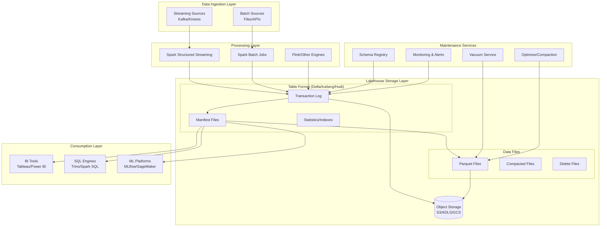
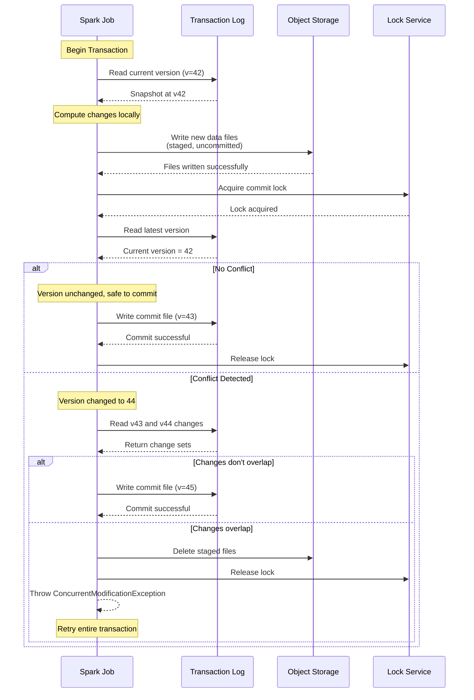
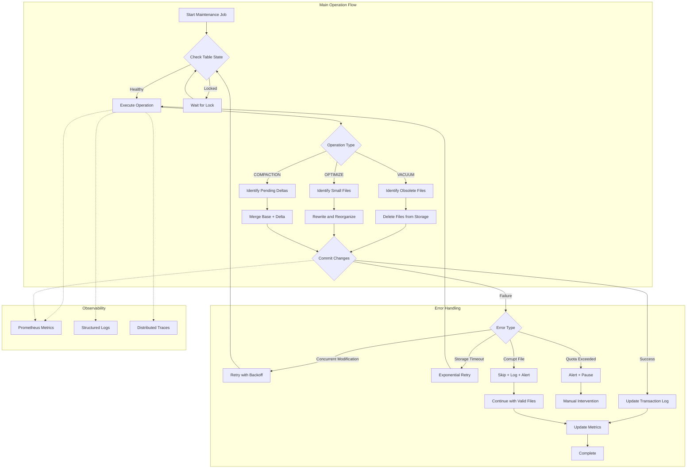
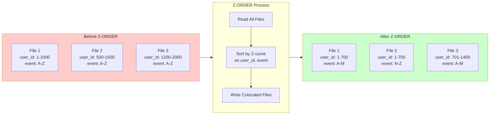

# Data Integrity and Maintenance Patterns in Lakehouse Architectures

> A FAANG Principal Data Architect / Staff Engineer Deep Dive

---

## Table of Contents
1. [Concept Breakdown](#1-concept-breakdown)
2. [Multiple Analogies](#2-multiple-analogies)
3. [Architecture & Design Variants](#3-architecture--design-variants)
4. [UML / Sequence / Architecture Diagrams](#4-uml--sequence--architecture-diagrams)
5. [Real-Time Issues & Failure Modes](#5-real-time-issues--failure-modes)
6. [Real-Time Scenarios & Interview Questions](#6-real-time-scenarios--interview-questions)
7. [Code Snippets](#7-code-snippets)
8. [Comparisons With Related Concepts](#8-comparisons-with-related-concepts)
9. [Production Best Practices](#9-production-best-practices)
10. [What to Remember for Interviews](#10-what-to-remember-for-interviews)

---

## 1. Concept Breakdown

### What Is Data Integrity in Lakehouse Architectures?

**Data integrity** in a Lakehouse refers to the accuracy, consistency, and reliability of data throughout its lifecycle—from ingestion through transformation to consumption. Unlike traditional data warehouses with strict ACID guarantees enforced by a centralized RDBMS, Lakehouses must implement integrity guarantees on top of distributed object storage (S3, ADLS, GCS) using table formats like **Delta Lake**, **Apache Iceberg**, or **Apache Hudi**.

### Why Does It Exist?

The Lakehouse paradigm emerged to solve the **two-system problem**: maintaining both a data lake (cheap, scalable, schema-agnostic) and a data warehouse (expensive, ACID-compliant, schema-enforced). However, building a unified architecture introduces challenges:

| Challenge | Traditional DW Solution | Lakehouse Challenge |
|-----------|------------------------|---------------------|
| ACID Transactions | Built-in RDBMS guarantees | Must be implemented via transaction logs |
| Schema Enforcement | DDL constraints | Schema evolution with backward/forward compatibility |
| Data Freshness | ETL windows | Incremental processing with exactly-once semantics |
| Storage Efficiency | DBA-managed | Automated compaction, vacuum, optimization |
| Concurrent Access | Row-level locking | Optimistic concurrency control (OCC) |

### How It Works Internally

#### The Transaction Log: The Source of Truth

Modern Lakehouse table formats maintain a **transaction log** (also called metadata log or manifest) that records every atomic change to the table:

```
_delta_log/
├── 00000000000000000000.json   # Initial table creation
├── 00000000000000000001.json   # First commit (add files)
├── 00000000000000000002.json   # Second commit (update/delete)
├── 00000000000000000003.json   # Compaction checkpoint
└── 00000000000000000010.checkpoint.parquet  # Periodic checkpoint
```

**Each commit file contains:**
- **Add actions**: New data files being added
- **Remove actions**: Files being logically deleted (not physically removed yet)
- **Metadata changes**: Schema updates, table properties
- **Protocol changes**: Reader/writer version requirements

#### Optimistic Concurrency Control (OCC)

Unlike traditional databases that use locks, Lakehouses implement OCC:

1. **Read Phase**: Transaction reads current table version (snapshot isolation)
2. **Validation Phase**: Before commit, check if files read have been modified
3. **Write Phase**: If validation passes, atomically write new commit file

```python
# Conceptual OCC flow
def commit_transaction(writes, read_snapshot):
    current_version = get_latest_version()
    
    # Conflict detection
    if current_version != read_snapshot:
        conflicting_files = get_modified_files(read_snapshot, current_version)
        if overlaps(writes, conflicting_files):
            raise ConcurrentModificationException("Retry transaction")
    
    # Atomic commit (rename operation on object storage)
    atomic_put(f"_delta_log/{current_version + 1:020d}.json", writes)
```

#### The ACID Properties Implementation

| Property | Implementation Mechanism |
|----------|-------------------------|
| **Atomicity** | Single JSON/Avro commit file write is atomic; partial writes are invisible |
| **Consistency** | Schema enforcement at write time; constraint validation |
| **Isolation** | Snapshot isolation via versioned reads; OCC for writes |
| **Durability** | Object storage durability (99.999999999% for S3); WAL semantics |

### Maintenance Operations: The Hidden Complexity

#### 1. VACUUM / File Cleanup

**Problem**: Delete/update operations don't remove physical files—they mark files for removal in the log.

```sql
-- Files accumulate over time
-- Before VACUUM:
-- _data/part-00000-abc.parquet (active)
-- _data/part-00000-def.parquet (obsolete - marked for removal 2 days ago)
-- _data/part-00000-ghi.parquet (obsolete - marked for removal 5 days ago)

VACUUM my_table RETAIN 168 HOURS;  -- Keep 7 days of history
```

**Critical Insight**: VACUUM permanently deletes files, breaking time-travel queries beyond the retention period. At FAANG scale, this is a **non-reversible operation** that requires careful coordination.

#### 2. COMPACTION (OPTIMIZE / BIN-PACKING)

**Problem**: Many small files degrade query performance due to:
- High metadata overhead
- Inefficient I/O patterns
- Suboptimal file pruning

```sql
-- Before optimization: 10,000 files × 1 MB each
-- After optimization: 100 files × 100 MB each (target file size)

OPTIMIZE my_table
WHERE event_date >= '2024-01-01'
ZORDER BY (user_id, event_type);
```

**Z-ORDER/Space-Filling Curves**: Colocate related data points in multi-dimensional space to enable efficient data skipping.

#### 3. DATA COMPACTION (Merge-on-Read → Copy-on-Write)

In **Merge-on-Read (MoR)** tables (Hudi default), updates are written to delta logs that must be merged at read time:

```
base_file_001.parquet      # Original data
├── .log_001               # Update log 1
├── .log_002               # Update log 2
└── .log_003               # Update log 3

# Compaction merges logs into new base file:
base_file_002.parquet      # Merged result
```

#### 4. SCHEMA EVOLUTION and Enforcement

```python
# Delta Lake schema evolution modes
spark.conf.set("spark.databricks.delta.schema.autoMerge.enabled", "true")

# Or explicit schema enforcement
df.write.format("delta") \
    .option("mergeSchema", "true") \
    .mode("append") \
    .save("/path/to/table")
```

**Schema Compatibility Matrix**:

| Change Type | Backward Compatible | Forward Compatible |
|-------------|--------------------|--------------------|
| Add nullable column | ✅ | ✅ |
| Add required column | ❌ | ✅ |
| Remove column | ✅ | ❌ |
| Rename column | ❌ | ❌ |
| Widen type (int→long) | ✅ | ❌ |

---

## 2. Multiple Analogies

### Analogy A: Real-World System — Hospital Medical Records

Think of a Lakehouse as a **modern hospital's medical records system**:

| Hospital Concept | Lakehouse Equivalent |
|------------------|---------------------|
| Patient file cabinet | Object storage (S3/ADLS) |
| Medical chart (paper) | Parquet/ORC data files |
| Audit log of all changes | Transaction log (_delta_log) |
| "Do not destroy" policy | VACUUM retention period |
| Chart organization by department | Partitioning by date/region |
| Microfilm archival | Time-travel snapshots |
| Record consolidation | Compaction/OPTIMIZE |
| Insurance form validation | Schema enforcement |

**The hospital administrator's nightmare**: Someone shreds old records (VACUUM) while a long-running insurance audit (time-travel query) still needs them. This is why **retention periods must exceed maximum expected query duration**.

---

### Analogy B: Software Engineering — Git Version Control

A Lakehouse table behaves remarkably like a **Git repository**:

| Git Concept | Lakehouse Equivalent |
|-------------|---------------------|
| `.git` directory | `_delta_log` / metadata folder |
| Commit SHA | Table version number |
| `git log` | Delta log history |
| `git checkout <sha>` | Time-travel query (`VERSION AS OF`) |
| Working directory | Current table snapshot |
| Blob objects (pack files) | Parquet data files |
| `git gc --prune` | VACUUM operation |
| `git rebase` | OPTIMIZE with ZORDER |
| Merge conflicts | Concurrent modification exceptions |
| Branch protection rules | Table constraints & schema enforcement |

**Key insight for engineers**: Just as `git gc` can break old references, VACUUM breaks time-travel queries. And just as Git uses content-addressable storage with garbage collection, Lakehouses use immutable files with periodic cleanup.

---

### Analogy C: Lead Data Engineer Day-to-Day — The Warehouse Manager

Imagine you're managing a **physical warehouse** storing inventory:

**Daily Operations:**

1. **Receiving shipments (Data Ingestion)**
   - Trucks arrive at different times (streaming/batch)
   - Each pallet has a manifest (schema)
   - Some shipments arrive late (late-arriving data)
   
2. **Organizing inventory (Maintenance Operations)**
   - **Compaction**: Combining half-empty boxes into full boxes
   - **OPTIMIZE**: Reorganizing shelves so related items are together
   - **VACUUM**: Throwing away empty boxes cluttering the floor
   
3. **Quality Control (Data Integrity)**
   - Checking items against manifests (schema validation)
   - Rejecting damaged goods (data quality checks)
   - Tracking everything in your inventory system (transaction log)

4. **Handling Returns (Updates/Deletes)**
   - Don't throw away the item immediately—mark it as "returned"
   - Wait for the accounting period to close (retention period)
   - Then actually remove it from inventory (VACUUM)

**The Lead DE conversation:**

> "Our 'sales_events' table has 50,000 small files from yesterday's streaming job. Each query reads all partition files, causing a 45-minute scan. I'm scheduling an OPTIMIZE job tonight with ZORDER on (customer_id, product_id) to reduce files to ~500 and colocate frequently-accessed data. We'll also VACUUM files older than 7 days since our longest-running dashboard refreshes in 2 hours."

---

## 3. Architecture & Design Variants

### Design Variant 1: Copy-on-Write (CoW)

**How it works**: Every update/delete rewrites the entire affected data file.

```
Before Update (file_001.parquet):
| id | name    |
|----|---------|
| 1  | Alice   |
| 2  | Bob     |

UPDATE: SET name = 'Bobby' WHERE id = 2

After Update (file_002.parquet replaces file_001.parquet):
| id | name    |
|----|---------|
| 1  | Alice   |
| 2  | Bobby   |

Transaction Log:
- Remove: file_001.parquet
- Add: file_002.parquet
```

| Aspect | Evaluation |
|--------|------------|
| **Read Performance** | ✅ Excellent—no merge overhead |
| **Write Amplification** | ❌ High—entire file rewritten for single row change |
| **Use Case** | Read-heavy workloads, infrequent updates |
| **Scaling Behavior** | Write latency increases with file size |

**FAANG Scale Consideration**: At Meta's scale, a single UPDATE affecting 1% of rows in a petabyte table could trigger terabytes of rewrites.

---

### Design Variant 2: Merge-on-Read (MoR)

**How it works**: Updates/deletes are written to separate delta files, merged at query time.

```
Base File (file_001.parquet):
| id | name    |
|----|---------|
| 1  | Alice   |
| 2  | Bob     |

UPDATE: SET name = 'Bobby' WHERE id = 2

Delta File (.file_001.log.1):
| id | _operation | name    |
|----|------------|---------|
| 2  | UPDATE     | Bobby   |

Read Query merges base + delta at runtime
```

| Aspect | Evaluation |
|--------|------------|
| **Read Performance** | ⚠️ Degrades without compaction |
| **Write Performance** | ✅ Excellent—append-only logs |
| **Use Case** | Write-heavy workloads, streaming updates |
| **Scaling Behavior** | Read latency increases with pending deltas |

**FAANG Scale Consideration**: Uber (Hudi's creator) processes 500B+ events/day with MoR, running continuous compaction to bound read latency.

---

### Design Variant 3: Hybrid Approach (Iceberg Position Deletes + Equality Deletes)

Apache Iceberg offers multiple delete strategies:

```
Position Delete File:
| file_path                  | pos |
|---------------------------|-----|
| s3://bucket/data/001.parq | 42  |
| s3://bucket/data/001.parq | 87  |

Equality Delete File:
| user_id |
|---------|
| 12345   |

Read-time handling varies by delete type
```

| Delete Type | Performance | Use Case |
|-------------|-------------|----------|
| Position Delete | Fast reads (indexed) | Point deletes after JOIN |
| Equality Delete | Slower (full scan match) | GDPR deletes by user_id |

---

### Design Variant 4: Partitioning Strategies

```
Strategy 1: Time-Based Partitioning
/events/year=2024/month=01/day=15/

Strategy 2: Hash Partitioning
/events/user_bucket=42/  (hash(user_id) % 256)

Strategy 3: Hybrid (Time + Hash)
/events/date=2024-01-15/user_bucket=42/

Strategy 4: Hidden Partitioning (Iceberg)
# Partition by month(event_time) without physical directory structure
# Partition evolution: change from daily → hourly without rewrite
```

**Decision Matrix: When to Choose Which Strategy**

| Scenario | Recommended Strategy | Reasoning |
|----------|---------------------|-----------|
| Time-series analytics | Time-based | Efficient range scans |
| User-level queries | Hash on user_id | Even distribution, colocate user data |
| Multi-tenant SaaS | Tenant_id + Time | Tenant isolation + temporal queries |
| High cardinality keys | Hash buckets | Prevent partition explosion |
| Evolving access patterns | Hidden partitioning | Change scheme without rewrite |

---

### Scaling Behavior at FAANG Scale

| Table Size | Key Challenges | Mitigation Strategies |
|------------|----------------|----------------------|
| **TB scale** | Small file problem | Scheduled OPTIMIZE jobs |
| **100 TB scale** | Partition skew | Adaptive partitioning, Z-ORDER |
| **PB scale** | Metadata bottleneck | Manifest file compaction, row-group stats |
| **10+ PB scale** | Global consistency | Per-partition snapshot isolation, tiered storage |

---

## 4. UML / Sequence / Architecture Diagrams

### High-Level Lakehouse Architecture



### Detailed Sequence: Write with Conflict Detection



### Failure and Retry Flow



### Z-ORDER Compaction Visual



---

## 5. Real-Time Issues & Failure Modes

### Issue 1: Orphaned Files (Storage Leak)

**Symptoms:**
- Storage costs growing faster than data volume
- `du -sh` on table directory >> actual data size
- Files in storage not referenced in transaction log

**Root Cause:**
- Spark job crashed after writing files but before commit
- Failed compaction left intermediate files
- VACUUM failed midway

**Detection:**
```sql
-- Delta Lake: Find orphaned files
WITH table_files AS (
    SELECT input_file_name() as file_path
    FROM delta.`/path/to/table`
),
storage_files AS (
    -- List from cloud storage API
)
SELECT s.file_path 
FROM storage_files s
LEFT JOIN table_files t ON s.file_path = t.file_path
WHERE t.file_path IS NULL
  AND s.file_path LIKE '%.parquet';
```

**Resolution:**
```bash
# Use built-in dry-run first
VACUUM my_table DRY RUN;

# Or manual cleanup with extreme caution
aws s3 rm s3://bucket/orphaned_file.parquet
```

---

### Issue 2: Time-Travel Query Failure After VACUUM

**Symptoms:**
```
Error: The requested timestamp (2024-01-01 00:00:00) is before the earliest 
version available (2024-01-05 12:34:56).
```

**Root Cause:**
- VACUUM retention period shorter than query lookback
- Long-running jobs started before VACUUM completed

**Detection:**
```python
# Check current retention settings
spark.sql("DESCRIBE HISTORY my_table").show()

# For Delta:
spark.conf.get("spark.databricks.delta.retentionDurationCheck.enabled")
```

**Resolution:**
- Increase retention: `delta.logRetentionDuration = 30 days`
- Disable safety check ONLY for recovery: `SET spark.databricks.delta.retentionDurationCheck.enabled = false`
- Implement backup strategy for critical tables

---

### Issue 3: Small File Explosion (Streaming Anti-Pattern)

**Symptoms:**
- Query latency increasing linearly over time
- Driver OOM during file listing
- Thousands of files per partition

**Root Cause:**
- Streaming micro-batches with low trigger interval
- No periodic compaction running
- Partition pruning not effective

**Detection:**
```sql
-- Check files per partition
SELECT 
    date_partition,
    COUNT(*) as file_count,
    SUM(size) / 1024 / 1024 as total_mb,
    AVG(size) / 1024 / 1024 as avg_file_mb
FROM delta.`/path/to/table`.files
GROUP BY date_partition
HAVING file_count > 100
ORDER BY file_count DESC;
```

**Resolution:**
```python
# Option 1: Trigger compaction
spark.sql("""
    OPTIMIZE my_table 
    WHERE event_date >= current_date() - INTERVAL 1 DAY
""")

# Option 2: Adjust streaming trigger
df.writeStream \
    .trigger(processingTime="5 minutes")  # Larger batches
    .option("checkpointLocation", "/checkpoint") \
    .start()

# Option 3: Enable auto-optimization (Databricks)
spark.conf.set("spark.databricks.delta.optimizeWrite.enabled", "true")
spark.conf.set("spark.databricks.delta.autoCompact.enabled", "true")
```

---

### Issue 4: Concurrent Modification Exceptions at Scale

**Symptoms:**
- Jobs failing with `ConcurrentModificationException`
- Retry storms during busy periods
- Pipeline SLAs missed

**Root Cause:**
- Multiple jobs writing to same table/partition
- Compaction running during heavy write periods
- Insufficient conflict resolution strategy

**Detection:**
```python
# Monitor exception patterns
spark.sparkContext.setLogLevel("WARN")

# Check table history for failed commits
spark.sql("""
    DESCRIBE HISTORY my_table
""").filter("operation = 'WRITE' AND status = 'FAILED'").show()
```

**Resolution:**
```python
# Implement exponential backoff wrapper
from tenacity import retry, stop_after_attempt, wait_exponential

@retry(
    stop=stop_after_attempt(5),
    wait=wait_exponential(multiplier=1, min=4, max=60)
)
def write_with_retry(df, path):
    df.write.format("delta").mode("append").save(path)

# Or use partition isolation
df.write.format("delta") \
    .mode("append") \
    .partitionBy("processing_hour") \  # Separate partition per job
    .save("/path/to/table")
```

---

### Issue 5: Schema Evolution Breaking Downstream

**Symptoms:**
- Downstream Spark jobs failing with `AnalysisException`
- Missing columns in BI dashboards
- Type mismatch errors

**Root Cause:**
- Upstream team added non-nullable column
- Column type changed without coordination
- Column renamed without alias

**Detection:**
```sql
-- Compare schema versions
DESCRIBE HISTORY my_table;

-- Check specific version schema
DESCRIBE delta.`/path/to/table` VERSION AS OF 42;
```

**Resolution:**
```python
# Read with schema evolution
spark.read.format("delta") \
    .option("mergeSchema", "true") \
    .load("/path/to/table")

# Enforce compatible changes only
spark.conf.set("spark.databricks.delta.schema.autoMerge.enabled", "true")

# Implement contract testing
def validate_schema_compatibility(old_schema, new_schema):
    for field in old_schema.fields:
        if field.name not in [f.name for f in new_schema.fields]:
            if not field.nullable:
                raise SchemaEvolutionError(f"Required column {field.name} removed")
```

---

## 6. Real-Time Scenarios & Interview Questions

### Scenario 1: The Petabyte GDPR Problem

> **Question**: "You're a Lead DE at Meta. A user requests deletion under GDPR. This user has data in a 5 PB table partitioned by event_date with 3 years of history. The table uses Delta Lake. How do you implement compliant deletion within 30 days SLA?"

**Expected Answer Structure:**

1. **Identify the Challenge**:
   - User data scattered across 1000+ daily partitions
   - Copy-on-Write would require rewriting potentially TBs of data
   - Must maintain query performance during deletion

2. **Approach**:
   ```python
   # Step 1: Identify affected partitions (avoid full table scan)
   affected_partitions = spark.sql("""
       SELECT DISTINCT event_date
       FROM user_partition_index
       WHERE user_id = 'user_123'
   """)
   
   # Step 2: Execute partition-scoped deletes
   for partition in affected_partitions.collect():
       spark.sql(f"""
           DELETE FROM events
           WHERE event_date = '{partition.event_date}'
             AND user_id = 'user_123'
       """)
   
   # Step 3: Run targeted VACUUM
   spark.sql("VACUUM events RETAIN 0 HOURS")  # GDPR exception
   ```

3. **Optimizations**:
   - Pre-build user_id → partition_date index table
   - Use Iceberg equality deletes for immediate logical deletion
   - Batch multiple GDPR requests before VACUUM

4. **Compliance Verification**:
   ```python
   # Verify deletion
   assert spark.sql("""
       SELECT COUNT(*) FROM events WHERE user_id = 'user_123'
   """).first()[0] == 0
   
   # Verify physical removal (post-VACUUM)
   # No way to query deleted data via time-travel
   ```

---

### Scenario 2: The Streaming Compaction Race

> **Question**: "Your team runs a Spark Structured Streaming job writing to a Delta table. A nightly OPTIMIZE job runs at 2 AM. You're seeing frequent StreamingQueryExceptions around 2 AM. What's happening and how do you fix it?"

**Expected Answer:**

**Root Cause Analysis:**
- OPTIMIZE rewrites files that the streaming checkpoint references
- Stream tries to commit with stale file references
- Results in `ConcurrentModificationException`

**Solutions (ranked by preference):**

1. **Schedule Separation** (Quick Fix):
   ```python
   # Pause streaming during maintenance
   query.stop()
   spark.sql("OPTIMIZE events")
   query.start()
   ```

2. **Partition Isolation** (Better):
   ```python
   # Stream writes to today's partition only
   # OPTIMIZE only runs on yesterday's partition
   spark.sql("""
       OPTIMIZE events 
       WHERE event_date < current_date()
   """)
   ```

3. **Auto-Compaction** (Best):
   ```python
   # Replace scheduled OPTIMIZE with auto-compaction
   spark.conf.set("spark.databricks.delta.autoCompact.enabled", "true")
   spark.conf.set("spark.databricks.delta.autoCompact.minNumFiles", 50)
   ```

---

### Scenario 3: The Cross-Region Consistency Problem

> **Question**: "Your Lakehouse table is replicated across us-east-1 and eu-west-1 for latency. Users in Europe are seeing data that doesn't match US queries for the same time range. What's happening?"

**Trick Aspects:**
- Candidate might jump to eventual consistency without considering causality
- Must discuss table format replication semantics

**Expected Answer:**

1. **Identify Root Cause Options**:
   - Transaction log replication lag
   - Different VACUUM schedules per region
   - Schema evolution applied inconsistently
   - Clock skew affecting partition assignment

2. **Investigation Steps**:
   ```python
   # Compare table versions
   us_version = spark.sql("DESCRIBE HISTORY us_table").first()['version']
   eu_version = spark.sql("DESCRIBE HISTORY eu_table").first()['version']
   
   # Check file inventories
   us_files = set(list_files("s3://us-bucket/table/_delta_log/"))
   eu_files = set(list_files("s3://eu-bucket/table/_delta_log/"))
   
   drift = us_files.symmetric_difference(eu_files)
   ```

3. **Resolution Strategies**:
   - Implement version-aware reads: `VERSION AS OF min(us_version, eu_version)`
   - Use centralized metadata with edge caching
   - Implement conflict-free replicated data types (CRDTs) for counters

---

### Trick Questions

**Trick Question 1:**
> "What's the difference between VACUUM with 0 hour retention and DROP TABLE?"

**Answer**: VACUUM(0) removes historical files but keeps current snapshot and table definition. DROP TABLE removes metadata and optionally files. Critically, VACUUM after DELETE physically removes rows; DROP TABLE removes entire table.

**Trick Question 2:**
> "You run OPTIMIZE on a 100 TB table and it runs for 30 hours. The job succeeds. Users report they can't query the table. Why?"

**Answer**: The 30-hour OPTIMIZE generated a commit referencing 1000s of new files. This single large commit JSON file in `_delta_log` is slow to read, or hit storage throttling. Solution: Use incremental optimization per partition, or split the OPTIMIZE across multiple commits.

**Trick Question 3:**
> "Your table has 1 billion rows and 100,000 files. You run Z-ORDER by (user_id). Queries by user_id are now SLOWER. What happened?"

**Answer**: Z-ORDER doesn't help with single-column ordering—it's designed for multi-column locality. For single-column, use `OPTIMIZE ... ZORDER BY (user_id, secondary_col)` or simple sorting. Additionally, if user_id has very high cardinality, Z-ORDER might not cluster effectively.

---

## 7. Code Snippets

### Best Practice: Idempotent Delta Write with Merge

```python
from delta.tables import DeltaTable
from pyspark.sql import SparkSession

def upsert_idempotent(spark: SparkSession, source_df, target_path: str, 
                       merge_keys: list, update_condition: str = None):
    """
    Idempotent MERGE operation with conflict handling.
    
    Args:
        source_df: DataFrame with new/updated records
        target_path: Delta table path
        merge_keys: List of columns for matching (e.g., ['id', 'date'])
        update_condition: Optional condition for updates (e.g., 'source.version > target.version')
    """
    
    if not DeltaTable.isDeltaTable(spark, target_path):
        # First write creates the table
        source_df.write.format("delta").save(target_path)
        return
    
    target_table = DeltaTable.forPath(spark, target_path)
    
    merge_condition = " AND ".join([f"source.{k} = target.{k}" for k in merge_keys])
    
    merge_builder = target_table.alias("target").merge(
        source_df.alias("source"),
        merge_condition
    )
    
    if update_condition:
        merge_builder = merge_builder.whenMatchedUpdate(
            condition=update_condition,
            set={col: f"source.{col}" for col in source_df.columns}
        )
    else:
        merge_builder = merge_builder.whenMatchedUpdateAll()
    
    merge_builder.whenNotMatchedInsertAll().execute()
    
    # Record metrics
    metrics = spark.sql(f"DESCRIBE HISTORY delta.`{target_path}` LIMIT 1").first()
    print(f"Merge complete: {metrics['operationMetrics']}")

# Usage
upsert_idempotent(
    spark=spark,
    source_df=daily_events,
    target_path="/warehouse/events",
    merge_keys=["event_id", "event_date"],
    update_condition="source.updated_at > target.updated_at"
)
```

---

### Best Practice: Automated Maintenance Job

```python
from datetime import datetime, timedelta
from dataclasses import dataclass
from typing import List
import logging

@dataclass
class MaintenanceConfig:
    table_path: str
    vacuum_retention_hours: int = 168  # 7 days
    optimize_partition_predicate: str = None
    zorder_columns: List[str] = None
    target_file_size_mb: int = 128
    max_concurrent_optimizes: int = 4

def run_table_maintenance(spark: SparkSession, config: MaintenanceConfig):
    """
    Production-grade maintenance job with safety checks.
    """
    logger = logging.getLogger("TableMaintenance")
    
    # Safety check: Ensure no active streaming queries
    active_streams = spark.streams.active
    for stream in active_streams:
        if config.table_path in str(stream.lastProgress):
            raise RuntimeError(f"Active stream writing to {config.table_path}")
    
    # Check table health before maintenance
    history = spark.sql(f"DESCRIBE HISTORY delta.`{config.table_path}` LIMIT 10")
    recent_failures = history.filter("operationMetrics.numOutputRows < 0").count()
    if recent_failures > 0:
        logger.warning(f"Table has {recent_failures} recent failed operations")
    
    # Step 1: OPTIMIZE with Z-ORDER
    optimize_start = datetime.now()
    optimize_sql = f"OPTIMIZE delta.`{config.table_path}`"
    
    if config.optimize_partition_predicate:
        optimize_sql += f" WHERE {config.optimize_partition_predicate}"
    
    if config.zorder_columns:
        zorder_cols = ", ".join(config.zorder_columns)
        optimize_sql += f" ZORDER BY ({zorder_cols})"
    
    logger.info(f"Executing: {optimize_sql}")
    optimize_result = spark.sql(optimize_sql)
    
    metrics = optimize_result.first()
    logger.info(f"OPTIMIZE completed in {datetime.now() - optimize_start}")
    logger.info(f"Files added: {metrics['numFilesAdded']}, removed: {metrics['numFilesRemoved']}")
    
    # Step 2: VACUUM with safety check
    vacuum_start = datetime.now()
    
    # Dry run first
    dry_run_result = spark.sql(f"""
        VACUUM delta.`{config.table_path}` 
        RETAIN {config.vacuum_retention_hours} HOURS
        DRY RUN
    """)
    files_to_delete = dry_run_result.count()
    logger.info(f"VACUUM dry run: {files_to_delete} files to delete")
    
    if files_to_delete > 10000:
        logger.warning("Large VACUUM operation - consider batching")
    
    # Actual vacuum
    spark.sql(f"""
        VACUUM delta.`{config.table_path}` 
        RETAIN {config.vacuum_retention_hours} HOURS
    """)
    
    logger.info(f"VACUUM completed in {datetime.now() - vacuum_start}")
    
    return {
        "optimize_duration": str(datetime.now() - optimize_start),
        "vacuum_files_deleted": files_to_delete,
        "success": True
    }

# Schedule with proper intervals
maintenance_config = MaintenanceConfig(
    table_path="/warehouse/events",
    vacuum_retention_hours=168,
    optimize_partition_predicate="event_date >= current_date() - INTERVAL 7 DAY",
    zorder_columns=["user_id", "event_type"],
    target_file_size_mb=256
)

run_table_maintenance(spark, maintenance_config)
```

---

### Anti-Pattern: VACUUM During Active Queries

```python
# ❌ ANTI-PATTERN: This can break concurrent time-travel queries
def dangerous_vacuum():
    # User might be running: SELECT * FROM table VERSION AS OF 5000
    spark.sql("VACUUM my_table RETAIN 0 HOURS")  # Deletes version 5000 files!

# ✅ CORRECT: Coordinate vacuum with query patterns
def safe_vacuum_with_coordination():
    # Check for long-running queries
    active_queries = get_active_queries_from_history_server()
    
    oldest_query_start = min(q.start_time for q in active_queries)
    hours_since_oldest = (datetime.now() - oldest_query_start).total_seconds() / 3600
    
    safe_retention = max(168, int(hours_since_oldest) + 24)  # At least 7 days + buffer
    
    spark.sql(f"VACUUM my_table RETAIN {safe_retention} HOURS")
```

---

### SQL: Schema Evolution Tracking

```sql
-- Create schema change tracking table
CREATE TABLE schema_change_log (
    table_name STRING,
    version BIGINT,
    change_type STRING,
    column_name STRING,
    old_type STRING,
    new_type STRING,
    changed_at TIMESTAMP,
    changed_by STRING
);

-- Trigger to track schema changes (pseudo-code, implement via CDC)
-- When schema changes detected:
INSERT INTO schema_change_log
SELECT 
    'events' as table_name,
    current_version as version,
    CASE 
        WHEN old_schema NOT CONTAINS new_column THEN 'ADD_COLUMN'
        WHEN new_schema NOT CONTAINS old_column THEN 'DROP_COLUMN'
        ELSE 'MODIFY_COLUMN'
    END as change_type,
    column_name,
    old_data_type,
    new_data_type,
    current_timestamp(),
    current_user();

-- Query for breaking changes
SELECT * FROM schema_change_log
WHERE change_type = 'MODIFY_COLUMN'
  AND NOT is_widening_cast(old_type, new_type);
```

---

### Anti-Pattern: Unbounded Partition Creation

```python
# ❌ ANTI-PATTERN: High-cardinality partition columns
df.write.format("delta") \
    .partitionBy("user_id")  # 1 billion unique users = 1 billion partitions!
    .save("/warehouse/events")

# ✅ CORRECT: Bounded partitioning with bucketing or computed columns
df.withColumn("user_bucket", expr("hash(user_id) % 256")) \
    .write.format("delta") \
    .partitionBy("event_date", "user_bucket")  # 365 * 256 = ~93k partitions/year
    .save("/warehouse/events")
```

---

## 8. Comparisons With Related Concepts

### Comparison 1: Delta Lake vs Apache Iceberg vs Apache Hudi

| Aspect | Delta Lake | Apache Iceberg | Apache Hudi |
|--------|------------|----------------|-------------|
| **Origin** | Databricks (2019) | Netflix (2017) | Uber (2017) |
| **Transaction Log** | JSON files | JSON manifests + Avro | Timeline (instant files) |
| **Default Storage** | Copy-on-Write | Copy-on-Write | Merge-on-Read |
| **Partition Evolution** | Manual rewrite | Native support | Manual rewrite |
| **Hidden Partitioning** | ❌ | ✅ | ❌ |
| **Row-Level Updates** | File rewrite | Position/Equality deletes | Log-based updates |
| **Concurrency Control** | OCC | OCC with snapshot isolation | Timeline-based |
| **Best For** | Databricks ecosystem | Multi-engine interop | Streaming heavy workloads |
| **Compaction** | OPTIMIZE command | Rewrite manifests | Inline/Async compaction |
| **Time Travel** | Version-based | Snapshot-based | Commit-based |

---

### Comparison 2: Lakehouse Maintenance vs Traditional DW Maintenance

| Aspect | Traditional DW (e.g., Teradata) | Lakehouse |
|--------|--------------------------------|-----------|
| **Vacuum/Cleanup** | Built-in spool cleanup | Explicit VACUUM command |
| **Statistics Update** | COLLECT STATS | ANALYZE TABLE or auto |
| **Storage Management** | DBA controls tablespaces | Open storage, file-based |
| **Concurrency Control** | Row/page locking | Optimistic concurrency |
| **Schema Changes** | ALTER TABLE (blocking) | Online schema evolution |
| **Index Maintenance** | Automatic B-tree updates | Manual Z-ORDER/clustering |
| **Partition Management** | Range/hash via DDL | Self-serve partitioning |

---

### Comparison 3: File-Based vs Log-Based Integrity

| Aspect | File-Based (Lakehouse) | Log-Based (Kafka/CDC) |
|--------|------------------------|----------------------|
| **Unit of Integrity** | Table version/snapshot | Event offset |
| **Rollback Mechanism** | Time-travel to version | Consumer offset reset |
| **Exactly-Once** | MERGE idempotency | Transactional producer |
| **Durability** | Object storage (99.999999999%) | Replication factor |
| **Recovery Time** | Instant (read old version) | Depends on log size |
| **Audit Trail** | Transaction log history | Retained events |

---

### Decision Matrix: When to Use What

| Scenario | Recommended Approach | Reasoning |
|----------|---------------------|-----------|
| Analytical workloads with updates | Delta Lake or Iceberg | ACID + time-travel |
| High-frequency streaming updates | Apache Hudi (MoR) | Low write latency |
| Multi-engine data sharing | Apache Iceberg | Best interoperability |
| Databricks-centric platform | Delta Lake | Native integration |
| GDPR with petabyte tables | Iceberg (equality deletes) | Efficient logical deletes |
| Data science + SQL combined | Any Lakehouse format | Unified batch + ML workloads |
| Sub-second query response | Pre-computed aggregates + cache | Lakehouse for source of truth only |

---

## 9. Production Best Practices

### ✅ Production Checklist

**Table Configuration:**
- [ ] Set appropriate `delta.logRetentionDuration` (minimum 7 days)
- [ ] Configure `delta.deletedFileRetentionDuration` for streaming workloads
- [ ] Enable auto-optimization if on managed platform (Databricks)
- [ ] Set target file size appropriate for query patterns (128-256 MB typical)
- [ ] Define partition strategy based on query filters

**Maintenance Jobs:**
- [ ] Schedule OPTIMIZE jobs during low-usage periods
- [ ] Run VACUUM with retention > max expected query duration
- [ ] Implement dry-run verification before VACUUM
- [ ] Set up alerts for OPTIMIZE/VACUUM failures
- [ ] Implement exponential backoff for concurrent modification retries

**Schema Management:**
- [ ] Enable schema enforcement in production writes
- [ ] Document schema evolution compatibility policy
- [ ] Set up schema change notifications (via CDC or hooks)
- [ ] Maintain schema change log for auditing

**Data Quality:**
- [ ] Add constraints (CHECK, NOT NULL) where supported
- [ ] Implement pre-write validation in ETL jobs
- [ ] Set up data quality monitoring dashboards
- [ ] Configure alerting for anomalies (row count, null ratio, etc.)

---

### Tooling Recommendations

| Category | Tool | Use Case |
|----------|------|----------|
| **Table Format** | Delta Lake | Databricks ecosystem, Spark-native |
| | Apache Iceberg | Multi-engine, Netflix/Apple scale |
| | Apache Hudi | Streaming-first, Uber scale |
| **Orchestration** | Apache Airflow | Flexible DAG scheduling |
| | Dagster | Asset-based with data observability |
| | Prefect | Python-native, event-driven |
| **Data Quality** | Great Expectations | Python-based validation |
| | dbt tests | SQL-based, integrated with transforms |
| | Monte Carlo | Automated anomaly detection |
| **Observability** | Datadog | Unified APM + logs + metrics |
| | Prometheus + Grafana | OSS metrics stack |
| | OpenTelemetry | Distributed tracing |
| **Catalog** | AWS Glue | AWS-native |
| | Hive Metastore | OSS standard |
| | Unity Catalog | Databricks, governance-focused |

---

### Monitoring & Observability

**Key Metrics to Track:**

```python
# Prometheus metrics example
TABLE_METRICS = {
    "lakehouse_table_version": Gauge("Current table version"),
    "lakehouse_file_count": Gauge("Current number of files"),
    "lakehouse_partition_count": Gauge("Number of partitions"),
    "lakehouse_vacuum_files_deleted": Counter("Files removed by VACUUM"),
    "lakehouse_optimize_duration_seconds": Histogram("OPTIMIZE job duration"),
    "lakehouse_concurrent_modification_retries": Counter("OCC retries"),
    "lakehouse_schema_changes": Counter("Schema evolution events"),
    "lakehouse_query_time_travel_failures": Counter("Time-travel query failures"),
}

# Grafana dashboard queries
# Panel: File Count Growth Rate
rate(lakehouse_file_count[1h])

# Panel: VACUUM Effectiveness
(lakehouse_file_count - lakehouse_file_count offset 24h) / lakehouse_file_count offset 24h

# Alert: Small File Explosion
lakehouse_file_count > 100000 AND rate(lakehouse_file_count[1h]) > 1000
```

---

### Cost Implications

| Operation | Cost Driver | Optimization |
|-----------|-------------|--------------|
| OPTIMIZE | Read + Write I/O | Run on cold partitions only |
| VACUUM | List + Delete API calls | Batch with large retention |
| Time-Travel | Storage for historical versions | Balance retention vs cost |
| Z-ORDER | Full partition rewrite | Target high-value columns only |
| Schema Evolution | None (metadata only) | - |
| Streaming Writes | Many small files → high PUT costs | Increase trigger interval |

**Cost Formula (AWS S3 example):**
```
Monthly Storage Cost = (Current Data Size × $0.023/GB) 
                     + (Historical Versions × Days × $0.023/GB)
                     
Monthly Operation Cost = (PUT requests × $0.005/1000)
                       + (GET requests × $0.0004/1000)
                       + (List requests × $0.005/1000)
```

---

### Security Implications

| Aspect | Consideration | Mitigation |
|--------|---------------|------------|
| **Time-Travel Access** | Old versions may contain deleted PII | VACUUM with GDPR-compliant retention |
| **File-Level Encryption** | Parquet supports column encryption | Use CSE or SSE-KMS |
| **Access Control** | Object storage ACLs are coarse | Use table-level RBAC (Unity Catalog) |
| **Audit Logging** | Transaction log reveals access patterns | Secure transaction log with encryption |
| **Cross-Account Access** | S3 bucket policies for sharing | Use IAM roles with least privilege |

---

## 10. What to Remember for Interviews

### Condensed Cheat Sheet

```
┌─────────────────────────────────────────────────────────────────┐
│ LAKEHOUSE DATA INTEGRITY - CHEAT SHEET                         │
├─────────────────────────────────────────────────────────────────┤
│ ACID via Transaction Log:                                      │
│   • Atomicity: Single commit file write                        │
│   • Consistency: Schema enforcement at write                   │
│   • Isolation: Snapshot reads, OCC for writes                  │
│   • Durability: Object storage (11 9s)                         │
├─────────────────────────────────────────────────────────────────┤
│ Key Maintenance Operations:                                    │
│   • VACUUM: Physical file cleanup (breaks time-travel!)        │
│   • OPTIMIZE: Compaction + Z-ORDER clustering                  │
│   • COMPACTION: MoR delta → base file merge                    │
├─────────────────────────────────────────────────────────────────┤
│ Table Format Comparison:                                       │
│   • Delta Lake: Databricks, good for Spark                     │
│   • Iceberg: Multi-engine, hidden partitioning                 │
│   • Hudi: Streaming-first, MoR default                         │
├─────────────────────────────────────────────────────────────────┤
│ Common Failure Modes:                                          │
│   • ConcurrentModificationException → Retry with backoff       │
│   • Time-travel failure → VACUUM retention too short           │
│   • Small file explosion → Missing compaction schedule         │
│   • Query slow → Missing Z-ORDER or partition pruning          │
├─────────────────────────────────────────────────────────────────┤
│ FAANG Scale Patterns:                                          │
│   • Partition isolation for concurrent writes                  │
│   • Incremental OPTIMIZE (per partition, not full table)       │
│   • Pre-compute user→partition index for GDPR deletes          │
│   • Separate staging/production tables for safe testing        │
└─────────────────────────────────────────────────────────────────┘
```

### Memory Mnemonic: "VOCAL" 🔊

Remember lakehouse maintenance with **VOCAL**:

- **V**acuum carefully (retention > query lookback)
- **O**ptimize incrementally (partition by partition)
- **C**oncurrency via OCC (expect and handle retries)
- **A**CID via transaction log (the single source of truth)
- **L**og everything (schema changes, maintenance runs, failures)

### The Hospital Analogy (Quick Recall)

> "A Lakehouse is like a hospital records room. The transaction log is the audit trail. VACUUM is shredding old charts (careful—ongoing audits need them!). OPTIMIZE is reorganizing file cabinets. Schema evolution is updating the chart format. And just like hospitals can't lose patient data, your Lakehouse can't lose transactions."

### One-Liner Definitions for Quick Answers

| Term | One-Liner |
|------|-----------|
| Transaction Log | "Append-only ledger of every change, enabling time-travel and ACID" |
| OCC | "Assume no conflicts, detect at commit, retry if wrong" |
| VACUUM | "Physical cleanup of obsolete files—irreversible!" |
| Z-ORDER | "Space-filling curve for multi-column data locality" |
| Schema Evolution | "Change table structure without full rewrite" |
| CoW vs MoR | "CoW = fast reads, slow writes; MoR = fast writes, merge on read" |

---

## Quick Reference: Interview Answer Structure

When asked about Lakehouse data integrity in an interview, structure your answer as:

1. **Start with the WHY**: "Data integrity in Lakehouses exists because we're building ACID guarantees on top of eventually-consistent object storage..."

2. **Name the mechanisms**: "The key mechanisms are the transaction log for consistency, OCC for isolation, and maintenance operations like VACUUM and OPTIMIZE for storage efficiency..."

3. **Discuss trade-offs**: "The main trade-off is between CoW (read-optimized) and MoR (write-optimized), and you choose based on your workload's read/write ratio..."

4. **Give a real-world example**: "At my last company, we processed 10TB/day of events and ran into the small file problem—we solved it by scheduling OPTIMIZE jobs with Z-ORDER on our most-queried columns..."

5. **End with scale considerations**: "At FAANG scale, the additional challenges include metadata bottlenecks, cross-region consistency, and GDPR deletions across petabyte tables..."

---

> **Final Tip**: The interviewer wants to see that you understand not just WHAT these systems do, but WHY they're designed the way they are, and HOW you'd operate them at scale. Always connect your answers to real operational experience.
