# Event-Time Handling & Reliability Guarantees in Distributed Streaming Systems

> **FAANG Principal Data Architect / Staff Engineer Deep Dive**

---

## 1. Concept Breakdown

### What Is It?

**Event-Time Handling** processes data based on *when events occurred* (event-time), not when they arrive (processing-time). **Reliability Guarantees** ensure data correctness despite failures, reordering, and duplicates.

### Why It Exists

In distributed systems, events arrive:
- **Out-of-order** (network delays, partition rebalancing)
- **Late** (mobile devices offline, upstream retries)
- **Duplicated** (at-least-once delivery)

Without proper handling, aggregations produce incorrect results.

### Core Components

| Component | Purpose | Implementation |
|-----------|---------|----------------|
| **Watermark** | Progress indicator declaring "all events before time T have arrived" | Heuristic or punctuation-based |
| **Windowing** | Groups events into time-bounded buckets | Tumbling, Sliding, Session |
| **Late Data Policy** | Handles events arriving after watermark | Drop, Refire, Side-output |
| **Checkpointing** | Periodic state snapshots for recovery | Chandy-Lamport algorithm |
| **Idempotency** | Ensures reprocessing doesn't duplicate effects | Dedup keys, transactional sinks |

### Internal Mechanics

```
┌─────────────────────────────────────────────────────────────────────┐
│                    EVENT-TIME PROCESSING ENGINE                      │
├─────────────────────────────────────────────────────────────────────┤
│                                                                      │
│  Source ──► [Extract Event-Time] ──► [Assign to Window]             │
│                     │                        │                       │
│                     ▼                        ▼                       │
│            [Update Watermark]        [Buffer in State Store]         │
│                     │                        │                       │
│                     ▼                        ▼                       │
│            [Watermark Advances] ──► [Trigger Window Emission]        │
│                                              │                       │
│                     ┌────────────────────────┴────────────┐          │
│                     ▼                                     ▼          │
│              [On-Time Results]                    [Late Results]     │
│              → Main Output                        → Side Output      │
│                                                                      │
└─────────────────────────────────────────────────────────────────────┘
```

### The Watermark Equation

```
Watermark(t) = min(event_time) across all partitions - allowed_lateness
```

**Key insight**: Watermark is a *heuristic*. Too aggressive = data loss. Too conservative = high latency.

---

## 2. Multiple Analogies

### a) Airport Baggage Claim (Real-World)

| Concept | Airport Analogy |
|---------|-----------------|
| Event-Time | When luggage was *checked in* |
| Processing-Time | When luggage *appears on carousel* |
| Watermark | "Last bags from Flight 123 arriving now" announcement |
| Late Data | Bag arriving 30 minutes after carousel stopped |
| Window | All bags for Flight 123 (bounded collection) |
| Exactly-Once | Each bag delivered exactly once to correct owner |

### b) Git Merge Conflicts (Software Engineering)

| Concept | Git Analogy |
|---------|-------------|
| Event-Time | Commit timestamp |
| Processing-Time | Push/merge time |
| Out-of-Order | Feature branches merged non-chronologically |
| Watermark | "All commits before v2.0 tag are stable" |
| Reprocessing | `git rebase` - replay with corrections |
| Idempotency | Same commit hash = same content always |

### c) Lead Data Engineer Day-to-Day (Preferred)

| Concept | DE Scenario |
|---------|-------------|
| Event-Time | `order_created_at` timestamp in payload |
| Processing-Time | Kafka consumer lag timestamp |
| Watermark | "Process hourly aggregates 15 min after hour ends" |
| Late Data | Mobile app syncs 3-day-old transactions |
| Window Trigger | DAG scheduled at T+30min after partition arrives |
| Exactly-Once | Delta Lake MERGE with composite dedup key |
| Checkpoint | Spark Structured Streaming checkpoint directory |
| Backfill | Re-run pipeline for date range after bug fix |

---

## 3. Architecture & Design Variants

### Variant 1: Watermark + Allowed Lateness


**Pros**: Handles reasonable lateness, low complexity  
**Cons**: Unbounded state growth, refire overhead  
**When to use**: Real-time dashboards tolerating updates (5-15 min lateness)

### Variant 2: Lambda Architecture


**Pros**: Batch guarantees correctness, stream provides freshness  
**Cons**: Dual codebases, complex reconciliation, high ops cost  
**When to use**: Financial reporting requiring both speed and audit-grade accuracy  

### Variant 3: Kappa Architecture (Unified)


**Pros**: Single codebase, simpler ops, idiomatic streaming  
**Cons**: Reprocessing requires log retention, complex state management  
**When to use**: Modern data platforms with long Kafka retention

### Variant 4: Exactly-Once with Transactional Sinks


**Pros**: True exactly-once semantics  
**Cons**: Higher latency, sink must support transactions  
**When to use**: Financial transactions, inventory updates

### Decision Matrix

| Requirement | Watermark+Lateness | Lambda | Kappa | Transactional |
|-------------|-------------------|--------|-------|---------------|
| Sub-second latency | ✅ | ❌ | ✅ | ⚠️ |
| Perfect correctness | ⚠️ | ✅ | ✅ | ✅ |
| Ops simplicity | ✅ | ❌ | ✅ | ⚠️ |
| Cost efficiency | ✅ | ❌ | ✅ | ⚠️ |
| State size | Medium | Low | High | Medium |

### FAANG Scale Considerations

- **Petabyte state**: Use RocksDB state backend with incremental checkpoints
- **Cross-DC replication**: Watermarks must account for inter-DC latency
- **Hot partitions**: Custom watermark strategies per partition key
- **Checkpoint storms**: Stagger checkpoints, use async snapshots

---

## 4. Diagrams

### High-Level Architecture

```mermaid
flowchart TB
    subgraph Sources["Data Sources"]
        Mobile["📱 Mobile Events"]
        Web["🌐 Web Clicks"]  
        IoT["📡 IoT Sensors"]
    end
    
    subgraph Ingestion["Ingestion Layer"]
        Kafka["Apache Kafka"]
    end
    
    subgraph Processing["Stream Processing"]
        Flink["Apache Flink"]
        subgraph State["State Management"]
            RocksDB["RocksDB"]
            Checkpoint["S3 Checkpoints"]
        end
    end
    
    subgraph Sinks["Output Sinks"]
        Delta["Delta Lake"]
        Redis["Redis Cache"]
        Metrics["Prometheus"]
    end
    
    Sources --> Kafka
    Kafka --> Flink
    Flink <--> State
    Flink --> Sinks
```



### Event-Time Processing Sequence


### Failure & Recovery Flow


### Watermark Propagation


---

## 5. Real-Time Issues & Failure Modes

### Issue 1: Watermark Stuckness

| Aspect | Detail |
|--------|--------|
| **Symptom** | No window output, state grows unbounded, memory pressure |
| **Root Cause** | Idle partition, slow producer, partition without events |
| **Detection** | Monitor `currentWatermark` metric, alert on stagnation > 5min |
| **Resolution** | Configure idle timeout: `.withIdleness(Duration.ofMinutes(5))` |

### Issue 2: State Explosion

| Aspect | Detail |
|--------|--------|
| **Symptom** | Checkpoint size grows, checkpoint duration increases, OOM |
| **Root Cause** | Unbounded allowed lateness, session windows without gaps |
| **Detection** | Track `state.size` metrics per operator |
| **Resolution** | Bound lateness, implement state TTL, use incremental checkpoints |

### Issue 3: Duplicate Processing

| Aspect | Detail |
|--------|--------|
| **Symptom** | Aggregates higher than expected, duplicate records in sink |
| **Root Cause** | At-least-once delivery without deduplication |
| **Detection** | Compare source counts vs sink counts |
| **Resolution** | Dedup with `event_id + event_time`, use transactional sinks |

### Issue 4: Clock Skew

| Aspect | Detail |
|--------|--------|
| **Symptom** | Events appear "from the future", negative latencies |
| **Root Cause** | Producer clocks not synced (mobile devices, IoT) |
| **Detection** | Monitor `processing_time - event_time` distribution |
| **Resolution** | Clamp event times, use server-side timestamps for untrusted sources |

### Issue 5: Checkpoint Timeouts

| Aspect | Detail |
|--------|--------|
| **Symptom** | Job restarts frequently, progress lost repeatedly |
| **Root Cause** | Large state, slow S3, back-pressure during checkpoint |
| **Detection** | `checkpoint_duration` > `checkpoint_interval` |
| **Resolution** | Incremental checkpoints, increase timeout, tune parallelism |

---

## 6. Interview Scenarios & Questions

### Scenario 1: E-Commerce Order Analytics

> "Design a system to compute hourly GMV (Gross Merchandise Value) from order events. Orders can arrive up to 2 hours late due to mobile app sync issues."

**Expected Answer**:
1. Use event-time windowing with 1-hour tumbling windows
2. Set allowed lateness of 2 hours
3. Configure watermark with 10-min heuristic delay
4. Use Delta Lake sink with MERGE for late data updates
5. Implement accumulating mode for window refires
6. Monitor late event ratio; if > 5%, adjust watermark strategy

### Scenario 2: Fraud Detection

> "How do you ensure exactly-once processing for a fraud detection pipeline that blocks transactions?"

**Expected Answer**:
1. Idempotency via transaction_id as dedup key in Redis
2. Flink with exactly-once checkpointing
3. Two-phase commit to Kafka sink for downstream consumers
4. State TTL to prevent unbounded dedup state
5. Sync blocking with async logging—never block on sink I/O

### Trick Question 1

> "If watermark is at 10:00 and an event with timestamp 09:30 arrives, what happens?"

**Answer**: Depends on `allowedLateness`:
- If `allowedLateness >= 30 min`: Event processed, window refires
- If `allowedLateness < 30 min`: Event dropped or sent to side output
- **Key insight**: Watermark + allowedLateness = true cutoff

### Trick Question 2

> "In a Kafka-Flink-Kafka pipeline, is exactly-once guaranteed end-to-end?"

**Answer**: Only if:
1. Flink checkpointing enabled with exactly-once mode
2. Kafka sink uses transactional producer (idempotent + transactions)
3. Consumer reads with `read_committed` isolation
4. **Trick**: Default consumer reads all messages—must explicitly configure isolation

### Trick Question 3

> "Two operators have watermarks 10:00 and 10:05. A downstream join operator has watermark...?"

**Answer**: `MIN(10:00, 10:05) = 10:00`  
**Follow-up**: This is why one slow partition stalls entire pipeline

---

## 7. Code Snippets

### PySpark Structured Streaming with Watermark

```python
from pyspark.sql import SparkSession
from pyspark.sql.functions import window, col, sum as _sum, from_json
from pyspark.sql.types import StructType, StringType, DoubleType, TimestampType

spark = SparkSession.builder \
    .config("spark.sql.streaming.stateStore.providerClass", 
            "org.apache.spark.sql.execution.streaming.state.RocksDBStateStoreProvider") \
    .getOrCreate()

# Schema for order events
schema = StructType() \
    .add("order_id", StringType()) \
    .add("amount", DoubleType()) \
    .add("event_time", TimestampType())

# ✅ BEST PRACTICE: Event-time processing with bounded lateness
orders_df = spark.readStream \
    .format("kafka") \
    .option("kafka.bootstrap.servers", "kafka:9092") \
    .option("subscribe", "orders") \
    .load() \
    .select(from_json(col("value").cast("string"), schema).alias("data")) \
    .select("data.*") \
    .withWatermark("event_time", "2 hours")  # Allow 2 hours late data

# Hourly GMV aggregation
hourly_gmv = orders_df \
    .groupBy(window("event_time", "1 hour")) \
    .agg(_sum("amount").alias("gmv"))

# Write with exactly-once semantics
query = hourly_gmv.writeStream \
    .format("delta") \
    .outputMode("update")  # Accumulating mode for late data \
    .option("checkpointLocation", "/checkpoints/hourly_gmv") \
    .option("mergeSchema", "true") \
    .start("/delta/hourly_gmv")
```

### ❌ Anti-Pattern: Processing-Time Aggregation

```python
# ❌ ANTI-PATTERN: Using processing time for aggregation
from pyspark.sql.functions import current_timestamp

orders_df \
    .withColumn("processing_time", current_timestamp()) \  # WRONG!
    .groupBy(window("processing_time", "1 hour")) \  # Results depend on when processed
    .agg(_sum("amount"))

# Why it's wrong:
# - Reprocessing produces different results
# - Late data goes to wrong windows
# - Not deterministic or reproducible
```

### Deduplication Pattern

```python
# ✅ BEST PRACTICE: Stateful deduplication with watermark
from pyspark.sql.functions import expr

deduped_orders = orders_df \
    .withWatermark("event_time", "1 hour") \
    .dropDuplicates(["order_id", "event_time"])  # Dedup key

# For Delta Lake sink with MERGE
deduped_orders.writeStream \
    .foreachBatch(lambda batch_df, batch_id: (
        DeltaTable.forPath(spark, "/delta/orders")
        .alias("target")
        .merge(
            batch_df.alias("source"),
            "target.order_id = source.order_id"
        )
        .whenMatchedUpdateAll()
        .whenNotMatchedInsertAll()
        .execute()
    )) \
    .start()
```

### Flink SQL Example

```sql
-- Create table with event-time and watermark
CREATE TABLE orders (
    order_id STRING,
    amount DECIMAL(10, 2),
    event_time TIMESTAMP(3),
    WATERMARK FOR event_time AS event_time - INTERVAL '2' HOUR
) WITH (
    'connector' = 'kafka',
    'topic' = 'orders',
    'properties.bootstrap.servers' = 'kafka:9092',
    'format' = 'json'
);

-- Hourly aggregation with late data handling
INSERT INTO hourly_gmv
SELECT 
    window_start,
    window_end,
    SUM(amount) as gmv,
    COUNT(*) as order_count
FROM TABLE(
    TUMBLE(TABLE orders, DESCRIPTOR(event_time), INTERVAL '1' HOUR)
)
GROUP BY window_start, window_end;
```

---

## 8. Comparisons With Related Concepts

### Event-Time vs Processing-Time vs Ingestion-Time

| Aspect | Event-Time | Processing-Time | Ingestion-Time |
|--------|------------|-----------------|----------------|
| Definition | When event occurred at source | When event processed | When event entered pipeline |
| Determinism | ✅ Reproducible | ❌ Non-reproducible | ⚠️ Semi-reproducible |
| Late data | Handled via watermark | Ignored (goes to current window) | Ignored |
| Use case | Analytics, billing | Simple monitoring | Logging systems |
| Complexity | High | Low | Medium |

### Delivery Guarantees Comparison

| Guarantee | Data Loss | Duplicates | Performance | Use Case |
|-----------|-----------|------------|-------------|----------|
| At-Most-Once | Possible | None | Fastest | Monitoring, logs |
| At-Least-Once | None | Possible | Fast | Most use cases + dedup |
| Exactly-Once | None | None | Slowest | Financial, inventory |

### Windowing Strategies

| Window Type | Description | State Size | Use Case |
|-------------|-------------|------------|----------|
| Tumbling | Fixed, non-overlapping | O(1) per window | Hourly/daily reports |
| Sliding | Fixed, overlapping | O(n) windows | Moving averages |
| Session | Gap-based, dynamic | Unbounded | User sessions |
| Global | No boundaries | Unbounded | Running totals |

### Decision Matrix: When to Use What

| Scenario | Recommended Approach |
|----------|---------------------|
| Real-time dashboard, tolerance for ~5min lag | Watermark + 5min allowed lateness |
| Financial reporting, audit-grade | Lambda or Transactional exactly-once |
| User session analytics | Session windows + generous lateness |
| Simple monitoring | Processing-time, at-most-once |
| IoT with offline devices | Large allowed lateness + side output for extremes |

---

## 9. Production Best Practices

### Pre-Deployment Checklist

- [ ] Watermark delay tuned based on historical late arrival distribution
- [ ] Allowed lateness bounded (not unbounded)
- [ ] State TTL configured to prevent memory leaks
- [ ] Checkpoint interval < processing latency SLA
- [ ] Incremental checkpointing enabled for large state
- [ ] Deduplication key defined (event_id + timestamp)
- [ ] Dead letter queue configured for malformed events
- [ ] Schema evolution strategy documented

### Tooling Recommendations

| Category | Tools |
|----------|-------|
| Stream Processing | Apache Flink, Spark Structured Streaming, Kafka Streams |
| State Backend | RocksDB (embedded), Redis (external) |
| Checkpointing | S3, GCS, HDFS |
| Monitoring | Prometheus + Grafana, Datadog |
| Schema Registry | Confluent Schema Registry, AWS Glue |
| Data Quality | Great Expectations, Deequ |

### Monitoring & Observability

**Critical Metrics**:
```
# Watermark lag
streaming_watermark_lag_seconds{operator="window_agg"}

# Checkpoint duration
flink_checkpoint_duration_seconds

# State size
streaming_state_size_bytes{operator="dedup"}

# Late events ratio
late_events_total / events_total

# Records per second
streaming_records_processed_per_second
```

**Alerts**:
- Watermark stuck > 10 minutes
- Checkpoint duration > 80% of interval
- Late event ratio > 5%
- State size growth > 10% per hour

### Cost Implications

| Component | Cost Driver | Optimization |
|-----------|-------------|--------------|
| State storage | State size × retention | Bound lateness, use TTL |
| Checkpointing | Frequency × state size | Incremental checkpoints |
| Compute | Parallelism × duration | Right-size operators, autoscaling |
| Reprocessing | Kafka retention × replay frequency | Tiered storage, compact topics |

### Security Implications

- **Data residency**: Checkpoints may contain PII—encrypt at rest
- **Access control**: Checkpoint buckets need restricted IAM
- **Audit logging**: Track who triggered reprocessing
- **Key rotation**: Encryption keys for state stores need rotation plan

---

## 10. Interview Cheat Sheet

### One-Liner Summary

> **Event-time handling uses watermarks to bound disorder; reliability guarantees use checkpoints + idempotency to survive failures.**

### The "WATER" Mnemonic

| Letter | Concept | Remember |
|--------|---------|----------|
| **W** | Watermark | "When is it safe to fire windows?" |
| **A** | Allowed Lateness | "How late is too late?" |
| **T** | Trigger | "When do I emit results?" |
| **E** | Exactly-Once | "Checkpoint + Idempotent Sink" |
| **R** | Reprocessing | "Replay from offset, restore from checkpoint" |

### Key Numbers to Remember

- Watermark delay: 10-30 seconds for fast sources, 5-15 minutes for mobile
- Allowed lateness: 2-24 hours depending on SLA
- Checkpoint interval: 1-5 minutes typical
- State TTL: 2× max expected lateness

### Interview Answer Template

> "For event-time processing at scale, I would:
> 1. **Extract** event-time from payload (not processing time)
> 2. **Configure** watermark with delay based on P99 lateness
> 3. **Bound** allowed lateness to prevent state explosion
> 4. **Enable** exactly-once via checkpointing + transactional sink
> 5. **Monitor** watermark lag, late event ratio, state size
> 6. **Handle** extreme late data via side output to dead letter queue"

### Quick Diagram to Draw

```
Events → [Watermark Generator] → [Window Operator] → [Trigger] → Output
              ↓                        ↓
         "Max seen - delay"      "State + Timer"
              ↓                        ↓
         Stalls slow partitions   Refires for late data
```

---

## Related Topics

- [Late-Arriving Data Handling](./04-late-arriving-data.md)
- [Exactly-Once Semantics Deep Dive](./06-exactly-once-semantics.md)
- [Stream-Table Duality](./07-stream-table-duality.md)
