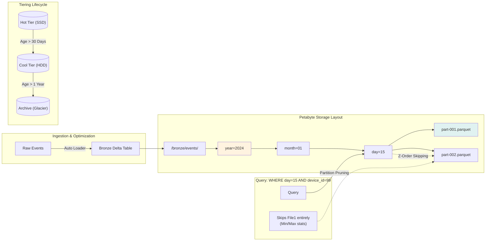

# Petabyte-Scale Patterns

> **When they say "we have petabytes of data"**

## The Core Question

*"We process petabytes of IoT data daily. How does your architecture handle this scale?"*

---

## 📊 Scale Considerations

| Scale | Daily Volume | Architecture Complexity |
|-------|--------------|------------------------|
| **Gigabytes** | < 100 GB | Simple, single notebook |
| **Terabytes** | 100 GB - 10 TB | Partitioning, parallel jobs |
| **Petabytes** | 10+ TB | Distributed, incremental, careful design |

---

## 🏗️ PB-Scale Architecture



---

## 🔄 Retry Policies at Scale

```python
# Databricks Workflow retry configuration
{
    "task_key": "bronze_to_silver",
    "retry_policy": {
        "max_retries": 3,
        "min_retry_interval_millis": 60000,    # 1 min
        "max_retry_interval_millis": 300000    # 5 min (exponential backoff)
    },
    "timeout_seconds": 7200,  # 2 hours max
    "email_notifications": {
        "on_failure": ["data-team@company.com"]
    }
}
```

---

## ⚡ Key Patterns for PB Scale

| Pattern | Why | How |
|---------|-----|-----|
| **Partition pruning** | Don't scan all data | Filter on partition columns first |
| **Incremental processing** | Process only new data | Track watermark, checkpoint |
| **File compaction** | Avoid small files problem | OPTIMIZE command, Auto-Optimize |
| **Z-Order** | Skip irrelevant rowgroups | Z-ORDER BY frequently filtered columns |
| **Adaptive Query Execution** | Handle skew automatically | `spark.sql.adaptive.enabled = true` |

---

## 🎯 Interview Answer

> *"At petabyte scale, key considerations are:*
>
> 1. **Partition by time** (year/month/day/hour) for partition pruning
> 2. **Incremental processing** - never full table scans, use watermarks
> 3. **File size targets** - 256MB-1GB to avoid small files
> 4. **Autoscaling clusters** with spot instances for cost
> 5. **Retry with exponential backoff** for transient failures
> 6. **AQE enabled** for automatic skew handling"*

---

## 📖 Next Topic

Continue to [Realistic Interview Questions](./06-realistic-interview-questions.md) for practice.
