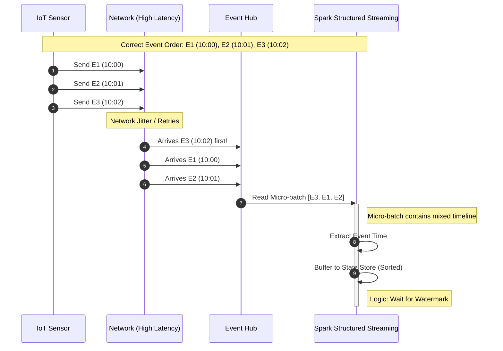
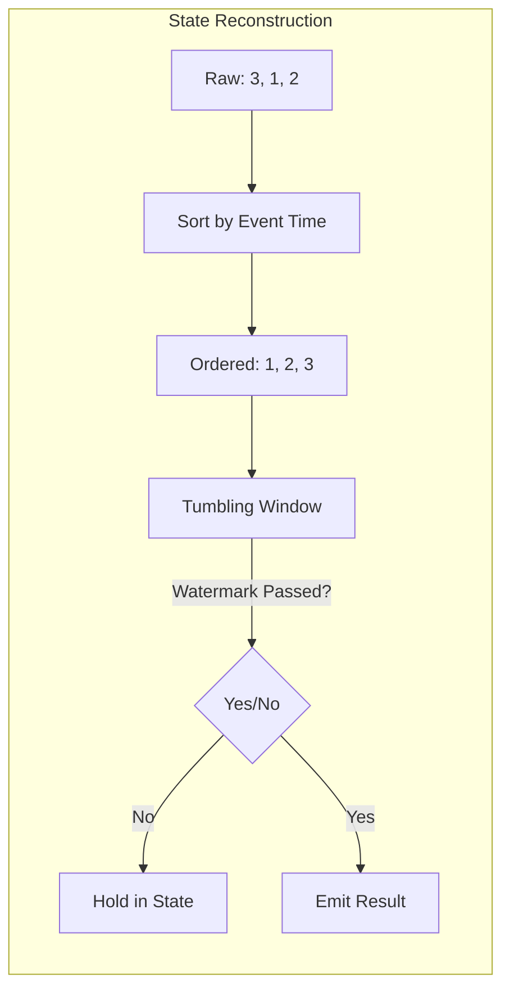

# Out-of-Order Events

> **When events arrive in the wrong sequence**

## The Core Problem

*"You receive events E3, E1, E2 instead of E1, E2, E3. How do you handle this?"*

```
What You Expect:              What You Get:
─────────────────────         ─────────────────────
   10:00  10:01  10:02           10:02  10:00  10:01
     │      │      │               │      │      │
     ▼      ▼      ▼               ▼      ▼      ▼
    E1     E2     E3              E3     E1     E2
    
Event Time:  10:00, 10:01, 10:02
Arrival Time: 10:02, 10:03, 10:03

If you process by arrival order, your calculations are WRONG!
```

---

## 🏗️ Architecture: Event-Time vs Processing-Time





---

## 🔧 Code Implementation

### Streaming with Watermark

```python
from pyspark.sql.functions import *
from pyspark.sql.types import *

# Define schema with event_time
schema = StructType([
    StructField("device_id", StringType()),
    StructField("event_time", TimestampType()),  # When event occurred
    StructField("temperature", DoubleType()),
    StructField("humidity", DoubleType())
])

# Read from Kafka/Event Hub
events_stream = spark.readStream \
    .format("kafka") \
    .option("subscribe", "iot-events") \
    .load() \
    .select(from_json(col("value").cast("string"), schema).alias("data")) \
    .select("data.*")

# CRITICAL: Use event_time with watermark
aggregated = events_stream \
    .withWatermark("event_time", "10 minutes")  # Allow 10 min late events \
    .groupBy(
        window("event_time", "5 minutes"),  # 5-minute tumbling windows
        "device_id"
    ) \
    .agg(
        avg("temperature").alias("avg_temp"),
        max("temperature").alias("max_temp"),
        count("*").alias("event_count")
    )

# Write to Delta
query = aggregated.writeStream \
    .format("delta") \
    .outputMode("append")  # Emit when window is complete \
    .option("checkpointLocation", "/checkpoints/iot_agg") \
    .start("/gold/device_metrics")
```

### Batch: Sort by Event Time

```python
# For batch processing, always sort/partition by event_time
df = spark.read.format("delta").load("/bronze/iot_events")

# Ensure processing respects event order
ordered_df = df \
    .withColumn("event_hour", date_trunc("hour", col("event_time"))) \
    .repartition("event_hour") \
    .sortWithinPartitions("event_time")  # Sort within each partition

# Now aggregations will respect event order
result = ordered_df.groupBy("device_id", "event_hour") \
    .agg(
        first("temperature").alias("first_temp"),  # First event in window
        last("temperature").alias("last_temp"),    # Last event in window
        avg("temperature").alias("avg_temp")
    )
```

---

## ⚖️ Watermark Trade-offs

| Watermark Duration | Late Events | Memory | Latency |
|-------------------|-------------|--------|---------|
| **1 minute** | Many dropped | Low | Fast |
| **10 minutes** | Some dropped | Medium | Medium |
| **1 hour** | Few dropped | High | Slow |
| **1 day** | Almost none dropped | Very High | Very Slow |

---

## 🎯 Interview Questions

| Question | Expected Answer |
|----------|----------------|
| *"How do you handle out-of-order events?"* | Use event_time not processing_time, watermarks for late cutoff |
| *"What if an event is 2 hours late?"* | Depends on watermark - if 10 min, dropped. Could reprocess in batch. |
| *"How does Spark know window is complete?"* | Watermark passes window end time, then emit result |
| *"Watermark of 10 min - what does it mean?"* | Events with event_time < (MAX_seen - 10min) are discarded |

---

## 📖 Next Scenario

Continue to [Duplicate Records Handling](./08-duplicate-records.md).
