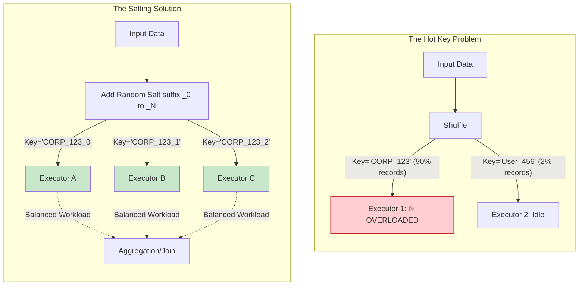

# Hot Partitions

> **When 90% of data goes to one partition**

## The Core Problem

*"Your job is slow because one executor is doing all the work while others are idle."*

```
Expected Distribution:                 Actual Distribution (HOT PARTITION):
───────────────────────                ───────────────────────────────────────
Partition 1: 25% of data               Partition 1: 5% of data  
Partition 2: 25% of data               Partition 2: 90% of data  ← HOT!
Partition 3: 25% of data               Partition 3: 3% of data
Partition 4: 25% of data               Partition 4: 2% of data

Result: One executor takes 10x longer, others wait idle.
```

---

## 🏗️ Hot Partition Architecture



---

## 🔧 Code Implementation

### Detecting Hot Partitions

```python
from pyspark.sql.functions import *

# Check data distribution
df = spark.read.format("delta").load("/silver/orders")

# Count by partition key
distribution = df.groupBy("customer_id") \
    .agg(count("*").alias("record_count")) \
    .orderBy(desc("record_count"))

distribution.show(20)

# Check for skew: if top 10% of keys have >50% of data
total = df.count()
top_10_pct = distribution.limit(int(distribution.count() * 0.1)) \
    .agg(sum("record_count")).collect()[0][0]

skew_ratio = top_10_pct / total
print(f"Top 10% of keys have {skew_ratio:.1%} of data")
if skew_ratio > 0.5:
    print("⚠️ HIGH SKEW DETECTED - Consider salting!")
```

### Salting for Skewed Joins

```python
from pyspark.sql.functions import *

# Configuration
SALT_BUCKETS = 10  # Split skewed key into 10 sub-partitions

# Large table (skewed)
orders = spark.read.format("delta").load("/silver/orders")

# Small table (reference)
customers = spark.read.format("delta").load("/silver/customers")

# Step 1: Add salt to large table
orders_salted = orders.withColumn(
    "salt", 
    (rand() * SALT_BUCKETS).cast("int")
).withColumn(
    "customer_id_salted",
    concat(col("customer_id"), lit("_"), col("salt"))
)

# Step 2: Explode small table to match all salts
from pyspark.sql.functions import explode, array, lit

customers_exploded = customers.withColumn(
    "salt",
    explode(array([lit(i) for i in range(SALT_BUCKETS)]))
).withColumn(
    "customer_id_salted",
    concat(col("customer_id"), lit("_"), col("salt"))
)

# Step 3: Join on salted key
result = orders_salted.join(
    customers_exploded,
    on="customer_id_salted",
    how="left"
).drop("salt", "customer_id_salted")
```

### AQE Configuration

```python
# Enable Adaptive Query Execution (recommended for Spark 3.0+)
spark.conf.set("spark.sql.adaptive.enabled", "true")
spark.conf.set("spark.sql.adaptive.coalescePartitions.enabled", "true")
spark.conf.set("spark.sql.adaptive.skewJoin.enabled", "true")

# Tune skew thresholds
spark.conf.set("spark.sql.adaptive.skewJoin.skewedPartitionFactor", "5")  # 5x median
spark.conf.set("spark.sql.adaptive.skewJoin.skewedPartitionThresholdInBytes", "256MB")

# Now joins automatically handle skew!
result = orders.join(customers, on="customer_id", how="left")
```

---

## 📊 Solution Comparison

| Solution | Complexity | When to Use |
|----------|------------|-------------|
| **AQE** | Low (config) | First try - works for most cases |
| **Composite key** | Low (design) | Can add date/region to partition key |
| **Salting** | Medium (code) | Known skewed keys, need manual control |
| **Separate processing** | High | Process hot keys separately |

---

## 🎯 Interview Questions

| Question | Expected Answer |
|----------|----------------|
| *"What is data skew?"* | Uneven distribution - most data in few partitions |
| *"How do you detect skew?"* | GroupBy key, check distribution, look at Spark UI for long tasks |
| *"How to fix skew?"* | AQE (automatic), salting (manual), composite keys |
| *"Why does salting work?"* | Splits hot key into N sub-keys, spreads across executors |

---

## 📖 Next Scenario

Continue to [Exactly-Once Processing](./14-exactly-once-processing.md).
