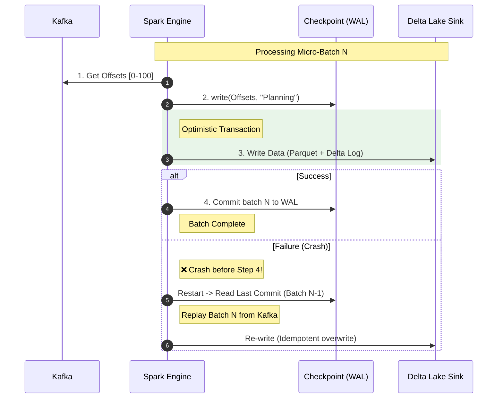

# Exactly-Once Processing

> **Guaranteeing no duplicates and no data loss in streaming**

## The Core Problem

*"How do you guarantee each record is processed exactly once - not zero times, not twice?"*

```
Delivery Semantics:
───────────────────────────────────────────────────────────────────
AT-MOST-ONCE:   May lose records (fire and forget)
AT-LEAST-ONCE:  May duplicate records (retry on failure)
EXACTLY-ONCE:   Each record processed exactly once ← THIS!
```

---

## 🏗️ Exactly-Once Architecture



---

## 🔧 Code Implementation

### Spark Structured Streaming with Checkpoints

```python
from pyspark.sql.functions import *

# Read from Kafka with exactly-once
kafka_stream = spark.readStream \
    .format("kafka") \
    .option("kafka.bootstrap.servers", "broker:9092") \
    .option("subscribe", "orders") \
    .option("startingOffsets", "earliest") \
    .load()

# Parse and transform
orders = kafka_stream \
    .select(from_json(col("value").cast("string"), schema).alias("data")) \
    .select("data.*")

# Write to Delta with EXACTLY-ONCE guarantee
query = orders.writeStream \
    .format("delta") \
    .outputMode("append") \
    .option("checkpointLocation", "/checkpoints/orders_stream") \
    .option("mergeSchema", "true") \
    .trigger(processingTime="10 seconds") \
    .start("/silver/orders")

# The checkpoint directory contains:
# - offsets (which Kafka offsets were read)
# - commits (which batches were successfully written)
# - state (for stateful operations like aggregations)
```

### Idempotent Batch Processing

```python
from delta.tables import DeltaTable

def process_batch_idempotent(batch_id: str, input_path: str, output_path: str):
    """
    Process a batch idempotently - safe to re-run.
    """
    
    # Read input
    df = spark.read.format("delta").load(input_path) \
        .filter(f"batch_id = '{batch_id}'")
    
    # Transform
    result = df.withColumn("processed_at", current_timestamp())
    
    # Check if already processed (idempotency check)
    if DeltaTable.isDeltaTable(spark, output_path):
        existing = spark.read.format("delta").load(output_path) \
            .filter(f"batch_id = '{batch_id}'")
        if existing.count() > 0:
            print(f"Batch {batch_id} already processed, skipping")
            return
    
    # Write with MERGE (upsert) for idempotency
    if DeltaTable.isDeltaTable(spark, output_path):
        target = DeltaTable.forPath(spark, output_path)
        target.alias("target").merge(
            result.alias("source"),
            "target.record_id = source.record_id AND target.batch_id = source.batch_id"
        ).whenMatchedUpdateAll() \
         .whenNotMatchedInsertAll() \
         .execute()
    else:
        result.write.format("delta").save(output_path)
```

### Foreachbatch with Exactly-Once

```python
def write_to_multiple_sinks(batch_df, batch_id):
    """
    Write to multiple sinks with exactly-once semantics.
    """
    
    # Use batch_id for idempotency
    batch_df = batch_df.withColumn("batch_id", lit(batch_id))
    
    # Persist to avoid recomputation
    batch_df.persist()
    
    try:
        # Write to Delta (primary)
        batch_df.write.format("delta") \
            .mode("append") \
            .save("/silver/orders")
        
        # Write to metrics table
        metrics = batch_df.agg(
            count("*").alias("record_count"),
            sum("amount").alias("total_amount")
        ).withColumn("batch_id", lit(batch_id))
        
        metrics.write.format("delta") \
            .mode("append") \
            .save("/monitoring/batch_metrics")
        
    finally:
        batch_df.unpersist()


# Use foreachBatch for custom sink logic
query = orders.writeStream \
    .foreachBatch(write_to_multiple_sinks) \
    .option("checkpointLocation", "/checkpoints/orders_multi_sink") \
    .start()
```

---

## 📊 Delivery Semantics Summary

| Semantic | Guarantee | How |
|----------|-----------|-----|
| **At-most-once** | Fire and forget | Commit offset before processing |
| **At-least-once** | May duplicate | Commit offset after processing |
| **Exactly-once** | Perfect | Checkpoint + atomic sink + idempotent writes |

---

## ⚠️ Requirements for Exactly-Once

| Requirement | Why | How |
|-------------|-----|-----|
| **Checkpoint enabled** | Track progress | `checkpointLocation` option |
| **Idempotent sink** | Safe re-writes | Delta Lake ACID, MERGE |
| **Deterministic processing** | Same input = same output | Avoid random(), current_timestamp() in transforms |

---

## 🎯 Interview Questions

| Question | Expected Answer |
|----------|----------------|
| *"What is exactly-once?"* | Each record processed once - no loss, no duplicates |
| *"How does Spark achieve it?"* | Checkpoints (offsets + commits) + atomic Delta writes |
| *"What if job fails mid-batch?"* | Restart reads uncommitted offsets, replays processing |
| *"Why is Delta Lake important?"* | ACID writes ensure atomic commits, idempotent re-writes |

---

## 📖 Summary

You've now covered all **8 critical scenarios**:

1. ✅ Out-of-Order Events (watermarks)
2. ✅ Duplicate Records (deduplication)
3. ✅ Schema Drift (evolution handling)
4. ✅ Backfill (partition-by-partition)
5. ✅ CDC Deletes (soft/hard delete)
6. ✅ Data Reconciliation (validation)
7. ✅ Hot Partitions (salting, AQE)
8. ✅ Exactly-Once Processing (checkpoints)

**Good luck with your interview! 🚀**
