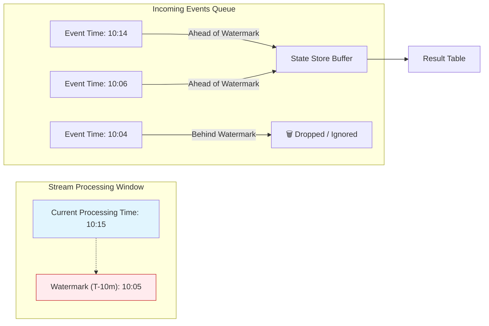

# Late-Arriving Data Handling


> **Senior Staff / Principal Interview Scenario**
>
> "Orders data arrived, but the product_id doesn't exist in Products dimension yet. What do you do?"

---

## 🔴 The Real-World Scenario

> *"You're a Lead DE at an e-commerce company. On Monday morning, you discover that 15,000 orders from the weekend show `product_name = NULL` in reports. Investigation reveals: new products were launched Friday night, but the Products dimension table update job failed. The Orders table has product_ids that don't exist in Products yet."*

**Business Impact**:

- Dashboard shows incomplete sales data
- Revenue reports are inaccurate
- Product managers can't see performance of new products

**Root Cause**: **Late-arriving dimension data** - Fact table references dimension keys that don't exist yet.

---

## 📚 Key Terminology

| Term | Definition | Example |
|:-----|:-----------|:--------|
| **Late-Arriving Dimension** | Dimension record arrives AFTER fact records that reference it | Product added after orders reference it |
| **Late-Arriving Fact** | Fact record arrives after its time window closed | Mobile order synced 3 days late |
| **Watermark** | Point in time that defines "too late" cutoff | `watermark = max_event_time - 10min` |
| **Allowed Lateness** | Grace period for events after watermark | Accept events up to 2 hours past watermark |
| **Unknown Member** | Placeholder dimension record for unmatched keys | `product_id = -1, name = 'Unknown'` |
| **Staging Table** | Holding area for unmatched records awaiting retry | `/staging/unmatched_orders` |

---

## ⚖️ Two Distinct Problems

| Problem | Description | Solution |
|:--------|:------------|:---------|
| **Late-Arriving Dimension** | Fact arrives before dimension exists | Staging + Retry OR Unknown Member |
| **Late-Arriving Fact** | Event arrives after processing window closed | Watermark + Allowed Lateness |

---

## 🔴 The Problem

```mermaid
gantt
    title Watermark Trade-off: Latency vs Completeness
    dateFormat  HH:mm
    axisFormat  %H:%M
    
    section Timelines
    Wall Clock - Processing Time :active, proc_time, 10:00, 30m
    Event Time - Data Arrival    :crit, data_arr, 10:00, 30m
    
    section Events
    On-Time Event 1005           :done,    event1, 10:05, 1m
    Late Buffered Event 1002     :active,  event2, 10:15, 1m
    Dropped Event 0955           :crit,    event3, 10:20, 1m
    
    section Watermark
    Watermark - Delay 10m        :milestone, 10:10, 0m
```





---

## 🏗️ Architecture Solutions

### Solution 1: Staging + Retry Pattern

```
┌─────────────────────────────────────────────────────────────────────────────┐
│                     STAGING + RETRY PATTERN                                  │
├─────────────────────────────────────────────────────────────────────────────┤
│                                                                              │
│  ┌─────────────┐        ┌─────────────┐                                     │
│  │   ORDERS    │        │  PRODUCTS   │                                     │
│  │   (fact)    │        │   (dim)     │                                     │
│  └──────┬──────┘        └──────┬──────┘                                     │
│         │                      │                                             │
│         ▼                      ▼                                             │
│  ┌────────────────────────────────────────────────────────────────────────┐ │
│  │                         JOIN PROCESS                                    │ │
│  │                                                                         │ │
│  │   SELECT o.*, p.product_name                                            │ │
│  │   FROM orders o                                                         │ │
│  │   LEFT JOIN products p ON o.product_id = p.product_id                   │ │
│  └───────────────────────────────┬────────────────┬───────────────────────┘ │
│                                  │                │                          │
│              ┌───────────────────┘                └───────────────────┐      │
│              ▼                                                        ▼      │
│  ┌───────────────────────┐                            ┌───────────────────┐  │
│  │   MATCHED ORDERS      │                            │  UNMATCHED ORDERS │  │
│  │   (product found)     │                            │  (product missing)│  │
│  │                       │                            │                   │  │
│  │   → Write to Gold     │                            │   → Write to      │  │
│  │                       │                            │     STAGING TABLE │  │
│  └───────────────────────┘                            └─────────┬─────────┘  │
│                                                                 │            │
│                                                    ┌────────────┘            │
│                                                    ▼                         │
│  ┌─────────────────────────────────────────────────────────────────────────┐│
│  │                    RETRY JOB (runs hourly)                               ││
│  │                                                                          ││
│  │   1. Read staging table                                                  ││
│  │   2. Join with latest Products dimension                                 ││
│  │   3. If matched → Move to Gold, delete from staging                      ││
│  │   4. If still unmatched → Keep in staging                                ││
│  │   5. After N retries → Move to dead letter / alert                       ││
│  └─────────────────────────────────────────────────────────────────────────┘│
│                                                                              │
└─────────────────────────────────────────────────────────────────────────────┘
```

**Code Implementation:**

```python
# Main processing job
def process_orders_with_late_arriving_dims(spark):
    orders_df = spark.read.format("delta").load("/silver/orders")
    products_df = spark.read.format("delta").load("/silver/products")
    
    # Left join to identify matched/unmatched
    joined = orders_df.join(
        products_df,
        on="product_id",
        how="left"
    )
    
    # Split into matched and unmatched
    matched = joined.filter(col("product_name").isNotNull())
    unmatched = joined.filter(col("product_name").isNull())
    
    # Write matched to Gold
    matched.write.format("delta").mode("append") \
        .save("/gold/enriched_orders")
    
    # Write unmatched to staging for retry
    if unmatched.count() > 0:
        unmatched.select("order_id", "product_id", "order_date", 
                        lit(current_timestamp()).alias("staged_at"),
                        lit(0).alias("retry_count")) \
            .write.format("delta").mode("append") \
            .save("/staging/unmatched_orders")

# Retry job (runs hourly)
def retry_unmatched_orders(spark):
    staging = spark.read.format("delta").load("/staging/unmatched_orders")
    products = spark.read.format("delta").load("/silver/products")
    
    # Try to match again
    retry_joined = staging.join(products, on="product_id", how="left")
    
    now_matched = retry_joined.filter(col("product_name").isNotNull())
    still_unmatched = retry_joined.filter(col("product_name").isNull())
    
    # Move matched to Gold
    if now_matched.count() > 0:
        now_matched.write.format("delta").mode("append") \
            .save("/gold/enriched_orders")
        # Delete from staging (use MERGE for Delta)
    
    # Increment retry count for still unmatched
    # Move to DLQ after max retries
```

---

### Solution 2: Unknown Member Pattern

```
┌─────────────────────────────────────────────────────────────────┐
│                  UNKNOWN MEMBER PATTERN                          │
│                                                                  │
│  Products Dimension:                                             │
│  ┌────────────────────────────────────────────────────────────┐ │
│  │ product_id │ product_name        │ category   │ status     │ │
│  ├────────────┼────────────────────┼────────────┼────────────┤ │
│  │     -1     │ Unknown Product     │ Unknown    │ PLACEHOLDER│ │  ← Default row
│  │     101    │ iPhone 15           │ Electronics│ ACTIVE     │ │
│  │     102    │ MacBook Pro         │ Electronics│ ACTIVE     │ │
│  └────────────────────────────────────────────────────────────┘ │
│                                                                  │
│  When product_id not found:                                      │
│  JOIN with COALESCE(product_id, -1) → Gets "Unknown Product"    │
│                                                                  │
│  Later: Backfill job updates orders when product arrives         │
└─────────────────────────────────────────────────────────────────┘
```

---

### Solution 3: Event-Time Based Windowing

```
┌─────────────────────────────────────────────────────────────────┐
│               EVENT-TIME WINDOWING                               │
│                                                                  │
│  Don't process immediately!                                      │
│  Wait for a window where ALL data should have arrived.           │
│                                                                  │
│  ┌─────────────────────────────────────────────────────────────┐│
│  │  Time Window: 10:00 - 11:00 AM                               ││
│  │                                                               ││
│  │  Processing starts at: 11:30 AM (30 min buffer)              ││
│  │                                                               ││
│  │  By 11:30, both Orders AND Products for that hour            ││
│  │  should have arrived.                                        ││
│  └─────────────────────────────────────────────────────────────┘│
│                                                                  │
│  Streaming version (watermarking):                               │
│  .withWatermark("event_time", "30 minutes")                     │
│  .groupBy(window("event_time", "1 hour"))                       │
│                                                                  │
└─────────────────────────────────────────────────────────────────┘
```

---

## 🎯 Interview Answer Framework

> *"For late-arriving dimensions, I'd implement a Staging + Retry pattern:*
>
> 1. *Process with LEFT JOIN immediately*
> 2. *Matched records → Gold layer*
> 3. *Unmatched records → Staging table with timestamp*
> 4. *Hourly retry job re-attempts join with latest dimensions*
> 5. *After N retries (e.g., 24 hours) → Move to DLQ and alert*
>
> *Alternative: Unknown member pattern where dimension has a default -1 row, and backfill job updates later."*

---

## 📖 Next Topic

Continue to [Petabyte-Scale Patterns](./05-petabyte-scale-patterns.md) for distributed data handling.
