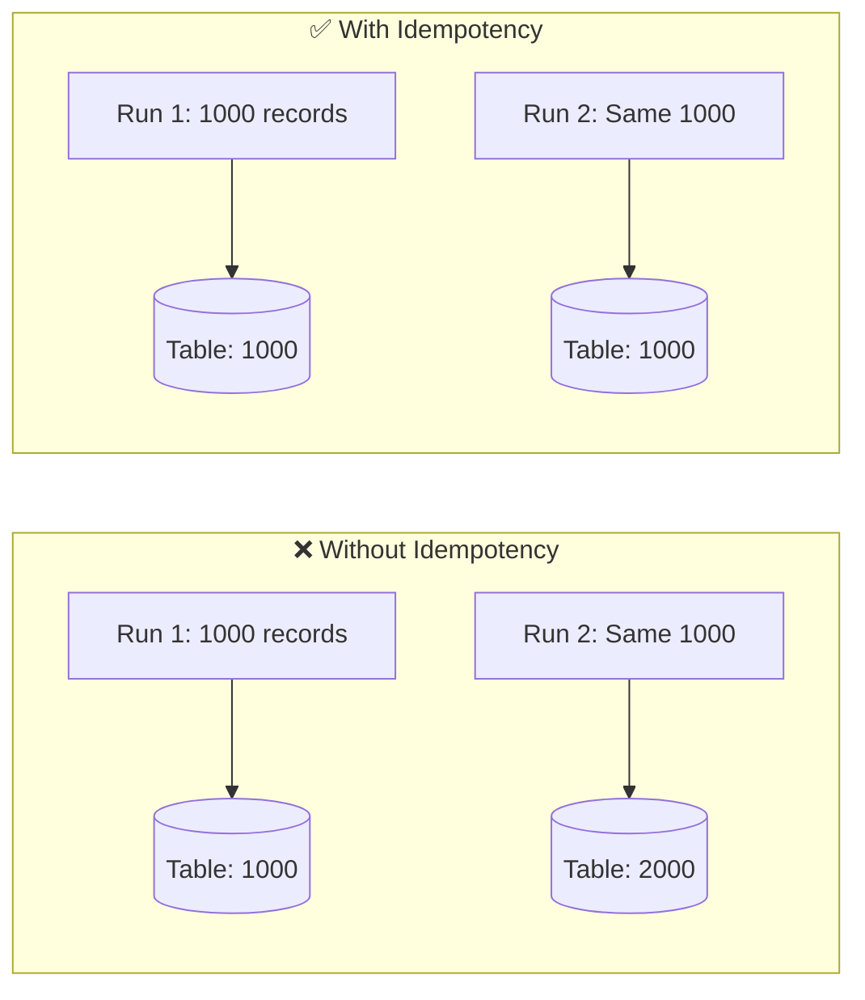
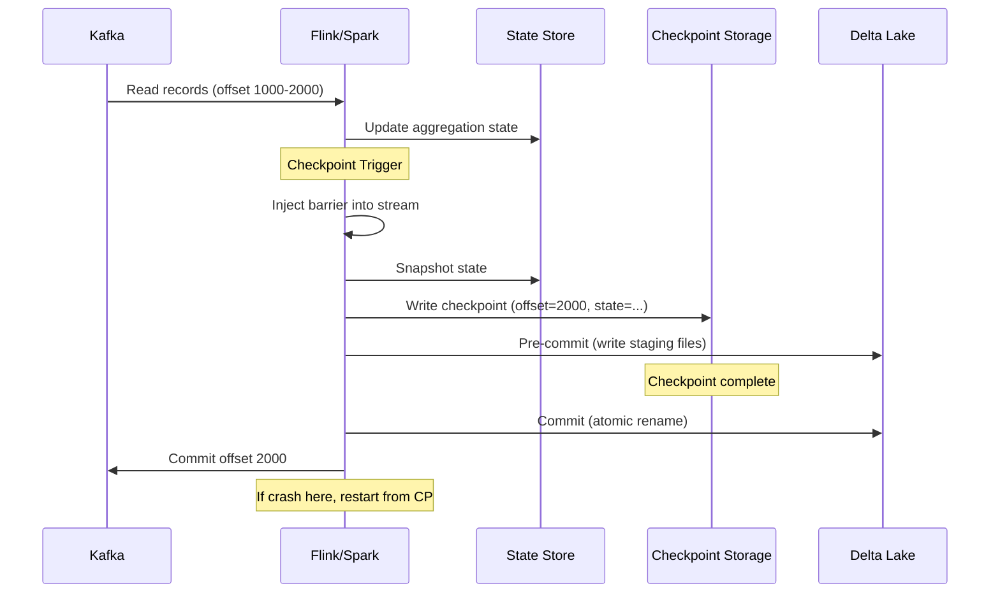
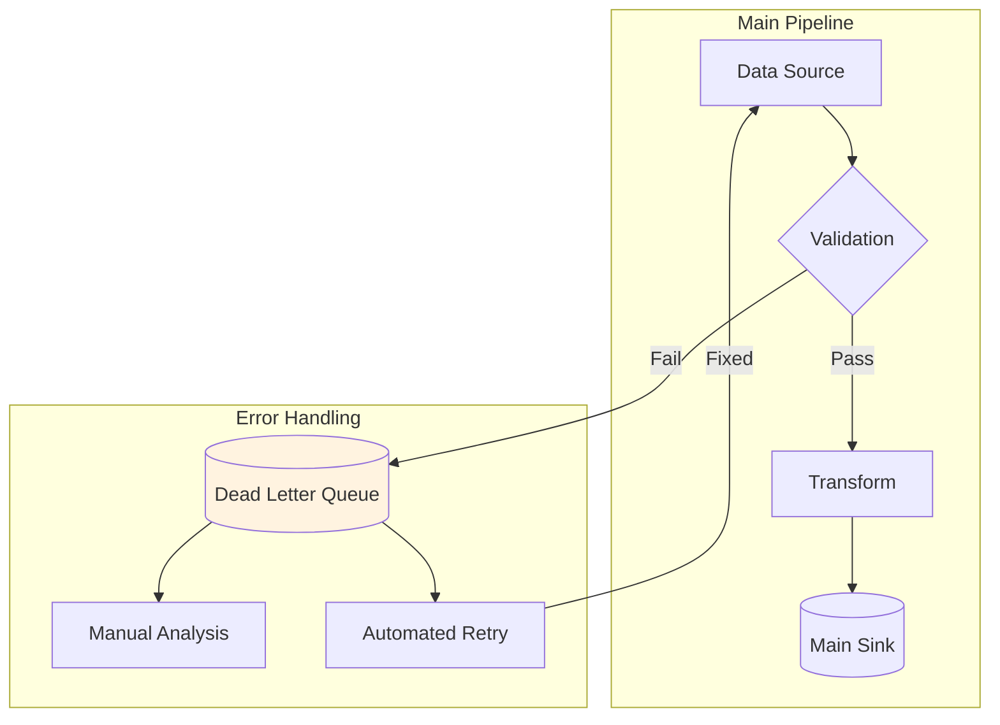
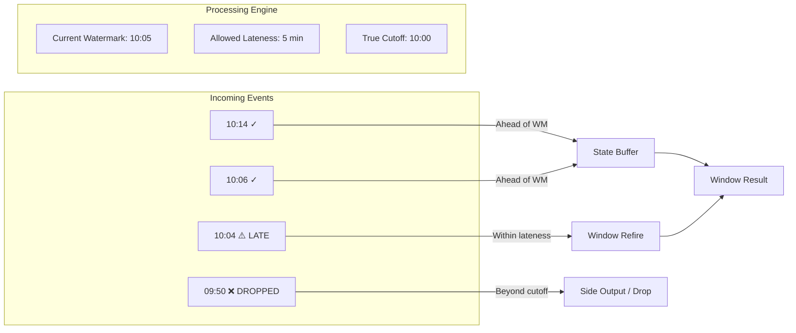
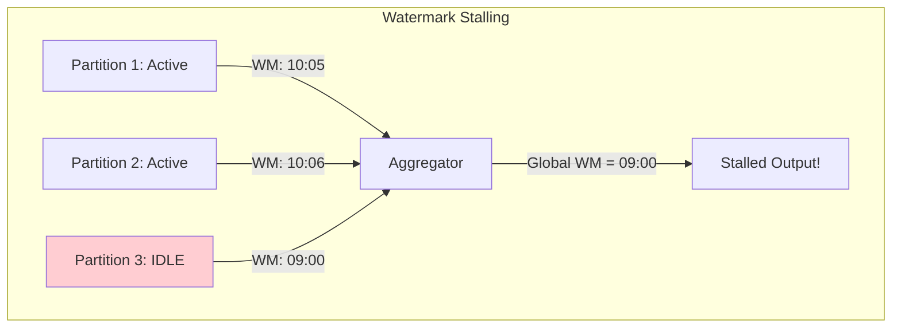

# Data Patterns Master Guide

> **Senior Staff Data Engineer / Principal Architect Interview Prep**
>
> Comprehensive guide covering Data Correctness, Reliability, and Integrity patterns for distributed data pipelines and Lakehouse architectures.

---

## Table of Contents

1. [Part 1: Core Terminology](#part-1-core-terminology)
2. [Part 2: Pipeline Processing Patterns](#part-2-pipeline-processing-patterns)
3. [Part 3: Streaming Patterns](#part-3-streaming-patterns)
4. [Part 4: Lakehouse Storage Patterns](#part-4-lakehouse-storage-patterns)
5. [Part 5: Unified Analogy](#part-5-unified-analogy)
6. [Part 6: Production Code Reference](#part-6-production-code-reference)
7. [Part 7: Interview Quick Reference](#part-7-interview-quick-reference)
8. [Part 8: Decision Matrices](#part-8-decision-matrices)

---

# Part 1: Core Terminology

> **Read this section FIRST** - Understanding these terms is foundational to everything else.

## 1.1 Fundamental Definitions

| Term | Definition | Why It Matters | Real Example |
|:-----|:-----------|:---------------|:-------------|
| **Data Correctness** | Data accurately reflects source truth at any point in time | Financial audits require zero discrepancy | Payment processed exactly once, not twice |
| **Data Reliability** | Pipeline recovers from failures and eventually produces correct results | 99.9% uptime SLA requirement | Job auto-restarts from checkpoint after OOM |
| **Data Integrity** | Data remains consistent and uncorrupted across storage operations | No orphaned records after partial failure | ACID transactions in Lakehouse |

## 1.2 Time Concepts

```
┌─────────────────────────────────────────────────────────────────────────────┐
│                    EVENT-TIME vs PROCESSING-TIME                             │
├─────────────────────────────────────────────────────────────────────────────┤
│                                                                              │
│  Timeline:    10:00 AM      10:05 AM      10:15 AM      10:30 AM            │
│                  │             │             │             │                 │
│                  │             │             │             │                 │
│  EVENT-TIME:     ▼             │             │             │                 │
│              Order placed      │             │             │                 │
│              (in app payload)  │             │             │                 │
│                                │             │             │                 │
│  INGESTION-TIME:               ▼             │             │                 │
│                           Arrived at         │             │                 │
│                           Kafka broker       │             │                 │
│                                              │             │                 │
│  PROCESSING-TIME:                            ▼             │                 │
│                                          Processed by      │                 │
│                                          Spark job         │                 │
│                                                            │                 │
│  VISIBLE IN DW:                                            ▼                 │
│                                                        Available            │
│                                                        for query            │
│                                                                              │
└─────────────────────────────────────────────────────────────────────────────┘
```

| Time Type | Definition | Use Case | Gotcha |
|:----------|:-----------|:---------|:-------|
| **Event-Time** | When event actually occurred at source | Time-based aggregations, billing | Requires extraction from payload |
| **Processing-Time** | When event was processed by system | Monitoring, debugging | Non-deterministic, varies on replay |
| **Ingestion-Time** | When event entered pipeline | Fallback when event-time unavailable | Still affected by network delays |

## 1.3 Delivery Guarantees

```
┌────────────────────────────────────────────────────────────────────────────┐
│                    DELIVERY SEMANTICS SPECTRUM                              │
├────────────────────────────────────────────────────────────────────────────┤
│                                                                             │
│   AT-MOST-ONCE          AT-LEAST-ONCE            EXACTLY-ONCE              │
│       │                      │                        │                     │
│       ▼                      ▼                        ▼                     │
│   ┌───────┐              ┌───────┐               ┌───────┐                 │
│   │ Fire  │              │ Retry │               │ Dedup │                 │
│   │ and   │              │ Until │               │   +   │                 │
│   │Forget │              │Success│               │Transact│                 │
│   └───────┘              └───────┘               └───────┘                 │
│                                                                             │
│   Data Loss OK       Duplicates OK            No Loss, No Dups             │
│   (Metrics/Logs)     (Idempotent Sinks)       (Financial Data)             │
│                                                                             │
│   Commit offset      Commit offset             Checkpoint + offset         │
│   BEFORE process     AFTER process             ATOMICALLY together         │
│                                                                             │
└────────────────────────────────────────────────────────────────────────────┘
```

| Guarantee | Data Loss? | Duplicates? | Performance | Use Case |
|:----------|:-----------|:------------|:------------|:---------|
| **At-Most-Once** | Possible | Never | Fastest | Logs, metrics, telemetry |
| **At-Least-Once** | Never | Possible | Fast | Most pipelines + dedup at sink |
| **Exactly-Once** | Never | Never | Slowest | Financial transactions, inventory |

**Key Equation**:

```
Exactly-Once = At-Least-Once Delivery + Idempotent Processing
```

## 1.4 CAP Theorem Trade-offs

| Property | Definition | Example |
|:---------|:-----------|:--------|
| **Consistency** | All nodes see same data at same time | Strong consistency in RDBMS |
| **Availability** | Every request gets a response | Eventually consistent systems |
| **Partition Tolerance** | System works despite network failures | Required in distributed systems |

**For Data Pipelines**: We typically choose AP (Availability + Partition Tolerance) with eventual consistency, using patterns like idempotency and reconciliation to ensure correctness.

---

# Part 2: Pipeline Processing Patterns

## 2.1 Idempotency

### Real-World Scenario

> *"Your Spark job failed at 90% completion. You restart it. The job runs again. Question: Did you just create millions of duplicate records?"*

If your pipeline isn't idempotent, the answer is **yes**.

### Terminology

| Term | Definition |
|:-----|:-----------|
| **Idempotent Operation** | Operation that produces same result whether applied once or multiple times: `f(f(x)) = f(x)` |
| **Deduplication Key** | Unique identifier for detecting duplicates (e.g., `order_id + event_time`) |
| **Upsert / MERGE** | Insert if new, update if exists - inherently idempotent |

### High-Level Solution

Design every pipeline stage so it can be safely re-run without side effects.



### Deep-Dive: Implementation Patterns

**Pattern 1: MERGE / Upsert**

```python
# Delta Lake MERGE - inherently idempotent
target_table.alias("target").merge(
    source_df.alias("source"),
    "target.order_id = source.order_id"
).whenMatchedUpdateAll() \
 .whenNotMatchedInsertAll() \
 .execute()
```

**Pattern 2: Partition Overwrite**

```python
# Replace entire partition - idempotent
df.write.format("delta") \
    .mode("overwrite") \
    .option("replaceWhere", "order_date = '2024-01-15'") \
    .save("/silver/orders")
```

**Pattern 3: Deduplication Before Write**

```python
from pyspark.sql.window import Window
from pyspark.sql.functions import row_number, col

window = Window.partitionBy("order_id").orderBy(col("event_time").desc())
deduped = df.withColumn("rn", row_number().over(window)) \
            .filter(col("rn") == 1) \
            .drop("rn")
```

### Common Mistakes

| Mistake | Problem | Solution |
|:--------|:--------|:---------|
| Using `append` mode without dedup | Creates duplicates on retry | Use MERGE or partition overwrite |
| Non-deterministic dedup key | Same record gets different keys | Use stable business keys only |
| Dedup key includes `current_timestamp()` | Every run creates new "unique" records | Use event_time from payload |

### Interview Question

> **Q**: "How do you make a pipeline idempotent?"

**Staff/Principal Answer**:
"I design pipelines with three layers of idempotency:

1. **Source**: Track processed offsets in a metadata table
2. **Processing**: Use deterministic transformations (no random(), no current_timestamp() in business logic)  
3. **Sink**: Use MERGE for upserts, or partition overwrite with replaceWhere

The key insight is that idempotency must be end-to-end. If any stage isn't idempotent, the entire pipeline isn't."

---

## 2.2 Checkpointing & Write-Ahead Logs

### Real-World Scenario

> *"Your streaming job crashes after processing 1 million records. When it restarts, does it start from record 1 or record 1,000,001?"*

Without checkpointing: **record 1** (losing all progress).
With checkpointing: **record 1,000,001** (resuming from last good state).

### Terminology

| Term | Definition |
|:-----|:-----------|
| **Checkpoint** | Periodic snapshot of pipeline state (offsets, aggregations, windows) |
| **Write-Ahead Log (WAL)** | Log written BEFORE data modification; enables recovery |
| **Offset** | Position in source stream (e.g., Kafka partition offset 12345) |
| **Barrier** | Marker injected into stream to coordinate checkpoint across operators |

### Architecture Diagram



### Deep-Dive: Two-Phase Commit

Exactly-once requires atomic commit across source, state, and sink:

1. **Phase 1: Pre-commit**
   - Flush state to checkpoint storage
   - Write data files to staging location
   - Record pending commit metadata

2. **Phase 2: Commit**
   - Atomically rename staging files to final location
   - Update checkpoint with new offsets
   - Acknowledge source (commit Kafka offsets)

### Common Mistakes

| Mistake | Problem | Solution |
|:--------|:--------|:---------|
| Checkpoint interval too short | Overhead exceeds processing time | Set to 30s-5min based on state size |
| Checkpoint interval too long | Lots of data to replay on failure | Balance with SLA requirements |
| Committing offset before sink | Data loss on crash | Always: sink commit → checkpoint → offset commit |

---

## 2.3 Dead Letter Queue (DLQ)

### Real-World Scenario

> *"0.1% of your records fail validation. Do you drop them? Do you stop the entire pipeline?"*

Neither. You route them to a DLQ for later analysis and retry.

### Architecture Diagram



### Production Code

```python
class DeadLetterHandler:
    def __init__(self, dlq_path: str, max_retries: int = 3):
        self.dlq_path = dlq_path
        self.max_retries = max_retries
    
    def route_to_dlq(self, record: dict, error: Exception, retry_count: int = 0):
        dlq_record = {
            "original_record": record,
            "error_type": type(error).__name__,
            "error_message": str(error),
            "retry_count": retry_count,
            "failed_at": datetime.utcnow().isoformat(),
            "replayable": retry_count < self.max_retries
        }
        
        # Write to DLQ table
        spark.createDataFrame([dlq_record]).write \
            .format("delta") \
            .mode("append") \
            .save(self.dlq_path)
        
        # Alert if replayable
        if dlq_record["replayable"]:
            send_alert(f"DLQ: {dlq_record['error_type']}")
```

---

## 2.4 The I-CROW-D Mnemonic

Remember pipeline reliability with **I-CROW-D**:

| Letter | Concept | One-Liner |
|:-------|:--------|:----------|
| **I** | Idempotency | Same input always produces same output |
| **C** | Checkpointing | Recoverable state snapshots |
| **R** | Retries | Exponential backoff for transient failures |
| **O** | Ordering | Watermarks for event-time correctness |
| **W** | Write-ahead | Log before commit |
| **D** | Dead Letter Queue | Don't drop problematic data |

---

# Part 3: Streaming Patterns

## 3.1 Watermarks

### Real-World Scenario

> *"Your hourly aggregation for 10:00-11:00 AM should include all orders from that hour. But mobile app users were offline, and their orders arrived at 2:00 PM with timestamps from 10:30 AM. What do you do?"*

**Watermarks** tell the system when it's "safe" to finalize a time window.

### Terminology

| Term | Definition |
|:-----|:-----------|
| **Watermark** | Assertion: "All events with timestamp < W have been seen" |
| **Allowed Lateness** | Time buffer after watermark for late events |
| **Window** | Time-bounded bucket for aggregation |
| **Trigger** | When to emit window results (on watermark, on late data, on processing-time) |

### The Watermark Equation

```
Watermark(t) = max(event_time seen) - allowed_lateness

Example:
- Max event_time seen: 10:30 AM
- Allowed lateness: 10 minutes
- Watermark: 10:20 AM
- Result: Window 09:00-10:00 can safely close
```

### Architecture Diagram



### Deep-Dive: Advanced Watermark Concepts

#### 3.1.1 Propagation & The "Idle Source" Problem

**Propagation Rule**: In a distributed system, the global watermark is the **minimum** of all input partition watermarks.
`GlobalWM = min(WM_Partition_1, WM_Partition_2, ...)`

**The Problem**: If *one* partition becomes idle (no data), its watermark doesn't advance. The **entire system stalls** because the minimum stays stuck.



**Solution**: Enable **Idleness Timeout**.

- "If a partition is silent for X minutes, mark it as 'Idle' and ignore it in the Min calculation."
- `spark.sql.streaming.noDataMicroBatches.enabled = true` (in some contexts) or specific source options.

#### 3.1.2 Tuning Watermark Delay

How do you choose "10 minutes" vs "2 hours"?

1. **Measure Latency Distribution**: Plot a histogram of `(ingestion_time - event_time)`.
2. **Identify P99**: Find the delay that covers 99% of your data.
3. **Add Buffer**: Add a safety margin (e.g., +50%).
4. **Cost-Benefit Analysis**:
    - *Larger Delay* = More completeness, but higher state memory usage (must keep windows open longer).
    - *Smaller Delay* = Lower memory, faster results, but more dropped data.

#### 3.1.3 Late Data Handling Strategies

When data arrives *after* `Watermark + AllowedLateness`, you have choices:

| Strategy | Mechanism | Pros | Cons |
|:---------|:----------|:-----|:-----|
| **Drop** | Default behavior | Zero cost, protects downstream | Data loss |
| **Side Output** | Divert to separate stream | No data loss, main stream stays fast | Complex to merge later |
| **Refire** | Update old window | Correctness | Downstream must handle updates |
| **Dead Letter** | Write to DLQ table | Auditable | Needs repayment process |

### Production Code

```python
from pyspark.sql.functions import window, col

# Streaming with watermark
orders_stream = spark.readStream \
    .format("kafka") \
    .option("subscribe", "orders") \
    .load() \
    .select(from_json(col("value").cast("string"), schema).alias("data")) \
    .select("data.*")

# Key: withWatermark BEFORE groupBy
hourly_gmv = orders_stream \
    .withWatermark("event_time", "2 hours") \    # Allow 2 hours late
    .groupBy(window("event_time", "1 hour")) \
    .agg(sum("amount").alias("gmv"))

# Write with checkpoint for exactly-once
query = hourly_gmv.writeStream \
    .format("delta") \
    .outputMode("update") \             # Accumulate mode for late data
    .option("checkpointLocation", "/cp/hourly_gmv") \
    .start("/gold/hourly_gmv")
```

### Common Mistakes

| Mistake | Problem | Solution |
|:--------|:--------|:---------|
| Watermark after groupBy | Watermark ignored | Always watermark BEFORE aggregation |
| Very small watermark delay | Too much data dropped | Analyze P99 lateness, add buffer |
| Unbounded allowed lateness | State grows forever, OOM | Bound lateness, use side output |

### Interview Question

> **Q**: "Watermark is at 10:00 and an event with timestamp 09:30 arrives. What happens?"

**Answer**: "It depends on allowed lateness:

- If `allowedLateness >= 30 min`: Event is processed, window refires with updated result
- If `allowedLateness < 30 min`: Event is dropped OR sent to side output
- **Key insight**: Watermark alone doesn't determine late cutoff. It's `watermark + allowed_lateness` that defines the true cutoff."

---

## 3.2 Windowing Types

### Visual Comparison

```
TUMBLING WINDOWS (Fixed, non-overlapping)
────────────────────────────────────────────────────────────
|   Window 1   |   Window 2   |   Window 3   |   Window 4   |
|  10:00-11:00 |  11:00-12:00 |  12:00-13:00 |  13:00-14:00 |
────────────────────────────────────────────────────────────

SLIDING WINDOWS (Fixed, overlapping)
────────────────────────────────────────────────────────────
|   Window 1 (10:00-11:00)    |
    |   Window 2 (10:30-11:30)    |
        |   Window 3 (11:00-12:00)    |
            |   Window 4 (11:30-12:30)    |
────────────────────────────────────────────────────────────

SESSION WINDOWS (Gap-based, dynamic)
────────────────────────────────────────────────────────────
| Session 1 |        gap        | Session 2 |   gap  |Sess3|
|  events   |    (no events)    |  events   |        |     |
────────────────────────────────────────────────────────────
```

| Window Type | Size | Overlap | State Size | Use Case |
|:------------|:-----|:--------|:-----------|:---------|
| **Tumbling** | Fixed | None | O(1) | Hourly/daily reports |
| **Sliding** | Fixed | Yes | O(n) windows | Moving averages |
| **Session** | Dynamic | None | Unbounded | User session analytics |

---

## 3.3 The WATER Mnemonic

Remember streaming patterns with **WATER**:

| Letter | Concept | Question It Answers |
|:-------|:--------|:--------------------|
| **W** | Watermark | "When is it safe to fire windows?" |
| **A** | Allowed Lateness | "How late is too late?" |
| **T** | Trigger | "When do I emit results?" |
| **E** | Exactly-Once | "How do I avoid duplicates?" |
| **R** | Reprocessing | "How do I replay from checkpoint?" |

---

# Part 4: Lakehouse Storage Patterns

## 4.1 Transaction Log Internals

### What Problem Does It Solve?

Object storage (S3, ADLS, GCS) is **eventually consistent** and has no native transaction support. Lakehouse table formats add ACID guarantees via a transaction log.

### How It Works

```
my_table/
├── _delta_log/                          # Transaction Log
│   ├── 00000000000000000000.json       # Version 0: CREATE TABLE
│   ├── 00000000000000000001.json       # Version 1: INSERT 1000 rows
│   ├── 00000000000000000002.json       # Version 2: DELETE 50 rows
│   ├── 00000000000000000003.json       # Version 3: UPDATE 200 rows
│   └── 00000000000000000010.checkpoint.parquet  # Checkpoint every 10 versions
│
└── _data/                               # Actual Data Files
    ├── part-00000-abc123.parquet       # Active file
    ├── part-00001-def456.parquet       # Active file
    └── part-00002-ghi789.parquet       # Obsolete (marked for removal)
```

**Commit File Contents**:

```json
{
  "add": [
    {"path": "part-00000-abc123.parquet", "size": 1048576, "stats": {...}}
  ],
  "remove": [
    {"path": "part-00002-old.parquet", "deletionTimestamp": 1704067200000}
  ],
  "txn": {"appId": "spark-job-123", "version": 3}
}
```

### ACID Implementation

| Property | How Lakehouse Implements It |
|:---------|:----------------------------|
| **Atomicity** | Single commit file write is atomic; partial writes invisible |
| **Consistency** | Schema enforcement at write time |
| **Isolation** | Snapshot isolation via versioned reads; OCC for writes |
| **Durability** | Object storage durability (11 nines for S3) |

---

## 4.2 VACUUM and OPTIMIZE

### VACUUM: File Cleanup

**Problem**: Deletes and updates don't remove physical files—they mark them as obsolete. Files accumulate.

```sql
-- Before VACUUM: 10 TB data, 15 TB storage (5 TB obsolete files)
-- After VACUUM:  10 TB data, 10 TB storage

VACUUM my_table RETAIN 168 HOURS;  -- Keep 7 days of history
```

**Critical Warning**: VACUUM is **irreversible**. It breaks time-travel queries beyond retention.

### OPTIMIZE: Compaction + Z-ORDER

**Problem**: Streaming creates many small files (1 file per micro-batch). Query performance degrades.

```sql
-- Before: 50,000 files × 2 MB = 100 GB, query scans all files
-- After:  400 files × 250 MB = 100 GB, efficient I/O

OPTIMIZE my_table
WHERE event_date >= '2024-01-01'
ZORDER BY (user_id, event_type);
```

**Z-ORDER**: Colocates related data in multi-dimensional space for better data skipping.

```
Before Z-ORDER:                    After Z-ORDER:
┌─────────────────────┐            ┌─────────────────────┐
│ File 1              │            │ File 1              │
│ user_id: 1-1000     │            │ user_id: 1-500      │
│ event: A-Z          │            │ event: A-M          │
├─────────────────────┤            ├─────────────────────┤
│ File 2              │            │ File 2              │
│ user_id: 500-1500   │            │ user_id: 1-500      │
│ event: A-Z          │            │ event: N-Z          │
└─────────────────────┘            └─────────────────────┘

Query: WHERE user_id = 100        Query: WHERE user_id = 100
Scans: BOTH files                 Scans: Only File 1 & 2 (50% skip)
```

---

## 4.3 Copy-on-Write vs Merge-on-Read

| Aspect | Copy-on-Write (CoW) | Merge-on-Read (MoR) |
|:-------|:--------------------|:--------------------|
| **Write Operation** | Rewrite entire affected file | Append to delta log |
| **Read Operation** | Direct file read | Merge base + delta at read time |
| **Write Latency** | Higher (file rewrite) | Lower (append only) |
| **Read Latency** | Lower (no merge) | Higher (merge overhead) |
| **Best For** | Read-heavy workloads | Write-heavy, streaming |
| **Default** | Delta Lake, Iceberg | Apache Hudi |

**Trade-off Decision**:

```
Read/Write Ratio > 10:1  → Use Copy-on-Write
Read/Write Ratio < 10:1  → Use Merge-on-Read
```

---

## 4.4 Schema Evolution

### Compatibility Matrix

| Change Type | Backward Compatible? | Forward Compatible? | Safe? |
|:------------|:--------------------|:--------------------|:------|
| Add nullable column | ✅ | ✅ | ✅ Safe |
| Add required column | ❌ | ✅ | ⚠️ Breaking for readers |
| Remove column | ✅ | ❌ | ⚠️ Breaking for writers |
| Rename column | ❌ | ❌ | ❌ Breaking |
| Widen type (int→long) | ✅ | ❌ | ⚠️ One-way |

**Handling Schema Drift**:

```python
# Auto-merge new columns
df.write.format("delta") \
    .option("mergeSchema", "true") \
    .mode("append") \
    .save("/table")

# Or explicit schema enforcement (fail on drift)
df.write.format("delta") \
    .option("mergeSchema", "false") \
    .mode("append") \
    .save("/table")  # Throws AnalysisException if schema differs
```

---

## 4.5 The VOCAL Mnemonic

Remember Lakehouse maintenance with **VOCAL**:

| Letter | Concept | Remember |
|:-------|:--------|:---------|
| **V** | Vacuum | "Clean up carefully—breaks time-travel!" |
| **O** | Optimize | "Compact files, Z-ORDER for skipping" |
| **C** | Concurrency | "OCC = expect and handle conflicts" |
| **A** | ACID | "Transaction log is the source of truth" |
| **L** | Log everything | "Schema changes, maintenance runs, failures" |

---

# Part 5: Unified Analogy

## The Hospital Records System

This single analogy covers ALL concepts in this guide:

| Data Engineering Concept | Hospital Equivalent |
|:-------------------------|:--------------------|
| **Data Pipeline** | Patient flow from ER → Diagnosis → Treatment → Discharge |
| **Event-Time** | When symptom actually started (patient's account) |
| **Processing-Time** | When doctor recorded it in system |
| **Transaction Log** | Complete audit trail of every chart update |
| **Checkpoint** | Taking patient vitals snapshot before surgery |
| **Watermark** | "All patients admitted before 10 AM have been triaged" |
| **Exactly-Once** | Each medication administered exactly once (critical!) |
| **Idempotency** | Scanning same patient wristband twice = same patient record |
| **Dead Letter Queue** | Patients requiring specialist escalation |
| **VACUUM** | Shredding old records (careful—insurance audits need them!) |
| **OPTIMIZE** | Reorganizing file cabinets for faster retrieval |
| **Schema Evolution** | Updating chart format (new fields for COVID symptoms) |
| **Partition** | Filing by department (Cardiology, Oncology, etc.) |
| **Z-ORDER** | Keeping related patient files together (same family, same doctor) |

**The nightmare scenario**:
> "Someone shreds old records (VACUUM) while a long-running insurance audit (time-travel query) still needs them. This is why **retention periods must exceed maximum expected query duration**."

---

# Part 6: Production Code Reference

## 6.1 Idempotent Delta Lake MERGE

```python
from delta.tables import DeltaTable
from pyspark.sql import SparkSession

def upsert_idempotent(spark: SparkSession, source_df, target_path: str, 
                       merge_keys: list, update_condition: str = None):
    """
    Idempotent MERGE operation safe for retries.
    
    Args:
        source_df: DataFrame with new/updated records
        target_path: Delta table path
        merge_keys: List of columns for matching (e.g., ['id', 'date'])
        update_condition: Optional (e.g., 'source.version > target.version')
    """
    
    if not DeltaTable.isDeltaTable(spark, target_path):
        source_df.write.format("delta").save(target_path)
        return
    
    target = DeltaTable.forPath(spark, target_path)
    merge_condition = " AND ".join([f"target.{k} = source.{k}" for k in merge_keys])
    
    merge_builder = target.alias("target").merge(
        source_df.alias("source"),
        merge_condition
    )
    
    if update_condition:
        merge_builder = merge_builder.whenMatchedUpdate(
            condition=update_condition,
            set={"*": "source.*"}
        )
    else:
        merge_builder = merge_builder.whenMatchedUpdateAll()
    
    merge_builder.whenNotMatchedInsertAll().execute()

# Usage
upsert_idempotent(
    spark=spark,
    source_df=daily_orders,
    target_path="/silver/orders",
    merge_keys=["order_id", "event_date"],
    update_condition="source.updated_at > target.updated_at"
)
```

## 6.2 Streaming with Watermark

```python
from pyspark.sql.functions import window, col, sum as _sum, from_json
from pyspark.sql.types import StructType, StringType, DoubleType, TimestampType

schema = StructType() \
    .add("order_id", StringType()) \
    .add("amount", DoubleType()) \
    .add("event_time", TimestampType())

# Read from Kafka
orders = spark.readStream \
    .format("kafka") \
    .option("kafka.bootstrap.servers", "kafka:9092") \
    .option("subscribe", "orders") \
    .load() \
    .select(from_json(col("value").cast("string"), schema).alias("data")) \
    .select("data.*")

# Watermark BEFORE aggregation
hourly_gmv = orders \
    .withWatermark("event_time", "2 hours") \
    .groupBy(window("event_time", "1 hour")) \
    .agg(_sum("amount").alias("gmv"))

# Write with exactly-once
query = hourly_gmv.writeStream \
    .format("delta") \
    .outputMode("update") \
    .option("checkpointLocation", "/checkpoints/hourly_gmv") \
    .start("/gold/hourly_gmv")
```

## 6.3 Reconciliation Framework

```python
from dataclasses import dataclass

@dataclass
class ReconciliationResult:
    layer: str
    check_date: str
    row_count: int
    sum_amount: float
    distinct_keys: int

class DataReconciler:
    def __init__(self, spark):
        self.spark = spark
    
    def collect_metrics(self, layer: str, table_path: str, 
                        date_col: str, check_date: str,
                        key_col: str, amount_col: str) -> ReconciliationResult:
        df = self.spark.read.format("delta").load(table_path) \
            .filter(col(date_col) == check_date)
        
        metrics = df.agg(
            count("*").alias("row_count"),
            sum(amount_col).alias("sum_amount"),
            countDistinct(key_col).alias("distinct_keys")
        ).collect()[0]
        
        return ReconciliationResult(
            layer=layer,
            check_date=check_date,
            row_count=metrics["row_count"],
            sum_amount=float(metrics["sum_amount"] or 0),
            distinct_keys=metrics["distinct_keys"]
        )
    
    def find_missing_records(self, source_path: str, target_path: str,
                             key_col: str, date_col: str, check_date: str):
        source = self.spark.read.format("delta").load(source_path) \
            .filter(col(date_col) == check_date).select(key_col).distinct()
        target = self.spark.read.format("delta").load(target_path) \
            .filter(col(date_col) == check_date).select(key_col).distinct()
        
        return source.subtract(target)  # Records in source but not target
```

---

# Part 7: Interview Quick Reference

## Question Types and Answer Structure

| Question Type | Example | Answer Structure |
|:--------------|:--------|:-----------------|
| **Design** | "Design CDC pipeline for 10PB table" | 5-layer architecture + trade-offs + scale considerations |
| **Debug** | "Pipeline shows 999,950 of 1M records" | Systematic diagnosis + reconciliation + prevention |
| **Trade-off** | "Exactly-once vs throughput" | Quantify overhead + when to use each + hybrid options |
| **Scale** | "Handle 100B events/day" | Partitioning + incremental + monitoring + cost |

## One-Liner Definitions

| Term | One-Liner for Interviews |
|:-----|:-------------------------|
| **Idempotency** | "Same input always produces same output, regardless of retry count" |
| **Watermark** | "Assertion that all events before time T have been seen" |
| **Checkpoint** | "Atomic snapshot of offsets + state, enabling exactly-once recovery" |
| **VACUUM** | "Irreversible physical file cleanup—coordinate with query patterns!" |
| **Z-ORDER** | "Space-filling curve for multi-column data locality and skipping" |
| **OCC** | "Assume no conflicts, detect at commit, retry if needed" |

## Common Mistakes to Avoid

| ❌ Don't Say | ✅ Say Instead |
|:------------|:---------------|
| "Watermarks guarantee ordering" | "Watermarks track progress, not ordering" |
| "Just retry forever" | "Retry with exponential backoff, route to DLQ after N attempts" |
| "Exactly-once is free" | "Exactly-once has 10-20% overhead; use when data loss is unacceptable" |
| "VACUUM whenever you want" | "Coordinate VACUUM retention with max expected query duration" |

---

# Part 8: Decision Matrices

## When to Use Which Pattern

| Scenario | Recommended Pattern | Why |
|:---------|:--------------------|:----|
| Financial transactions | Exactly-Once + Checkpoint | Zero tolerance for duplicates or loss |
| Log ingestion | At-Least-Once + Dedup | High throughput, dedup at sink acceptable |
| Real-time dashboard | Watermark + 5min lateness | Balance freshness vs completeness |
| Petabyte analytics | Partition pruning + Z-ORDER | Query performance critical |
| GDPR deletion | Soft delete → batch hard delete | Audit trail + eventual compliance |
| High-frequency updates | Merge-on-Read (Hudi) | Low write latency required |
| Read-heavy analytics | Copy-on-Write (Delta) | Optimized read performance |

## Table Format Comparison

| Aspect | Delta Lake | Apache Iceberg | Apache Hudi |
|:-------|:-----------|:---------------|:------------|
| **Best For** | Databricks ecosystem | Multi-engine interop | Streaming updates |
| **Default Mode** | Copy-on-Write | Copy-on-Write | Merge-on-Read |
| **Hidden Partitioning** | ❌ | ✅ | ❌ |
| **Partition Evolution** | Manual rewrite | Native support | Manual rewrite |

## Scale Considerations

| Scale | Key Challenge | Mitigation |
|:------|:--------------|:-----------|
| **TB scale** | Small file problem | Scheduled OPTIMIZE |
| **100 TB scale** | Partition skew | Adaptive partitioning, Z-ORDER |
| **PB scale** | Metadata bottleneck | Manifest compaction, stats |
| **10+ PB scale** | Global consistency | Per-partition isolation, tiered storage |

---

> **Document Version**: 1.0  
> **Target**: Senior Staff Data Engineer / Principal Architect  
> **Topics Consolidated**: Data Correctness, Data Reliability, Event-Time Handling, Lakehouse Integrity
