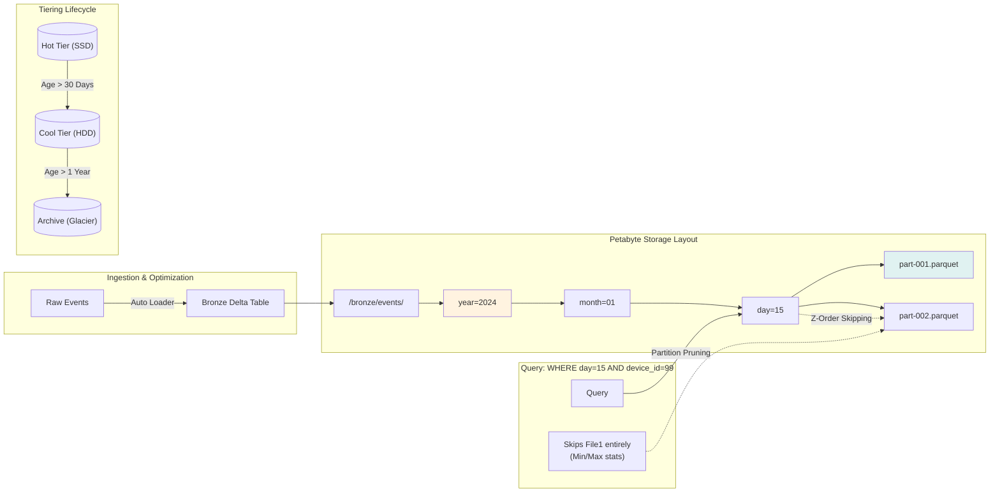

# Petabyte-Scale Patterns

> **Senior Staff / Principal Interview Scenario**
>
> "We process petabytes of IoT data daily. How does your architecture handle this scale?"

---

## 🔴 The Real-World Scenario

> *"Your data lake grew from 50 TB to 5 PB in 18 months. Queries that took 30 seconds now take 45 minutes. The nightly batch job times out. Finance is threatening to buy an expensive enterprise data warehouse."*

**Business Impact**:

- Reports delayed by hours
- Real-time dashboards become "eventually-time"
- Cloud costs exploding (scanning 5 PB daily)

**Root Cause**: Architecture patterns that work at TB scale **break** at PB scale.

---

## 📚 Key Terminology

| Term | Definition | PB-Scale Impact |
|:-----|:-----------|:----------------|
| **Partition Pruning** | Query optimizer skips irrelevant partitions | Reduces 5 PB → 50 GB scanned |
| **Data Skipping** | Min/max stats skip irrelevant files | Further reduces I/O by 50-90% |
| **Z-ORDER** | Colocate related data across dimensions | Multi-column filter acceleration |
| **Small Files Problem** | Too many small files (< 128 MB) | Kills query performance at scale |
| **Compaction** | Merge small files into optimal size | Target: 256 MB - 1 GB per file |
| **Liquid Clustering** | Databricks auto-clustering (replaces Z-ORDER) | Self-tuning optimization |

---

## 📊 Scale Reference Table

| Scale | Daily Volume | Files | Query Pattern | Key Challenge |
|:------|:-------------|:------|:--------------|:--------------|
| **GB** | < 100 GB | ~100s | Full scan OK | None - simple works |
| **TB** | 100 GB - 10 TB | ~10K | Need partitioning | Small files accumulate |
| **100 TB** | 1-10 TB/day | ~100K | Need Z-ORDER | Partition skew, metadata lag |
| **PB** | 10+ TB/day | ~1M+ | Aggressive pruning | Everything breaks without planning |

---

## 🏗️ PB-Scale Architecture



---

## 🔬 Deep-Dive: The Math of PB Scale

### Why Full Scans Kill You

```
5 PB table at $0.02/GB scanned = $102,400 per full scan

If analysts run 10 queries/day hitting full table:
Daily cost = $1,024,000 ❌

With partition pruning (scan 50 GB instead):
Daily cost = $10 ✅
```

### File Size Sweet Spot

```
File too small (1 MB):
  - 5 PB ÷ 1 MB = 5 billion files
  - Metadata explosion, listing takes hours
  - Task scheduling overhead dominates

File too large (10 GB):
  - Single corrupt file loses 10 GB
  - Can't parallelize within file
  - Memory pressure on readers

Optimal: 256 MB - 1 GB files
  - 5 PB ÷ 512 MB = ~10 million files (manageable)
  - Good parallelism
  - Efficient I/O patterns
```

### Partition Strategy

| Strategy | Cardinality | Files per Partition | Works At |
|:---------|:------------|:--------------------|:---------|
| `year` only | 5 | 1 PB / 5 = 200M files each | Never at PB |
| `year/month` | 60 | Millions each | Still too coarse |
| `year/month/day` | 1,825 | ~500K each | Good for TB, borderline PB |
| `year/month/day/hour` | 43,800 | ~100K each | Good for PB |

---

## ⚡ Key Patterns for PB Scale

| Pattern | Why | How | Impact |
|:--------|:----|:----|:-------|
| **Partition pruning** | Don't scan all data | Filter on partition columns first | 99% reduction |
| **Incremental processing** | Process only new data | Track watermark, checkpoint | 99.9% compute savings |
| **File compaction** | Avoid small files | OPTIMIZE, Auto-Optimize | 10x query speedup |
| **Z-ORDER** | Skip irrelevant rowgroups | Z-ORDER BY filter columns | 50-90% I/O reduction |
| **AQE** | Handle skew automatically | `spark.sql.adaptive.enabled = true` | Prevents OOMs |
| **Bloom Filters** | Point lookups on high-cardinality | Enable per column | 10-100x speedup |

---

## 🚀 Advanced: When Partitioning Isn't Enough (The 50TB -> 5PB Wall)

**The Scenario**: You have partitions, you have Z-Orders, you handle small files... but your query time still jumped from 30s to 45m. *Why?*

At 5 PB, **metadata becomes the bottleneck**. Just *finding* the files to read takes longer than reading them.

### 1. The Metadata Bottleneck ("List Files" Problem)

- **Problem**: `s3.list_objects()` on a partition with 100k files can take minutes. Spark Driver spends 100% CPU purely on listing files before executers start.
- **Solution**:
  - **Delta Lake / Iceberg**: They maintain a "file list" in the transaction log. Spark reads one small log file instead of listing 1M objects in S3.
  - **Metadata Service**: Hive Metastore or specialized catalogs (Unity Catalog) to cache file locations.

### 2. Bucketing (Sort-Merge-Bucket Joins)

- **Problem**: Joining two 1PB tables requires shuffling petabytes across the network (Exchange).
- **Solution**: Pre-shuffle data into "Buckets" by join key.
- **Result**: **Shuffle-free joins**. Joins become local merge operations (SMB Join).
- **Trade-off**: Hard to maintain (must restrict writer parallelism). Only use for "static" massive lookup tables.

### 3. Materialized Views (Pre-computation)

- **Problem**: Summing 100 billion rows takes time, even with optimization.
- **Solution**: Don't scan raw data. Maintain an incremental aggregation.
- `Delta Live Tables (DLT)` or `Materialized Views` automatically update only changed records.
- **Impact**: Query scans 10k rows (aggregated) instead of 100B rows.

### 4. Vectorized Readers (Photon / Velox)

- **Problem**: Java/Scala overhead in Row-based processing.
- **Solution**: Use C++ native vectorized engines (Photon on Databricks, Velox open source).
- **Impact**: 2-8x faster raw execution for CPU-bound tasks (parsing Parquet, hashing).

### 5. Scan Sharing

- **Problem**: 50 users running similar dashboards scan the same 5PB daily.
- **Solution**: Enable "Reuse Exchange" or specific "Scan Sharing" features (vendor specific). One reader scans, broadcasts data to 50 queries.

### Summary: Beyond Basic Optimizations

| Bottleneck | Symptom | Advanced Solution |
|:-----------|:--------|:------------------|
| **Driver CPU** | Long pause before tasks start | Delta/Iceberg (avoid listing), Metadata Scaling |
| **Network I/O** | Huge Shuffle Read/Write | Bucketing (SMB Joins), Broadcast |
| **Executer CPU** | Slow task execution | Vectorized Readers (Photon), Whole-Stage Codegen |
| **Repeated Scans** | Same query runs slowly every hour | Materialized Views (Incremental Aggregation) |

---

## 💰 Cost Analysis at PB Scale

| Cost Component | Monthly @ 5 PB | Optimization | Savings |
|:---------------|:---------------|:-------------|:--------|
| **Storage** | $115,000 (S3 Standard) | Tiered: Hot/Warm/Cold | 40% |
| **Compute** | Variable | Spot instances | 60-80% |
| **Scan costs** | $1M+ if unoptimized | Partition pruning | 99% |
| **API calls** | $50K+ (many small files) | Compaction | 90% |

---

## 🔄 Retry Policies at Scale

```python
# Databricks Workflow retry configuration
{
    "task_key": "bronze_to_silver",
    "retry_policy": {
        "max_retries": 3,
        "min_retry_interval_millis": 60000,    # 1 min
        "max_retry_interval_millis": 300000    # 5 min (exponential backoff)
    },
    "timeout_seconds": 7200,  # 2 hours max
    "email_notifications": {
        "on_failure": ["data-team@company.com"]
    }
}
```

---

## ⚠️ Common Mistakes at PB Scale

| Mistake | Impact | Solution |
|:--------|:-------|:---------|
| No partition strategy | Every query scans everything | Design partitions for query patterns |
| High-cardinality partition | Millions of tiny partitions | Use computed columns (date bucket) |
| Ignoring small files | Metadata explosion | Schedule OPTIMIZE jobs |
| Z-ORDER on wrong columns | No benefit | Analyze query patterns first |
| Full table backfills | 10+ hour jobs | Incremental, partition-by-partition |

---

## 🎯 Interview Answer Framework

> **Q**: "How do you handle petabyte-scale data?"
>
> **Staff/Principal Answer**:
>
> "At PB scale, the key insight is that **the architecture that works at TB scale will break**. My approach has four pillars:
>
> 1. **Partition for access patterns**: I partition by time (year/month/day/hour) since 90% of queries filter by time. This turns 5 PB scans into 50 GB scans.
>
> 2. **Eliminate small files**: Streaming creates thousands of tiny files per hour. I schedule OPTIMIZE to hit 256 MB-1 GB targets, and use Auto-Optimize for hot partitions.
>
> 3. **Incremental everything**: No job should ever full-scan. I use watermarks for streaming and change data capture for batch updates.
>
> 4. **Monitor ruthlessly**: I track files-per-partition, query scan ratios, and storage tier distribution. Early warning prevents expensive surprises.
>
> The biggest mistake I've seen is treating 5 PB like a big 50 TB system. It's not—it requires fundamentally different design choices."

---

## 📖 Next Topic

Continue to [Realistic Interview Questions](./06-realistic-interview-questions.md) for practice.
