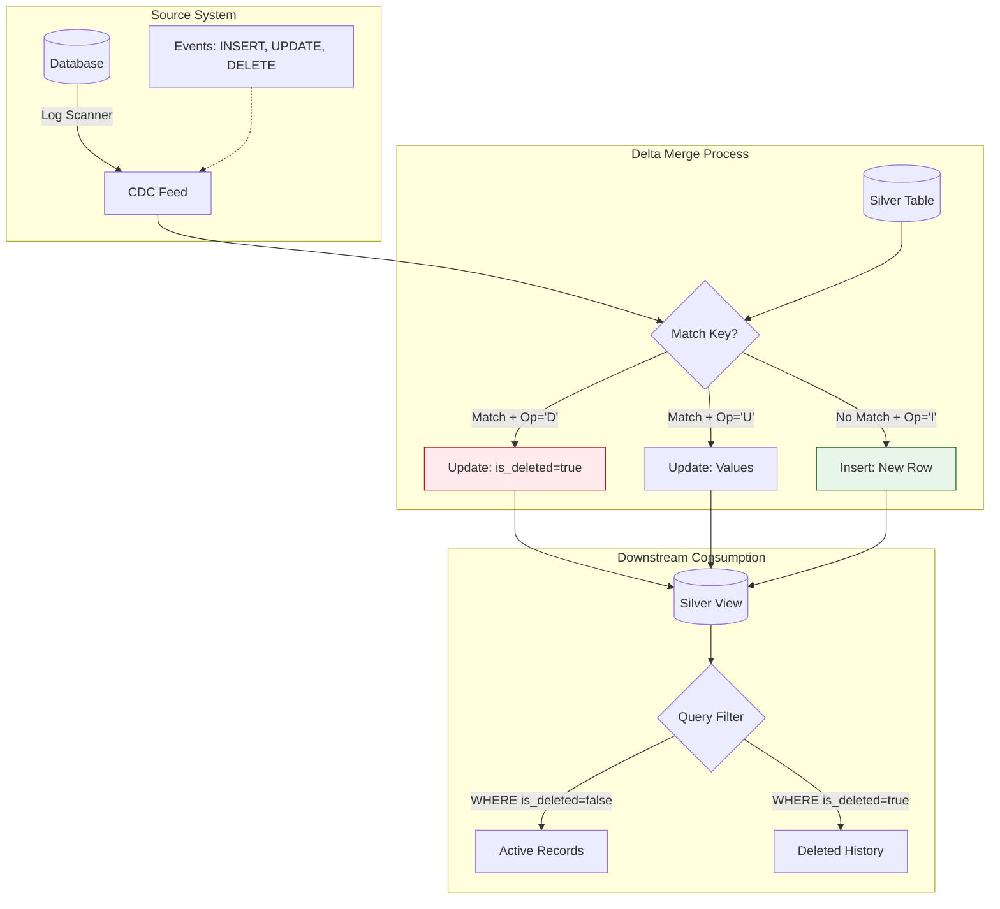

# Handling Deletes in CDC

> **The complete picture: Inserts, Updates, AND Deletes**

## The Core Problem

*"When a record is deleted in the source database, how do you propagate that to your data lake?"*

```
Source Database:                   CDC Events:
───────────────────────            ───────────────────────
10:00 INSERT customer_id=123       {op: 'I', id: 123, name: 'John'}
10:30 UPDATE customer_id=123       {op: 'U', id: 123, name: 'Johnny'}
11:00 DELETE customer_id=123       {op: 'D', id: 123}  ← How to handle?

Data Lake Options:
1. Hard delete → Remove row entirely
2. Soft delete → Set is_deleted=true
3. Ignore → Keep stale data (WRONG!)
```

---

## 🏗️ CDC Architecture with Deletes


│  ┌─────────────────────────────────────────────────────────────────────────┐│
│  │  Transaction Log (CDC enabled)                                           ││
│  │                                                                          ││
│  │  ┌────────────┬────────────┬───────────────────────────────────────────┐││
│  │  │ LSN        │ Operation  │ Data                                      │││
│  │  ├────────────┼────────────┼───────────────────────────────────────────┤││
│  │  │ 00000001   │ INSERT     │ {id:123, name:'John', email:'j@co.com'}   │││
│  │  │ 00000002   │ UPDATE     │ {id:123, name:'Johnny'}                   │││
│  │  │ 00000003   │ DELETE     │ {id:123}                                  │││
│  │  └────────────┴────────────┴───────────────────────────────────────────┘││
│  └───────────────────────────────────────────────────────────────────────┬─┘│
│                                                                           │  │
│                       Debezium / Azure CDC / Auto Loader                  │  │
│                                                                           ▼  │
│  BRONZE LAYER (Raw CDC events)                                               │
│  ┌─────────────────────────────────────────────────────────────────────────┐│
│  │  Store ALL events as-is:                                                 ││
│  │                                                                          ││
│  │  ┌────────────┬────────────┬────────────┬──────────────────────────────┐││
│  │  │ event_time │ operation  │ key        │ after_data                   │││
│  │  ├────────────┼────────────┼────────────┼──────────────────────────────┤││
│  │  │ 10:00      │ c (create) │ {id:123}   │ {name:'John', email:'...'}   │││
│  │  │ 10:30      │ u (update) │ {id:123}   │ {name:'Johnny'}              │││
│  │  │ 11:00      │ d (delete) │ {id:123}   │ NULL                         │││
│  │  └────────────┴────────────┴────────────┴──────────────────────────────┘││
│  └─────────────────────────────────────────────────────────────────────────┘│
│                                      │                                       │
│                                      ▼                                       │
│  SILVER LAYER (Current State)                                                │
│  ┌─────────────────────────────────────────────────────────────────────────┐│
│  │                                                                          ││
│  │  OPTION 1: SOFT DELETE (Recommended)                                     ││
│  │  ┌───────────────────────────────────────────────────────────────────┐  ││
│  │  │ id  │ name   │ email      │ is_deleted │ deleted_at              │  ││
│  │  ├─────┼────────┼────────────┼────────────┼─────────────────────────┤  ││
│  │  │ 123 │ Johnny │ j@co.com   │ true       │ 2024-01-15 11:00:00     │  ││
│  │  └───────────────────────────────────────────────────────────────────┘  ││
│  │                                                                          ││
│  │  Queries filter: WHERE is_deleted = false                                ││
│  │  History preserved for auditing                                          ││
│  │                                                                          ││
│  │  OPTION 2: HARD DELETE                                                   ││
│  │  ┌───────────────────────────────────────────────────────────────────┐  ││
│  │  │ Row id=123 is REMOVED from table                                   │  ││
│  │  │ Use time travel if need history                                    │  ││
│  │  └───────────────────────────────────────────────────────────────────┘  ││
│  │                                                                          ││
│  └─────────────────────────────────────────────────────────────────────────┘│
│                                                                              │
└─────────────────────────────────────────────────────────────────────────────┘
```

---

## 🔧 Code Implementation

### Complete CDC Merge (Insert + Update + Delete)

```python
from delta.tables import DeltaTable
from pyspark.sql.functions import *

# Read CDC events from Bronze
cdc_events = spark.read.format("delta").load("/bronze/customers_cdc") \
    .filter(col("event_date") == current_date())

# Get target Silver table
silver_table = DeltaTable.forPath(spark, "/silver/customers")

# Prepare: Get latest event per key (handle duplicates)
from pyspark.sql.window import Window

window = Window.partitionBy("customer_id").orderBy(col("event_time").desc())

latest_events = cdc_events \
    .withColumn("rn", row_number().over(window)) \
    .filter(col("rn") == 1) \
    .drop("rn")

# SOFT DELETE: Merge with is_deleted flag
silver_table.alias("target").merge(
    latest_events.alias("source"),
    condition="target.customer_id = source.customer_id"
).whenMatchedUpdate(
    # Delete operation → set is_deleted = true
    condition="source.operation = 'd'",
    set={
        "is_deleted": lit(True),
        "deleted_at": col("source.event_time"),
        "updated_at": col("source.event_time")
    }
).whenMatchedUpdate(
    # Update operation → update fields
    condition="source.operation = 'u'",
    set={
        "name": "source.name",
        "email": "source.email",
        "updated_at": "source.event_time",
        "is_deleted": lit(False)  # In case of un-delete
    }
).whenNotMatchedInsert(
    # Insert operation → insert new row
    condition="source.operation IN ('c', 'r')",  # c=create, r=read (snapshot)
    values={
        "customer_id": "source.customer_id",
        "name": "source.name",
        "email": "source.email",
        "created_at": "source.event_time",
        "updated_at": "source.event_time",
        "is_deleted": lit(False)
    }
).execute()
```

### Hard Delete Version

```python
# HARD DELETE: Actually remove rows
silver_table.alias("target").merge(
    latest_events.alias("source"),
    condition="target.customer_id = source.customer_id"
).whenMatchedDelete(
    condition="source.operation = 'd'"
).whenMatchedUpdateAll(
    condition="source.operation = 'u'"
).whenNotMatchedInsertAll(
    condition="source.operation IN ('c', 'r')"
).execute()
```

### Create Silver Table with Delete Columns

```sql
CREATE TABLE silver_customers (
    customer_id STRING NOT NULL,
    name STRING,
    email STRING,
    created_at TIMESTAMP,
    updated_at TIMESTAMP,
    
    -- Soft delete columns
    is_deleted BOOLEAN DEFAULT FALSE,
    deleted_at TIMESTAMP,
    
    -- GDPR retention
    retention_until DATE  -- For compliance
)
USING DELTA
TBLPROPERTIES (
    delta.enableChangeDataFeed = true  -- Track changes for downstream
);
```

---

## 📊 Soft Delete vs Hard Delete

| Aspect | Soft Delete | Hard Delete |
|--------|-------------|-------------|
| **History** | Preserved | Lost (use time travel) |
| **GDPR compliance** | Tricky (data still exists) | Easier (data gone) |
| **Performance** | Slightly slower (filter) | Faster |
| **Recovery** | Easy (flip flag) | Hard (restore from backup) |
| **Downstream impact** | Need to filter | No action needed |

---

## 🎯 Interview Questions

| Question | Expected Answer |
|----------|----------------|
| *"How do you handle deletes in CDC?"* | Soft delete (is_deleted flag) or hard delete (whenMatchedDelete) |
| *"Why soft delete over hard?"* | Preserve history, easier recovery, audit trail |
| *"How do downstream consumers know about deletes?"* | Delta Change Data Feed (enable CDF) pushes delete events |
| *"GDPR right to delete?"* | Hard delete after retention period, or tokenize PII |

---

## 📖 Next Scenario

Continue to [Data Reconciliation](./12-data-reconciliation.md).
