# Debugging OOM Errors - FAANG Principal DE/Architect Guide

> **Interview Frequency:** ⭐⭐⭐⭐⭐ (Critical Troubleshooting Skill)
> **Difficulty:** Staff/Principal Level Deep Dive

---

## Table of Contents
1. [Concept Breakdown](#1-concept-breakdown)
2. [Analogy](#2-analogy-lead-data-engineers-daily-etl-pipeline)
3. [Architecture & Design Variants](#3-architecture--design-variants)
4. [Diagrams](#4-diagrams)
5. [Real-Time Issues & Failure Modes](#5-real-time-issues--failure-modes)
6. [Real-Time Scenarios & Interview Questions](#6-real-time-scenarios--interview-questions)
7. [Code Snippets](#7-code-snippets)
8. [Comparisons With Related Concepts](#8-comparisons-with-related-concepts)
9. [Production Best Practices](#9-production-best-practices)
10. [Interview Cheat Sheet](#10-interview-cheat-sheet)

---

## 1. Concept Breakdown

### What is a Spark OOM Error?

An **Out-of-Memory (OOM)** error in Apache Spark is a **JVM-level or container-level failure** that occurs when the memory required to complete an operation exceeds the available memory allocated to that process (Driver or Executor).

### Why OOM Errors Exist in Spark

Spark is a **distributed compute engine** that processes data in memory for performance. This design creates a fundamental tension:

```
                    ┌─────────────────────────────────────────────┐
                    │           THE OOM PARADOX                   │
                    │                                             │
                    │   Performance ←──────────────→ Reliability  │
                    │      ▲                              ▲       │
                    │      │     In-Memory Processing     │       │
                    │      │            │                 │       │
                    │      │            ▼                 │       │
                    │   Fast       Finite Memory      Safe        │
                    │   Access      Boundaries       Failures     │
                    └─────────────────────────────────────────────┘
```

**Key insight:** OOM is NOT simply "not enough RAM" - it's a symptom of **architectural mismatches** between:
- Data volume vs. allocated memory
- Partition strategy vs. data distribution
- Operation semantics vs. memory model

### The Spark Memory Model Architecture

Understanding OOM requires understanding Spark's **Unified Memory Model** (Spark 2.x+):

```
┌─────────────────────────────────────────────────────────────────────────────┐
│                    EXECUTOR MEMORY LAYOUT (spark.executor.memory = 16GB)    │
├─────────────────────────────────────────────────────────────────────────────┤
│                                                                             │
│  ┌───────────────────────────────────────────────────────────────────────┐  │
│  │  RESERVED MEMORY (300MB fixed)                                        │  │
│  │  - Spark internal overhead                                            │  │
│  │  - System-level JVM objects                                           │  │
│  └───────────────────────────────────────────────────────────────────────┘  │
│                                                                             │
│  ┌───────────────────────────────────────────────────────────────────────┐  │
│  │  UNIFIED MEMORY (spark.memory.fraction × (heap - 300MB) = ~9.4GB)     │  │
│  │  Default: 0.6 × (16GB - 300MB) ≈ 9.4GB                                │  │
│  │                                                                        │  │
│  │  ┌─────────────────────────┬─────────────────────────────────────────┐ │  │
│  │  │     EXECUTION MEMORY    │         STORAGE MEMORY                  │ │  │
│  │  │    (shuffles, joins,    │      (cached RDDs, broadcast,           │ │  │
│  │  │     aggregations,       │       accumulator results)              │ │  │
│  │  │     sorting buffers)    │                                         │ │  │
│  │  │                         │                                         │ │  │
│  │  │   ◄═══ DYNAMIC ═══►     │    (bounded by storageFraction         │ │  │
│  │  │       BORROWING         │           when execution needs)         │ │  │
│  │  │                         │                                         │ │  │
│  │  │   CAN EVICT STORAGE     │    CANNOT evict execution memory       │ │  │
│  │  └─────────────────────────┴─────────────────────────────────────────┘ │  │
│  └───────────────────────────────────────────────────────────────────────┘  │
│                                                                             │
│  ┌───────────────────────────────────────────────────────────────────────┐  │
│  │  USER MEMORY ((1 - spark.memory.fraction) × (heap - 300MB) ≈ 6.3GB)   │  │
│  │  - User data structures                                               │  │
│  │  - UDF internal objects                                               │  │
│  │  - Spark internal metadata                                            │  │
│  └───────────────────────────────────────────────────────────────────────┘  │
│                                                                             │
└─────────────────────────────────────────────────────────────────────────────┘

┌─────────────────────────────────────────────────────────────────────────────┐
│  MEMORY OVERHEAD (spark.executor.memoryOverhead = max(384MB, 10% of heap))  │
│  OFF-HEAP / CONTAINER OVERHEAD:                                             │
│  - PySpark: Python interpreter, Arrow buffers, Pandas UDF data             │
│  - JNI native libraries                                                     │
│  - Direct ByteBuffers (NIO)                                                 │
│  - YARN/K8s container margin                                                │
└─────────────────────────────────────────────────────────────────────────────┘
```

### Three Categories of OOM Errors

| Category | Error Location | Symptom | Root Cause Domain |
|----------|----------------|---------|-------------------|
| **Driver OOM** | Driver process | `java.lang.OutOfMemoryError: Java heap space` at driver | Data collection to driver |
| **Executor OOM** | Executor JVM | `Container killed by YARN for exceeding memory limits` | Task-level data processing |
| **Off-Heap OOM** | Container/Native | `Container killed... running beyond virtual memory limits` or `Cannot allocate memory` | PySpark, native libraries |

### Deep Dive: Why Each OOM Type Happens

#### Driver OOM - The Coordinator Overload

The driver is a **single JVM** that:
1. Coordinates DAG scheduling
2. Manages SparkContext and SparkSession
3. Collects action results
4. Maintains broadcast variable data

**Critical insight:** The driver has **O(1)** memory but `collect()` creates **O(N)** data flow to it.

```
                collect() ANTI-PATTERN
                
    EXECUTORS                                    DRIVER
    ┌──────────────────────────────────────────┐ ┌────────────────────────┐
    │ Partition 1: █████ (1M rows)             ├→│                        │
    │ Partition 2: █████ (1M rows)             ├→│ ALL 10M rows          │
    │ Partition 3: █████ (1M rows)             ├→│ materialized here!    │
    │ ...                                       ├→│                        │
    │ Partition 10: █████ (1M rows)            ├→│ 💥 OOM                │
    └──────────────────────────────────────────┘ └────────────────────────┘
```

#### Executor OOM - The Worker Overwhelm

Each executor has **bounded heap memory** partitioned into Unified Memory + User Memory. OOM occurs when:

1. **Single task exceeds partition budget** - Data skew causes one task to process GBs
2. **Aggregate across tasks exceeds heap** - Too many concurrent tasks
3. **Execution memory exhausted** - Shuffle buffers, sort buffers full
4. **Storage memory exhausted** - Too much cached data

```
              EXECUTOR MEMORY PRESSURE CASCADE
              
    ┌─────────────────────────────────────────────────────────────────┐
    │  Normal State:                                                  │
    │  Execution: ████████░░░░░░░░░░░░  Storage: █████░░░░░░░░░░░░░░  │
    │                                                                 │
    │  Skewed Task Arrives:                                           │
    │  Execution: ███████████████████████████  (SPILLING TO DISK)     │
    │  Storage:   ███████ (EVICTING CACHED DATA)                      │
    │                                                                 │
    │  Spill Fails (disk full or too slow):                           │
    │  Execution: ██████████████████████████████████ → 💥 OOM         │
    └─────────────────────────────────────────────────────────────────┘
```

#### Off-Heap OOM - The Hidden Memory Consumer

PySpark creates a **dual-process model**:

```
    ┌─────────────────────────────────────────────────────────────────┐
    │                     EXECUTOR CONTAINER                          │
    │                                                                 │
    │   ┌─────────────────────┐    ┌─────────────────────────────┐   │
    │   │   JVM Process       │    │   Python Worker Process     │   │
    │   │  (spark.executor.   │◄──►│  (Pandas, NumPy allocations)│   │
    │   │   memory)           │    │                             │   │
    │   │                     │    │   NOT counted in JVM heap   │   │
    │   │   8GB allocated     │    │   Uses memoryOverhead pool  │   │
    │   └─────────────────────┘    └─────────────────────────────┘   │
    │                                                                 │
    │   Total container limit = executor.memory + memoryOverhead      │
    │   If Python allocates beyond overhead → Container killed        │
    └─────────────────────────────────────────────────────────────────┘
```

---

## 2. Analogy: Lead Data Engineer's Daily ETL Pipeline

> The most practical way to understand OOM is through a real production scenario.

You're a **Lead DE** running a daily ETL pipeline that joins:
- **Fact table:** 10TB of daily transactions
- **Dimension table:** 50MB customer lookup

**Normal Day (No OOM):**
```
┌────────────────────────────────────────────────────────────────────┐
│  8:00 AM: Pipeline starts                                          │
│  8:05 AM: Dimension table broadcast to all executors              │
│  8:10 AM: Each executor joins its partition locally               │
│  8:30 AM: Pipeline completes                                       │
│  Status: ✅ All good, get coffee                                   │
└────────────────────────────────────────────────────────────────────┘
```

**Black Friday (OOM!!):**
```
┌────────────────────────────────────────────────────────────────────┐
│  8:00 AM: Pipeline starts (10x normal volume!)                     │
│  8:02 AM: PagerDuty alert: Executor OOM                            │
│  8:03 AM: Check Spark UI → One task processing 500GB (skew!)       │
│           All "Amazon" orders went to one partition               │
│  8:10 AM: Enable AQE skew handling, increase partitions           │
│  8:15 AM: Rerun succeeds                                           │
│  Status: 🎯 Lesson learned - add skew detection to pre-checks     │
└────────────────────────────────────────────────────────────────────┘
```

### Mapping to OOM Concepts

| What Happened | OOM Concept | Fix Applied |
|---------------|-------------|-------------|
| 10x data volume | Partition size exceeded memory | Increase partition count |
| "Amazon" orders dominated | Data skew → one executor overloaded | AQE skew join handling |
| PagerDuty alert | Container killed by YARN | Better monitoring thresholds |

### Key Learnings

1. **Proactive monitoring** catches OOM before production failure
2. **Data distribution analysis** prevents skew-related OOM
3. **AQE** is your first defense, salting is your fallback
4. **Post-mortems** should update runbooks and monitoring

---

## 3. Architecture & Design Variants

### Design Pattern 1: Memory-First Configuration

**Strategy:** Allocate maximum memory, minimize spill-to-disk.

```python
# Memory-first configuration
spark.conf.set("spark.executor.memory", "32g")
spark.conf.set("spark.executor.memoryOverhead", "8g")
spark.conf.set("spark.memory.fraction", "0.8")  # More unified memory
spark.conf.set("spark.memory.storageFraction", "0.3")  # Favor execution
spark.conf.set("spark.sql.shuffle.partitions", "200")
```

| Pros | Cons |
|------|------|
| ✅ Fastest execution | ❌ Expensive (more RAM per executor) |
| ✅ Minimal disk I/O | ❌ OOM risk if data exceeds estimates |
| ✅ Good for iterative jobs | ❌ Fewer executors fit per node |

**When to Use:**
- Memory-intensive ML training
- Small-to-medium datasets with complex transformations
- Development/exploration environments

---

### Design Pattern 2: Spill-Tolerant Configuration

**Strategy:** Accept disk spill, prioritize stability over speed.

```python
# Spill-tolerant configuration
spark.conf.set("spark.executor.memory", "8g")
spark.conf.set("spark.executor.memoryOverhead", "2g")
spark.conf.set("spark.memory.fraction", "0.6")
spark.conf.set("spark.shuffle.spill.compress", "true")
spark.conf.set("spark.sql.shuffle.partitions", "2000")  # More partitions, less per task
```

| Pros | Cons |
|------|------|
| ✅ Highly resilient to OOM | ❌ Slower due to disk I/O |
| ✅ Cost-effective (less RAM) | ❌ Requires fast local SSDs |
| ✅ Handles unexpected data spikes | ❌ May not meet latency SLAs |

**When to Use:**
- Production batch jobs with variable data volumes
- Budget-constrained environments
- Jobs with unknown or changing data distributions

---

### Design Pattern 3: AQE-Optimized Configuration (Spark 3.0+)

**Strategy:** Let Spark dynamically adjust at runtime.

```python
# AQE-optimized configuration
spark.conf.set("spark.sql.adaptive.enabled", "true")
spark.conf.set("spark.sql.adaptive.coalescePartitions.enabled", "true")
spark.conf.set("spark.sql.adaptive.skewJoin.enabled", "true")
spark.conf.set("spark.sql.adaptive.skewJoin.skewedPartitionFactor", "5")
spark.conf.set("spark.sql.adaptive.skewJoin.skewedPartitionThresholdInBytes", "256MB")
spark.conf.set("spark.sql.adaptive.advisoryPartitionSizeInBytes", "128MB")
```

| Pros | Cons |
|------|------|
| ✅ Self-tuning partitions | ❌ Planning overhead |
| ✅ Automatic skew handling | ❌ Less predictable resource usage |
| ✅ Reduced OOM from skew | ❌ Doesn't help aggregation skew |

**When to Use:**
- Modern Spark 3.0+ environments
- Variable workloads with unpredictable skew
- Teams without deep Spark tuning expertise

---

### Design Pattern 4: Partition-Engineered Configuration

**Strategy:** Pre-compute optimal partitions based on data statistics.

```python
# Partition-engineered approach - requires data profiling first
# Step 1: Analyze data distribution
data_size_bytes = spark.sql("SELECT SUM(size_bytes) FROM data_profile").collect()[0][0]
target_partition_size = 256 * 1024 * 1024  # 256MB per partition
optimal_partitions = max(200, int(data_size_bytes / target_partition_size))

# Step 2: Apply computed partitions
spark.conf.set("spark.sql.shuffle.partitions", str(optimal_partitions))
df = df.repartition(optimal_partitions, "join_key")  # Hash partition by key
```

| Pros | Cons |
|------|------|
| ✅ Optimal for known data | ❌ Requires upfront profiling |
| ✅ Predictable performance | ❌ Breaks if data distribution changes |
| ✅ Best for stable pipelines | ❌ More complex to maintain |

---

### FAANG Scale Considerations

At FAANG scale (petabytes, thousands of pipelines):

```
┌──────────────────────────────────────────────────────────────────────────────┐
│                    FAANG-SCALE OOM MITIGATION ARCHITECTURE                   │
├──────────────────────────────────────────────────────────────────────────────┤
│                                                                              │
│   ┌─────────────────────────────────────────────────────────────────────┐   │
│   │  LAYER 1: Platform Guardrails                                       │   │
│   │  - Maximum job memory quotas per team                               │   │
│   │  - Default AQE enabled cluster-wide                                 │   │
│   │  - Driver memory limits enforced by admission control               │   │
│   └─────────────────────────────────────────────────────────────────────┘   │
│                                                                              │
│   ┌─────────────────────────────────────────────────────────────────────┐   │
│   │  LAYER 2: Data Profiling Service                                    │   │
│   │  - Automatic partition recommendations per table                    │   │
│   │  - Hot key detection alerts                                         │   │
│   │  - Historical data growth projections                               │   │
│   └─────────────────────────────────────────────────────────────────────┘   │
│                                                                              │
│   ┌─────────────────────────────────────────────────────────────────────┐   │
│   │  LAYER 3: Runtime Monitoring                                        │   │
│   │  - Real-time GC pressure metrics                                    │   │
│   │  - Spill-to-disk rate alerts                                        │   │
│   │  - Task duration anomaly detection                                  │   │
│   └─────────────────────────────────────────────────────────────────────┘   │
│                                                                              │
│   ┌─────────────────────────────────────────────────────────────────────┐   │
│   │  LAYER 4: Auto-Remediation                                          │   │
│   │  - Automatic retry with 2x memory on OOM                            │   │
│   │  - Dynamic repartitioning based on skew detection                   │   │
│   │  - Fallback to slower but safer execution modes                     │   │
│   └─────────────────────────────────────────────────────────────────────┘   │
│                                                                              │
└──────────────────────────────────────────────────────────────────────────────┘
```

---

## 4. Diagrams

### High-Level OOM Debugging Architecture

```mermaid
flowchart TB
    subgraph Trigger["🔴 OOM Error Detected"]
        OOM[OutOfMemoryError/<br/>Container Killed]
    end
    
    subgraph Identify["1️⃣ IDENTIFY LOCATION"]
        OOM --> ErrorType{Error Type?}
        ErrorType -->|"Driver heap<br/>space error"| Driver[Driver OOM]
        ErrorType -->|"Container killed<br/>by YARN/K8s"| Executor[Executor OOM]
        ErrorType -->|"Virtual memory<br/>or Python"| OffHeap[Off-Heap OOM]
    end
    
    subgraph AnalyzeDriver["2️⃣ DRIVER ROOT CAUSE"]
        Driver --> DriverCause{Root Cause?}
        DriverCause -->|"collect()"| CollectFix["Replace with<br/>write() or limit()"]
        DriverCause -->|"toPandas()"| PandasFix["Use Arrow or<br/>write to storage"]
        DriverCause -->|"broadcast()"| BroadcastFix["Reduce table size<br/>or increase driver.memory"]
        DriverCause -->|"Too many<br/>partitions"| PartitionFix["Reduce partition count"]
    end
    
    subgraph AnalyzeExecutor["3️⃣ EXECUTOR ROOT CAUSE"]
        Executor --> SparkUI["Check Spark UI"]
        SparkUI --> ExecutorCause{Symptom?}
        ExecutorCause -->|"One task takes<br/>10x longer"| Skew["Data Skew"]
        ExecutorCause -->|"All tasks fail<br/>at same size"| BigPartition["Large Partitions"]
        ExecutorCause -->|"High GC time<br/>+ slow tasks"| MemoryPressure["Memory Pressure"]
        
        Skew --> SkewFix["Enable AQE<br/>or use Salting"]
        BigPartition --> PartitionIncrease["Increase partition count<br/>or repartition()"]
        MemoryPressure --> MemoryFix["Increase executor.memory<br/>or reduce concurrency"]
    end
    
    subgraph AnalyzeOffHeap["4️⃣ OFF-HEAP ROOT CAUSE"]
        OffHeap --> OffHeapCause{Python?}
        OffHeapCause -->|"Yes"| OverheadFix["Increase<br/>memoryOverhead"]
        OffHeapCause -->|"Native libs"| NativeFix["Check for leaks<br/>or increase overhead"]
    end
    
    CollectFix --> Resolved[✅ Resolved]
    PandasFix --> Resolved
    BroadcastFix --> Resolved
    PartitionFix --> Resolved
    SkewFix --> Resolved
    PartitionIncrease --> Resolved
    MemoryFix --> Resolved
    OverheadFix --> Resolved
    NativeFix --> Resolved
```



### Detailed Sequence Flow: Executor OOM Investigation

```mermaid
sequenceDiagram
    autonumber
    participant DE as Data Engineer
    participant Spark as Spark UI
    participant Logs as Application Logs
    participant Config as Spark Config
    
    Note over DE,Config: 🔴 ALERT: Job Failed - Executor OOM
    
    DE->>Spark: Access Spark UI → Stages Tab
    Spark-->>DE: Show failed stage details
    
    DE->>Spark: Check Task Metrics<br/>(Duration, Shuffle Read, GC Time)
    Spark-->>DE: Task 47: 45min, 50GB shuffle read<br/>Other tasks: 30sec, 500MB
    
    Note over DE: Diagnosis: DATA SKEW<br/>Task 47 has 100x more data
    
    DE->>Logs: Get Failed Task Details
    Logs-->>DE: Processing partition with key "AMAZON"<br/>50M rows in single partition
    
    DE->>DE: Decision: Which fix?
    
    alt Quick Fix (AQE)
        DE->>Config: Enable AQE Skew Join
        Config-->>DE: spark.sql.adaptive.skewJoin.enabled=true
        DE->>Spark: Rerun Job
        Spark-->>DE: ✅ AQE split skewed partition into 5 tasks
    else Manual Fix (Salting)
        DE->>Config: Add salting logic to join
        Config-->>DE: Salted key distributes AMAZON across 10 partitions
        DE->>Spark: Rerun Job
        Spark-->>DE: ✅ Even distribution, all tasks ~2min
    else Resource Fix
        DE->>Config: Increase executor.memory & partitions
        Config-->>DE: 32g memory, 1000 partitions
        DE->>Spark: Rerun Job
        Spark-->>DE: ✅ Each task handles less data
    end
    
    Note over DE,Config: 📝 Update runbook with fix
```



### Failure and Retry Flow

```mermaid
flowchart TB
    subgraph Normal["Normal Execution"]
        Start[Job Submitted] --> Execute[Execute Tasks]
        Execute --> Success{All Tasks<br/>Complete?}
        Success -->|Yes| Done[✅ Job Success]
    end
    
    subgraph FirstFailure["First OOM Failure"]
        Success -->|No: OOM| Classify{Classify<br/>Failure Type}
        
        Classify -->|Transient| Retry1["Retry Task<br/>(same resources)"]
        Retry1 --> Execute
        
        Classify -->|Persistent| Analyze["Analyze<br/>Root Cause"]
    end
    
    subgraph AutoRemediation["Auto-Remediation (Platform)"]
        Analyze --> AutoFix{Platform<br/>Support?}
        
        AutoFix -->|Yes| DoubleMemory["Retry with<br/>2x Memory"]
        DoubleMemory --> Retry2{Retry<br/>Success?}
        Retry2 -->|Yes| Done
        Retry2 -->|No| HumanReview["🚨 Escalate to<br/>Human Review"]
    end
    
    subgraph ManualRemediation["Manual Remediation"]
        AutoFix -->|No| ManualFix["Engineer<br/>Investigation"]
        HumanReview --> ManualFix
        
        ManualFix --> IdentifyFix["Identify Fix:<br/>- Repartition<br/>- Salting<br/>- Memory Increase"]
        
        IdentifyFix --> ApplyFix["Apply Configuration<br/>Changes"]
        ApplyFix --> Resubmit["Resubmit Job"]
        Resubmit --> Execute
    end
    
    subgraph Prevention["Prevention (Post-Mortem)"]
        Done --> PostMortem{Was there<br/>OOM?}
        PostMortem -->|Yes| RootCause["Document Root Cause"]
        RootCause --> UpdatePipeline["Update Pipeline:<br/>- Add profiling<br/>- Add monitoring<br/>- Update configs"]
        UpdatePipeline --> PreventFuture["Add Pre-checks<br/>for Similar Issues"]
        PostMortem -->|No| End[End]
        PreventFuture --> End
    end
```



### Memory Layout Visualization


---

## 5. Real-Time Issues & Failure Modes

### Issue 1: Stealthy Driver OOM from Accumulator Abuse

**Symptoms:**
- Driver crashes after job runs for hours
- Memory graph shows steady increase until OOM
- No obvious `collect()` calls in code

**Root Cause:**
Custom accumulators collecting results in driver memory:

```python
# ANTI-PATTERN: Unbounded accumulator growth
class ListAccumulator(AccumulatorParam):
    def addInPlace(self, v1, v2):
        return v1 + v2  # Lists concatenate on driver!

failed_records = sc.accumulator([], ListAccumulator())

# During job, millions of failures collected to driver
def process_row(row):
    if is_bad(row):
        failed_records.add([row])  # Memory bomb!
```

**Detection:**
- Monitor driver heap usage over time
- Add count-based accumulators instead of collecting records

**Resolution:**
```python
# BETTER: Count failures, write records to storage
failed_count = sc.accumulator(0)

def process_row(row):
    if is_bad(row):
        failed_count.add(1)
        return None  # Or write to dead-letter queue
    return transform(row)

# After job, query the failed record count
print(f"Failed records: {failed_count.value}")
```

---

### Issue 2: PySpark Pandas UDF Memory Explosion

**Symptoms:**
- Container killed (not JVM OOM)
- memoryOverhead-related failure
- Works with small data, fails with large

**Root Cause:**
Pandas UDFs receive entire partition as DataFrame in Python memory:

```python
# DANGEROUS: Large partition + Pandas UDF = OOM
@pandas_udf("double")
def complex_calc(series: pd.Series) -> pd.Series:
    # Receives entire partition!
    # If partition has 10GB, Python needs 10GB + temp allocations
    return series.apply(some_expensive_function)

df.withColumn("result", complex_calc(col("value")))  # 💥 if partitions large
```

**Detection:**
- Monitor container memory (not just JVM)
- Check `spark.executor.memoryOverhead` settings
- Look for `python worker exited unexpectedly`

**Resolution:**
```python
# FIX 1: Reduce partition size
df = df.repartition(2000)  # More partitions = smaller data per UDF call

# FIX 2: Increase overhead
spark.conf.set("spark.executor.memoryOverhead", "4g")  # Or more

# FIX 3: Use Arrow for Pandas UDFs (more efficient)
spark.conf.set("spark.sql.execution.arrow.pyspark.enabled", "true")
```

---

### Issue 3: Shuffle Explosion from Cartesian Product

**Symptoms:**
- Job runs forever, eventual OOM
- Shuffle write sizes are enormous (TBs)
- Task count multiplies unexpectedly

**Root Cause:**
Accidental cartesian joins from missing or wrong join keys:

```python
# DANGER: Cross join without realizing
df1.join(df2, df1.id == df2.user_id)  # WRONG: column name mismatch causes cross join
# If df1 has 1M rows and df2 has 1M rows → 1 TRILLION row intermediate!
```

**Detection:**
- Check `explain()` for `CartesianProduct` or `BroadcastNestedLoopJoin`
- Monitor shuffle write sizes in Spark UI

**Resolution:**
```python
# FIX: Verify join keys match
df1.select("id").distinct().show()  # Check actual values
df2.select("user_id").distinct().show()

# Correct join
result = df1.join(df2, df1.id == df2.id, "inner")

# Guard against cartesian
spark.conf.set("spark.sql.crossJoin.enabled", "false")  # Fail on cross join
```

---

### Issue 4: Skew from Null Keys (The Silent Killer)

**Symptoms:**
- One task takes hours, others minutes
- Spark UI shows one partition has millions of rows
- Join key analysis shows NULLs dominate

**Root Cause:**
Null values hash to the same partition:

```python
# All rows with NULL customer_id go to ONE partition
df.groupBy("customer_id").agg(sum("amount"))
# If 30% of data has NULL customer_id → extreme skew
```

**Detection:**
```python
# Check null distribution
df.groupBy(col("customer_id").isNull().alias("is_null")).count().show()
# is_null | count
# true    | 50000000  ← Problem!
# false   | 100000000
```

**Resolution:**
```python
# FIX: Handle nulls separately
non_null_df = df.filter(col("customer_id").isNotNull())
null_df = df.filter(col("customer_id").isNull())

# Process non-null normally
result_non_null = non_null_df.groupBy("customer_id").agg(sum("amount"))

# Process nulls separately (if business logic requires)
result_null = null_df.agg(sum("amount").alias("amount")).withColumn("customer_id", lit(None))

# Combine
final_result = result_non_null.union(result_null)
```

---

### Issue 5: Memory Leak from Cached DataFrames

**Symptoms:**
- Job works initially, fails in long-running sessions
- Storage memory fills up over time
- Older cached data not evicted as expected

**Root Cause:**
DataFrame references kept alive prevent cache eviction:

```python
# PROBLEM: Long-running notebook/script with caching
for date in dates:
    df = spark.read.parquet(f"/data/{date}")
    df.cache()
    process(df)
    # df reference still exists, cache not released!
```

**Detection:**
- Check Storage tab in Spark UI for lingering cached RDDs
- Monitor storage memory fraction over time

**Resolution:**
```python
# FIX: Explicitly unpersist
for date in dates:
    df = spark.read.parquet(f"/data/{date}")
    df.cache()
    process(df)
    df.unpersist()  # Explicitly release cache

# Or: Clear all cache periodically in long sessions
spark.catalog.clearCache()
```

---

## 6. Real-Time Scenarios & Interview Questions

### Scenario 1: The Black Friday Problem 🛍️

**Question:** *"Your daily ETL pipeline runs fine for 364 days, but crashes with OOM on Black Friday. What happened and how do you fix it?"*

**Expected Answer:**

1. **Diagnosis:**
   > "Black Friday represents a 10x data spike. The job likely hit OOM due to:
   > - Data skew (popular products/retailers have massive order volumes)
   > - Partition sizes exceeding executor memory
   > - Shuffle stage overwhelming with unprecedented volume"

2. **Immediate Fix:**
   ```python
   # Increase resources
   spark.conf.set("spark.executor.memory", "32g")  # Was 16g
   spark.conf.set("spark.sql.shuffle.partitions", "2000")  # Was 200
   
   # Enable skew handling
   spark.conf.set("spark.sql.adaptive.enabled", "true")
   spark.conf.set("spark.sql.adaptive.skewJoin.enabled", "true")
   ```

3. **Preventive Fix:**
   > "I'd implement dynamic resource allocation based on data volume detection:
   > - Pre-check data size before job execution
   > - Scale resources proportionally
   > - Add alerting for >2x normal volume"

---

### Scenario 2: The Midnight Failure 🌙

**Question:** *"A job that ran successfully for months starts failing every night at 2 AM with executor OOM. Day runs work fine. What's happening?"*

**Expected Answer:**

1. **Hypothesis 1 - Batch Processing Collision:**
   > "2 AM is often when batch jobs run. There might be resource contention with other jobs, reducing available memory per executor."

2. **Hypothesis 2 - Data Accumulation:**
   > "Nightly jobs often process accumulated data. If the job does `groupBy` on a key that accumulates unboundedly (like `session_id`), partitions grow larger each day."

3. **Investigation:**
   ```python
   # Check partition growth over time
   spark.sql("""
       SELECT date, key, count(*) as record_count
       FROM my_table
       GROUP BY date, key
       ORDER BY record_count DESC
   """).show()
   ```

4. **Fix:**
   > "Implement time-based partitioning in the source data, or add a date filter to limit the window being processed."

---

### Scenario 3: The Streaming OOM 📡

**Question:** *"A Spark Structured Streaming job with watermarking runs for hours, then OOM. The data rate is constant. Why?"*

**Expected Answer:**

1. **Root Cause - State Accumulation:**
   > "Watermarking should prune state, but if the watermark column has out-of-order or skewed values, state can grow unboundedly."

2. **Verification:**
   ```python
   # Check state store size growth
   # In Spark UI → Streaming tab → State Store metrics
   # If rowsTotal keeps increasing → state not being pruned
   ```

3. **Fix:**
   ```python
   # Ensure watermark is tight enough
   stream = stream.withWatermark("event_time", "1 hour")  # Was maybe "1 day"
   
   # Add state store checkpointing limits
   spark.conf.set("spark.sql.streaming.stateStore.rocksdb.changelogCheckpointing.enabled", "true")
   ```

---

### Trick Question 1: "Just Add More Memory"

**Question:** *"A junior engineer says 'just double the executor memory' to fix OOM. What's wrong with this approach?"*

**Expected Answer:**

> "Doubling memory is a band-aid, not a fix. Problems:
> 
> 1. **Cost doubles** without addressing root cause
> 2. **Skew still exists** - one executor still gets 10x data
> 3. **GC pauses increase** with larger heaps (G1GC struggles >32GB)
> 4. **Diminishing returns** - overhead grows with heap size
> 5. **Masking the problem** - next data spike will OOM again
>
> The right approach is to understand WHY memory is exceeded, then choose the targeted fix (repartition, skew handling, different algorithm)."

---

### Trick Question 2: "Why Not Just repartition(10000)?"

**Question:** *"If each partition should be smaller, why not repartition to 10,000 partitions?"*

**Expected Answer:**

> "Over-partitioning causes different problems:
> 
> 1. **Scheduler overhead** - Driver must track 10K tasks (metadata OOM risk)
> 2. **Small file problem** - Each partition becomes a small output file
> 3. **Shuffle overhead** - More partitions = more network connections
> 4. **Underutilization** - If you have 100 executors, 90% of tasks wait
>
> Rule of thumb: Aim for 128MB-256MB per partition, which means partition_count = total_data_size / 200MB"

---

### Trick Question 3: "AQE Solves Everything"

**Question:** *"We have Spark 3.0+ with AQE enabled. Do we still need to worry about OOM?"*

**Expected Answer:**

> "AQE helps but doesn't solve everything:
> 
> ✅ **What AQE handles:**
> - Join skew (splits large partitions automatically)
> - Coalescing too-small partitions
> - Dynamic partition counts based on shuffle statistics
>
> ❌ **What AQE doesn't handle:**
> - Aggregation skew (groupBy with hot keys)
> - Driver OOM from collect()/broadcast()
> - Python UDF memory (off-heap)
> - Streaming state accumulation
> - Cartesian products from bad join conditions
>
> AQE is essential but not sufficient. Deep understanding of memory model is still required."

---

## 7. Code Snippets

### Best Practice: Pre-Job Memory Analysis

```python
from pyspark.sql.functions import col, count, spark_partition_id, approx_count_distinct

def analyze_oom_risk(df, join_key_column=None, partition_threshold_mb=256):
    """
    Pre-flight check for OOM risk before running expensive operations.
    Run this BEFORE the actual job to predict memory issues.
    """
    analysis = {}
    
    # 1. Check partition count and distribution
    partition_stats = df.withColumn("partition_id", spark_partition_id()) \
        .groupBy("partition_id") \
        .agg(count("*").alias("row_count")) \
        .agg(
            {"row_count": "min", "row_count": "max", "row_count": "avg"}
        ).collect()[0]
    
    analysis["partition_count"] = df.rdd.getNumPartitions()
    analysis["min_rows_per_partition"] = partition_stats["min(row_count)"]
    analysis["max_rows_per_partition"] = partition_stats["max(row_count)"]
    analysis["avg_rows_per_partition"] = partition_stats["avg(row_count)"]
    analysis["skew_ratio"] = analysis["max_rows_per_partition"] / max(1, analysis["avg_rows_per_partition"])
    
    # 2. Check join key cardinality and skew (if provided)
    if join_key_column:
        key_distribution = df.groupBy(join_key_column) \
            .agg(count("*").alias("count")) \
            .orderBy(col("count").desc()) \
            .limit(10) \
            .collect()
        
        analysis["top_10_keys"] = [(row[join_key_column], row["count"]) for row in key_distribution]
        analysis["key_cardinality"] = df.select(approx_count_distinct(join_key_column)).collect()[0][0]
        
        # Warn if top key has >5% of data
        total_rows = df.count()
        top_key_ratio = key_distribution[0]["count"] / total_rows if key_distribution else 0
        analysis["top_key_ratio"] = top_key_ratio
        analysis["skew_warning"] = top_key_ratio > 0.05
    
    # 3. Check null key ratio
    if join_key_column:
        null_count = df.filter(col(join_key_column).isNull()).count()
        total = df.count()
        analysis["null_key_ratio"] = null_count / total if total > 0 else 0
        analysis["null_warning"] = analysis["null_key_ratio"] > 0.10
    
    return analysis

# Usage
df = spark.read.parquet("/data/transactions")
risk_analysis = analyze_oom_risk(df, join_key_column="customer_id")

print(f"Partition count: {risk_analysis['partition_count']}")
print(f"Skew ratio: {risk_analysis['skew_ratio']:.2f}x")
print(f"Top key ratio: {risk_analysis.get('top_key_ratio', 0):.2%}")

if risk_analysis.get('skew_warning'):
    print("⚠️ WARNING: Data skew detected! Consider salting or AQE.")
if risk_analysis.get('null_warning'):
    print("⚠️ WARNING: High null ratio in join key! Handle nulls separately.")
```

---

### Best Practice: Safe collect() Wrapper

```python
def safe_collect(df, max_rows=10000, max_size_mb=100):
    """
    Safe alternative to df.collect() that prevents driver OOM.
    Raises exception if data exceeds limits.
    """
    # First, check row count
    row_count = df.count()
    if row_count > max_rows:
        raise ValueError(
            f"DataFrame has {row_count:,} rows, exceeds max {max_rows:,}. "
            f"Use df.limit({max_rows}).collect() or df.write.* instead."
        )
    
    # Estimate size (very rough - assumes 1KB per row)
    estimated_size_mb = row_count * 1 / 1024  # Rough estimate
    if estimated_size_mb > max_size_mb:
        raise ValueError(
            f"Estimated size {estimated_size_mb:.1f}MB exceeds max {max_size_mb}MB. "
            f"Use df.write.* and read with pandas chunk iterator."
        )
    
    # Safe to collect
    return df.collect()

# Usage
try:
    results = safe_collect(df, max_rows=50000)
except ValueError as e:
    print(f"Cannot collect: {e}")
    # Fallback: write to storage
    df.write.parquet("/tmp/safe_output")
```

---

### Best Practice: Dynamic Repartitioning Based on Data Size

```python
def auto_repartition(df, target_partition_size_mb=200):
    """
    Automatically repartition DataFrame based on target partition size.
    Prevents both too-large (OOM) and too-small (overhead) partitions.
    """
    # Estimate total size using sampling
    sample = df.sample(False, 0.01)  # 1% sample
    sample_count = sample.count()
    total_count = df.count()
    
    # Cache sample briefly to get size
    sample.cache()
    sample.count()  # Trigger caching
    
    # Get cached size from Spark UI (approximate)
    # Alternative: use df.rdd.map(len).sum() but expensive
    sample_size_bytes = sample.rdd.map(lambda row: len(str(row))).sum()
    estimated_total_bytes = sample_size_bytes * 100  # Scale from 1% sample
    
    sample.unpersist()
    
    # Calculate optimal partitions
    target_bytes = target_partition_size_mb * 1024 * 1024
    optimal_partitions = max(1, int(estimated_total_bytes / target_bytes))
    
    # Bound to reasonable limits
    optimal_partitions = min(max(optimal_partitions, 10), 10000)
    
    print(f"Estimated size: {estimated_total_bytes / (1024**3):.2f}GB")
    print(f"Optimal partitions: {optimal_partitions}")
    
    return df.repartition(optimal_partitions)

# Usage
df = auto_repartition(spark.read.parquet("/data/large_table"))
```

---

### Anti-Pattern: Common OOM-Causing Code

```python
# ❌ ANTI-PATTERN 1: Global collect
all_data = df.collect()  # DON'T DO THIS

# ✅ CORRECT:
df.write.parquet("/output/path")
# Or for small data:
sample = df.limit(1000).collect()


# ❌ ANTI-PATTERN 2: Broadcast too-large table
from pyspark.sql.functions import broadcast
result = df1.join(broadcast(large_lookup_table), "key")  # OOM if lookup is GBs

# ✅ CORRECT: Check size first
lookup_count = large_lookup_table.count()
if lookup_count < 1_000_000:  # Reasonable broadcast size
    result = df1.join(broadcast(large_lookup_table), "key")
else:
    result = df1.join(large_lookup_table, "key")  # Let Spark decide


# ❌ ANTI-PATTERN 3: Uncontrolled UDF with external data
import json
large_mapping = json.load(open("100GB_mapping.json"))  # Loaded per executor!

@udf(returnType=StringType())
def map_value(x):
    return large_mapping.get(x, "unknown")

# ✅ CORRECT: Use broadcast variable
large_mapping_bc = spark.sparkContext.broadcast(json.load(open("mapping.json")))

@udf(returnType=StringType())
def map_value_bc(x):
    return large_mapping_bc.value.get(x, "unknown")


# ❌ ANTI-PATTERN 4: Explode without limits
df.withColumn("items", explode(col("huge_array")))  # If arrays have 1M elements!

# ✅ CORRECT: Limit explosion
df.withColumn(
    "items", 
    explode(slice(col("huge_array"), 1, 100))  # Limit to first 100
)
```

---

### Advanced: Salting for Aggregation Skew

```python
from pyspark.sql.functions import concat, lit, floor, rand, sum as spark_sum

def salted_aggregation(df, group_key, agg_column, num_salt_buckets=100):
    """
    Two-phase aggregation with salting for skewed groupBy operations.
    Handles the case where AQE doesn't help (aggregation, not join).
    """
    
    # Phase 1: Partial aggregation with salt
    # This distributes hot keys across multiple partitions
    partial = df.withColumn(
        "salt", 
        floor(rand() * num_salt_buckets).cast("int")
    ).groupBy(group_key, "salt") \
     .agg(spark_sum(agg_column).alias("partial_sum"))
    
    # Phase 2: Final aggregation (removes salt)
    # Each salted group is much smaller now
    final = partial.groupBy(group_key) \
        .agg(spark_sum("partial_sum").alias("total"))
    
    return final

# Usage: Instead of
# df.groupBy("customer_id").agg(sum("amount"))  # OOM if "AMAZON" has 50M rows

# Use:
result = salted_aggregation(df, "customer_id", "amount", num_salt_buckets=50)
```

---

## 8. Comparisons With Related Concepts

### OOM vs. Related Memory Issues

| Issue | Symptom | Root Cause | Fix Approach |
|-------|---------|------------|--------------|
| **OOM Error** | JVM crash, container killed | Memory exhausted | Reduce data per task, increase memory |
| **GC Thrashing** | Job runs but very slow | Near-OOM, constant garbage collection | Reduce memory pressure, tune GC |
| **Disk Spill** | Job completes but slow | Insufficient execution memory | Accept spill (OK) or increase memory |
| **Network Timeout** | Task failures with timeout | Shuffle taking too long | Reduce shuffle, better partitioning |
| **Task Skew** | One task runs forever | Uneven data distribution | Salting, AQE, repartition |

---

### OOM Handling: Spark vs. Other Engines

| Aspect | Apache Spark | Apache Flink | Trino/Presto | Snowflake |
|--------|--------------|--------------|--------------|-----------|
| **Memory Model** | JVM heap + off-heap | Managed memory segments | JVM heap per query | Fully managed |
| **OOM Risk** | High (manual tuning) | Lower (managed) | Medium | Very Low |
| **Auto-Spill** | Yes (shuffle only) | Yes (all operations) | Yes (sorted spill) | Transparent |
| **Skew Handling** | AQE (3.0+), manual salting | Automatic | Manual (redistribute) | Automatic |
| **Overhead for Py** | Manual memoryOverhead | Built-in Python process | N/A | N/A |
| **Tuning Required** | Significant | Moderate | Moderate | Minimal |

---

### Decision Matrix: When to Use Which Fix

```
┌──────────────────────────────────────────────────────────────────────────────┐
│                    OOM FIX DECISION MATRIX                                   │
├────────────────────┬─────────────┬───────────────┬───────────────────────────┤
│ Root Cause         │ Quick Fix   │ Proper Fix    │ When to Use Proper Fix    │
├────────────────────┼─────────────┼───────────────┼───────────────────────────┤
│ collect() to driver│ limit()     │ write()       │ Always in production      │
│ Large broadcast    │ increase    │ reduce table  │ If table keeps growing    │
│                    │ driver mem  │ or don't      │                           │
│                    │             │ broadcast     │                           │
│ Data skew (join)   │ enable AQE  │ salt + AQE    │ If AQE splits too much   │
│ Data skew (agg)    │ more partns │ two-phase     │ If groupBy has hot keys   │
│                    │             │ salted agg    │                           │
│ Large partitions   │ repartition │ pre-partition │ If data is repeatedly     │
│                    │             │ at write time │ read                      │
│ PySpark UDF OOM    │ more        │ vectorized    │ If possible, always       │
│                    │ overhead    │ Pandas UDF    │ prefer Pandas UDF         │
│ Null key skew      │ more        │ filter +      │ Always in analytics joins │
│                    │ partitions  │ handle        │                           │
│                    │             │ separately    │                           │
│ Streaming state    │ more memory │ tighter       │ If state GB growing       │
│ growth             │             │ watermark     │ continuously              │
└────────────────────┴─────────────┴───────────────┴───────────────────────────┘
```

---

## 9. Production Best Practices

### Pre-Deployment Checklist

- [ ] **Memory Configuration Review**
  - [ ] executor.memory set appropriately for workload (8-32GB typical)
  - [ ] memoryOverhead set for PySpark (min 2-4GB)
  - [ ] driver.memory accounts for broadcast and collect operations
  
- [ ] **Partition Strategy Review**
  - [ ] shuffle.partitions set based on data volume (not default 200)
  - [ ] Key distribution analyzed for skew
  - [ ] Null key handling implemented
  
- [ ] **AQE Configuration**
  - [ ] `spark.sql.adaptive.enabled = true` (Spark 3.0+)
  - [ ] `spark.sql.adaptive.skewJoin.enabled = true`
  - [ ] Skew thresholds tuned for data characteristics
  
- [ ] **Defensive Coding**
  - [ ] No unbounded `collect()` calls
  - [ ] Broadcast tables verified under limit
  - [ ] UDFs use vectorized operations where possible

### Monitoring & Observability

```yaml
# Key metrics to monitor for OOM prevention

Executor Metrics:
  - jvm.heap.used / jvm.heap.max  # Alert if > 90% sustained
  - executor.gc.time / task.time  # Alert if > 25%
  - executor.memory.spill         # Track spill-to-disk rate
  - peak.execution.memory         # Trend for capacity planning

Driver Metrics:
  - driver.jvm.heap.used          # Alert if growing unboundedly
  - scheduler.delay.time          # Indicates driver overload

Container Metrics:
  - container.memory.used         # Catch off-heap issues
  - container.killed.count        # OOM events (reactive)

Data Metrics:
  - partition.size.max            # Detect skew before OOM
  - partition.size.variance       # Skew indicator
  - shuffle.read.bytes.per.task   # Uneven = skew
```

### Tooling Recommendations

| Tool | Purpose | Cost |
|------|---------|------|
| **Spark UI** | Real-time job monitoring, task metrics | Free |
| **Ganglia/Grafana** | Cluster-level memory trends | Free |
| **Datadog/DatadogSpark** | APM, executor metrics, alerting | $$ |
| **spark-measure** | Programmatic metrics collection | Free |
| **Dr. Elephant** | Automatic tuning suggestions (LinkedIn) | Free |
| **Databricks Advisor** | Auto-optimization recommendations | Part of Databricks |

### Cost Implications

```
┌─────────────────────────────────────────────────────────────────────────────┐
│                      COST-MEMORY TRADE-OFF ANALYSIS                         │
├─────────────────────────────────────────────────────────────────────────────┤
│                                                                             │
│   APPROACH 1: Large Memory + Fewer Executors                                │
│   ─────────────────────────────────────────────                             │
│   Config: 10 executors × 64GB = 640GB total                                 │
│   Pros: Fewer nodes, less shuffle overhead                                  │
│   Cons: GC pauses, single point of failure per executor                     │
│   Cost: $$$ (memory-optimized instances expensive)                          │
│                                                                             │
│   APPROACH 2: Small Memory + Many Executors                                 │
│   ─────────────────────────────────────────────                             │
│   Config: 100 executors × 8GB = 800GB total (more with overhead)            │
│   Pros: Better fault isolation, more parallelism                            │
│   Cons: More shuffle, scheduler overhead                                    │
│   Cost: $$ (general purpose instances cheaper)                              │
│                                                                             │
│   APPROACH 3: Spill-Tolerant with SSDs                                      │
│   ─────────────────────────────────────────                                 │
│   Config: 50 executors × 16GB + fast NVMe SSDs                              │
│   Pros: Handles spikes gracefully, predictable                              │
│   Cons: Slower than in-memory for large shuffles                            │
│   Cost: $ (SSD storage cheaper than equivalent RAM)                         │
│                                                                             │
│   RECOMMENDATION: Start with Approach 3, scale to 1/2 for hot paths         │
│                                                                             │
└─────────────────────────────────────────────────────────────────────────────┘
```

### Security Implications

- **Memory dumps may contain sensitive data** - Configure secure deletion of crash dumps
- **PySpark overhead isolation** - Python processes can access executor memory
- **Broadcast variables cached** - Ensure sensitive lookup tables are handled appropriately

---

## 10. Interview Cheat Sheet

### The 30-Second Answer

> "For Spark OOM, I follow a three-step process:
> 1. **Identify location** - Driver or Executor (check error message)
> 2. **Root cause** - For driver: is it collect/broadcast? For executor: check Spark UI for skew or large partitions
> 3. **Fix** - For skew use AQE or salting; for partitions increase count; for driver avoid collect()
>
> The key insight is OOM is usually not about total memory, but about data distribution."

### The Memory Model in One Sentence

> "Spark executors have Unified Memory (execution + storage with dynamic borrowing) plus User Memory for UDFs, and PySpark adds off-heap overhead."

### The Mnemonic: **CAPS** for OOM Debugging

| Letter | Meaning | Action |
|--------|---------|--------|
| **C** | **C**ategorize | Is it Driver, Executor, or Off-Heap OOM? |
| **A** | **A**nalyze | Check Spark UI for skew, partition sizes, GC time |
| **P** | **P**inpoint | Find the specific operation: shuffle? join? UDF? |
| **S** | **S**olve | Apply targeted fix: salting, repartition, memory config |

### Core Numbers to Remember

| Metric | Default/Typical | Red Flag |
|--------|-----------------|----------|
| Partition size | Target 128-256MB | >1GB = repartition |
| Skew ratio (max/avg) | 2-3x | >10x = salting needed |
| GC time % | <10% | >25% = memory pressure |
| Shuffle spill | 0-10% | >50% = more memory or partitions |
| Top key % of data | <2% | >5% = skew alert |

---

## 📖 Next Section

Continue to [03 - Pipeline Resilience](../03-pipeline-resilience/README.md) to learn about fault-tolerant pipeline design.
