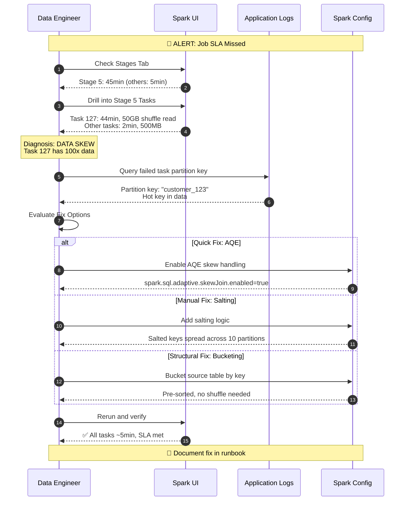
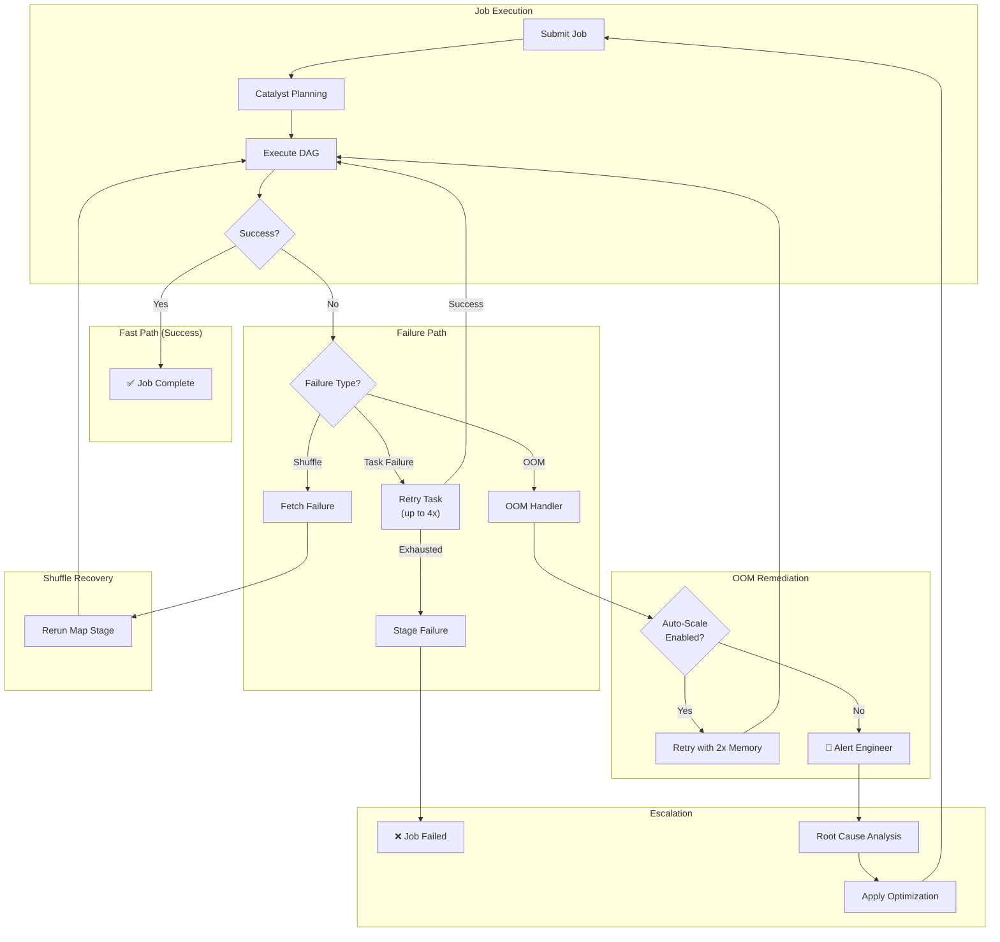
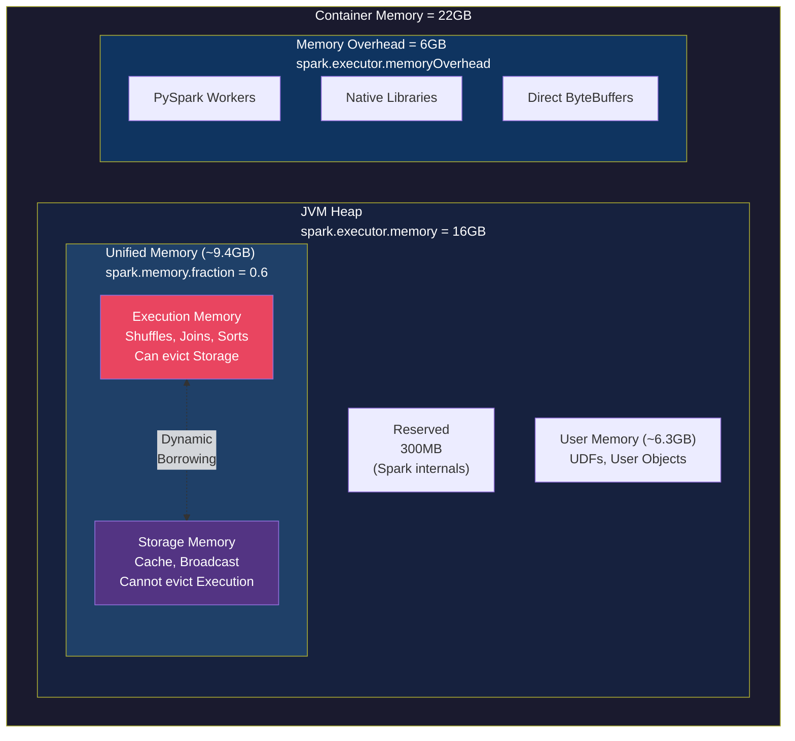

# Advanced Spark Performance Optimization Techniques - FAANG Principal DE/Architect Guide

> **Interview Frequency:** ⭐⭐⭐⭐⭐ (Critical Principal-Level Topic)
> **Difficulty:** Staff/Principal Level Strategic Overview

---

## Table of Contents
1. [Concept Breakdown](#1-concept-breakdown)
2. [Analogy](#2-analogy-the-factory-floor-optimization)
3. [Architecture & Design Variants](#3-architecture--design-variants)
4. [Diagrams](#4-diagrams)
5. [Real-World Issues & Failure Modes](#5-real-world-issues--failure-modes)
6. [Scenario-Based System Design Questions](#6-scenario-based-system-design-questions)
7. [Code Examples](#7-code-examples)
8. [Comparisons](#8-comparisons)
9. [Production Best Practices](#9-production-best-practices)
10. [Interview Summary](#10-interview-summary)

---

## 1. Concept Breakdown

### What Are Advanced Spark Performance Optimization Techniques?

Advanced Spark Performance Optimization is the **systematic engineering discipline** of maximizing throughput, minimizing latency, and ensuring resource efficiency in distributed Spark workloads. At FAANG scale (petabytes of data, thousands of jobs), this moves beyond simple tuning into **architectural decision-making**.

### Why It Exists

Spark's abstraction layer hides distributed computing complexity, but this convenience creates performance pitfalls:

```
┌─────────────────────────────────────────────────────────────────────────────┐
│                    THE PERFORMANCE OPTIMIZATION SPECTRUM                     │
├─────────────────────────────────────────────────────────────────────────────┤
│                                                                             │
│   ABSTRACTION LEVEL          OPTIMIZATION FOCUS           IMPACT LEVEL     │
│   ─────────────────          ──────────────────           ────────────     │
│                                                                             │
│   ┌───────────────┐                                                         │
│   │   SQL/DSL     │  ─────►  Query Structure              10-100x          │
│   │   (High)      │          Join Strategy                                  │
│   └───────────────┘          Filter Placement                               │
│          │                                                                  │
│          ▼                                                                  │
│   ┌───────────────┐                                                         │
│   │   Logical     │  ─────►  Catalyst Hints               5-50x            │
│   │   Plan        │          CBO Statistics                                 │
│   └───────────────┘          Partition Strategy                             │
│          │                                                                  │
│          ▼                                                                  │
│   ┌───────────────┐                                                         │
│   │   Physical    │  ─────►  Memory Tuning                2-20x            │
│   │   Execution   │          Parallelism                                    │
│   └───────────────┘          Shuffle Configuration                          │
│          │                                                                  │
│          ▼                                                                  │
│   ┌───────────────┐                                                         │
│   │   Storage     │  ─────►  File Format                  2-10x            │
│   │   (Low)       │          Compression                                    │
│   └───────────────┘          Partitioning/Bucketing                         │
│                                                                             │
└─────────────────────────────────────────────────────────────────────────────┘
```

### The Five Pillars of Spark Performance

```
┌──────────────────────────────────────────────────────────────────────────────┐
│                    FIVE PILLARS OF SPARK OPTIMIZATION                        │
├──────────────────────────────────────────────────────────────────────────────┤
│                                                                              │
│  1. PARTITION MANAGEMENT          │  2. MEMORY ARCHITECTURE                  │
│  ────────────────────────         │  ──────────────────────                  │
│  • Right-sizing partitions        │  • Unified memory model                  │
│  • Avoiding data skew             │  • Execution vs storage balance          │
│  • Coalesce vs repartition        │  • Off-heap configuration                │
│  • Bucketing for joins            │  • Spill management                      │
│                                   │                                          │
│  3. SHUFFLE OPTIMIZATION          │  4. STORAGE OPTIMIZATION                 │
│  ───────────────────────          │  ──────────────────────                  │
│  • Minimizing shuffle volume      │  • Columnar formats (Parquet)            │
│  • Broadcast joins                │  • Predicate pushdown                    │
│  • AQE dynamic optimization       │  • Partition pruning                     │
│  • Sort merge vs hash joins       │  • Z-ordering/clustering                 │
│                                   │                                          │
│  5. QUERY OPTIMIZATION                                                       │
│  ─────────────────────                                                       │
│  • Catalyst optimizer hints                                                  │
│  • Cost-based optimization                                                   │
│  • Avoiding anti-patterns                                                    │
│  • UDF optimization                                                          │
│                                                                              │
└──────────────────────────────────────────────────────────────────────────────┘
```

### How Spark Processes Data (Internal Mechanics)

Understanding the internal flow is critical for optimization:

```
┌─────────────────────────────────────────────────────────────────────────────┐
│                          SPARK EXECUTION FLOW                               │
├─────────────────────────────────────────────────────────────────────────────┤
│                                                                             │
│  USER CODE                                                                  │
│      │                                                                      │
│      ▼                                                                      │
│  ┌─────────────────────────────────────────────────────────────────────┐    │
│  │  CATALYST OPTIMIZER                                                  │    │
│  │  ┌─────────┐    ┌─────────┐    ┌─────────┐    ┌─────────┐          │    │
│  │  │ Parse   │───►│ Analyze │───►│ Optimize│───►│ Plan    │          │    │
│  │  │ (AST)   │    │ (Resolve│    │ (Rules) │    │ (Cost)  │          │    │
│  │  └─────────┘    │ Schema) │    └─────────┘    └─────────┘          │    │
│  │                 └─────────┘                                         │    │
│  └─────────────────────────────────────────────────────────────────────┘    │
│      │                                                                      │
│      ▼                                                                      │
│  ┌─────────────────────────────────────────────────────────────────────┐    │
│  │  DAG SCHEDULER                                                       │    │
│  │  • Splits plan into STAGES (shuffle boundaries)                     │    │
│  │  • Each stage = set of TASKS (one per partition)                    │    │
│  │  • Pipelining: narrow transformations fused                         │    │
│  └─────────────────────────────────────────────────────────────────────┘    │
│      │                                                                      │
│      ▼                                                                      │
│  ┌─────────────────────────────────────────────────────────────────────┐    │
│  │  TASK SCHEDULER                                                      │    │
│  │  • Data locality optimization (PROCESS_LOCAL → NODE_LOCAL → ANY)    │    │
│  │  • Speculative execution for stragglers                             │    │
│  │  • Dynamic allocation of executors                                   │    │
│  └─────────────────────────────────────────────────────────────────────┘    │
│      │                                                                      │
│      ▼                                                                      │
│  ┌─────────────────────────────────────────────────────────────────────┐    │
│  │  EXECUTOR (Worker JVM)                                               │    │
│  │  • Runs tasks in parallel (spark.executor.cores threads)            │    │
│  │  • Memory split: Execution + Storage + User                         │    │
│  │  • Tungsten binary processing for efficiency                        │    │
│  └─────────────────────────────────────────────────────────────────────┘    │
│                                                                             │
└─────────────────────────────────────────────────────────────────────────────┘
```

### Key Performance Metrics to Understand

| Metric | What It Measures | Target Range | Optimization Focus |
|--------|-----------------|--------------|-------------------|
| **Shuffle Read/Write** | Data moved between stages | Minimize | Join strategy, partition count |
| **GC Time %** | Time spent in garbage collection | <10% | Memory allocation, object creation |
| **Task Skew Ratio** | Max task time / Median task time | <3x | Salting, AQE, partition balancing |
| **Spill to Disk** | Bytes written due to memory pressure | 0 ideally | Memory tuning, partition sizing |
| **Scheduler Delay** | Time waiting for executor slot | <5% of task time | Parallelism, executor sizing |

---

## 2. Analogy: The Factory Floor Optimization

> The most practical way to understand Spark optimization is through a Lead Data Engineer's daily workflow.

### The Factory Analogy

Think of a Spark cluster as a **modern electronics factory**:

```
┌─────────────────────────────────────────────────────────────────────────────┐
│                        THE SPARK FACTORY FLOOR                              │
├─────────────────────────────────────────────────────────────────────────────┤
│                                                                             │
│  SPARK COMPONENT          │  FACTORY EQUIVALENT                             │
│  ──────────────           │  ──────────────────                             │
│                           │                                                 │
│  Driver                   │  Factory Manager / Control Room                 │
│                           │  • Coordinates all work                         │
│                           │  • Holds the master plan (DAG)                  │
│                           │  • Shouldn't do assembly work itself            │
│                           │                                                 │
│  Executors                │  Assembly Lines (Workstations)                  │
│                           │  • Each has workers (cores)                     │
│                           │  • Has local storage (memory)                   │
│                           │  • Processes batches (partitions)               │
│                           │                                                 │
│  Partitions               │  Batches of Components                          │
│                           │  • Too small = workers wait                     │
│                           │  • Too large = bottleneck                       │
│                           │  • Ideal: 128MB-1GB each                        │
│                           │                                                 │
│  Shuffle                  │  Moving Parts Between Lines                     │
│                           │  • Expensive (shipping costs)                   │
│                           │  • Minimize cross-line transfers                │
│                           │  • Pre-sort to reduce movement                  │
│                           │                                                 │
│  Broadcast                │  Posting Reference Sheets                       │
│                           │  • Small lookup tables                          │
│                           │  • Copy to every workstation once               │
│                           │  • Workers reference locally                    │
│                           │                                                 │
└─────────────────────────────────────────────────────────────────────────────┘
```

### The Daily Optimization Scenario

**Morning:** Your daily ETL processes 10TB of transactions.

```
Normal Day (Optimized):
┌────────────────────────────────────────────────────────────────────┐
│  6:00 AM: Job starts with AQE enabled                              │
│  6:05 AM: Broadcast 50MB dimension table to all workers            │
│  6:20 AM: 2000 evenly-sized partitions process in parallel         │
│  6:45 AM: Job completes, SLA met ✅                                │
└────────────────────────────────────────────────────────────────────┘
```

**Black Friday (Crisis without optimization):**

```
┌────────────────────────────────────────────────────────────────────┐
│  6:00 AM: Job starts (10x volume!)                                 │
│  6:15 AM: One partition has 70% of data (skew on "Amazon")         │
│  8:00 AM: Still running... OOM errors appearing                    │
│  9:30 AM: Job fails, SLA breached ❌                               │
│                                                                    │
│  Root cause: All Amazon orders hashed to ONE partition             │
│  Fix: Enable AQE skew handling + salting for known hot keys        │
└────────────────────────────────────────────────────────────────────┘
```

### Key Takeaway

Optimization is about **preventing the factory from having bottlenecks**:
- **Balance workloads** (partition sizing)
- **Minimize transportation** (reduce shuffles)
- **Post reference materials locally** (broadcast small tables)
- **Plan ahead for peak seasons** (dynamic resource allocation)

---

## 3. Architecture & Design Variants

### Design Pattern 1: Partition-Centric Optimization

**Strategy:** Optimize data layout at rest to minimize runtime computation.

```python
# Partition by frequently filtered column
df.write.partitionBy("date", "region").parquet("/data/events")

# Bucket by join key for repeated joins
df.write.bucketBy(256, "customer_id").sortBy("customer_id") \
    .saveAsTable("events_bucketed")
```

| Pros | Cons |
|------|------|
| ✅ Eliminates partition pruning at query time | ❌ Requires upfront design decisions |
| ✅ Bucketing avoids shuffle for same-key joins | ❌ Schema changes require full rewrite |
| ✅ Predictable performance | ❌ Small files problem if over-partitioned |

**When to Use:**
- Stable schemas with known query patterns
- Repeated joins on same keys
- Time-series data with date-based queries

**FAANG Scale Consideration:**
At petabyte scale, partition pruning saves **orders of magnitude** in I/O. A well-partitioned table at Meta can reduce scan from 1PB to 10GB.

---

### Design Pattern 2: Shuffle-Minimization Architecture

**Strategy:** Structure pipelines to minimize data movement between stages.

```python
# Pre-aggregate before joining
aggregated_df = large_df.groupBy("customer_id").agg(
    sum("amount").alias("total"),
    count("*").alias("cnt")
)

# Now join with smaller intermediate data
result = aggregated_df.join(broadcast(dim_df), "customer_id")
```

| Pros | Cons |
|------|------|
| ✅ Dramatically reduces network I/O | ❌ May lose detail needed downstream |
| ✅ Smaller intermediate datasets | ❌ Requires understanding data flow |
| ✅ Lower memory pressure | ❌ Can complicate query logic |

**When to Use:**
- Multi-stage aggregation pipelines
- Joining aggregated results with dimensions
- When network bandwidth is the bottleneck

---

### Design Pattern 3: AQE-First Dynamic Optimization (Spark 3.0+)

**Strategy:** Let Spark optimize at runtime based on actual data statistics.

```python
# Enable comprehensive AQE
spark.conf.set("spark.sql.adaptive.enabled", "true")
spark.conf.set("spark.sql.adaptive.coalescePartitions.enabled", "true")
spark.conf.set("spark.sql.adaptive.skewJoin.enabled", "true")
spark.conf.set("spark.sql.adaptive.skewJoin.skewedPartitionFactor", "5")
spark.conf.set("spark.sql.adaptive.skewJoin.skewedPartitionThresholdInBytes", "256MB")
spark.conf.set("spark.sql.adaptive.advisoryPartitionSizeInBytes", "128MB")
spark.conf.set("spark.sql.adaptive.autoBroadcastJoinThreshold", "100MB")
```

| Pros | Cons |
|------|------|
| ✅ Self-tuning for variable workloads | ❌ Planning overhead |
| ✅ Automatic skew handling for joins | ❌ Less predictable resource usage |
| ✅ Reduces manual tuning | ❌ Doesn't help aggregation skew |

**When to Use:**
- Variable data volumes
- Unknown or changing data distributions
- Teams without deep Spark expertise

---

### Design Pattern 4: Memory-Tiered Architecture

**Strategy:** Layer caching strategy based on access patterns.

```python
# Tier 1: Hot data - memory only
hot_df.persist(StorageLevel.MEMORY_ONLY)

# Tier 2: Warm data - memory with disk spillover
warm_df.persist(StorageLevel.MEMORY_AND_DISK)

# Tier 3: Cold but reused - disk only
cold_df.persist(StorageLevel.DISK_ONLY)

# Always unpersist when done
hot_df.unpersist()
```

| Pros | Cons |
|------|------|
| ✅ Optimal memory utilization | ❌ Requires understanding access patterns |
| ✅ Reduces recomputation | ❌ Memory leaks if not unpersisted |
| ✅ Flexible for mixed workloads | ❌ Serialization overhead for MEMORY_AND_DISK |

---

### Design Pattern 5: Cost-Based Optimization (CBO)

**Strategy:** Provide Spark with statistics for optimal planning.

```sql
-- Compute table-level statistics
ANALYZE TABLE events COMPUTE STATISTICS;

-- Compute column-level statistics (more expensive but better plans)
ANALYZE TABLE events COMPUTE STATISTICS FOR COLUMNS 
    customer_id, event_type, event_date;
```

```python
# Enable CBO features
spark.conf.set("spark.sql.cbo.enabled", "true")
spark.conf.set("spark.sql.cbo.joinReorder.enabled", "true")
spark.conf.set("spark.sql.cbo.planStats.enabled", "true")
```

| Pros | Cons |
|------|------|
| ✅ Optimal join ordering | ❌ Statistics become stale |
| ✅ Better broadcast decisions | ❌ ANALYZE is expensive |
| ✅ Improved filter selectivity | ❌ Not all operations benefit |

---

### FAANG-Scale Architecture

At FAANG scale, optimization is **platform-level**:

```
┌──────────────────────────────────────────────────────────────────────────────┐
│                    FAANG SPARK PLATFORM ARCHITECTURE                         │
├──────────────────────────────────────────────────────────────────────────────┤
│                                                                              │
│   ┌─────────────────────────────────────────────────────────────────────┐   │
│   │  LAYER 1: Platform Defaults                                         │   │
│   │  • AQE enabled cluster-wide                                         │   │
│   │  • Default broadcast threshold: 256MB                               │   │
│   │  • Memory guardrails per team (quota system)                        │   │
│   │  • Automatic retry with 2x resources on OOM                         │   │
│   └─────────────────────────────────────────────────────────────────────┘   │
│                                                                              │
│   ┌─────────────────────────────────────────────────────────────────────┐   │
│   │  LAYER 2: Automated Tuning Service                                  │   │
│   │  • Historical job analysis → configuration recommendations          │   │
│   │  • Automatic partition count calculation                            │   │
│   │  • Anomaly detection (skew, OOM patterns)                           │   │
│   └─────────────────────────────────────────────────────────────────────┘   │
│                                                                              │
│   ┌─────────────────────────────────────────────────────────────────────┐   │
│   │  LAYER 3: Data Profiling & Catalog                                  │   │
│   │  • Table statistics updated nightly                                 │   │
│   │  • Hot key detection alerts                                         │   │
│   │  • Data growth projections                                          │   │
│   └─────────────────────────────────────────────────────────────────────┘   │
│                                                                              │
│   ┌─────────────────────────────────────────────────────────────────────┐   │
│   │  LAYER 4: Observability                                             │   │
│   │  • Real-time shuffle volume dashboards                              │   │
│   │  • GC pressure alerts                                               │   │
│   │  • Stage-level cost attribution                                     │   │
│   └─────────────────────────────────────────────────────────────────────┘   │
│                                                                              │
└──────────────────────────────────────────────────────────────────────────────┘
```

---

## 4. Diagrams

### High-Level Architecture: Optimization Decision Tree

```mermaid
flowchart TB
    subgraph Input["📊 Performance Issue Detected"]
        Problem[Slow Job / OOM / High Cost]
    end
    
    Problem --> Diagnose{Diagnose<br/>Root Cause}
    
    Diagnose -->|"High Shuffle<br/>Volume"| ShuffleOpt["SHUFFLE OPTIMIZATION"]
    Diagnose -->|"Task Duration<br/>Variance"| SkewOpt["SKEW HANDLING"]
    Diagnose -->|"Memory<br/>Pressure"| MemoryOpt["MEMORY TUNING"]
    Diagnose -->|"High GC<br/>Time"| GCOpt["SERIALIZATION"]
    Diagnose -->|"Slow Scans"| IOOpt["I/O OPTIMIZATION"]
    
    subgraph ShuffleFixes["Shuffle Fixes"]
        ShuffleOpt --> BroadcastJoin["Use Broadcast Join"]
        ShuffleOpt --> PreAggregate["Pre-aggregate Before Join"]
        ShuffleOpt --> Bucketing["Enable Bucketing"]
    end
    
    subgraph SkewFixes["Skew Fixes"]
        SkewOpt --> EnableAQE["Enable AQE Skew Join"]
        SkewOpt --> Salting["Apply Salting"]
        SkewOpt --> IsolateNulls["Handle NULLs Separately"]
    end
    
    subgraph MemoryFixes["Memory Fixes"]
        MemoryOpt --> IncreasePartitions["Increase Partition Count"]
        MemoryOpt --> TuneMemory["Tune Memory Fractions"]
        MemoryOpt --> AddOverhead["Increase memoryOverhead"]
    end
    
    subgraph GCFixes["GC Fixes"]
        GCOpt --> UseUnsafe["Use Tungsten/Unsafe"]
        GCOpt --> AvoidUDF["Replace UDFs with Built-ins"]
        GCOpt --> KryoSerializer["Enable Kryo Serialization"]
    end
    
    subgraph IOFixes["I/O Fixes"]
        IOOpt --> ColumnPruning["Select Only Needed Columns"]
        IOOpt --> PartitionPruning["Add Partition Filters"]
        IOOpt --> PredicatePushdown["Enable Predicate Pushdown"]
    end
```



### Sequence Flow: Optimization Investigation



### Failure and Retry Flow



### Memory Layout Visualization



---

## 5. Real-World Issues & Failure Modes

### Issue 1: The Silent Skew Killer

**Symptoms:**
- Job runs 10x longer than expected
- Spark UI shows 99% of tasks complete rapidly, 1% straggler
- Same job worked fine last month

**Root Cause:**
New data introduced a hot key:

```python
# Check key distribution
df.groupBy("customer_id").count().orderBy(desc("count")).show(5)
# customer_id | count
# HOT_KEY     | 50,000,000  ← 50% of all data!
# others      | 1,000
```

**Detection:**
```python
# Pre-job check for skew
def detect_skew(df, key_col, threshold=5):
    stats = df.groupBy(key_col).count()
    median_count = stats.approxQuantile("count", [0.5], 0.01)[0]
    max_count = stats.agg({"count": "max"}).collect()[0][0]
    skew_ratio = max_count / median_count
    if skew_ratio > threshold:
        print(f"⚠️ SKEW DETECTED: {skew_ratio:.1f}x on {key_col}")
    return skew_ratio
```

**Resolution:**
```python
# Solution 1: AQE (Spark 3.0+)
spark.conf.set("spark.sql.adaptive.skewJoin.enabled", "true")

# Solution 2: Salting for aggregations
from pyspark.sql.functions import floor, rand, concat, lit

SALT_BUCKETS = 20
salted_df = df.withColumn(
    "salted_key",
    concat(col("customer_id"), lit("_"), floor(rand() * SALT_BUCKETS))
)
partial_agg = salted_df.groupBy("salted_key").agg(sum("amount"))
final_agg = partial_agg.groupBy(
    regexp_extract(col("salted_key"), r"(.+)_\d+", 1).alias("customer_id")
).agg(sum("sum(amount)").alias("total"))
```

---

### Issue 2: Broadcast Table OOM

**Symptoms:**
- Driver OOM during broadcast
- Error: `SparkException: Cannot broadcast the table that is larger than 8GB`
- Job worked when table was smaller

**Root Cause:**
Dimension table grew beyond broadcast threshold:

```python
# Table grew from 50MB to 9GB over 2 years
spark.conf.get("spark.sql.autoBroadcastJoinThreshold")  # 10MB default
```

**Detection:**
```python
# Monitor table sizes
def get_table_size_mb(df):
    # Force execution to get accurate size
    return df.cache().count() and df.storageLevel
    
# Or estimate from Parquet files
import os
table_path = "/path/to/table"
size_bytes = sum(f.size for f in dbutils.fs.ls(table_path) if f.name.endswith('.parquet'))
print(f"Table size: {size_bytes / 1024**2:.1f} MB")
```

**Resolution:**
```python
# Option 1: Disable broadcast for this table
spark.conf.set("spark.sql.autoBroadcastJoinThreshold", "-1")

# Option 2: Filter dimension before join
dim_filtered = dim_df.filter(col("active") == True)  # Reduce size
result = fact_df.join(broadcast(dim_filtered), "key")

# Option 3: Switch to Sort-Merge Join
result = fact_df.join(dim_df, "key")  # Will use SMJ for large tables
```

---

### Issue 3: Small Files Explosion

**Symptoms:**
- Jobs get slower over time
- Driver spends minutes in planning
- Thousands of tiny Parquet files

**Root Cause:**
Over-partitioning combined with streaming or frequent appends:

```python
# Anti-pattern: Too many partitions on write
df.repartition(2000).write.parquet("/output")  # Creates 2000 files

# Worse: Streaming creates files every micro-batch
stream.writeStream.trigger(processingTime="10 seconds")
# Can create 8,640 files per day!
```

**Detection:**
```bash
# Count files
hdfs dfs -count /path/to/table
# Or
ls -la /path/to/table/*.parquet | wc -l
```

**Resolution:**
```python
# Option 1: Compaction with Delta
spark.sql("OPTIMIZE delta.`/path/to/table`")

# Option 2: Coalesce on write
df.coalesce(100).write.parquet("/output")

# Option 3: Use maxRecordsPerFile
df.write.option("maxRecordsPerFile", 1000000).parquet("/output")

# Option 4: Schedule regular compaction job
def compact_table(path, target_file_size_mb=128):
    df = spark.read.parquet(path)
    target_partitions = max(1, int(get_table_size_mb(df) / target_file_size_mb))
    df.coalesce(target_partitions).write.mode("overwrite").parquet(f"{path}_compacted")
```

---

### Issue 4: UDF Performance Cliff

**Symptoms:**
- 10-100x slower than expected
- High deserialization time in Spark UI
- Python worker processes consuming memory

**Root Cause:**
Python UDFs require row-by-row serialization:

```python
# ANTI-PATTERN: Row-by-row Python UDF
@udf(StringType())
def slow_transform(value):
    return value.upper()  # Could use built-in upper()!

df.withColumn("result", slow_transform(col("name")))  # SLOW
```

**Resolution:**
```python
# Solution 1: Use built-in functions
from pyspark.sql.functions import upper
df.withColumn("result", upper(col("name")))  # 100x faster

# Solution 2: Use Pandas UDF for batch processing
from pyspark.sql.functions import pandas_udf
import pandas as pd

@pandas_udf(StringType())
def fast_transform(s: pd.Series) -> pd.Series:
    return s.str.upper()  # Vectorized!

df.withColumn("result", fast_transform(col("name")))

# Solution 3: Use Apache Arrow for even better performance
spark.conf.set("spark.sql.execution.arrow.pyspark.enabled", "true")
```

---

### Issue 5: Join Explosion (Cartesian Product)

**Symptoms:**
- Job runs forever or OOM
- Shuffle write is terabytes (unexpected)
- Output row count is input1 × input2

**Root Cause:**
Missing or mismatched join keys:

```python
# DANGEROUS: Column name mismatch
df1.join(df2, df1.id == df2.user_id)  # If no matches, becomes cross join!

# VERY DANGEROUS: Join without condition
df1.crossJoin(df2)  # Explicit, but deadly
```

**Detection:**
```python
# Before join, verify key cardinality
print(f"df1 keys: {df1.select('id').distinct().count()}")
print(f"df2 keys: {df2.select('id').distinct().count()}")

# Check explain plan for CartesianProduct
df1.join(df2, "id").explain(True)
```

**Prevention:**
```python
# Disable accidental cross joins
spark.conf.set("spark.sql.crossJoin.enabled", "false")

# Always verify join keys match
assert df1.select("id").dtypes[0] == df2.select("id").dtypes[0], "Type mismatch!"
```

---

## 6. Scenario-Based System Design Questions

### Scenario 1: The Midnight Cascade

**Question:** 
*"Your 2 AM batch job that joins a 5TB fact table with a 2GB dimension table has been failing with OOM for the past week. It ran fine for 6 months before. What's your debugging approach?"*

**Expected Answer Shape:**

1. **Identify when it started failing:**
   > "First, I'd check git history for config changes around that time. Then examine if dimension table size changed."

2. **Analyze the failure mode:**
   > "Check Spark UI for the failed runs - is it driver OOM (broadcast issue) or executor OOM (skew or partition size)?"

3. **Root cause hypothesis:**
   > "Likely the dimension table grew beyond broadcast threshold (default 10MB). At 2GB, it's broadcast-able but marginal. Check if it recently crossed 2GB or if data quality issues caused duplication."

4. **Immediate fix:**
   ```python
   # If dimension table is too large for broadcast
   spark.conf.set("spark.sql.autoBroadcastJoinThreshold", "-1")  # Disable
   # Use Sort-Merge Join instead
   ```

5. **Long-term fix:**
   > "Add dimension table size monitoring. Create alert when it exceeds 1GB. Consider bucketing both tables by join key for repeated joins."

**Trick Edge:**
Interviewer might say *"The dimension table is still under 10MB."* → Look for **schema changes** that increased row width, or **NULL key explosion** causing skew.

---

### Scenario 2: The Black Friday Surge

**Question:**
*"Design a Spark pipeline that handles 10x traffic spikes (Black Friday) without manual intervention. Normal daily volume is 1TB, spike is 10TB."*

**Expected Answer Shape:**

1. **Dynamic resource allocation:**
   ```python
   spark.conf.set("spark.dynamicAllocation.enabled", "true")
   spark.conf.set("spark.dynamicAllocation.minExecutors", "10")
   spark.conf.set("spark.dynamicAllocation.maxExecutors", "500")
   spark.conf.set("spark.dynamicAllocation.executorIdleTimeout", "60s")
   ```

2. **Adaptive Query Execution:**
   ```python
   spark.conf.set("spark.sql.adaptive.enabled", "true")
   spark.conf.set("spark.sql.adaptive.coalescePartitions.enabled", "true")
   spark.conf.set("spark.sql.adaptive.skewJoin.enabled", "true")
   ```

3. **Pre-check data volume:**
   ```python
   def get_partition_recommendations(input_path, target_size_mb=256):
       size_bytes = sum(f.size for f in dbutils.fs.ls(input_path))
       return max(200, int(size_bytes / (target_size_mb * 1024 * 1024)))
   
   recommended_partitions = get_partition_recommendations("/input/path")
   spark.conf.set("spark.sql.shuffle.partitions", str(recommended_partitions))
   ```

4. **Graceful degradation:**
   > "If job exceeds SLA threshold, switch to sampling mode or prioritize critical outputs."

**Trick Edge:**
*"What if hot product becomes 70% of orders?"* → Pre-identify known hot keys (top 100 products), apply selective salting.

---

### Scenario 3: The Delta Lake Merge Performance

**Question:**
*"Your Delta Lake MERGE is taking 4 hours on a 10TB table with 1M daily updates. How do you optimize it?"*

**Expected Answer Shape:**

1. **Diagnose current state:**
   ```python
   # Check table metadata
   spark.sql("DESCRIBE HISTORY my_table").show(5)
   
   # Count files
   len(spark.sql("DESCRIBE DETAIL my_table").collect()[0].numFiles)
   ```

2. **Enable key optimizations:**
   ```python
   # MERGE optimizations
   spark.conf.set("spark.databricks.delta.merge.enableLowShuffle", "true")
   
   # If source is small, broadcast it
   spark.conf.set("spark.databricks.delta.merge.repartitionBeforeWrite.enabled", "true")
   ```

3. **Z-Order on merge key:**
   ```sql
   OPTIMIZE my_table ZORDER BY (merge_key);
   ```

4. **Partition the table:**
   > "If merge key includes date, partition by date to limit scan scope."

5. **Consider table design:**
   > "If 1M updates hit 10TB randomly, consider changing to SCD Type 2 with partition by ingestion_date."

**Trick Edge:**
*"What if the merge key has 90% NULL values?"* → NULLs all hash together. Filter NULLs first, process separately, union back.

---

## 7. Code Examples

### Best Practice: Complete Optimized Job Template

```python
from pyspark.sql import SparkSession
from pyspark.sql.functions import col, broadcast, sum as spark_sum
from pyspark.storagelevel import StorageLevel

# ============================================================
# CONFIGURATION: Apply performance settings BEFORE job starts
# ============================================================
spark = SparkSession.builder \
    .config("spark.sql.adaptive.enabled", "true") \
    .config("spark.sql.adaptive.coalescePartitions.enabled", "true") \
    .config("spark.sql.adaptive.skewJoin.enabled", "true") \
    .config("spark.sql.adaptive.skewJoin.skewedPartitionFactor", "5") \
    .config("spark.sql.adaptive.skewJoin.skewedPartitionThresholdInBytes", "256MB") \
    .config("spark.sql.autoBroadcastJoinThreshold", "100MB") \
    .config("spark.serializer", "org.apache.spark.serializer.KryoSerializer") \
    .config("spark.sql.shuffle.partitions", "auto") \
    .getOrCreate()

# ============================================================
# DATA LOADING: Column pruning + partition filtering
# ============================================================
# GOOD: Select only needed columns, filter early
fact_df = spark.read.parquet("/data/fact_table") \
    .select("customer_id", "product_id", "amount", "event_date") \
    .filter(col("event_date") >= "2024-01-01")

# GOOD: Broadcast small dimension tables
dim_customer = spark.read.parquet("/data/dim_customer") \
    .select("customer_id", "customer_name", "region")

dim_product = spark.read.parquet("/data/dim_product") \
    .filter(col("is_active") == True) \
    .select("product_id", "product_name", "category")

# ============================================================
# PROCESSING: Optimize join order (small first)
# ============================================================
# GOOD: Join with broadcast for small dimensions
enriched = fact_df \
    .join(broadcast(dim_product), "product_id", "left") \
    .join(broadcast(dim_customer), "customer_id", "left")

# GOOD: Pre-aggregate before complex operations
aggregated = enriched.groupBy("region", "category") \
    .agg(
        spark_sum("amount").alias("total_revenue"),
        count("*").alias("transaction_count")
    )

# ============================================================
# CACHING: Only cache if reused multiple times
# ============================================================
if needs_multiple_outputs:
    aggregated.persist(StorageLevel.MEMORY_AND_DISK)
    
    # Write to multiple destinations
    aggregated.write.parquet("/output/by_region_category")
    aggregated.filter(col("total_revenue") > 1000000) \
        .write.parquet("/output/high_value")
    
    # CRITICAL: Always unpersist
    aggregated.unpersist()

# ============================================================
# OUTPUT: Optimize file layout
# ============================================================
aggregated.coalesce(10) \
    .write \
    .mode("overwrite") \
    .option("compression", "zstd") \
    .partitionBy("region") \
    .parquet("/output/final")
```

### Anti-Patterns to Avoid

```python
# ❌ ANTI-PATTERN 1: collect() on large data
all_results = df.collect()  # OOM if df is large

# ✅ CORRECT: Write to storage, sample, or aggregate
df.write.parquet("/results")
sample = df.limit(1000).collect()
count = df.count()

# ❌ ANTI-PATTERN 2: Python UDF for simple operations
@udf(StringType())
def upper_case(s):
    return s.upper() if s else None

df.withColumn("name_upper", upper_case(col("name")))

# ✅ CORRECT: Use built-in functions
from pyspark.sql.functions import upper
df.withColumn("name_upper", upper(col("name")))

# ❌ ANTI-PATTERN 3: Multiple small writes
for date in dates:
    df.filter(col("date") == date).write.parquet(f"/output/{date}")

# ✅ CORRECT: Partition on write
df.write.partitionBy("date").parquet("/output")

# ❌ ANTI-PATTERN 4: Caching without unpersisting
df.cache()
# ... job ends without unpersist
# Memory never freed in long-running session!

# ✅ CORRECT: Always unpersist
df.cache()
try:
    process(df)
finally:
    df.unpersist()

# ❌ ANTI-PATTERN 5: repartition() when coalesce() suffices
df.repartition(10).write.parquet("/output")  # Full shuffle!

# ✅ CORRECT: coalesce() for reducing partitions
df.coalesce(10).write.parquet("/output")  # No shuffle

# ❌ ANTI-PATTERN 6: Ignoring null handling in joins
df1.join(df2, "customer_id")  # NULLs create skew

# ✅ CORRECT: Handle nulls explicitly
df1_non_null = df1.filter(col("customer_id").isNotNull())
result = df1_non_null.join(df2, "customer_id")
```

### SQL Performance Patterns

```sql
-- ❌ ANTI-PATTERN: SELECT * (reads all columns)
SELECT * FROM fact_table WHERE date = '2024-01-01';

-- ✅ CORRECT: Column pruning
SELECT customer_id, amount FROM fact_table WHERE date = '2024-01-01';

-- ❌ ANTI-PATTERN: Filter after join
SELECT * FROM fact_table f
JOIN dim_customer c ON f.customer_id = c.customer_id
WHERE f.date = '2024-01-01';

-- ✅ CORRECT: Filter before join (predicate pushdown)
SELECT * FROM (
    SELECT * FROM fact_table WHERE date = '2024-01-01'
) f
JOIN dim_customer c ON f.customer_id = c.customer_id;

-- ✅ BEST: Spark often optimizes this anyway, but explicit is safer

-- BROADCAST HINT for small tables
SELECT /*+ BROADCAST(dim_customer) */ *
FROM fact_table f
JOIN dim_customer c ON f.customer_id = c.customer_id;

-- REPARTITION HINT for skew
SELECT /*+ REPARTITION(100, customer_id) */ *
FROM orders
GROUP BY customer_id;
```

---

## 8. Comparisons

### Optimization Approach Decision Matrix

| Scenario | AQE | Salting | Bucketing | Broadcast | Repartition |
|----------|-----|---------|-----------|-----------|-------------|
| **Join skew (unknown keys)** | ✅ Best | ⚠️ Fallback | ❌ | ❌ | ❌ |
| **Join skew (known hot keys)** | ✅ Good | ✅ Best | ⚠️ Long-term | ❌ | ❌ |
| **Aggregation skew** | ❌ | ✅ Best | ❌ | ❌ | ❌ |
| **Large + Small join** | ✅ Auto | ❌ | ❌ | ✅ Best | ❌ |
| **Large + Large join** | ✅ Good | ❌ | ✅ Best | ❌ | ⚠️ Pre-shuffle |
| **Too many partitions** | ✅ Coalesce | ❌ | ❌ | ❌ | ❌ |
| **Too few partitions** | ❌ | ❌ | ❌ | ❌ | ✅ Best |

### Join Strategy Comparison

| Join Type | Shuffle Required | Memory | Best For | Scalability |
|-----------|-----------------|--------|----------|-------------|
| **Broadcast Hash** | ❌ None | Small table in all executors | Large + Small | Limited by driver/executor memory |
| **Shuffle Hash** | ✅ Both sides | Hash table per partition | Medium + Medium | Good |
| **Sort Merge** | ✅ Both sides | Streaming (low) | Large + Large | Excellent |
| **Bucketed Join** | ❌ If co-bucketed | Depends on strategy | Repeated joins on same key | Excellent |

### File Format Comparison for Performance

| Format | Read Speed | Write Speed | Predicate Pushdown | Compression |
|--------|-----------|-------------|-------------------|-------------|
| **Parquet** | ⭐⭐⭐⭐⭐ | ⭐⭐⭐ | ✅ Excellent | ⭐⭐⭐⭐⭐ |
| **Delta** | ⭐⭐⭐⭐ | ⭐⭐⭐⭐ | ✅ Excellent | ⭐⭐⭐⭐⭐ |
| **ORC** | ⭐⭐⭐⭐ | ⭐⭐⭐ | ✅ Good | ⭐⭐⭐⭐ |
| **Avro** | ⭐⭐⭐ | ⭐⭐⭐⭐⭐ | ❌ Limited | ⭐⭐⭐ |
| **CSV** | ⭐ | ⭐⭐⭐⭐⭐ | ❌ None | ⭐ |

---

## 9. Production Best Practices

### Deployment Checklist

```
PRE-DEPLOYMENT:
□ Enable AQE for Spark 3.0+
□ Set appropriate broadcast threshold (100-500MB)
□ Configure serializer (Kryo for complex objects)
□ Set dynamic allocation with reasonable min/max
□ Enable speculation for straggler handling

PARTITION STRATEGY:
□ Target 128MB-256MB per partition
□ Avoid over-partitioning (no more than 1 partition per 10MB)
□ Bucket frequently joined tables
□ Use date/region partitioning for large fact tables

MEMORY CONFIGURATION:
□ Set executor memory based on workload (8-32GB typical)
□ Increase memoryOverhead for PySpark (min 2GB)
□ Monitor GC time (<10% is healthy)
□ Test with production-like data volumes
```

### Monitoring & Observability

**Key Metrics to Track:**

| Metric | Alert Threshold | Dashboard |
|--------|----------------|-----------|
| Task Skew Ratio | > 5x | Spark UI Stages |
| GC Time % | > 15% | Spark UI Executors |
| Shuffle Spill | > 0 GB persistent | Spark UI Stages |
| Scheduler Delay | > 10% of task time | Spark UI Tasks |
| Job Duration Variance | > 2σ from baseline | Custom pipeline monitoring |

**Prometheus Metrics Example:**

```yaml
# spark-metrics.yaml
- pattern: "spark.executor.GcTime"
  name: spark_executor_gc_time_ms
  labels:
    executor_id: "$1"
    
- pattern: "spark.executor.shuffleTotalBytesRead"
  name: spark_shuffle_read_bytes
  
- pattern: "spark.executor.memoryUsed"
  name: spark_memory_used_bytes
```

### Cost Considerations

| Optimization | Compute Cost Impact | Storage Cost Impact | When Worth It |
|-------------|--------------------|--------------------|---------------|
| **Increase executors** | ↑ Higher | — | When parallelism bottleneck |
| **Larger executors** | ↑ Higher | — | When memory bottleneck |
| **Bucketing** | — | ↑ Slight (sorted) | Repeated joins on same key |
| **Z-Ordering** | ↑ Once (OPTIMIZE) | — | Query-heavy tables |
| **Caching** | ↑ Memory cost | — | Multi-use intermediate data |
| **File compaction** | ↑ Once | ↓ Fewer files | Small files problem |

### Security Considerations

```python
# Encryption in transit
spark.conf.set("spark.ssl.enabled", "true")
spark.conf.set("spark.ssl.keyStore", "/path/to/keystore")

# Encryption at rest (configure storage layer)
# Delta Lake encryption example
spark.conf.set("spark.databricks.delta.encryption.enabled", "true")

# Audit logging
spark.conf.set("spark.sql.queryExecutionListeners", 
               "com.company.AuditQueryListener")

# Data masking for sensitive columns
from pyspark.sql.functions import sha2, concat
df.withColumn("email_hash", sha2(col("email"), 256))
```

### Production Readiness Checklist

```
□ PERFORMANCE VALIDATED
  □ Tested with 2x expected data volume
  □ Verified no data skew on join keys
  □ Confirmed partition sizes in healthy range
  □ Reviewed explain() output for unexpected shuffles

□ RESILIENCE VERIFIED
  □ Job retries configured (max 3x)
  □ Checkpoint enabled for streaming
  □ Idempotent writes (overwrite mode or merge)
  □ Dead letter queue for bad records

□ MONITORING CONFIGURED  
  □ Job duration alerts
  □ OOM failure alerts
  □ Data quality checks
  □ SLA breach notifications

□ COST OPTIMIZED
  □ Dynamic allocation enabled
  □ Spot/preemptible instances where applicable
  □ Auto-scaling cluster configuration
  □ Resource cleanup after job completion

□ SECURITY REVIEWED
  □ Secrets not hardcoded
  □ Encryption enabled
  □ IAM roles properly scoped
  □ PII columns masked or encrypted
```

---

## 10. Interview Summary

### Cheat Sheet

```
┌──────────────────────────────────────────────────────────────────────────────┐
│                    SPARK OPTIMIZATION CHEAT SHEET                            │
├──────────────────────────────────────────────────────────────────────────────┤
│                                                                              │
│  🎯 FIRST LINE OF DEFENSE                                                    │
│     • Enable AQE (spark.sql.adaptive.enabled = true)                         │
│     • Use built-in functions, avoid UDFs                                     │
│     • Broadcast small tables (<100MB)                                        │
│                                                                              │
│  📊 PARTITION RULES                                                          │
│     • Target: 128MB-256MB per partition                                      │
│     • Formula: num_partitions = data_size_GB * 4                             │
│     • Use coalesce() to reduce, repartition() to increase                    │
│                                                                              │
│  🔀 SHUFFLE REDUCTION                                                        │
│     • Filter early (predicate pushdown)                                      │
│     • Pre-aggregate before joins                                             │
│     • Bucket tables for repeated joins                                       │
│                                                                              │
│  💾 MEMORY OPTIMIZATION                                                      │
│     • executor.memory: 8-32GB typical                                        │
│     • memoryOverhead: 10-20% of heap (more for PySpark)                      │
│     • memory.fraction: 0.6-0.8 for heavy computation                         │
│                                                                              │
│  🔥 SKEW HANDLING                                                            │
│     • AQE skewJoin for join skew                                             │
│     • Salting for aggregation skew                                           │
│     • Handle NULL keys separately                                            │
│                                                                              │
│  📝 DEBUGGING COMMANDS                                                       │
│     • df.explain(True) - View execution plan                                 │
│     • df.rdd.getNumPartitions() - Check partition count                      │
│     • spark.catalog.cacheTable() - Persist hot tables                        │
│                                                                              │
└──────────────────────────────────────────────────────────────────────────────┘
```

### The Mnemonic: **SPAMS**

Remember the five pillars with **SPAMS**:

| Letter | Pillar | Key Action |
|--------|--------|------------|
| **S** | **S**huffle | Minimize with broadcast, bucketing |
| **P** | **P**artition | Right-size at 128-256MB |
| **A** | **A**QE | Enable for automatic optimization |
| **M** | **M**emory | Tune fractions, avoid spill |
| **S** | **S**kew | Salt or AQE for hot keys |

### Quick Interview Response Template

**When asked about Spark optimization:**

> "I approach Spark optimization through five pillars: **Shuffle minimization** using broadcast joins and bucketing, **Partition sizing** targeting 128-256MB per partition, **AQE** for dynamic runtime optimization, **Memory tuning** with proper fractions and overhead, and **Skew handling** through salting or AQE skew join.
>
> My debugging process starts with `explain(True)` to identify shuffles, then Spark UI to find stragglers, then key distribution analysis to detect skew.
>
> At FAANG scale, I'd advocate for platform-level defaults (AQE enabled everywhere) plus automated tuning services that recommend configurations based on historical job analysis."

---

## Related Topics

- [Skew Handling & Salting](./01-skew-handling-salting.md)
- [Broadcast vs Shuffle Joins](./02-broadcast-vs-shuffle-joins.md)
- [Catalyst Optimizer](./03-catalyst-optimizer.md)
- [File Formats Deep Dive](./04-file-formats-deep-dive.md)
- [Debugging OOM Errors](./05-debugging-oom-errors.md)
