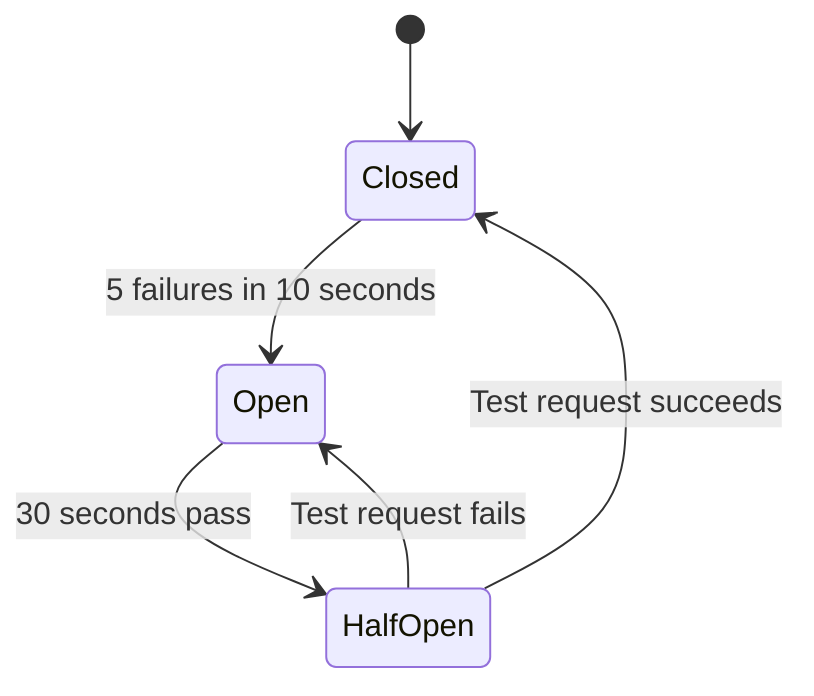
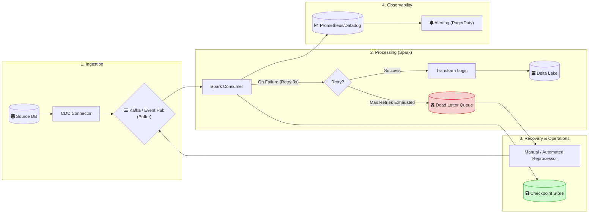
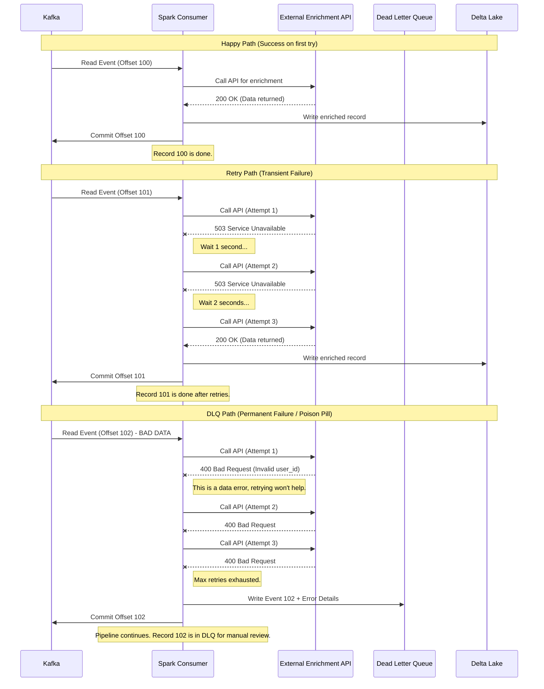
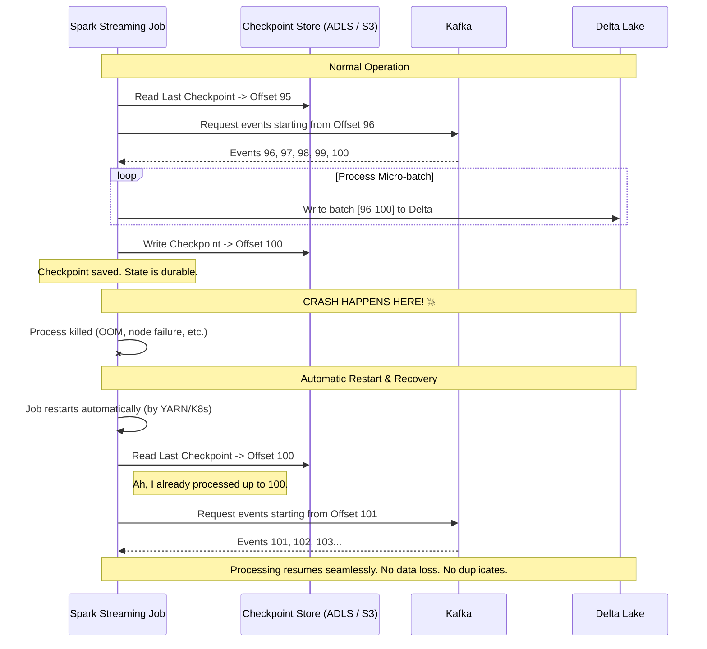

# 05 - Data Pipeline Resilience: Architect Master Guide

> **Building Data Systems That Survive Production Reality**
> *Target Audience: Principal Data Architects & Staff Engineers*

---

## 1. Concept Breakdown

### What is Data Pipeline Resilience?

Let me start with a simple question: **What happens when your data pipeline breaks at 3 AM?**

**Data Pipeline Resilience** is the answer to that question. It is the ability of a data system to:
1.  **Continue operating correctly** even when parts of it fail.
2.  **Recover to a consistent state** automatically when failures occur.
3.  **Not lose any data** during failures.

Think of it like this: A non-resilient pipeline is like a chain of dominos. If one falls, everything stops. A resilient pipeline is like a highway system. If one road is blocked, traffic is rerouted, and the system keeps flowing.

---

### Why Does Resilience Matter? (The FAANG Reality)

At small scale, you might process 1,000 records a day. If something fails, you check the logs, fix the bug, and re-run. Easy.

At FAANG scale, you process **billions of records per day**. Consider this math:

| Metric | Value |
| :--- | :--- |
| Records per day | 1,000,000,000 (1 Billion) |
| Success rate | 99.99% (which sounds great!) |
| **Failures per day** | **100,000 failures** |

Even with a 99.99% success rate, you have **100,000 failures every single day**. You cannot have a human look at each one. The system must handle them automatically. That is resilience.

---

### The Three Pillars of Resilience (Explained in Detail)

Every resilient system is built on three pillars. Understanding these deeply is the key to designing robust pipelines.

#### Pillar 1: Fault Tolerance
> **"The system keeps running even when parts of it break."**

**What it means**: If one server crashes, another takes over. If one network call fails, the system retries. The user (or downstream system) may not even notice a failure occurred.

**How it works (Mechanisms)**:
*   **Redundancy**: Having backup copies. Example: Kafka stores data on 3 brokers (replicas). If one broker dies, 2 others have the data.
*   **Isolation (Bulkheads)**: Separating systems so one failure doesn't cascade. Example: Your "critical orders" pipeline runs on a separate cluster from the "marketing analytics" pipeline. If marketing crashes, orders are unaffected.
*   **Timeouts**: If you call an API and it doesn't respond in 5 seconds, you don't wait forever. You give up and handle the error.

**Real-World Example**: Netflix. When their recommendation service fails, they don't show a "broken" page. They show a generic "Top 10" list instead. The user gets a degraded but functional experience.

---

#### Pillar 2: Recoverability
> **"The system can go back to a known-good state after a failure."**

**What it means**: Imagine you are writing a novel. You write 10 chapters. Your computer crashes. If you saved after every chapter, you only lose the unsaved work from chapter 10. If you never saved, you lose everything.

**How it works (Mechanisms)**:
*   **Checkpointing**: Periodically saving your progress. A Spark Streaming job writes "I have processed up to offset 12345" to a file. If it crashes, it reads that file on restart and picks up from offset 12346. It does NOT re-process everything from the beginning.
*   **Idempotency**: Designing operations so that running them twice produces the same result as running them once. Example: `SET balance = 100` is idempotent. `ADD 10 to balance` is NOT idempotent (running it twice adds 20).
*   **Transaction Logs**: Keeping a record of every single change. If something goes wrong, you can "replay" the log to reconstruct the state.

**Real-World Example**: Video games with "save points." If your character dies, you restart from the last save point, not from the beginning of the game.

---

#### Pillar 3: Observability
> **"You can see exactly what is happening inside the system."**

**What it means**: A resilient system fails gracefully, but you still need to *know* it failed, *where* it failed, and *why*. You can't fix what you can't see.

**How it works (Mechanisms)**:
*   **Logging**: Writing detailed messages. `"Processing record 123... Success"`. `"Processing record 124... ERROR: Field 'email' is null"`.
*   **Metrics**: Numerical measurements over time. "Number of records processed per minute." "Average processing latency in milliseconds." "Number of errors in the last hour."
*   **Tracing**: Following a single record's journey through multiple services. "Record 123 entered Kafka at 10:00:01, was processed by Spark at 10:00:03, was written to Delta Lake at 10:00:05."
*   **Alerting**: Automatically notifying you when something goes wrong. "Alert: Error rate exceeded 1% in the last 10 minutes."

**Real-World Example**: The dashboard in your car. It shows speed, fuel level, engine temperature. If the engine overheats, a warning light turns on. Without the dashboard, you would drive until the engine explodes.

---

### The "Distributed Systems Tax" (Why This is Harder Than It Looks)

In a simple Python script on your laptop, a function call either works or throws an exception. It's synchronous and predictable.

In a distributed data pipeline, a single event might travel like this:

```
Your App -> Kafka (Network call 1) -> Spark (Network call 2) -> External API (Network call 3) -> Delta Lake on ADLS (Network call 4)
```

Each of those network calls can:
1.  **Succeed**.
2.  **Fail completely** (server is down).
3.  **Partially fail** (server received the request, but the response got lost in the network).
4.  **Succeed slowly** (takes 30 seconds instead of 0.1 seconds).

The "partial failure" case is the worst. Did the API process your request or not? You don't know. If you retry, you might process it twice (duplicate data). If you don't retry, you might lose it. **This is why resilience engineering is complex.**

---

## 2. The Core Analogy: Your Pipeline is Like a Package Delivery System

Forget multiple analogies. Let's use **one powerful mental model** that maps perfectly to data pipelines: **A Package Delivery Service (like Amazon or FedEx)**.

---

### The Mapping

| Delivery System Concept | Pipeline Equivalent | What It Does |
| :--- | :--- | :--- |
| **The Package** | **A Data Record / Event** | The thing you're moving from A to B. |
| **Warehouse (Sorting Facility)** | **Kafka / Message Queue** | Packages wait here before delivery. If a truck breaks, packages are safe in the warehouse. |
| **Tracking Number** | **Offset / Checkpoint** | Tells you exactly where the package is in the journey. If something goes wrong, you know where to look. |
| **"Package Could Not Be Delivered" Slip** | **Dead Letter Queue (DLQ)** | The address was wrong (bad data). Package goes to a holding area for manual investigation, not thrown away. |
| **Delivery Retry** | **Retry with Backoff** | "Nobody home, will try again tomorrow." Temporary problem, try again. |
| **"Fragile - Handle With Care"** | **Schema Validation** | Ensures the package (data) meets certain criteria before processing. |
| **Multiple Trucks** | **Parallel Executors / Kafka Partitions** | If one truck breaks down, others keep delivering. System doesn't stop. |

**The Key Insight**: Amazon doesn't throw away a package because one address was wrong. They don't stop all trucks because one broke down. They **isolate failures** and **keep the system running**. Your pipeline should do the same.

---

## 3. Architecture & Design Patterns (Deep Dive)

This section explains each resilience pattern **in plain language**, with terminology defined clearly.

---

### ⚠️ First: Key Terminology Glossary

Before diving into patterns, let's define the terms you'll see everywhere:

| Term | Plain English Definition | Example |
| :--- | :--- | :--- |
| **Transient Failure** | A temporary problem that will fix itself if you wait and try again. | Network timeout, server briefly overloaded. |
| **Permanent Failure** | A problem that will NEVER succeed no matter how many times you retry. | Bad data format, missing required field. |
| **Idempotent** | Running something twice gives the same result as running it once. | `SET x = 5` is idempotent. `x = x + 1` is NOT. |
| **Checkpoint** | A saved "bookmark" of your progress so you can resume from here, not from the beginning. | Spark saves "I processed up to record #1000." |
| **Offset** | A position in a stream (like Kafka). Each message has a number. | Message 100, Message 101, Message 102... |
| **Consumer Lag** | How far behind your processor is from the newest message. | "There are 5000 messages I haven't read yet." |
| **Backpressure** | When downstream is slower than upstream, causing a traffic jam. | Producer sends 1000 msg/sec, consumer reads 100 msg/sec. |
| **Cascading Failure** | One failure causes another, which causes another, like falling dominoes. | API is slow → your app waits → memory fills up → OOM crash. |
| **DLQ (Dead Letter Queue)** | A special place to put "failed" messages so they don't block the main flow. | Like a "lost and found" bin for bad data. |

---

### Pattern A: Retry with Exponential Backoff

**What Problem Does This Solve?**

Transient (temporary) failures. The server is briefly busy. The network hiccuped. If you just wait a moment and try again, it will probably work.

---

**The Scenario (Step-by-Step):**

Imagine you're calling an API to get user details:

```
Step 1: Call API → Response: "503 Service Unavailable" (Server is busy)
        ❌ Failed!
        
Step 2: Wait 1 second. Try again.
        Call API → Response: "503 Service Unavailable"
        ❌ Failed again!

Step 3: Wait 2 seconds. Try again. (Wait time DOUBLES each time = "Exponential")
        Call API → Response: "503 Service Unavailable"
        ❌ Failed again!

Step 4: Wait 4 seconds. Try again.
        Call API → Response: "200 OK" with user data
        ✅ Success! Continue processing.

If after 5 attempts it still fails → Give up and report an error.
```

---

**Why "Exponential"? Why not just wait 1 second every time?**

Imagine 1000 users all call the API at the same time. The server fails.

*   **Bad approach (Fixed retry)**: All 1000 users wait 1 second, then ALL hit the server again at the exact same time. The server fails again. Repeat forever.
*   **Good approach (Exponential + Jitter)**: User A waits 1.2 seconds. User B waits 0.9 seconds. User C waits 2.5 seconds. The retries are SPREAD OUT, giving the server time to recover.

**Jitter** = Adding randomness to the wait time so not everyone retries at the same moment.

---

**When to Use This Pattern:**
*   ✅ Calling external APIs or HTTP services
*   ✅ Network operations (reading from S3, Azure Blob)
*   ✅ Database connections that might time out

**When NOT to Use:**
*   ❌ If the error is "400 Bad Request" (your data is wrong—retrying won't help)
*   ❌ If the error is "401 Unauthorized" (your password is wrong—retrying won't help)

---

**📦 Batch Example: Spark Job Reading Files from S3**

```python
# Your Spark batch job reads 1000 Parquet files from S3
# Sometimes S3 returns "503 SlowDown" when throttled

from tenacity import retry, stop_after_attempt, wait_exponential

@retry(
    stop=stop_after_attempt(5),
    wait=wait_exponential(multiplier=1, min=2, max=60)
)
def read_file_from_s3(file_path):
    """
    If S3 throttles us, wait and retry.
    Attempt 1: Wait 2 seconds
    Attempt 2: Wait 4 seconds
    Attempt 3: Wait 8 seconds... up to 60 seconds max
    """
    return spark.read.parquet(file_path)

# Usage in batch job
for file_path in list_of_1000_files:
    df = read_file_from_s3(file_path)  # Retries automatically!
    process_and_write(df)
```

---

### Pattern B: Dead Letter Queue (DLQ)

**What Problem Does This Solve?**

Permanent failures. A record has bad data. No matter how many times you retry, it will NEVER succeed. You need to move it aside so it doesn't block everyone else.

---

**The Scenario (Step-by-Step):**

```
Your pipeline reads messages from Kafka:

Message 100: {"user_id": 1, "email": "alice@example.com"}
        → Process → ✅ Success! Write to database.

Message 101: {"user_id": 2, "email": null}  ← ⚠️ EMAIL IS MISSING!
        → Process → ❌ Error! Email is required.
        → Retry 1 → ❌ Same error (data hasn't changed)
        → Retry 2 → ❌ Same error
        → Retry 3 → ❌ Same error
        
        At this point, what do you do?
        
        ❌ BAD OPTION: Crash the whole pipeline. Now nobody gets their data.
        
        ✅ GOOD OPTION: Write Message 101 to the "Dead Letter Queue" (DLQ).
                        Move on to Message 102.
                        An engineer will look at the DLQ later.

Message 102: {"user_id": 3, "email": "charlie@example.com"}
        → Process → ✅ Success! Pipeline keeps running.
```

---

**What is a DLQ, physically?**

It's just another storage location. It could be:
*   A separate Kafka topic (e.g., `my-topic-dlq`)
*   A database table (e.g., `failed_records`)
*   A folder in S3 (e.g., `s3://my-bucket/dlq/`)

The key is: **Bad records go here, not into your main output.**

---

**What happens to records in the DLQ?**

1.  An alert tells engineers "Hey, there are 50 records in the DLQ."
2.  An engineer investigates: "Oh, the upstream system sent null emails. I'll fix their bug."
3.  Once fixed, you can **manually re-process** the DLQ records or discard them.

---

**When to Use This Pattern:**
*   ✅ Any streaming pipeline (Kafka, Event Hubs)
*   ✅ Batch pipelines where one bad file shouldn't stop 10,000 good files

---

**📦 Batch Example: Processing 10,000 Files with Bad Files Quarantined**

```
Scenario: Your daily batch job processes 10,000 CSV files.

File 1:    users_001.csv → Parse → ✅ Success! Write to Data Lake.
File 2:    users_002.csv → Parse → ✅ Success! Write to Data Lake.
File 3:    users_003.csv → Parse → ❌ Error! File is CORRUPT (truncated)
        
        ❌ BAD DESIGN: Crash entire job. 9,997 good files don't get processed.
        
        ✅ GOOD DESIGN: 
           1. Move users_003.csv to /quarantine/bad_files/
           2. Log the error with details
           3. Continue to File 4...

File 4:    users_004.csv → Parse → ✅ Success!
...
File 10000: users_10000.csv → Parse → ✅ Success!

End of Job:
        - 9,998 files processed successfully
        - 2 files in /quarantine/bad_files/
        - Alert sent: "2 files failed. Check quarantine folder."
```

**Spark Batch Code with badRecordsPath (Built-in DLQ):**

```python
# Spark has a BUILT-IN DLQ feature for batch jobs!
df = spark.read \
    .option("mode", "PERMISSIVE") \
    .option("badRecordsPath", "/data/quarantine/bad_records/") \
    .csv("/data/raw/users/*.csv")

# Good records → df (continue processing)
# Bad records → /data/quarantine/bad_records/ (for later investigation)
```

**Airflow DAG with DLQ Folder:**

```python
# In an Airflow batch pipeline
def process_file(file_path):
    try:
        df = pd.read_csv(file_path)
        transform_and_load(df)
        move_file(file_path, "/processed/")
    except Exception as e:
        # DLQ: Move bad files to quarantine
        move_file(file_path, "/quarantine/")
        log_error(file_path, str(e))
```

---

### Pattern C: Circuit Breaker

**What Problem Does This Solve?**

Cascading failures. A downstream service is not just slow—it's dying. And your retries are making it WORSE by hammering it with requests.

---

**Real-World Analogy:**

Think of the electrical circuit breaker in your home. If there's a power surge, the breaker "trips" and cuts off electricity. This prevents a fire. You have to manually reset it.

---

**The Scenario (Step-by-Step):**

```
Your pipeline calls an "Email Service" API for every record:

Normal Operation (Circuit: CLOSED):
        Record 1 → Call Email API → ✅ Success
        Record 2 → Call Email API → ✅ Success
        Record 3 → Call Email API → ✅ Success

Email Service Starts Failing (Circuit: Still CLOSED, counting failures):
        Record 4 → Call Email API → ❌ Timeout (Failure #1)
        Record 5 → Call Email API → ❌ Timeout (Failure #2)
        Record 6 → Call Email API → ❌ Timeout (Failure #3)
        Record 7 → Call Email API → ❌ Timeout (Failure #4)
        Record 8 → Call Email API → ❌ Timeout (Failure #5)
        
        🚨 5 failures in 10 seconds! CIRCUIT OPENS!

Circuit is OPEN (Protecting the dying service):
        Record 9 → DO NOT call Email API. Immediately return error.
        Record 10 → DO NOT call Email API. Immediately return error.
        Record 11 → DO NOT call Email API. Immediately return error.
        
        (This gives the Email Service time to recover without being hammered)

After 30 seconds, Circuit goes to HALF-OPEN (Testing):
        Record 12 → Call Email API (ONE test request)
        
        If ✅ Success → Circuit CLOSES. Back to normal.
        If ❌ Failure → Circuit stays OPEN for another 30 seconds.
```

---

**Why is this important?**

Without a circuit breaker:
1.  Email service is slow (2-second response time instead of 0.1 seconds).
2.  Your pipeline keeps calling it, waiting 2 seconds each time.
3.  Records pile up. Memory usage climbs.
4.  Eventually, your pipeline runs out of memory (OOM) and crashes.
5.  Now TWO services are down instead of one.

**The Circuit Breaker stops the bleeding** by failing fast and not wasting time on a dying service.

---



---

### Pattern D: Checkpointing

**What Problem Does This Solve?**

Your job crashes. When it restarts, where does it pick up from?

---

**The Scenario (Without Checkpointing):**

```
Job starts. Reads 10,000 records from Kafka.
        Processes record 1... 2... 3... ... 5000...
        
        💥 CRASH! (Out of memory, network failure, etc.)

Job restarts.
        "I have no idea where I was. I'll start from the beginning."
        Reads records 1... 2... 3... (records 1-5000 are processed AGAIN)
```

This is bad because:
*   You waste time reprocessing.
*   If your sink is NOT idempotent, you create **DUPLICATES**.

---

**📦 Batch Example: Processing Files with Checkpointing**

```
Scenario: You have 10,000 files to process. Each file takes 1 minute.
Total time: ~7 hours.

WITHOUT CHECKPOINTING:
        Process file 1... 2... 3... ... 5000... (5 hours elapsed)
        
        💥 CRASH! (Cluster node fails)
        
        Job restarts. "I'll start from file 1."
        Process file 1... 2... 3... (Waste 5 more hours!)

WITH CHECKPOINTING:
        Process file 1... 2... 3...
        After every 100 files → Save checkpoint: 
            {"last_processed_file": "users_0100.csv"}
        
        Process 4000... 4500... 5000...
        Save checkpoint: {"last_processed_file": "users_5000.csv"}
        
        💥 CRASH!
        
        Job restarts. Read checkpoint: "I left off at file 5000."
        Resume from file 5001. (Save 5 hours!)
```

**Airflow Checkpointing (Using XCom or External State):**

```python
# Airflow DAG with checkpointing using Variables
from airflow.models import Variable

def process_files_with_checkpoint():
    # Read last checkpoint
    last_processed = Variable.get("last_processed_file", default_var="")
    
    all_files = list_files("/data/raw/")
    remaining = [f for f in all_files if f > last_processed]
    
    for file_path in remaining:
        process_file(file_path)
        
        # Save checkpoint after each file (or every N files)
        Variable.set("last_processed_file", file_path)
```

**Spark Batch Checkpointing (Track Progress in Delta Table):**

```python
# Store processing state in a Delta "control table"
def process_with_checkpoint(files_to_process):
    # Read last checkpoint from control table
    control_df = spark.read.table("processing_control")
    last_processed = control_df.select("last_file").first()[0]
    
    # Resume from where we left off
    remaining = [f for f in files_to_process if f > last_processed]
    
    for file_path in remaining:
        df = spark.read.parquet(file_path)
        process_and_write(df)
        
        # Update checkpoint
        spark.sql(f"""
            UPDATE processing_control 
            SET last_file = '{file_path}', 
                updated_at = current_timestamp()
        """)
```

---

**The Scenario (With Checkpointing):**

```
Job starts. Saves checkpoint: "I'm starting at record 0."

After processing record 1000:
        Save checkpoint: "I've processed up to record 1000."

After processing record 2000:
        Save checkpoint: "I've processed up to record 2000."

... After processing record 5000:
        Save checkpoint: "I've processed up to record 5000."
        
        💥 CRASH!

Job restarts.
        Read checkpoint: "I left off at record 5000."
        Continue from record 5001. (No duplicates!)
```

---

**Where is the checkpoint stored?**

*   Cloud storage (Azure Blob, S3, ADLS)
*   A database table
*   HDFS

It's usually just a small file that says: `{"last_offset": 5000}`.

---

### Pattern E: Idempotent Sinks

**What Problem Does This Solve?**

Even with checkpointing, network failures can cause a record to be written TWICE. Your sink must handle this correctly.

---

**The Scenario (Why Duplicates Happen):**

```
Step 1: Process record 1000.
Step 2: Write record 1000 to the database. ✅ Success!
Step 3: Save checkpoint: "I processed record 1000."
        
        💥 CRASH before checkpoint is saved!

Step 4: Job restarts. Reads checkpoint: "I left off at record 999."
        "Let me process record 1000 again."
        Write record 1000 to the database. (SECOND TIME!)
```

Now you have record 1000 in your database TWICE.

---

**The Solution: Idempotent Writes**

An idempotent write means: "Writing the same thing twice has no additional effect."

**Non-Idempotent (BAD):**
```sql
INSERT INTO users (id, name) VALUES (1000, 'Alice');
-- If you run this twice, you get TWO rows with id=1000.
```

**Idempotent (GOOD):**
```sql
MERGE INTO users AS target
USING (SELECT 1000 AS id, 'Alice' AS name) AS source
ON target.id = source.id
WHEN MATCHED THEN UPDATE SET name = source.name
WHEN NOT MATCHED THEN INSERT (id, name) VALUES (source.id, source.name);
-- If you run this twice, you still have ONE row with id=1000.
```

Or, simpler:
```sql
INSERT INTO users (id, name) VALUES (1000, 'Alice')
ON CONFLICT (id) DO UPDATE SET name = 'Alice';
-- PostgreSQL "UPSERT" - insert or update if exists.
```

---

### Summary: Matching Problems to Patterns

| Problem | Pattern to Use |
| :--- | :--- |
| Server is temporarily busy (transient failure) | **Retry with Exponential Backoff** |
| Data is malformed and will never succeed | **Dead Letter Queue (DLQ)** |
| Downstream service is dying and causing cascading failures | **Circuit Breaker** |
| Job crashes and needs to resume from where it stopped | **Checkpointing** |
| Same record might be written twice due to retries | **Idempotent Sink (MERGE / Upsert)** |

---

## 4. Architecture Diagrams

### High-Level Resilient Pipeline Architecture

This diagram shows how all the patterns fit together.



**Key Takeaways from the Diagram**:
*   **Kafka is the buffer**: It absorbs load spikes and allows the consumer to go down without losing data.
*   **DLQ is the hospital**: Bad records go here, not into the main sink.
*   **Checkpoint is the save point**: Allows resumption on failure.
*   **Observability is the dashboard**: Tells you what's happening.

---

### Detailed Sequence: Retry with DLQ Fallback

This shows the exact order of events when processing a single record.



---

### Failure & Recovery Flow (Checkpointing)

This shows how a crash is handled.



---

## 5. Real-Time Issues & Failure Modes

These are the problems you will actually face in production. For each, I'll explain: **Symptom** (what you see), **Root Cause** (the underlying problem), **Detection** (how you find it), and **Resolution** (how you fix it).

---

### Issue 1: The "Poison Pill" Event

**Symptom**: Your pipeline keeps crashing and restarting in an infinite loop. The consumer lag (how far behind the pipeline is) grows and grows.

**Root Cause**: A single event in the queue has malformed data (e.g., a field that should be an integer is a string like `"N/A"`). Your processing code throws an exception. The job fails. On restart, it reads the *same* event (because the offset was never committed). It fails again. Forever.

**Detection**:
*   Alert: Job restart count > 5 in 10 minutes.
*   Alert: Consumer lag growing continuously.
*   Logs: The same error message appearing repeatedly for the same offset.

**Resolution**:
*   **Short-term**: Manually skip the bad offset (risky, can lose data).
*   **Long-term (Correct)**: Implement the **DLQ pattern**. Wrap your processing logic in a `try-except`. If an exception is not retryable (e.g., data format error), write the event to the DLQ and commit the offset.

---

### Issue 2: Cascading Failure ("The Domino Effect")

**Symptom**: One seemingly unrelated service goes down (e.g., an email notification service). Suddenly, your core data pipeline starts timing out and failing.

**Root Cause**: Your pipeline makes a synchronous, blocking call to the email service for every record. When the email service is slow, your pipeline is slow. When the email service is down, your pipeline is stuck waiting for timeouts, causing a massive backlog. The backlog causes memory pressure. Memory pressure causes OOMs. Everything crashes.

**Detection**:
*   Correlation: Notice that multiple services failed at roughly the same time.
*   Latency P99: A spike in latency for calls to the email service.
*   Resource exhaustion: Spark executor memory usage at 100%.

**Resolution**:
*   **Timeouts**: Set aggressive timeouts on external calls (e.g., 5 seconds max).
*   **Circuit Breaker**: If the email service fails 5 times in a row, stop calling it for 30 seconds.
*   **Async / Decouple**: Don't call the email service directly. Write a message to an email queue. Let a separate email worker process it asynchronously.

---

### Issue 3: Checkpoint Corruption / Lag Death Spiral

**Symptom**: Your Spark Structured Streaming job falls further and further behind. Processing time per batch keeps increasing.

**Root Cause**: Your checkpoint store (e.g., Azure Blob Storage) is slow or the checkpoint data is very large (lots of state). Writing the checkpoint takes longer than your trigger interval. So, each batch takes longer than the time allocated for it. You fall behind. The more you fall behind, the larger the batches become. The larger the batches, the longer the checkpoint takes. Death spiral.

**Detection**:
*   Spark Streaming UI: `processingTime` > `triggerInterval` for sustained periods.
*   Consumer Lag: Continuously growing.

**Resolution**:
*   Increase `trigger(processingTime="...")` to a larger value.
*   Use faster checkpoint storage (e.g., local SSD on the driver, then async copy to cloud).
*   Reduce state: If you have stateful operations (aggregations, joins), ensure state is pruned using watermarks.
*   Scale up: Add more executors to process batches faster.

---

### Issue 4: Silent Data Corruption (The Scariest One)

**Symptom**: No errors in logs. No job failures. But downstream users report that the numbers in the reports are wrong.

**Root Cause**: A subtle bug in the transformation logic. For example, instead of `COALESCE(value, 0)`, you wrote `COALESCE(0, value)`, so all values became 0. The job ran successfully without exceptions. But the output data is incorrect.

**Detection**:
*   **Data Quality Tests**: Automated tests that run after every pipeline execution.
    *   Row count tests: "Output row count should be within 5% of input row count."
    *   Null checks: "Column `user_id` should have 0 nulls."
    *   Referential integrity: "All `order_ids` in `fact_orders` must exist in `dim_orders`."
    *   Statistical checks: "Average order value should be between $50 and $500."
*   **Tools**: Great Expectations, dbt tests, Soda, Monte Carlo.

**Resolution**:
*   Implement data quality checks as a mandatory step in the pipeline *before* data is made available to consumers.
*   Use schema enforcement (`spark.read.schema(...).option("mode", "FAILFAST")`) to catch type mismatches.
*   Implement data lineage so you can trace where bad data came from.

---

## 6. Real-Time Scenarios & Interview Questions

These are the kinds of questions you'll get in a FAANG System Design interview. I've included "trick" elements that separate Staff engineers from mid-level engineers.

---

### Scenario 1: The Corrupt File

**Interviewer**: "Your daily pipeline processes 10,000 Parquet files, totaling 500 billion rows. One day, one of the 10,000 files is corrupt (maybe truncated due to an upstream failure). What happens? How do you design for this?"

**Weak Answer**: "The job fails. We alert the on-call engineer. They delete the bad file and re-run."

**Strong Answer**: "My design should handle this automatically without manual intervention.
1.  **Fail-Fast with Isolation**: I would NOT read all files in one go. I would read them in smaller batches or one at a time. If a file fails to parse, the error is isolated to that file only.
2.  **Bad Records Path**: I use Spark's `badRecordsPath` option. `spark.read.option('badRecordsPath', '/path/to/quarantine/')`. Corrupt files (or records within files) are written to the quarantine path. The rest of the job succeeds.
3.  **Alerting**: I set up an alert if *any* records are written to the quarantine path. An engineer can then investigate the root cause asynchronously.
4.  **Reprocessing**: The quarantine path is my DLQ for files. Once the upstream issue is fixed, I re-process only those files."

**Trick element**: The interviewer wants to see if you understand **graceful degradation**. A single bad file should not block 499,999,999,999 good records.

---

### Scenario 2: Exactly-Once Semantics

**Interviewer**: "How do you achieve exactly-once processing in your streaming pipeline?"

**Weak Answer**: "Kafka supports exactly-once semantics."

**Strong Answer**: "True end-to-end exactly-once is tricky. The key insight is that 'exactly-once' is *usually* achieved by combining **at-least-once delivery** with an **idempotent sink**.

1.  **Kafka guarantees at-least-once**: With proper offset management and `enable.auto.commit=false`, Kafka ensures I won't lose messages. But on failure/retry, I might receive the same message twice.
2.  **Idempotent Sink is my responsibility**: My sink must handle duplicates gracefully.
    *   For a data lake (Delta/Iceberg): I use `MERGE INTO ... WHEN MATCHED THEN UPDATE ... WHEN NOT MATCHED THEN INSERT`. If the record already exists (by primary key), it's updated, not duplicated.
    *   For an API call: I include a unique `request_id` (derived from the Kafka offset or a record ID). The API, if well-designed, is idempotent on `request_id` and ignores duplicates.
3.  **Transactionality (Kafka Transactions)**: For Kafka-to-Kafka pipelines, Kafka Transactions allow atomic "read-process-write" semantics (`isolation.level=read_committed`). This is true exactly-once within Kafka but requires the consumer to also be idempotent for sinks outside Kafka."

**Trick element**: The interviewer wants you to move beyond buzzwords. "Kafka exactly-once" is a marketing term. The real engineering is in designing idempotent sinks.

---

### Scenario 3: The 2-Hour Outage Recovery

**Interviewer**: "A critical pipeline has been down for 2 hours due to a cluster failure. How do you recover without losing data?"

**Strong Answer**: "The recovery depends on my checkpointing strategy.

1.  **Check the Checkpoint**: First, I look at the last committed checkpoint. If it's healthy and points to offset X, my job will automatically resume from offset X+1 when it restarts.
2.  **Investigate the Lag**: I check the source (Kafka). What's the oldest message available? If Kafka retention is set to 7 days, my 2-hour backlog is tiny. I can just restart the job, and it will catch up.
3.  **Restart the Job**: I restart the job. It reads the checkpoint, asks Kafka for data from offset X+1, and begins processing. Because my sink is idempotent, even if there's some overlap in processing, the final data will be correct.
4.  **Monitor the Catch-Up**: I watch the consumer lag metric. It should be decreasing rapidly as the job catches up.

**If the checkpoint is corrupt (rare, but bad)**:
*   I need to perform a **backfill**.
*   I identify the time window of the outage (e.g., 10 AM to 12 PM).
*   I run a separate batch job that reads historical data from the source for that specific window.
*   I use `MERGE` to load this data into the sink, ensuring idempotency."

---

## 7. Code Snippets

### Python: Retry with Exponential Backoff (Detailed)

This is a production-quality retry decorator you can use.

```python
import time
import random
import logging
from functools import wraps

logger = logging.getLogger(__name__)

def retry_with_exponential_backoff(
    max_retries: int = 3,
    base_delay_seconds: float = 1.0,
    max_delay_seconds: float = 60.0,
    exponential_base: float = 2.0,
    jitter: bool = True,
    retryable_exceptions: tuple = (Exception,)
):
    """
    A decorator that retries a function with exponential backoff.

    Args:
        max_retries: Maximum number of retry attempts.
        base_delay_seconds: The initial delay before the first retry.
        max_delay_seconds: The maximum delay between retries.
        exponential_base: The base for exponential growth (e.g., 2 means delays double).
        jitter: If True, add randomness to the delay to prevent thundering herds.
        retryable_exceptions: A tuple of exception types that should trigger a retry.
    """
    def decorator(func):
        @wraps(func)
        def wrapper(*args, **kwargs):
            last_exception = None
            for attempt in range(max_retries + 1):  # +1 for the initial attempt
                try:
                    return func(*args, **kwargs)
                except retryable_exceptions as e:
                    last_exception = e
                    if attempt == max_retries:
                        logger.error(f"Function '{func.__name__}' failed after {max_retries} retries.")
                        raise  # Re-raise the last exception

                    # Calculate delay
                    delay = min(
                        base_delay_seconds * (exponential_base ** attempt),
                        max_delay_seconds
                    )
                    if jitter:
                        delay = delay * (0.5 + random.random())  # Add 0% to 50% jitter

                    logger.warning(
                        f"Attempt {attempt + 1} for '{func.__name__}' failed with {type(e).__name__}. "
                        f"Retrying in {delay:.2f} seconds..."
                    )
                    time.sleep(delay)
            # This point should never be reached, but just in case
            raise last_exception
        return wrapper
    return decorator


# --- Example Usage ---

import requests

@retry_with_exponential_backoff(
    max_retries=5,
    base_delay_seconds=2.0,
    retryable_exceptions=(requests.exceptions.RequestException,)
)
def call_external_api(user_id: str) -> dict:
    """Calls an external API to get user data."""
    response = requests.get(f"https://api.example.com/users/{user_id}", timeout=10)
    response.raise_for_status()  # Raises HTTPError for 4xx/5xx responses
    return response.json()

# This call will automatically retry on network errors
# user_data = call_external_api("user-123")
```

---

### PySpark: Dead Letter Queue Pattern (Detailed)

This shows how to process a DataFrame where some records might fail.

```python
from pyspark.sql import DataFrame, SparkSession
from pyspark.sql.functions import col, lit, current_timestamp, struct, to_json
from pyspark.sql.types import StringType

def process_with_dlq(
    spark: SparkSession,
    input_df: DataFrame,
    transform_func,
    sink_path: str,
    dlq_path: str,
    id_column: str = "id"
):
    """
    Processes a DataFrame row by row (conceptually, via mapPartitions).
    Successful rows are written to the sink.
    Failed rows are written to a Dead Letter Queue (DLQ).

    In real production, you'd use foreachPartition for efficiency.
    This is a simplified example for clarity.
    """
    from pyspark.sql import Row

    def process_partition(partition_iter):
        for row in partition_iter:
            try:
                # Apply the transformation logic
                transformed_row = transform_func(row)
                yield ("success", transformed_row, None)
            except Exception as e:
                # Capture the error and the original row
                yield ("failure", row, str(e))

    # Apply the processing and capture results
    # Note: Using RDD for row-level try-except. This can also be done with UDFs that return error info.
    result_rdd = input_df.rdd.mapPartitions(process_partition)

    # Convert back to DataFrame
    # Schema: (status: string, data: Row, error: string or None)
    result_df = spark.createDataFrame(
        result_rdd,
        schema=["status", "data", "error_message"]
    )

    # --- Write Successes to Sink ---
    success_df = result_df.filter(col("status") == "success").select("data.*")
    success_df.write.mode("append").parquet(sink_path)
    print(f"SUCCESS: Wrote {success_df.count()} records to {sink_path}")

    # --- Write Failures to DLQ ---
    failure_df = result_df.filter(col("status") == "failure") \
        .select(
            col("data.*"),  # The original row
            col("error_message"),
            current_timestamp().alias("failed_at"),
            lit("my_pipeline").alias("source_pipeline")
        )

    if failure_df.count() > 0:
        failure_df.write.mode("append").parquet(dlq_path)
        print(f"DLQ: Wrote {failure_df.count()} failed records to {dlq_path}")
        # In production, also send an alert here!
    else:
        print("SUCCESS: No failures. DLQ is empty for this batch.")


# --- Example Transform Function ---
def my_transform(row):
    """
    Example transform that fails if email is null.
    """
    if row["email"] is None:
        raise ValueError(f"Email is required for user_id: {row['user_id']}")
    # ... do some transformation ...
    return row


# --- How to call it ---
# input_df = spark.read.parquet("s3://my-bucket/raw-users/")
# process_with_dlq(
#     spark=spark,
#     input_df=input_df,
#     transform_func=my_transform,
#     sink_path="s3://my-bucket/processed-users/",
#     dlq_path="s3://my-bucket/dlq/users/",
#     id_column="user_id"
# )
```

---

### Anti-Pattern vs. Best Practice

**❌ ANTI-PATTERN: Swallowing Exceptions**

```python
# This is DANGEROUS. You are losing data silently.
def process_record(record):
    try:
        result = complex_transformation(record)
        return result
    except Exception:
        pass  # <--- THE BUG: The error is swallowed. The record is lost.
              # Nobody knows it failed. No alert. No log. Data just vanishes.
    # If an exception occurs, this returns None implicitly.
    # Downstream, you might filter out Nones and never realize you lost data.
```

**✅ BEST PRACTICE: Explicit Error Handling**

```python
import logging

logger = logging.getLogger(__name__)

# Define a dedicated exception for expected data issues
class DataValidationError(Exception):
    pass

def process_record_correctly(record, dlq_writer):
    """
    Processes a record with explicit error handling.
    - Expected data errors (like validation) -> go to DLQ.
    - Unexpected errors (like OOM, bugs) -> crash loudly so we can fix them.
    """
    try:
        # Validate the record first
        if record.get("user_id") is None:
            raise DataValidationError("user_id is required")

        # Do the transformation
        result = complex_transformation(record)
        return result

    except DataValidationError as e:
        # Expected error: This record is bad. Quarantine it.
        logger.warning(f"Validation failed for record {record.get('id')}: {e}")
        dlq_writer.write(record, error=str(e))
        return None  # Explicitly signal that this record was not processed

    except Exception as e:
        # Unexpected error: This is a bug! Crash the job so someone investigates.
        logger.error(f"Unexpected critical error processing record {record.get('id')}: {e}")
        raise  # <--- Re-raise the exception. Let the job fail. Let alerts fire.
```

---

## 8. Comparisons & Decision Matrix

Use this table to decide which pattern to apply for a given problem.

| Feature / Metric | Retry (Exponential Backoff) | Dead Letter Queue (DLQ) | Circuit Breaker | Saga |
| :--- | :--- | :--- | :--- | :--- |
| **Best for what type of failure?** | Transient (network blip, brief server overload) | Permanent (bad data, schema mismatch) | Systemic (downstream service is overwhelmed/dying) | Distributed Transaction (multi-step business logic across services) |
| **Does it block the pipeline?** | Yes (during retries) | No (failures are sidelined) | No (requests fail fast) | Partially (compensations take time) |
| **Operational Complexity** | Low | Medium (need to manage DLQ) | Medium (need to tune thresholds) | Very High (need to design all compensations) |
| **Risk of Data Loss?** | Low (if idempotent sink) | Low (data is in DLQ) | Medium (requests are dropped) | Low (compensations restore state) |
| **Example Implementation** | Python `tenacity` library | Kafka DLQ topic, S3 quarantine folder | `resilience4j` (Java), `pybreaker` (Python) | Temporal.io, AWS Step Functions |
| **When NOT to use** | When the failure is permanent (bad data) | When you can't tolerate any delay in error investigation | When downstream failures are rare and transient | When you need synchronous consistency |

---

## 9. Production Best Practices

### ✅ Pre-Production Checklist

Before deploying any pipeline to production, ask yourself these questions:

- [ ] **Idempotency**: If the job runs twice with the same data, will the output be correct (no duplicates)?
- [ ] **Checkpointing**: If the job crashes mid-way, will it resume from where it left off, not from the beginning?
- [ ] **DLQ**: If a single record is malformed, does the entire pipeline fail, or is the bad record quarantined?
- [ ] **Timeouts**: Does every external call (API, database) have an explicit timeout set? (Never wait forever!)
- [ ] **Alerting**: Are there alerts for: job failure, consumer lag, DLQ depth, error rate?
- [ ] **Rollback Plan**: If bad data is written, can you restore the table to a previous version (e.g., Delta Time Travel)?

---

### 🛠️ Tooling Recommendations

| Category | Recommended Tools |
| :--- | :--- |
| **Orchestration** | Apache Airflow, Dagster, Prefect, Azure Data Factory |
| **Streaming** | Apache Kafka, Azure Event Hubs, Apache Flink, Spark Structured Streaming |
| **Retry / Circuit Breaker (Python)** | `tenacity`, `pybreaker`, `backoff` |
| **Retry / Circuit Breaker (Java)** | `resilience4j` |
| **Data Quality** | Great Expectations, dbt tests, Soda Core, Monte Carlo |
| **Observability** | Datadog, Prometheus + Grafana, Azure Monitor, New Relic |
| **Saga Orchestration** | Temporal.io, AWS Step Functions, Apache Airflow |

---

### 💰 Cost Implications

*   **DLQs increase storage costs**: If you're not careful, old failed events accumulate. Implement a **retention policy** (e.g., delete DLQ data older than 30 days). Or, periodically move DLQ data to cheaper "cold" storage.
*   **Retries increase compute costs**: If you set max_retries=10 with a 30-second delay, a failing batch might take 5 extra minutes. At scale, this adds up. Tune aggressively.
*   **Frequent Checkpointing increases I/O costs**: Each checkpoint is a write to cloud storage. If you checkpoint every 100ms, that's a lot of writes. Balance durability vs. cost. For most pipelines, checkpointing every 30-60 seconds is sufficient.

---

### 🔒 Security Implications

*   **DLQ contains production data**: Treat your DLQ with the same security as your production data. Apply encryption at rest and in transit. Restrict access controls.
*   **Error messages can leak PII**: `"User john.doe@email.com has an invalid account"` logged to your monitoring system could be a data breach. Sanitize logs. Log `"User [user_abc123] has an invalid account"` instead.
*   **Retry credentials**: If you're retrying a call to an authenticated API, ensure your credentials are stored securely (e.g., in a secrets manager) and not hardcoded.

---

## 10. What to Remember for Interviews (The Cheat Sheet)

### The "DOCTOR" Mnemonic

A healthy pipeline needs a **DOCTOR**:

| Letter | Concept | One-Liner |
| :---: | :--- | :--- |
| **D** | **D**ead Letter Queue | Quarantine sick records so they don't infect the whole batch. |
| **O** | **O**bservability | You can't fix what you can't see (Logs, Metrics, Traces, Alerts). |
| **C** | **C**heckpointing | Save your progress so you can resume, not restart. |
| **T** | **T**imeouts | Never wait forever for a response. Set explicit deadlines. |
| **O** | **O**rdering | Handle out-of-order events (use watermarks, LSNs). |
| **R** | **R**etries | For transient failures, try again with exponential backoff. |

---

### The "Staff Engineer" One-Liner Quote

> *"Resilience is not about preventing failures; it's about designing systems that **degrade gracefully** and **recover automatically**, because at scale, failure is not a question of 'if', but 'when' and 'how often'."*

Use this in an interview when summarizing your design philosophy.

---

### Quick Problem -> Solution Recall Table

| Problem | Your Go-To Solution |
| :--- | :--- |
| Network blip / Server briefly busy | **Retry with Exponential Backoff** |
| Malformed record ("Poison Pill") | **Dead Letter Queue** |
| Downstream service is overloaded/dying | **Circuit Breaker** |
| Job crashes and needs to resume | **Checkpointing** |
| Duplicates in the output table | **Idempotent Sink (MERGE / Upsert)** |
| Multi-step transaction across services fails midway | **Saga Pattern (Compensating Transactions)** |
| Numbers in reports are wrong, but no errors in logs | **Data Quality Tests (Great Expectations)** |
