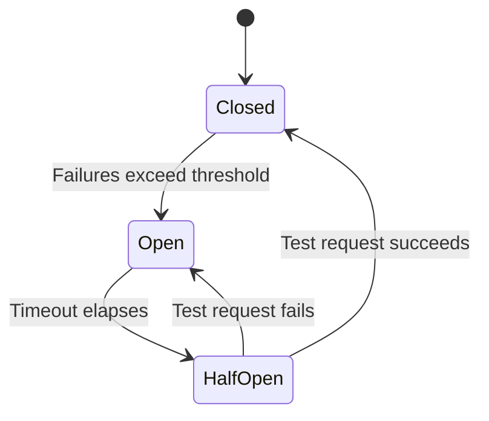

# 05 - Data Pipeline Resilience: Architect Master Guide

> **Building Data Systems That Survive Production Reality**
> *Target Audience: Principal Data Architects & Staff Engineers*

---

## 1. Concept Breakdown

### What is Data Pipeline Resilience?

Let me start with a simple question: **What happens when your data pipeline breaks at 3 AM?**

**Data Pipeline Resilience** is the answer to that question. It is the ability of a data system to:
1.  **Continue operating correctly** even when parts of it fail.
2.  **Recover to a consistent state** automatically when failures occur.
3.  **Not lose any data** during failures.

Think of it like this: A non-resilient pipeline is like a chain of dominos. If one falls, everything stops. A resilient pipeline is like a highway system. If one road is blocked, traffic is rerouted, and the system keeps flowing.

---

### Why Does Resilience Matter? (The FAANG Reality)

At small scale, you might process 1,000 records a day. If something fails, you check the logs, fix the bug, and re-run. Easy.

At FAANG scale, you process **billions of records per day**. Consider this math:

| Metric | Value |
| :--- | :--- |
| Records per day | 1,000,000,000 (1 Billion) |
| Success rate | 99.99% (which sounds great!) |
| **Failures per day** | **100,000 failures** |

Even with a 99.99% success rate, you have **100,000 failures every single day**. You cannot have a human look at each one. The system must handle them automatically. That is resilience.

---

### The Three Pillars of Resilience (Explained in Detail)

Every resilient system is built on three pillars. Understanding these deeply is the key to designing robust pipelines.

#### Pillar 1: Fault Tolerance
> **"The system keeps running even when parts of it break."**

**What it means**: If one server crashes, another takes over. If one network call fails, the system retries. The user (or downstream system) may not even notice a failure occurred.

**How it works (Mechanisms)**:
*   **Redundancy**: Having backup copies. Example: Kafka stores data on 3 brokers (replicas). If one broker dies, 2 others have the data.
*   **Isolation (Bulkheads)**: Separating systems so one failure doesn't cascade. Example: Your "critical orders" pipeline runs on a separate cluster from the "marketing analytics" pipeline. If marketing crashes, orders are unaffected.
*   **Timeouts**: If you call an API and it doesn't respond in 5 seconds, you don't wait forever. You give up and handle the error.

**Real-World Example**: Netflix. When their recommendation service fails, they don't show a "broken" page. They show a generic "Top 10" list instead. The user gets a degraded but functional experience.

---

#### Pillar 2: Recoverability
> **"The system can go back to a known-good state after a failure."**

**What it means**: Imagine you are writing a novel. You write 10 chapters. Your computer crashes. If you saved after every chapter, you only lose the unsaved work from chapter 10. If you never saved, you lose everything.

**How it works (Mechanisms)**:
*   **Checkpointing**: Periodically saving your progress. A Spark Streaming job writes "I have processed up to offset 12345" to a file. If it crashes, it reads that file on restart and picks up from offset 12346. It does NOT re-process everything from the beginning.
*   **Idempotency**: Designing operations so that running them twice produces the same result as running them once. Example: `SET balance = 100` is idempotent. `ADD 10 to balance` is NOT idempotent (running it twice adds 20).
*   **Transaction Logs**: Keeping a record of every single change. If something goes wrong, you can "replay" the log to reconstruct the state.

**Real-World Example**: Video games with "save points." If your character dies, you restart from the last save point, not from the beginning of the game.

---

#### Pillar 3: Observability
> **"You can see exactly what is happening inside the system."**

**What it means**: A resilient system fails gracefully, but you still need to *know* it failed, *where* it failed, and *why*. You can't fix what you can't see.

**How it works (Mechanisms)**:
*   **Logging**: Writing detailed messages. `"Processing record 123... Success"`. `"Processing record 124... ERROR: Field 'email' is null"`.
*   **Metrics**: Numerical measurements over time. "Number of records processed per minute." "Average processing latency in milliseconds." "Number of errors in the last hour."
*   **Tracing**: Following a single record's journey through multiple services. "Record 123 entered Kafka at 10:00:01, was processed by Spark at 10:00:03, was written to Delta Lake at 10:00:05."
*   **Alerting**: Automatically notifying you when something goes wrong. "Alert: Error rate exceeded 1% in the last 10 minutes."

**Real-World Example**: The dashboard in your car. It shows speed, fuel level, engine temperature. If the engine overheats, a warning light turns on. Without the dashboard, you would drive until the engine explodes.

---

### The "Distributed Systems Tax" (Why This is Harder Than It Looks)

In a simple Python script on your laptop, a function call either works or throws an exception. It's synchronous and predictable.

In a distributed data pipeline, a single event might travel like this:

```
Your App -> Kafka (Network call 1) -> Spark (Network call 2) -> External API (Network call 3) -> Delta Lake on ADLS (Network call 4)
```

Each of those network calls can:
1.  **Succeed**.
2.  **Fail completely** (server is down).
3.  **Partially fail** (server received the request, but the response got lost in the network).
4.  **Succeed slowly** (takes 30 seconds instead of 0.1 seconds).

The "partial failure" case is the worst. Did the API process your request or not? You don't know. If you retry, you might process it twice (duplicate data). If you don't retry, you might lose it. **This is why resilience engineering is complex.**

---

## 2. Multiple Analogies (For Deep Understanding)

Analogies help you *intuit* the concepts, not just memorize definitions.

---

### Analogy A: The Airport System (Real-World)

An international airport is one of the most resilient systems humans have built. Think about how it handles failures:

| Airport Concept | Pipeline Equivalent | What It Does |
| :--- | :--- | :--- |
| **Multiple Runways** | **Kafka Partitions / Parallel Executors** | If one runway closes for repair, planes use the others. If one Spark executor fails, others continue processing. |
| **The Terminal (Waiting Area)** | **Message Queue (Kafka)** | Passengers don't walk directly onto the tarmac. They wait in the terminal. If the plane is delayed, passengers are buffered safely. Similarly, data waits in Kafka if the downstream consumer is slow or down. |
| **Boarding Pass** | **Checkpoint / Offset** | Your boarding pass is proof of where you are in the process. If you lose your luggage, the airline uses your tag scan history to find it. Similarly, an offset tells the system "this record has been processed." |
| **Gate Change Announcements** | **Error Handling / Retry** | If there's a problem at Gate A1, they announce "Please proceed to Gate A5." The system routes around the failure. |
| **Immigration & Customs** | **Data Quality Checks** | This is a validation layer. If your passport is invalid (bad data), you are quarantined (sent to a secondary inspection / Dead Letter Queue). You don't crash the entire airport; you are just separated from the main flow. |

**The Key Insight**: The airport keeps running even when individual components fail. Planes are delayed, not canceled, whenever possible. This is **graceful degradation**.

---

### Analogy B: Git Version Control (Software Engineering)

If you've used Git, you already understand resilience.

| Git Concept | Pipeline Equivalent | What It Does |
| :--- | :--- | :--- |
| **`git commit`** | **Checkpointing** | You are saving your progress. If everything breaks, you can go back to this point. A pipeline should checkpoint after every batch. |
| **`git log`** | **Audit Trail / Logging** | A complete history of every change. You can see who did what and when. Essential for debugging. |
| **`git revert`** | **Rollback / Recovery** | If a commit introduced a bug, you revert to the previous good state. Similarly, if a pipeline writes bad data, you can roll back the Delta Lake table to a previous version. |
| **Branches (`feature-branch`)** | **Isolation (Bulkheads)** | A developer working on a risky feature does so on a separate branch. If they break it, `main` is unaffected. Running risky pipelines on separate clusters is the same idea. |
| **Pull Request Review** | **Data Quality Gates** | Code is not merged until it's reviewed. Data is not promoted to "Gold" tables until it passes quality checks. |

**The Key Insight**: Git is designed so that you *cannot* accidentally destroy your work. Every state is recoverable. A resilient pipeline should have the same property.

---

### Analogy C: The "Excel AutoSave" (Lead Data Engineer Day-to-Day)

This is my favorite analogy because it's something everyone has experienced.

**Scenario 1: No Resilience (Old Excel, No AutoSave)**
1.  You open a blank spreadsheet at 9:00 AM.
2.  You work for 4 hours, building a complex financial model.
3.  At 1:00 PM, the power goes out.
4.  **Result**: You lose 4 hours of work. You feel despair. You have to start over.

**Scenario 2: With Resilience (Modern Excel / Google Sheets with AutoSave)**
1.  You open a blank spreadsheet at 9:00 AM.
2.  Every 30 seconds, AutoSave saves your work to the cloud. (This is **Checkpointing**).
3.  At 1:00 PM, the power goes out.
4.  You turn the computer back on. You open the file.
5.  **Result**: You lost only the last 30 seconds of work. The file is just as you left it.

**Scenario 3: Idempotency**
1.  Excel autosyncs to the cloud.
2.  Your network is flaky. The sync command gets sent twice.
3.  **Bad Design (Not Idempotent)**: Excel might duplicate all your data because it processed the sync command twice.
4.  **Good Design (Idempotent)**: Excel recognizes it already has the latest version and ignores the second sync. The final state is correct.

**The Key Insight**: Checkpointing means you never lose more than a tiny amount of work. Idempotency means retrying is always safe.

---

## 3. Architecture & Design Variants

Now let's look at the specific *patterns* you use to build resilience. Each pattern solves a different problem.

---

### Pattern A: Retry with Exponential Backoff

**The Problem it Solves**: Transient failures. A network blip. A server momentarily busy.

**How It Works (Step-by-Step)**:
1.  You call an API. It fails with a `503 Service Unavailable` error.
2.  Instead of crashing, you wait 1 second and try again.
3.  It fails again. You wait 2 seconds and try again.
4.  It fails again. You wait 4 seconds and try again.
5.  It succeeds! You continue.
6.  If it fails 5 times in a row, you give up and report a permanent error.

**Why "Exponential Backoff"?** If the server is overloaded, and 1000 clients all fail at the same time, you don't want them all to retry at the exact same second. That would overload the server even more (a "thundering herd"). By having them wait 1s, 2s, 4s, 8s with some randomness ("jitter"), the retries are spread out over time, giving the server time to recover.

| Pros | Cons |
| :--- | :--- |
| Simple to implement. | Doesn't help if the failure is permanent (e.g., bad data format). |
| Handles most transient failures automatically. | Can delay processing significantly (waiting for retries). |
| Standard pattern, well-understood. | Can worsen cascading failures if not tuned correctly. |

**When to Use**: Calling external APIs. Network operations. Reading from cloud storage.

---

### Pattern B: Dead Letter Queue (DLQ)

**The Problem it Solves**: "Poison pill" events. A single bad record that will *never* succeed, no matter how many times you retry.

**How It Works (Step-by-Step)**:
1.  You read an event from Kafka: `{"user_id": "abc", "email": null}`.
2.  Your processing logic fails because `email` is required for this pipeline.
3.  You retry 3 times. It fails every time (because the data is bad, not the system).
4.  Instead of crashing the entire pipeline, you write this event to a special **Dead Letter Queue (DLQ)**. This is a separate Kafka topic or a database table specifically for failed events.
5.  You commit the offset for the original event, telling Kafka "I'm done with this one."
6.  The pipeline continues processing the next events.
7.  Later, an engineer (or an automated job) looks at the DLQ, fixes the bad records (or discards them), and may reprocess them.

```
Main Queue:  [Event1] [Event2_BAD] [Event3] [Event4]
                 |         |           |        |
                 v         v           v        v
             Success     DLQ      Success   Success
```

**Why is this critical?** Without a DLQ, a single bad event can block your entire pipeline forever. The pipeline keeps crashing. It restarts. It reads the same bad event. It crashes again. This is the "poison pill" problem. A DLQ is the quarantine.

| Pros | Cons |
| :--- | :--- |
| Isolates bad records from good ones. | Requires building a process to monitor and handle the DLQ. |
| Pipeline never blocks on a single failure. | DLQ can grow infinitely if not managed. |
| Failures are captured with context for debugging. | Adds complexity to the system. |

**When to Use**: Any streaming pipeline. Any batch pipeline processing files where one bad file shouldn't stop the whole job.

---

### Pattern C: Circuit Breaker

**The Problem it Solves**: Cascading failures. A downstream dependency is not just slow; it's *dying*. And you keep hammering it with requests, making it worse.

**How It Works (Step-by-Step)**:

Think of an electrical circuit breaker in your home. If there's a power surge, the breaker "trips" and cuts off electricity to prevent a fire. You have to manually reset it.

1.  **CLOSED state (Normal)**: Requests flow through to the downstream service. Everything is fine.
2.  **Failures accumulate**: The downstream service starts failing. 1 failure, 2 failures, 5 failures in the last 10 seconds.
3.  **OPEN state (Triggered)**: The failure count exceeds a threshold (e.g., 5 failures in 10 seconds). The circuit breaker "opens." Now, *all* requests are immediately rejected *without even trying* to call the downstream service. This gives the downstream service time to recover without being hammered by more requests.
4.  **HALF-OPEN state (Testing)**: After a cooldown period (e.g., 30 seconds), the circuit breaker allows *one* test request through.
    *   If it succeeds: The circuit closes. Back to normal.
    *   If it fails: The circuit opens again for another cooldown period.



| Pros | Cons |
| :--- | :--- |
| Prevents your system from killing an already-struggling dependency. | Requires careful tuning (How many failures? How long a cooldown?). |
| Provides fast failure (fail immediately instead of waiting for a timeout). | Can incorrectly trip due to temporary network issues. |
| Gives systems time to recover. | Adds complexity. |

**When to Use**: Calling any external microservice. Calling any shared database. Anywhere a dependency could become overloaded.

---

### Pattern D: Saga Pattern (For Distributed Transactions)

**The Problem it Solves**: Multi-step business transactions across multiple services where you need to maintain consistency, but you can't use traditional database transactions.

**Real-World Example: E-Commerce Checkout**
1.  **Step 1**: Reserve the item in Inventory Service.
2.  **Step 2**: Charge the customer's credit card in Payment Service.
3.  **Step 3**: Schedule the shipment in Shipping Service.

What if Step 2 (Payment) fails? The item is still reserved in Inventory. You have an inconsistent state.

**How It Works (Step-by-Step - Compensating Transactions)**:
1.  Execute Step 1 (Reserve Inventory). Success.
2.  Execute Step 2 (Charge Payment). **FAILURE**.
3.  Execute *Compensating Transaction* for Step 1: Un-reserve the item in Inventory.
4.  The system is now back to a consistent state (nothing reserved, nothing charged).

Each step has a corresponding "undo" action:
*   Reserve Inventory -> Un-reserve Inventory
*   Charge Payment -> Refund Payment
*   Schedule Shipment -> Cancel Shipment

| Pros | Cons |
| :--- | :--- |
| Achieves eventual consistency across microservices. | Very complex to implement. |
| Avoids the need for a distributed transaction coordinator (which is slow and a single point of failure). | Every action needs a compensating action. |
| Works well in event-driven architectures. | Difficult to debug partial failures. |

**When to Use**: Complex multi-service business processes. Financial transactions. Booking systems.

---

## 4. Architecture Diagrams

### High-Level Resilient Pipeline Architecture

This diagram shows how all the patterns fit together.


**Key Takeaways from the Diagram**:
*   **Kafka is the buffer**: It absorbs load spikes and allows the consumer to go down without losing data.
*   **DLQ is the hospital**: Bad records go here, not into the main sink.
*   **Checkpoint is the save point**: Allows resumption on failure.
*   **Observability is the dashboard**: Tells you what's happening.

---

### Detailed Sequence: Retry with DLQ Fallback

This shows the exact order of events when processing a single record.


---

### Failure & Recovery Flow (Checkpointing)

This shows how a crash is handled.


---

## 5. Real-Time Issues & Failure Modes

These are the problems you will actually face in production. For each, I'll explain: **Symptom** (what you see), **Root Cause** (the underlying problem), **Detection** (how you find it), and **Resolution** (how you fix it).

---

### Issue 1: The "Poison Pill" Event

**Symptom**: Your pipeline keeps crashing and restarting in an infinite loop. The consumer lag (how far behind the pipeline is) grows and grows.

**Root Cause**: A single event in the queue has malformed data (e.g., a field that should be an integer is a string like `"N/A"`). Your processing code throws an exception. The job fails. On restart, it reads the *same* event (because the offset was never committed). It fails again. Forever.

**Detection**:
*   Alert: Job restart count > 5 in 10 minutes.
*   Alert: Consumer lag growing continuously.
*   Logs: The same error message appearing repeatedly for the same offset.

**Resolution**:
*   **Short-term**: Manually skip the bad offset (risky, can lose data).
*   **Long-term (Correct)**: Implement the **DLQ pattern**. Wrap your processing logic in a `try-except`. If an exception is not retryable (e.g., data format error), write the event to the DLQ and commit the offset.

---

### Issue 2: Cascading Failure ("The Domino Effect")

**Symptom**: One seemingly unrelated service goes down (e.g., an email notification service). Suddenly, your core data pipeline starts timing out and failing.

**Root Cause**: Your pipeline makes a synchronous, blocking call to the email service for every record. When the email service is slow, your pipeline is slow. When the email service is down, your pipeline is stuck waiting for timeouts, causing a massive backlog. The backlog causes memory pressure. Memory pressure causes OOMs. Everything crashes.

**Detection**:
*   Correlation: Notice that multiple services failed at roughly the same time.
*   Latency P99: A spike in latency for calls to the email service.
*   Resource exhaustion: Spark executor memory usage at 100%.

**Resolution**:
*   **Timeouts**: Set aggressive timeouts on external calls (e.g., 5 seconds max).
*   **Circuit Breaker**: If the email service fails 5 times in a row, stop calling it for 30 seconds.
*   **Async / Decouple**: Don't call the email service directly. Write a message to an email queue. Let a separate email worker process it asynchronously.

---

### Issue 3: Checkpoint Corruption / Lag Death Spiral

**Symptom**: Your Spark Structured Streaming job falls further and further behind. Processing time per batch keeps increasing.

**Root Cause**: Your checkpoint store (e.g., Azure Blob Storage) is slow or the checkpoint data is very large (lots of state). Writing the checkpoint takes longer than your trigger interval. So, each batch takes longer than the time allocated for it. You fall behind. The more you fall behind, the larger the batches become. The larger the batches, the longer the checkpoint takes. Death spiral.

**Detection**:
*   Spark Streaming UI: `processingTime` > `triggerInterval` for sustained periods.
*   Consumer Lag: Continuously growing.

**Resolution**:
*   Increase `trigger(processingTime="...")` to a larger value.
*   Use faster checkpoint storage (e.g., local SSD on the driver, then async copy to cloud).
*   Reduce state: If you have stateful operations (aggregations, joins), ensure state is pruned using watermarks.
*   Scale up: Add more executors to process batches faster.

---

### Issue 4: Silent Data Corruption (The Scariest One)

**Symptom**: No errors in logs. No job failures. But downstream users report that the numbers in the reports are wrong.

**Root Cause**: A subtle bug in the transformation logic. For example, instead of `COALESCE(value, 0)`, you wrote `COALESCE(0, value)`, so all values became 0. The job ran successfully without exceptions. But the output data is incorrect.

**Detection**:
*   **Data Quality Tests**: Automated tests that run after every pipeline execution.
    *   Row count tests: "Output row count should be within 5% of input row count."
    *   Null checks: "Column `user_id` should have 0 nulls."
    *   Referential integrity: "All `order_ids` in `fact_orders` must exist in `dim_orders`."
    *   Statistical checks: "Average order value should be between $50 and $500."
*   **Tools**: Great Expectations, dbt tests, Soda, Monte Carlo.

**Resolution**:
*   Implement data quality checks as a mandatory step in the pipeline *before* data is made available to consumers.
*   Use schema enforcement (`spark.read.schema(...).option("mode", "FAILFAST")`) to catch type mismatches.
*   Implement data lineage so you can trace where bad data came from.

---

## 6. Real-Time Scenarios & Interview Questions

These are the kinds of questions you'll get in a FAANG System Design interview. I've included "trick" elements that separate Staff engineers from mid-level engineers.

---

### Scenario 1: The Corrupt File

**Interviewer**: "Your daily pipeline processes 10,000 Parquet files, totaling 500 billion rows. One day, one of the 10,000 files is corrupt (maybe truncated due to an upstream failure). What happens? How do you design for this?"

**Weak Answer**: "The job fails. We alert the on-call engineer. They delete the bad file and re-run."

**Strong Answer**: "My design should handle this automatically without manual intervention.
1.  **Fail-Fast with Isolation**: I would NOT read all files in one go. I would read them in smaller batches or one at a time. If a file fails to parse, the error is isolated to that file only.
2.  **Bad Records Path**: I use Spark's `badRecordsPath` option. `spark.read.option('badRecordsPath', '/path/to/quarantine/')`. Corrupt files (or records within files) are written to the quarantine path. The rest of the job succeeds.
3.  **Alerting**: I set up an alert if *any* records are written to the quarantine path. An engineer can then investigate the root cause asynchronously.
4.  **Reprocessing**: The quarantine path is my DLQ for files. Once the upstream issue is fixed, I re-process only those files."

**Trick element**: The interviewer wants to see if you understand **graceful degradation**. A single bad file should not block 499,999,999,999 good records.

---

### Scenario 2: Exactly-Once Semantics

**Interviewer**: "How do you achieve exactly-once processing in your streaming pipeline?"

**Weak Answer**: "Kafka supports exactly-once semantics."

**Strong Answer**: "True end-to-end exactly-once is tricky. The key insight is that 'exactly-once' is *usually* achieved by combining **at-least-once delivery** with an **idempotent sink**.

1.  **Kafka guarantees at-least-once**: With proper offset management and `enable.auto.commit=false`, Kafka ensures I won't lose messages. But on failure/retry, I might receive the same message twice.
2.  **Idempotent Sink is my responsibility**: My sink must handle duplicates gracefully.
    *   For a data lake (Delta/Iceberg): I use `MERGE INTO ... WHEN MATCHED THEN UPDATE ... WHEN NOT MATCHED THEN INSERT`. If the record already exists (by primary key), it's updated, not duplicated.
    *   For an API call: I include a unique `request_id` (derived from the Kafka offset or a record ID). The API, if well-designed, is idempotent on `request_id` and ignores duplicates.
3.  **Transactionality (Kafka Transactions)**: For Kafka-to-Kafka pipelines, Kafka Transactions allow atomic "read-process-write" semantics (`isolation.level=read_committed`). This is true exactly-once within Kafka but requires the consumer to also be idempotent for sinks outside Kafka."

**Trick element**: The interviewer wants you to move beyond buzzwords. "Kafka exactly-once" is a marketing term. The real engineering is in designing idempotent sinks.

---

### Scenario 3: The 2-Hour Outage Recovery

**Interviewer**: "A critical pipeline has been down for 2 hours due to a cluster failure. How do you recover without losing data?"

**Strong Answer**: "The recovery depends on my checkpointing strategy.

1.  **Check the Checkpoint**: First, I look at the last committed checkpoint. If it's healthy and points to offset X, my job will automatically resume from offset X+1 when it restarts.
2.  **Investigate the Lag**: I check the source (Kafka). What's the oldest message available? If Kafka retention is set to 7 days, my 2-hour backlog is tiny. I can just restart the job, and it will catch up.
3.  **Restart the Job**: I restart the job. It reads the checkpoint, asks Kafka for data from offset X+1, and begins processing. Because my sink is idempotent, even if there's some overlap in processing, the final data will be correct.
4.  **Monitor the Catch-Up**: I watch the consumer lag metric. It should be decreasing rapidly as the job catches up.

**If the checkpoint is corrupt (rare, but bad)**:
*   I need to perform a **backfill**.
*   I identify the time window of the outage (e.g., 10 AM to 12 PM).
*   I run a separate batch job that reads historical data from the source for that specific window.
*   I use `MERGE` to load this data into the sink, ensuring idempotency."

---

## 7. Code Snippets

### Python: Retry with Exponential Backoff (Detailed)

This is a production-quality retry decorator you can use.

```python
import time
import random
import logging
from functools import wraps

logger = logging.getLogger(__name__)

def retry_with_exponential_backoff(
    max_retries: int = 3,
    base_delay_seconds: float = 1.0,
    max_delay_seconds: float = 60.0,
    exponential_base: float = 2.0,
    jitter: bool = True,
    retryable_exceptions: tuple = (Exception,)
):
    """
    A decorator that retries a function with exponential backoff.

    Args:
        max_retries: Maximum number of retry attempts.
        base_delay_seconds: The initial delay before the first retry.
        max_delay_seconds: The maximum delay between retries.
        exponential_base: The base for exponential growth (e.g., 2 means delays double).
        jitter: If True, add randomness to the delay to prevent thundering herds.
        retryable_exceptions: A tuple of exception types that should trigger a retry.
    """
    def decorator(func):
        @wraps(func)
        def wrapper(*args, **kwargs):
            last_exception = None
            for attempt in range(max_retries + 1):  # +1 for the initial attempt
                try:
                    return func(*args, **kwargs)
                except retryable_exceptions as e:
                    last_exception = e
                    if attempt == max_retries:
                        logger.error(f"Function '{func.__name__}' failed after {max_retries} retries.")
                        raise  # Re-raise the last exception

                    # Calculate delay
                    delay = min(
                        base_delay_seconds * (exponential_base ** attempt),
                        max_delay_seconds
                    )
                    if jitter:
                        delay = delay * (0.5 + random.random())  # Add 0% to 50% jitter

                    logger.warning(
                        f"Attempt {attempt + 1} for '{func.__name__}' failed with {type(e).__name__}. "
                        f"Retrying in {delay:.2f} seconds..."
                    )
                    time.sleep(delay)
            # This point should never be reached, but just in case
            raise last_exception
        return wrapper
    return decorator


# --- Example Usage ---

import requests

@retry_with_exponential_backoff(
    max_retries=5,
    base_delay_seconds=2.0,
    retryable_exceptions=(requests.exceptions.RequestException,)
)
def call_external_api(user_id: str) -> dict:
    """Calls an external API to get user data."""
    response = requests.get(f"https://api.example.com/users/{user_id}", timeout=10)
    response.raise_for_status()  # Raises HTTPError for 4xx/5xx responses
    return response.json()

# This call will automatically retry on network errors
# user_data = call_external_api("user-123")
```

---

### PySpark: Dead Letter Queue Pattern (Detailed)

This shows how to process a DataFrame where some records might fail.

```python
from pyspark.sql import DataFrame, SparkSession
from pyspark.sql.functions import col, lit, current_timestamp, struct, to_json
from pyspark.sql.types import StringType

def process_with_dlq(
    spark: SparkSession,
    input_df: DataFrame,
    transform_func,
    sink_path: str,
    dlq_path: str,
    id_column: str = "id"
):
    """
    Processes a DataFrame row by row (conceptually, via mapPartitions).
    Successful rows are written to the sink.
    Failed rows are written to a Dead Letter Queue (DLQ).

    In real production, you'd use foreachPartition for efficiency.
    This is a simplified example for clarity.
    """
    from pyspark.sql import Row

    def process_partition(partition_iter):
        for row in partition_iter:
            try:
                # Apply the transformation logic
                transformed_row = transform_func(row)
                yield ("success", transformed_row, None)
            except Exception as e:
                # Capture the error and the original row
                yield ("failure", row, str(e))

    # Apply the processing and capture results
    # Note: Using RDD for row-level try-except. This can also be done with UDFs that return error info.
    result_rdd = input_df.rdd.mapPartitions(process_partition)

    # Convert back to DataFrame
    # Schema: (status: string, data: Row, error: string or None)
    result_df = spark.createDataFrame(
        result_rdd,
        schema=["status", "data", "error_message"]
    )

    # --- Write Successes to Sink ---
    success_df = result_df.filter(col("status") == "success").select("data.*")
    success_df.write.mode("append").parquet(sink_path)
    print(f"SUCCESS: Wrote {success_df.count()} records to {sink_path}")

    # --- Write Failures to DLQ ---
    failure_df = result_df.filter(col("status") == "failure") \
        .select(
            col("data.*"),  # The original row
            col("error_message"),
            current_timestamp().alias("failed_at"),
            lit("my_pipeline").alias("source_pipeline")
        )

    if failure_df.count() > 0:
        failure_df.write.mode("append").parquet(dlq_path)
        print(f"DLQ: Wrote {failure_df.count()} failed records to {dlq_path}")
        # In production, also send an alert here!
    else:
        print("SUCCESS: No failures. DLQ is empty for this batch.")


# --- Example Transform Function ---
def my_transform(row):
    """
    Example transform that fails if email is null.
    """
    if row["email"] is None:
        raise ValueError(f"Email is required for user_id: {row['user_id']}")
    # ... do some transformation ...
    return row


# --- How to call it ---
# input_df = spark.read.parquet("s3://my-bucket/raw-users/")
# process_with_dlq(
#     spark=spark,
#     input_df=input_df,
#     transform_func=my_transform,
#     sink_path="s3://my-bucket/processed-users/",
#     dlq_path="s3://my-bucket/dlq/users/",
#     id_column="user_id"
# )
```

---

### Anti-Pattern vs. Best Practice

**❌ ANTI-PATTERN: Swallowing Exceptions**

```python
# This is DANGEROUS. You are losing data silently.
def process_record(record):
    try:
        result = complex_transformation(record)
        return result
    except Exception:
        pass  # <--- THE BUG: The error is swallowed. The record is lost.
              # Nobody knows it failed. No alert. No log. Data just vanishes.
    # If an exception occurs, this returns None implicitly.
    # Downstream, you might filter out Nones and never realize you lost data.
```

**✅ BEST PRACTICE: Explicit Error Handling**

```python
import logging

logger = logging.getLogger(__name__)

# Define a dedicated exception for expected data issues
class DataValidationError(Exception):
    pass

def process_record_correctly(record, dlq_writer):
    """
    Processes a record with explicit error handling.
    - Expected data errors (like validation) -> go to DLQ.
    - Unexpected errors (like OOM, bugs) -> crash loudly so we can fix them.
    """
    try:
        # Validate the record first
        if record.get("user_id") is None:
            raise DataValidationError("user_id is required")

        # Do the transformation
        result = complex_transformation(record)
        return result

    except DataValidationError as e:
        # Expected error: This record is bad. Quarantine it.
        logger.warning(f"Validation failed for record {record.get('id')}: {e}")
        dlq_writer.write(record, error=str(e))
        return None  # Explicitly signal that this record was not processed

    except Exception as e:
        # Unexpected error: This is a bug! Crash the job so someone investigates.
        logger.error(f"Unexpected critical error processing record {record.get('id')}: {e}")
        raise  # <--- Re-raise the exception. Let the job fail. Let alerts fire.
```

---

## 8. Comparisons & Decision Matrix

Use this table to decide which pattern to apply for a given problem.

| Feature / Metric | Retry (Exponential Backoff) | Dead Letter Queue (DLQ) | Circuit Breaker | Saga |
| :--- | :--- | :--- | :--- | :--- |
| **Best for what type of failure?** | Transient (network blip, brief server overload) | Permanent (bad data, schema mismatch) | Systemic (downstream service is overwhelmed/dying) | Distributed Transaction (multi-step business logic across services) |
| **Does it block the pipeline?** | Yes (during retries) | No (failures are sidelined) | No (requests fail fast) | Partially (compensations take time) |
| **Operational Complexity** | Low | Medium (need to manage DLQ) | Medium (need to tune thresholds) | Very High (need to design all compensations) |
| **Risk of Data Loss?** | Low (if idempotent sink) | Low (data is in DLQ) | Medium (requests are dropped) | Low (compensations restore state) |
| **Example Implementation** | Python `tenacity` library | Kafka DLQ topic, S3 quarantine folder | `resilience4j` (Java), `pybreaker` (Python) | Temporal.io, AWS Step Functions |
| **When NOT to use** | When the failure is permanent (bad data) | When you can't tolerate any delay in error investigation | When downstream failures are rare and transient | When you need synchronous consistency |

---

## 9. Production Best Practices

### ✅ Pre-Production Checklist

Before deploying any pipeline to production, ask yourself these questions:

- [ ] **Idempotency**: If the job runs twice with the same data, will the output be correct (no duplicates)?
- [ ] **Checkpointing**: If the job crashes mid-way, will it resume from where it left off, not from the beginning?
- [ ] **DLQ**: If a single record is malformed, does the entire pipeline fail, or is the bad record quarantined?
- [ ] **Timeouts**: Does every external call (API, database) have an explicit timeout set? (Never wait forever!)
- [ ] **Alerting**: Are there alerts for: job failure, consumer lag, DLQ depth, error rate?
- [ ] **Rollback Plan**: If bad data is written, can you restore the table to a previous version (e.g., Delta Time Travel)?

---

### 🛠️ Tooling Recommendations

| Category | Recommended Tools |
| :--- | :--- |
| **Orchestration** | Apache Airflow, Dagster, Prefect, Azure Data Factory |
| **Streaming** | Apache Kafka, Azure Event Hubs, Apache Flink, Spark Structured Streaming |
| **Retry / Circuit Breaker (Python)** | `tenacity`, `pybreaker`, `backoff` |
| **Retry / Circuit Breaker (Java)** | `resilience4j` |
| **Data Quality** | Great Expectations, dbt tests, Soda Core, Monte Carlo |
| **Observability** | Datadog, Prometheus + Grafana, Azure Monitor, New Relic |
| **Saga Orchestration** | Temporal.io, AWS Step Functions, Apache Airflow |

---

### 💰 Cost Implications

*   **DLQs increase storage costs**: If you're not careful, old failed events accumulate. Implement a **retention policy** (e.g., delete DLQ data older than 30 days). Or, periodically move DLQ data to cheaper "cold" storage.
*   **Retries increase compute costs**: If you set max_retries=10 with a 30-second delay, a failing batch might take 5 extra minutes. At scale, this adds up. Tune aggressively.
*   **Frequent Checkpointing increases I/O costs**: Each checkpoint is a write to cloud storage. If you checkpoint every 100ms, that's a lot of writes. Balance durability vs. cost. For most pipelines, checkpointing every 30-60 seconds is sufficient.

---

### 🔒 Security Implications

*   **DLQ contains production data**: Treat your DLQ with the same security as your production data. Apply encryption at rest and in transit. Restrict access controls.
*   **Error messages can leak PII**: `"User john.doe@email.com has an invalid account"` logged to your monitoring system could be a data breach. Sanitize logs. Log `"User [user_abc123] has an invalid account"` instead.
*   **Retry credentials**: If you're retrying a call to an authenticated API, ensure your credentials are stored securely (e.g., in a secrets manager) and not hardcoded.

---

## 10. What to Remember for Interviews (The Cheat Sheet)

### The "DOCTOR" Mnemonic

A healthy pipeline needs a **DOCTOR**:

| Letter | Concept | One-Liner |
| :---: | :--- | :--- |
| **D** | **D**ead Letter Queue | Quarantine sick records so they don't infect the whole batch. |
| **O** | **O**bservability | You can't fix what you can't see (Logs, Metrics, Traces, Alerts). |
| **C** | **C**heckpointing | Save your progress so you can resume, not restart. |
| **T** | **T**imeouts | Never wait forever for a response. Set explicit deadlines. |
| **O** | **O**rdering | Handle out-of-order events (use watermarks, LSNs). |
| **R** | **R**etries | For transient failures, try again with exponential backoff. |

---

### The "Staff Engineer" One-Liner Quote

> *"Resilience is not about preventing failures; it's about designing systems that **degrade gracefully** and **recover automatically**, because at scale, failure is not a question of 'if', but 'when' and 'how often'."*

Use this in an interview when summarizing your design philosophy.

---

### Quick Problem -> Solution Recall Table

| Problem | Your Go-To Solution |
| :--- | :--- |
| Network blip / Server briefly busy | **Retry with Exponential Backoff** |
| Malformed record ("Poison Pill") | **Dead Letter Queue** |
| Downstream service is overloaded/dying | **Circuit Breaker** |
| Job crashes and needs to resume | **Checkpointing** |
| Duplicates in the output table | **Idempotent Sink (MERGE / Upsert)** |
| Multi-step transaction across services fails midway | **Saga Pattern (Compensating Transactions)** |
| Numbers in reports are wrong, but no errors in logs | **Data Quality Tests (Great Expectations)** |
