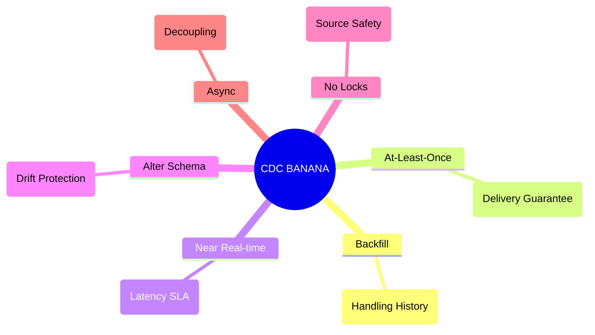

# 04 - CDC Cheat Sheet & The "BANANA" Principle

> **Your last-minute memory aid before the interview.**

---

## 🍌 The "BANANA" System Design Mnemonics

When asked to design a CDC system, remember the **BANANA**:

*   **B - Backfill**: Don't just plan for the stream. How do you load the **B**ackfill (history) without killing the source? (Answer: Snapshotting with watermarks).
*   **A - At-Least-Once**: Network failures happen. You must design for **A**t-least-once delivery and handle duplicates at the sink (**A**tomicity/Idempotency).
*   **N - Near Real-time**: Define the latency SLA. is it sub-second or 5 minutes? This decides if you need **N**ear real-time logs or just polling.
*   **A - Alter Schema**: Schemas change. Your pipeline must handle **A**ltered columns (Schema Drift) or it will break.
*   **N - No Lock**: The Golden Rule. Your CDC process must have **N**o locking impact on the production operational database.
*   **A - Async**: Decouple source and sink. Always use an **A**synchronous buffer (like Kafka/Event Hubs) in the middle.

### 🧘 Mental Visualization (Memory Peg)

Since we can't always rely on generated images, visualize this scene to recall the concepts:

> **The Scene**: A giant, yellow **Banana** floating down a **Stream** (River).
> *   **Backfill**: The stem of the banana is hooked to a **Clock** (History).
> *   **At-Least-Once**: Someone is stamping **Checkmarks** on the skin, sometimes double-stamping them.
> *   **Near Real-time**: The banana is moving fast, propelled by a **Lightning Bolt**.
> *   **Alter Schema**: The peel has a **Grid** pattern that is shifting and expanding.
> *   **No Lock**: The banana flows freely; it never gets stuck or **Locked** against a rock.
> *   **Async**: It flows into a **Buffer** (Lake) before continuing.

---

## ⚡ Quick Fire Interview Answers

| Question | The "Junior" Answer | The "Staff" Answer |
| :--- | :--- | :--- |
| **"How do we move data?"** | "Write a Python script." | "Log-based CDC for fidelity, Query-based for simplicity." |
| **"What about deletes?"** | "I forgot about them." | "Log-based captures them naturally. Query-based requires soft-deletes." |
| **"The table is huge."** | "Run it at night." | "Incremental snapshotting with chunking to avoid locks." |
| **"Duplicate events?"** | "Hope it doesn't happen." | "Idempotent sinks (Upsert/Merge) or sequence number deduplication." |

---

## 🛠️ Microsoft Tech Mapping

| Concept | Microsoft Tool |
| :--- | :--- |
| **Log Reader** | SQL Server CDC / Replication |
| **Native Stream** | Azure Cosmos DB Change Feed |
| **Orchestrator** | Azure Data Factory (CDC Resource) |
| **Buffer/Broker** | Azure Event Hubs |
| **Processor** | Azure Functions / Azure Databricks |
| **Sink** | ADLS Gen2 (Delta Lake) |

---

## 🛑 Common Failure Modes (What breaks?)

1.  **Transaction Log Full**: CDC reader is down -> Log can't truncate -> Disk fills up -> DB Crashes.
2.  **Schema Drift**: Upstream adds a column -> Downstream parser fails -> Pipeline halts.
3.  **Poison Pill**: A message that is too large or malformed crashes the consumer loop repeatedly.
