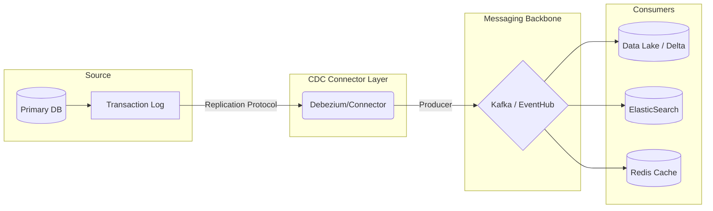
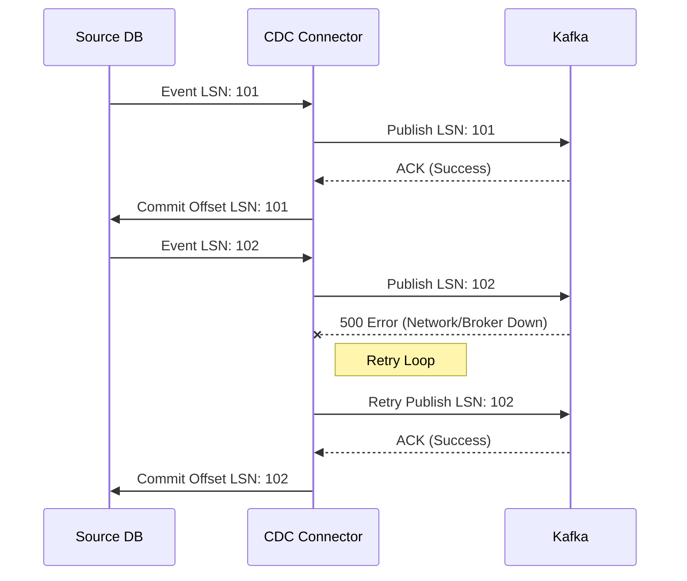

# 05 - CDC Architect Master Guide (Principal/Staff Level)

> **The Definitive Deep Dive into Change Data Capture**
> *Target Audience: Principal Data Architects & Staff Engineers*

---

## 1. Concept Breakdown

### Internal Mechanics: The "Log" is Truth
**Change Data Capture (CDC)** is not just "reading updates." It is the process of extracting the **commit log** of a database and replaying it elsewhere.

In Relational Databases (RDBMS), ACID properties are guaranteed by a **Write-Ahead Log (WAL)** (Postgres) or **Transaction Log** (SQL Server) or **Binary Log** (MySQL).
*   **The Write Path**: When you `INSERT`, the DB engine *first* writes the event to the Append-Only Log on disk, *then* updates the B-Tree implementation in memory/disk pages.
*   **The CDC Mechanism**: Instead of querying the B-Tree (which only has current state), the CDC Connector acts like a **Replica**. It connects to the replication slot and requests a stream of these log records.

### Why it exists?
*   **Dual-Write Problem**: Writing to App DB and Kafka simultaneously in application code is unreliable (system crash between writes = data inconsistency).
*   **Decoupling**: It allows the operational database to be optimized for OLTP (writes) while downstream systems are optimized for OLAP (reads) without heavy polling queries.

---

## 2. Multiple Analogies

### A) Real-World: The "Security Camera" (Log-Based) vs. "Polaroid" (Query-Based)
*   **Snapshot (Query-Based)**: You take a photo of a room every hour.
    *   *Result*: You see the furniture moved, but you don't know *who* moved it or if they moved it back and forth 5 times.
*   **Security Camera (Log-Based CDC)**: You record video.
    *   *Result*: You can replay the entire sequence of events. You see the thief entering, taking the TV, and leaving. The "Delete" is visible.

### B) Software Analogy: Git
*   **Operational DB**: The current working directory of your code.
*   **CDC Stream**: The `git log`. It shows every commit (+ lines, - lines) that led to the current state.

### C) Lead Data Engineer Analogy: "Track Changes" in Excel
*   **Without CDC**: You get sent a `v2.xlsx` file. You have to use VLOOKUP against `v1.xlsx` to figure out what changed. This is expensive and error-prone.
*   **With CDC**: You turn on "Track Changes". A side-panel lists every edit: "Cell B2 changed from 100 to 200 by User X". You just append this list to your master ledger.

---

## 3. Architecture & Design Variants

### A. The "Debezium" Pattern (Log-Based)
*   **Design**: Source DB -> Kafka Connect (Debezium) -> Kafka Topics -> Sink Connector -> Data Lake.
*   **Pros**: Real-time, captures Deletes, no impact on Source DB queries.
*   **Cons**: Complex ops (Kafka management), DB admin access required.
*   **Scaling**: Scales via Kafka Partitions. High throughput, linear scalability.

### B. The "High-Watermark" Pattern (Query-Based)
*   **Design**: Airflow Job -> `SELECT * FROM T WHERE updated_at > X` -> Write to Lake.
*   **Pros**: Simple, uses standard SQL permissions.
*   **Cons**: Misses Hard Deletes, polling latency, high load on Source DB.

### C. The "Outbox" Pattern (Hybrid)
*   **Design**: Transaction writes to `Users` table and `Outbox` table in same transaction. CDC reads `Outbox`.
*   **Pros**: Explicit control over what is published.
*   **Cons**: Developer overhead, extra write cost.

---

## 4. Architecture Diagrams

### High-Level Architecture



### Failure & Retry Flow



---

## 5. Real-Time Issues & Failure Modes

### 1. The "Thundering Herd" (Snapshotting)
*   **Symptom**: Starting CDC on a massive table locks the DB or saturates IO, taking down Prod.
*   **Root Cause**: `SELECT *` without chunking.
*   **Resolution**: **DBLog Algorithm**. Use chunk-based reads mixed with stream events. Lock table only for milliseconds to marks offsets, then read chunk.

### 2. Schema Drift Failure
*   **Symptom**: Consumer pipelines crash with `SerializationException`.
*   **Root Cause**: Upstream added column; Downstream schema registry wasn't updated.
*   **Resolution**: **Confluent Schema Registry** with strict compatibility rules (FORWARD/BACKWARD).

### 3. Gap in Sequence (Data Loss)
*   **Symptom**: Ops reports missing orders.
*   **Root Cause**: Transaction Logs were truncated (rotated) before CDC connector could read them (e.g., Connector was down for 24h, logs kept for 12h).
*   **Resolution**: Alert on **Consumer Lag**. Increase Log retention on Source. Resnapshot required.

---

## 6. Real-Time Scenarios & Interview Questions

### Q1: "How do you handle Exactly-Once processing in CDC?"
*   **Trick**: Kafka only guarantees *At-Least-Once* easily.
*   **Answer**: "I push the complexity to the **Sink**. I use **idempotent writes**.
    *   If target is SQL: `MERGE` statement.
    *   If target is S3: Write file named by `LSN`.
    *   Key concept: Applying the same update (LSN 100) twice results in the same final state."

### Q2: "A user updates their profile 50 times in a second. How do we handle downstream?"
*   **Scenario**: Frequent updates (Hot key).
*   **Answer**: "Log compaction. Downstream, we only care about the *latest* state for the profile view. We can use Kafka Log Compaction or a windowed aggregation (tumbling window 1s) to collapse 50 events into the final one before writing to the Data Warehouse."

---

## 7. Code Snippets

### PySpark Structured Streaming (Delta Lake Change Data Feed)

```python
# Reading CDC feed from Delta Lake
cdc_df = spark.readStream \
    .format("delta") \
    .option("readChangeFeed", "true") \
    .table("source_users")

# Result Schema has: _change_type, _commit_version, _commit_timestamp
# Handle Merges in Sink
def upsert_to_gold(microBatchDF, batchId):
    microBatchDF.createOrReplaceTempView("updates")
    microBatchDF._jdf.sparkSession().sql("""
        MERGE INTO gold_users t
        USING updates s
        ON t.id = s.id
        WHEN MATCHED AND s._change_type = 'update' THEN UPDATE SET *
        WHEN MATCHED AND s._change_type = 'delete' THEN DELETE
        WHEN NOT MATCHED AND s._change_type = 'insert' THEN INSERT *
    """)

cdc_df.writeStream \
    .foreachBatch(upsert_to_gold) \
    .start()
```

---

## 8. Comparisons & Decision Matrix

| Feature | Query-Based (Polling) | Log-Based (CDC) | App-Level Events (Dual Write) |
| :--- | :--- | :--- | :--- |
| **Integrity** | ⚠️ Misses hard deletes | ✅ Exact replica of DB | 🔴 Inconsistent (Dual write problem) |
| **Latency** | 🐢 Minutes | 🐇 Milliseconds | 🐇 Milliseconds |
| **Source Impact** | 🔴 High (Polling scans) | 🟢 Low (Log reader) | 🟢 Zero (App handles it) |
| **Complexity** | 🟢 Low | 🔴 High (Ops burden) | 🟡 Medium |
| **Use Case** | Reports, Batch ETL | Data Sync, Search Index, Caches | Triggering business emails |

---

## 9. Production Best Practices

*   [ ] **Monitoring**: Alert on `Consumer Lag` (Time behind source) > 5 mins.
*   [ ] **Tombstones**: Ensure Sink handles `null` payloads as Deletes.
*   [ ] **Isolation**: Run CDC connectors on dedicated Read Replicas (if eventual consistency is allowed) to save Primary CPU.
*   [ ] **Ordering**: ALWAYS partition Kafka topics by Primary Key. Failure to do so breaks consistency.
*   [ ] **Security**: Limit CDC user permissions to `replication client` only. Mask PII in the connector (SMT - Single Message Transform) before it hits Kafka.

---

## 10. Cheat Sheet (What to Remember)

### Mnemonic: BANANA
*   **B**ackfill strategies (Snapshot).
*   **A**t-least-once delivery (Idempotency).
*   **N**ear real-time requirements.
*   **A**lter Schema (Drift handling).
*   **N**o Locks on source.
*   **A**sync architecture.

### The "Staff Engineer" One-Liner
> *"CDC is the bridge that turns mutable state (Database) into immutable history (Streams), enabling event-driven architecture without tight coupling."*
