# 05 - CDC Architect Master Guide (Principal/Staff Level)

> **The Definitive Deep Dive into Change Data Capture**
> *Target Audience: Principal Data Architects & Staff Engineers*

---

## 1. Concept Breakdown

### Internal Mechanics: The "Log" is Truth
**Change Data Capture (CDC)** is not just "reading updates." It is the process of extracting the **commit log** of a database and replaying it elsewhere.

In Relational Databases (RDBMS), ACID properties are guaranteed by a **Write-Ahead Log (WAL)** (Postgres) or **Transaction Log** (SQL Server) or **Binary Log** (MySQL).
*   **The Write Path**: When you `INSERT`, the DB engine *first* writes the event to the Append-Only Log on disk, *then* updates the B-Tree implementation in memory/disk pages.
*   **The CDC Mechanism**: Instead of querying the B-Tree (which only has current state), the CDC Connector acts like a **Replica**. It connects to the replication slot and requests a stream of these log records.

### Why it exists?

CDC exists to solve two fundamental problems in distributed data systems:

---

#### 🔴 Problem #1: The Dual-Write Problem

**What is a Dual-Write?**
A dual-write occurs when application code writes to **two systems** (e.g., a database AND a message queue) as part of a single business operation.

**The Flawed Approach (Without CDC):**
```python
# ❌ DANGEROUS: Application-level dual-write
def create_order(order_data):
    # Step 1: Write to the database
    db.insert("orders", order_data)  # Succeeds ✅
    
    # 💥 CRASH HERE - server dies, network fails, or code throws exception
    
    # Step 2: Publish event to Kafka
    kafka.publish("order-events", order_data)  # NEVER EXECUTES ❌
```

**Why This Fails (Failure Scenarios):**

| Scenario | DB State | Kafka State | Result |
|:---------|:---------|:------------|:-------|
| App crashes after DB write | Order exists ✅ | No event ❌ | **Data Loss**: Downstream systems never see the order |
| Network fails after DB write | Order exists ✅ | No event ❌ | **Inconsistency**: Inventory not updated, search index stale |
| Kafka write fails, app retries | Order exists ✅ | Duplicate events | **Duplication**: Customer charged twice |
| DB write fails, but Kafka succeeds | Order doesn't exist ❌ | Event published ✅ | **Phantom Event**: Downstream processes a non-existent order |

**Real-World Disaster Example:**
Imagine an e-commerce site:
1. User places a $500 order
2. App writes order to PostgreSQL ✅
3. **Server crashes** (memory exhaustion, deployment during traffic spike)
4. Kafka event never sent ❌
5. **Result**: 
   - Customer sees "Order Confirmed" (DB has it)
   - Warehouse never ships (never got the event)
   - Analytics shows wrong revenue (missing event)
   - Emails are never triggered (no event)

**Why You Can't "Fix" Dual-Writes with Transactions:**
- **Database and Kafka are different systems** - there's no distributed transaction coordinator
- **2PC (Two-Phase Commit)** is fragile:
  - What if the coordinator dies?
  - Massive latency overhead
  - Both systems must support XA transactions (Kafka doesn't)

**How CDC Solves This:**
```
┌────────────────────────────────────────────────────────────────────────┐
│  ✅ THE CDC SOLUTION: Single Write, Guaranteed Propagation             │
├────────────────────────────────────────────────────────────────────────┤
│                                                                        │
│   Application ───────> Database ───────> Transaction Log              │
│       │                    │                    │                      │
│       │                    │                    │ (CDC Connector Reads)│
│       │                    │                    ▼                      │
│       │                    │               ┌─────────┐                 │
│       │                    │               │  Kafka  │                 │
│       │                    │               └────┬────┘                 │
│       └────────────────────┴────────────────────┴─────> Downstream     │
│                                                                        │
│   🎯 Key Insight: The database transaction log is the SINGLE SOURCE   │
│      of truth. CDC reads from THIS log, so any committed transaction  │
│      WILL be captured. No gap, no inconsistency.                      │
└────────────────────────────────────────────────────────────────────────┘
```

**Why This is Bulletproof:**
- The app only writes to **ONE system** (the database)
- The database guarantees ACID - if the write committed, it's in the log
- CDC reads the log **after** the commit - it can never miss a committed transaction
- If CDC crashes, it resumes from the last **Log Sequence Number (LSN)** - no skips

---

#### 🟢 Problem #2: Decoupling (OLTP vs OLAP)

**The Problem: Conflicting Workload Requirements**

OLTP (Transactional) and OLAP (Analytical) databases have fundamentally different optimization goals:

| Characteristic | OLTP (Operational) | OLAP (Analytical) |
|:---------------|:-------------------|:------------------|
| **Query Pattern** | Point lookups (`WHERE id = 123`) | Full scans (`GROUP BY category`) |
| **Data Volume** | Single rows | Millions/billions of rows |
| **Latency** | < 10ms required | Minutes acceptable |
| **Storage Format** | Row-oriented (B-Tree) | Column-oriented (Parquet) |
| **Optimization** | Writes, Updates, Deletes | Aggregations, Joins |
| **Index Strategy** | Many indexes | Few/no indexes (scan-friendly) |

**The Naive Approach: Direct Queries (Polling)**
```sql
-- ❌ Analytics team runs this on PROD every 10 minutes
SELECT 
    category,
    SUM(amount) as total_sales,
    COUNT(*) as order_count
FROM orders
WHERE created_at > '2024-01-01'
GROUP BY category;
```

**Why This Destroys Production:**


**Real-World Disaster:**
1. **3:00 PM**: Analytics runs hourly sales report on PROD PostgreSQL
2. **3:01 PM**: Full table scan locks pages, CPU spikes to 100%
3. **3:02 PM**: Checkout page latency goes from 50ms → 5000ms
4. **3:03 PM**: Customers abandon carts, revenue lost
5. **3:04 PM**: On-call engineer kills the analytics query
6. **3:05 PM**: Post-mortem scheduled, Analytics team banned from PROD 😅

**How CDC Enables Proper Decoupling:**


**The Benefits of This Architecture:**

| Benefit | Explanation |
|:--------|:------------|
| **Zero Production Impact** | CDC reads from the transaction log (append-only), not the tables. No locks, no CPU contention. |
| **Real-Time Data** | Analytics sees data within seconds of commit, not hours. |
| **Right Tool for the Job** | PostgreSQL stays lean for transactions; Synapse crunches petabytes for analytics. |
| **Scalable Consumers** | Add 10 new analytics consumers? No problem - they all read from Kafka, not PROD. |
| **Time Travel** | Delta Lake keeps history; replay data from any point without touching PROD. |

**The Staff Engineer's Mental Model:**
> *Think of it like a **radio broadcast**. The radio station (OLTP) broadcasts once. Millions of radios (OLAP systems) tune in and listen without calling the station. CDC is the **transmission tower** that converts the signal.*

---

## 2. Multiple Analogies

Understanding CDC through multiple lenses helps cement the concept and provides ready answers for interviews.

---

### A) Real-World: The "Security Camera" (Log-Based) vs. "Polaroid" (Query-Based)

This is the **most powerful analogy** for explaining CDC in interviews.

| Aspect | 📸 Polaroid (Query-Based) | 📹 Security Camera (Log-Based CDC) |
|:-------|:--------------------------|:------------------------------------|
| **Capture Method** | Take a photo every hour | Continuous video recording |
| **What You See** | Current state only | Complete history of events |
| **Missing Info** | Who moved the furniture? How many times? | Everything captured |
| **"Deletes" Visibility** | ❌ Can't tell if something was removed | ✅ See the thief leaving with the TV |
| **Resource Usage** | Light (periodic snapshots) | Heavier (continuous stream) |

**Deep Dive - Why This Matters:**

```
┌─────────────────────────────────────────────────────────────────────────────┐
│  SCENARIO: User profile updates                                            │
├─────────────────────────────────────────────────────────────────────────────┤
│                                                                             │
│  Timeline:  12:00    12:15    12:30    12:45    13:00                      │
│                │        │        │        │        │                        │
│  Events:      SET      SET      SET      DELETE   (empty)                  │
│               name=    name=    name=                                       │
│               "Alice"  "Bob"    "Charlie"                                   │
│                                                                             │
├─────────────────────────────────────────────────────────────────────────────┤
│  📸 Polaroid (Hourly Query):                                               │
│     • 12:00 snapshot: name = "Alice"                                        │
│     • 13:00 snapshot: row doesn't exist                                     │
│     • Question: What happened? Did "Alice" get deleted? Was there ever     │
│       a "Bob" or "Charlie"? NO IDEA. 🤷                                     │
│                                                                             │
│  📹 Security Camera (CDC):                                                 │
│     • 12:00 INSERT: {id: 1, name: "Alice", op: 'c'}                        │
│     • 12:15 UPDATE: {id: 1, name: "Bob", op: 'u'}                          │
│     • 12:30 UPDATE: {id: 1, name: "Charlie", op: 'u'}                      │
│     • 12:45 DELETE: {id: 1, op: 'd'}                                       │
│     • FULL HISTORY preserved. Every change auditable. ✅                   │
│                                                                             │
└─────────────────────────────────────────────────────────────────────────────┘
```

**Interview Tip:** Use this analogy when asked "Why not just query the database every 5 minutes?"

---

### B) Software Analogy: Git

This analogy resonates deeply with backend engineers.

| Concept | Git Equivalent | Database/CDC Equivalent |
|:--------|:---------------|:------------------------|
| Current state | Working directory | Database tables (B-Tree) |
| History of changes | `git log` | Transaction Log (WAL) |
| Individual change | Commit | CDC Event |
| Viewing what changed | `git diff` | CDC change event payload |
| Going back in time | `git checkout <sha>` | Replay CDC events to point-in-time |
| Collaboration | Push/Pull | Pub/Sub to Kafka |

**The Key Insight:**
```bash
# Git: To know what changed between v1 and v2
git diff v1..v2

# Without CDC: You'd have to
diff old_snapshot.sql new_snapshot.sql  # Expensive, incomplete

# With CDC: The log IS the diff
SELECT * FROM cdc_events WHERE version BETWEEN 1 AND 2
```

**Why Git Analogy Works for Engineers:**
- Engineers already understand that `git log` is **append-only** (just like WAL)
- They know you can **replay** commits to recreate any state (like CDC replay)
- They appreciate that **every change is traceable** (audit trail)
- The `.git` folder is analogous to the **transaction log** - hidden but critical


---

### C) Lead Data Engineer Analogy: "Track Changes" in Excel

This analogy is perfect for **non-technical stakeholders** and **business-focused interviews**.

**Scenario: Monthly Sales Report Reconciliation**

```
┌─────────────────────────────────────────────────────────────────────────────┐
│  ❌ WITHOUT CDC (VLOOKUP Hell)                                              │
├─────────────────────────────────────────────────────────────────────────────┤
│                                                                             │
│  1. Receive sales_jan.xlsx from upstream team                              │
│  2. Receive sales_feb.xlsx one month later                                  │
│  3. To find what changed:                                                   │
│     - VLOOKUP every row in Feb against Jan                                 │
│     - For 10M rows: Takes HOURS, crashes Excel                             │
│     - Misses DELETED orders (row in Jan, not in Feb - but why?)            │
│     - Can't tell: Was it a correction? A refund? A mistake?                │
│                                                                             │
│  4. Result: "Trust me, the numbers changed" 🤷                             │
│                                                                             │
├─────────────────────────────────────────────────────────────────────────────┤
│  ✅ WITH CDC (Track Changes On)                                            │
├─────────────────────────────────────────────────────────────────────────────┤
│                                                                             │
│  1. sales.xlsx has "Track Changes" enabled                                 │
│  2. Side panel shows:                                                       │
│     - 2024-01-15 10:00: Cell B5 changed from $100 to $150 by Finance       │
│     - 2024-01-15 10:05: Row 12 DELETED by Admin (Reason: Duplicate)        │
│     - 2024-01-20 09:00: Cell C7 changed from "Pending" to "Shipped"        │
│                                                                             │
│  3. Result: Complete audit trail, instant reconciliation ✅                │
│                                                                             │
└─────────────────────────────────────────────────────────────────────────────┘
```

**Real Use Case - Financial Auditing:**
- **Without CDC**: Auditors ask "Why did revenue change from Q1 to Q2 report?"
  - You: "Uh... let me write a SQL query and compare snapshots..." (2 days later)
  
- **With CDC**: Pull CDC events for that entity
  - Instant: "On March 15, Order #1234 was retroactively refunded by UserID 789"

---

### D) Bonus Analogy: The "Bank Statement" Model

For **finance-heavy** interviews or domains:

| Without CDC | With CDC |
|:------------|:---------|
| Check your bank balance once a month | Receive real-time transaction notifications |
| Balance: $1000 → $500 (What happened?!) | Transaction log: ATM -$200, Coffee -$5, Transfer -$295 |
| Can't dispute unknown charges | Every transaction has timestamp, merchant, amount |

---

## 3. Architecture & Design Variants

Every CDC architecture has trade-offs. Understanding **when to use which** is the mark of a Staff Engineer.

---

### A. The "Debezium" Pattern (Log-Based CDC)

**The Gold Standard for enterprise-grade CDC.**


**How It Works (Step by Step):**

1. **Connector Registration**:
   ```json
   {
     "name": "postgres-source",
     "config": {
       "connector.class": "io.debezium.connector.postgresql.PostgresConnector",
       "database.hostname": "prod-db.example.com",
       "database.user": "cdc_user",
       "database.password": "${secrets:db_password}",
       "database.dbname": "production",
       "plugin.name": "pgoutput",
       "slot.name": "debezium_slot",
       "publication.name": "dbz_publication"
     }
   }
   ```

2. **Replication Slot Created**: Debezium creates a logical replication slot in Postgres

3. **WAL Streaming**: Every committed transaction is streamed to Debezium

4. **Event Transformation**: Each change becomes a structured Kafka message:
   ```json
   {
     "before": {"id": 1, "name": "Alice", "email": "alice@old.com"},
     "after": {"id": 1, "name": "Alice", "email": "alice@new.com"},
     "source": {
       "version": "2.3.0",
       "connector": "postgresql",
       "ts_ms": 1702089600000,
       "txId": 12345,
       "lsn": 987654321
     },
     "op": "u",
     "ts_ms": 1702089600500
   }
   ```

5. **Topic Publishing**: Message published to `db.public.users`

**Pros (Deep Dive):**

| Pro | Why It Matters |
|:----|:---------------|
| **Real-time** (< 1 second latency) | Search indexes, caches, and dashboards always fresh |
| **Captures ALL operations** (I/U/D) | Hard deletes are visible; complete audit trail |
| **Zero impact on source queries** | Reads from log, not from tables; no SELECT load |
| **Exactly-once compatible** | LSN-based deduplication possible at sink |
| **Schema included in events** | Schema Registry integration prevents drift issues |

**Cons (The Real Challenges):**

| Con | Reality Check |
|:----|:--------------|
| **Ops complexity** | Kafka cluster + ZooKeeper/KRaft + Connect workers = 24/7 on-call |
| **DB admin access required** | Need `REPLICATION` permission; DBAs often push back |
| **Snapshot "thundering herd"** | Initial snapshot of 1B row table can take hours |
| **Log retention dependency** | If logs rotate before connector reads, data is LOST |
| **Learning curve** | Debezium + Kafka + Avro/Protobuf + Schema Registry = steep |

**When to Use:**
- ✅ Real-time analytics, search, caching
- ✅ Microservices event-driven architecture
- ✅ Data mesh / streaming data platform
- ✅ You have a dedicated Data Platform team

**When to Avoid:**
- ❌ Small team with no Kafka expertise
- ❌ Simple batch ETL with SLA > 1 hour
- ❌ Source DB team refuses replication access

---

### B. The "High-Watermark" Pattern (Query-Based / Polling)

**The "Simple but Limited" approach - still valid for many use cases.**

```mermaid
graph LR
    subgraph Orchestration["⏰ Scheduler"]
        Airflow[Airflow DAG<br/>@ every 15 min]
    end
    
    subgraph Source["🗄️ Source"]
        DB[(Production DB)]
        Meta[(Metadata Store<br/>last_watermark)]
    end
    
    subgraph ETL["🔄 ETL Logic"]
        Read[Read Watermark]
        Query[Execute Query<br/>WHERE updated_at > X]
        Write[Write to Sink]
        Update[Update Watermark]
        
        Airflow --> Read
        Read --> Query
        Query -->|"Fetch Rows"| DB
        DB --> Write
        Write --> Update
        Update -->|"Store new max"| Meta
    end
    
    subgraph Sink["🎯 Destination"]
        Lake[(Data Lake<br/>Delta/Iceberg)]
    end
    
    Write --> Lake
    
    style Orchestration fill:#fff3e0,stroke:#f57c00
    style Source fill:#e3f2fd,stroke:#1976d2
    style ETL fill:#f5f5f5,stroke:#9e9e9e
    style Sink fill:#e8f5e9,stroke:#388e3c
```



**How It Works (Step by Step):**

1. **Scheduler Triggers**: Airflow runs DAG every 15 minutes

2. **Read Last Watermark**:
   ```python
   from airflow.models import Variable
   last_watermark = Variable.get("orders_watermark", default_var="1970-01-01")
   ```

3. **Query Source with Watermark**:
   ```sql
   SELECT *
   FROM orders
   WHERE updated_at > '{{ last_watermark }}'
   ORDER BY updated_at
   LIMIT 100000;  -- Chunk to avoid memory issues
   ```

4. **Write to Sink** (Append or Merge)

5. **Update Watermark**:
   ```python
   new_watermark = df.agg({"updated_at": "max"}).collect()[0][0]
   Variable.set("orders_watermark", new_watermark)
   ```

**The Hard Delete Problem (Why This Matters):**

```
┌─────────────────────────────────────────────────────────────────────────────┐
│  THE INVISIBLE DELETE                                                       │
├─────────────────────────────────────────────────────────────────────────────┤
│                                                                             │
│  Source DB at 10:00 AM:                                                     │
│  ┌─────┬────────┬─────────────────────┐                                    │
│  │ id  │ name   │ updated_at          │                                    │
│  ├─────┼────────┼─────────────────────┤                                    │
│  │ 1   │ Alice  │ 2024-01-01 09:00:00 │                                    │
│  │ 2   │ Bob    │ 2024-01-01 09:30:00 │                                    │
│  │ 3   │ Carol  │ 2024-01-01 09:45:00 │                                    │
│  └─────┴────────┴─────────────────────┘                                    │
│                                                                             │
│  At 10:05 AM: DELETE FROM users WHERE id = 2;  -- Bob deleted              │
│                                                                             │
│  Source DB at 10:15 AM:                                                     │
│  ┌─────┬────────┬─────────────────────┐                                    │
│  │ id  │ name   │ updated_at          │                                    │
│  ├─────┼────────┼─────────────────────┤                                    │
│  │ 1   │ Alice  │ 2024-01-01 09:00:00 │                                    │
│  │ 3   │ Carol  │ 2024-01-01 09:45:00 │                                    │
│  └─────┴────────┴─────────────────────┘                                    │
│                                                                             │
│  ETL runs at 10:15 AM:                                                      │
│  SELECT * WHERE updated_at > '2024-01-01 10:00:00'                         │
│  Result: 0 rows (nothing updated after 10:00)                               │
│                                                                             │
│  ❌ Bob's DELETE is INVISIBLE to the ETL!                                   │
│  Data Lake still shows Bob as active. INCONSISTENT.                        │
│                                                                             │
└─────────────────────────────────────────────────────────────────────────────┘
```

**Workarounds for Hard Deletes:**

| Strategy | Implementation | Trade-off |
|:---------|:---------------|:----------|
| **Soft Deletes** | Add `is_deleted` boolean column | App code must respect flag; query patterns change |
| **Tombstone Table** | Trigger writes deleted PKs to `deleted_users` | Extra writes; trigger overhead |
| **Full Table Scans** | Periodically sync entire table | Works but expensive; kills source DB |
| **Change Table (SCD)** | Source maintains explicit change log | Dev overhead; not all apps support |

**Pros:**

| Pro | Reality |
|:----|:--------|
| **Dead simple** | Any engineer can understand SELECT + WHERE |
| **No special permissions** | Standard read-only DB user works |
| **No new infrastructure** | Use existing Airflow, no Kafka needed |
| **Works with any DB** | Even legacy systems without WAL access |

**Cons:**

| Con | Impact |
|:----|:-------|
| **Misses hard deletes** | Data inconsistency (Bob still in Data Lake) |
| **Polling latency** | 15-60 minute delay vs real-time |
| **Source DB load** | Full table scans hurt OLTP performance |
| **Clock skew issues** | `updated_at` from app vs DB time = gaps or duplicates |

**When to Use:**
- ✅ Batch analytics with SLA > 1 hour
- ✅ No real-time requirements
- ✅ Small tables (< 10M rows)
- ✅ No Kafka expertise on team
- ✅ Source DB has soft deletes implemented

**When to Avoid:**
- ❌ Real-time dashboards or search
- ❌ Tables with hard deletes
- ❌ Large tables (scans kill performance)

---

### C. The "Outbox" Pattern (Hybrid / Transactional Outbox)

**The "Best of Both Worlds" - transactional consistency with event-driven architecture.**


**How It Works (The Magic):**

1. **Application writes to BOTH tables in SAME transaction:**
   ```python
   # ✅ ATOMIC: Both succeed or both fail
   async def create_user(user_data: dict):
       async with db.transaction():
           # Business data
           user = await db.execute(
               "INSERT INTO users (name, email) VALUES ($1, $2) RETURNING id",
               user_data["name"], user_data["email"]
           )
           
           # Outbox event (same transaction!)
           await db.execute("""
               INSERT INTO outbox (
                   aggregate_type, aggregate_id, event_type, payload
               ) VALUES (
                   'User', $1, 'UserCreated', $2
               )
           """, user.id, json.dumps(user_data))
           
       # Transaction committed - BOTH or NEITHER
   ```

2. **Outbox Table Schema:**
   ```sql
   CREATE TABLE outbox (
       id            UUID PRIMARY KEY DEFAULT gen_random_uuid(),
       aggregate_type VARCHAR(255) NOT NULL,  -- 'User', 'Order'
       aggregate_id   VARCHAR(255) NOT NULL,  -- Entity PK
       event_type     VARCHAR(255) NOT NULL,  -- 'UserCreated', 'OrderShipped'
       payload        JSONB NOT NULL,          -- Event data
       created_at     TIMESTAMP DEFAULT NOW()
   );
   ```

3. **Debezium with Outbox SMT (Single Message Transform):**
   ```json
   {
     "name": "outbox-connector",
     "config": {
       "connector.class": "io.debezium.connector.postgresql.PostgresConnector",
       "transforms": "outbox",
       "transforms.outbox.type": "io.debezium.transforms.outbox.EventRouter",
       "transforms.outbox.table.fields.additional.placement": "event_type:header",
       "transforms.outbox.route.topic.replacement": "${routedByValue}.events"
     }
   }
   ```

4. **Event Routing:**
   - Debezium reads INSERT from `outbox` table
   - SMT extracts `aggregate_type` → routes to `user.events` topic
   - Original row structure is transformed into clean event

**Why This is Powerful:**

```
┌─────────────────────────────────────────────────────────────────────────────┐
│  THE OUTBOX GUARANTEE                                                       │
├─────────────────────────────────────────────────────────────────────────────┤
│                                                                             │
│  Scenario: Server crashes AFTER db.commit() but BEFORE Kafka publish       │
│                                                                             │
│  ❌ Dual-Write Pattern:                                                     │
│     Transaction commits → Server dies → Kafka never gets event = LOST      │
│                                                                             │
│  ✅ Outbox Pattern:                                                         │
│     Transaction commits (both Users + Outbox) → Server dies →              │
│     → Debezium reads Outbox → Event still delivered = CONSISTENT          │
│                                                                             │
│  The event is IN THE DATABASE. It survives crashes. CDC will find it.     │
│                                                                             │
└─────────────────────────────────────────────────────────────────────────────┘
```

**Pros:**

| Pro | Deep Dive |
|:----|:----------|
| **Transactional consistency** | Event published IFF business data committed |
| **Explicit event design** | You control exactly what downstream sees |
| **No dual-write problem** | Single database transaction is the source of truth |
| **Works with legacy apps** | Add Outbox table without rewriting app |
| **Event versioning** | Can evolve event schemas independently |

**Cons:**

| Con | Reality |
|:----|:--------|
| **Developer overhead** | Every write needs corresponding Outbox insert |
| **Extra write cost** | 2x writes per operation (data + event) |
| **Still needs CDC** | Debezium/Kafka infrastructure still required |
| **Outbox table growth** | Need scheduled cleanup (can grow large) |

**Outbox Cleanup Strategy:**
```sql
-- Run daily: Delete processed events older than 7 days
DELETE FROM outbox WHERE created_at < NOW() - INTERVAL '7 days';
```

**When to Use:**
- ✅ Microservices needing exactly-once event publishing
- ✅ Legacy apps that can't use event sourcing
- ✅ When you need control over event schema (not just CDC of tables)
- ✅ Compliance requires explicit audit events

**When to Avoid:**
- ❌ High write throughput (2x writes = 2x cost)
- ❌ Simple CDC requirements (table mirroring)
- ❌ No development resources to maintain pattern

---

### Decision Matrix: Which Pattern to Choose?

| Criteria | 📹 Debezium (Log) | ⏰ High-Watermark | 📦 Outbox |
|:---------|:------------------|:------------------|:----------|
| **Latency** | < 1 second | 15-60 minutes | < 1 second |
| **Captures Deletes** | ✅ Yes | ❌ No (unless soft delete) | ✅ Yes |
| **Source DB Impact** | 🟢 None (reads log) | 🔴 High (queries tables) | 🟡 Medium (extra writes) |
| **Ops Complexity** | 🔴 High (Kafka + Connect) | 🟢 Low (just SQL) | 🔴 High (Kafka + Connect) |
| **Dev Effort** | 🟢 Low (auto-capture) | 🟢 Low (SQL query) | 🔴 High (explicit events) |
| **Event Schema Control** | 🟡 Medium (mirrors DB) | 🟡 Medium (query result) | ✅ Full control |
| **Best For** | Data replication, Search | Batch ETL, Reports | Microservices, Audit |

**The Staff Engineer's Heuristic:**
> *"Start with High-Watermark if latency doesn't matter. Graduate to Debezium when you need real-time or deletes. Use Outbox when you need explicit, versioned domain events."*

---

## 4. Architecture Diagrams

### High-Level Architecture


### Failure & Retry Flow


---

## 5. Real-Time Issues & Failure Modes

Understanding failure modes is critical for on-call firefighting and system design interviews. Each failure has a **pattern** you can recognize.

---

### 1. The "Thundering Herd" (Snapshotting Problem)

**The Scenario:**
You deploy a new CDC connector on a 500GB table with 2 billion rows. Within minutes, your production database is unresponsive.

```
┌─────────────────────────────────────────────────────────────────────────────┐
│  🔥 THE THUNDERING HERD TIMELINE                                           │
├─────────────────────────────────────────────────────────────────────────────┤
│                                                                             │
│  T+0:     Deploy Debezium connector for `orders` table (2B rows)           │
│                                                                             │
│  T+10s:   Debezium starts initial snapshot:                                 │
│           SELECT * FROM orders;  -- FULL TABLE SCAN                        │
│                                                                             │
│  T+30s:   PostgreSQL buffer cache is evicted (cold data loaded)            │
│           All other queries now hit disk → latency spikes 10x              │
│                                                                             │
│  T+1m:    Connection pool exhausted (snapshot holds connection)             │
│           App servers can't get DB connections → 503 errors                 │
│                                                                             │
│  T+2m:    PagerDuty goes off. On-call engineer kills the connector.        │
│           Post-mortem: "CDC took down production" 😱                       │
│                                                                             │
└─────────────────────────────────────────────────────────────────────────────┘
```

**Root Cause Analysis:**

| What Happened | Technical Detail |
|:--------------|:-----------------|
| **Full Table Lock** | Some DBs (MySQL with MyISAM) lock entire table during SELECT |
| **Buffer Cache Pollution** | Cold snapshot data evicts hot working set from memory |
| **Connection Starvation** | Long-running query holds connection; pool exhausted |
| **I/O Saturation** | Sequential full-table read saturates disk bandwidth |
| **Replication Lag** | If using replica, snapshot causes replication lag |

**Resolution: The DBLog Algorithm (Netflix Pattern)**


**Key Techniques:**

| Technique | Implementation |
|:----------|:---------------|
| **Chunk-based reads** | `SELECT ... LIMIT 10000 OFFSET X` or PK-range based |
| **Back-pressure** | Sleep between chunks to let DB breathe |
| **Read Replica** | Point snapshot at replica, stream from primary |
| **Off-peak scheduling** | Start snapshot at 2 AM, not 2 PM |
| **Incremental snapshots** | Debezium's `snapshot.mode=initial` vs `schema_only` |

**Debezium Configuration to Prevent Thundering Herd:**
```json
{
  "snapshot.mode": "initial",
  "snapshot.fetch.size": 10000,
  "snapshot.max.threads": 1,
  "snapshot.delay.ms": 100,
  "snapshot.select.statement.overrides": "orders:SELECT * FROM orders WHERE created_at > '2024-01-01'"
}
```

---

### 2. Schema Drift Failure

**The Scenario:**
Monday morning, your Spark streaming job crashes with `org.apache.avro.AvroTypeException`. The source team added a new column over the weekend.

```
┌─────────────────────────────────────────────────────────────────────────────┐
│  💥 SCHEMA DRIFT FAILURE TIMELINE                                          │
├─────────────────────────────────────────────────────────────────────────────┤
│                                                                             │
│  Friday 6 PM:    Source team runs: ALTER TABLE users ADD COLUMN phone      │
│                  Debezium picks up new schema automatically                  │
│                  Kafka topic now has messages with 'phone' field            │
│                                                                             │
│  Saturday:       New events accumulate with 'phone' field                   │
│                  Old consumers ignore extra field (for now...)              │
│                                                                             │
│  Monday 9 AM:    Spark job restarts after weekend maintenance              │
│                  Job tries to read from last checkpoint                      │
│                  Schema Registry returns schema v2 (with phone)             │
│                  Spark's expected schema is v1 (without phone)              │
│                                                                             │
│  Monday 9:01:    org.apache.avro.AvroTypeException:                        │
│                  "Found users.phone, expecting users.email, found phone"   │
│                  JOB CRASHES. Data stops flowing. 🔥                       │
│                                                                             │
└─────────────────────────────────────────────────────────────────────────────┘
```

**Root Cause Analysis:**

| Issue | Explanation |
|:------|:------------|
| **No schema versioning** | Consumer hardcoded schema, doesn't handle evolution |
| **Compatibility not enforced** | Schema Registry allowed breaking change |
| **No notification** | Data team wasn't informed of schema change |
| **Checkpoint problem** | Consumer checkpointed with old schema ID |

**Resolution: Schema Registry with Compatibility Rules**


**Compatibility Modes Explained:**

| Mode | Rule | Example |
|:-----|:-----|:--------|
| **BACKWARD** | New schema can read old data | Add optional field with default ✅ |
| **FORWARD** | Old schema can read new data | Remove optional field ✅ |
| **FULL** | Both directions work | Very restrictive |
| **NONE** | No checks | Dangerous ⚠️ |

**Best Practice Configuration:**
```bash
# Set BACKWARD compatibility on topics
curl -X PUT \
  http://schema-registry:8081/config/db.public.users-value \
  -H "Content-Type: application/json" \
  -d '{"compatibility": "BACKWARD"}'
```

**Consumer Code for Schema Evolution (PySpark):**
```python
# ✅ Handle schema evolution gracefully
from pyspark.sql.avro.functions import from_avro

cdc_df = spark.readStream \
    .format("kafka") \
    .option("kafka.bootstrap.servers", "broker:9092") \
    .option("subscribe", "db.public.users") \
    .load()

# Use Schema Registry with evolution
schema_registry_url = "http://schema-registry:8081"
avro_df = cdc_df.select(
    from_avro(
        col("value"),
        topic="db.public.users",
        schemaRegistryAddress=schema_registry_url,
        options={"mode": "PERMISSIVE"}  # Don't fail on unknown fields
    ).alias("data")
)
```

---

### 3. Gap in Sequence (Data Loss / LSN Gap)

**The Scenario:**
Business reports that 500 orders from last weekend are missing from the Data Warehouse. Investigation shows a 12-hour gap in CDC events.

```
┌─────────────────────────────────────────────────────────────────────────────┐
│  🕳️ THE DATA LOSS TIMELINE                                                  │
├─────────────────────────────────────────────────────────────────────────────┤
│                                                                             │
│  Friday 11 PM:   Kubernetes node running Debezium connector crashes        │
│                  K8s doesn't reschedule (node pool full)                    │
│                  LSN at crash: 50000                                        │
│                                                                             │
│  Saturday:       Orders keep coming in. DB writes LSN 50001 → 150000       │
│                  PostgreSQL WAL files accumulate                            │
│                                                                             │
│  Sunday 6 AM:    Automated WAL cleanup runs (wal_keep_size = 1GB)          │
│                  WAL files containing LSN 50001-100000 are DELETED         │
│                                                                             │
│  Sunday 11 AM:   On-call notices connector is down. Restarts it.           │
│                  Debezium tries to resume from LSN 50000                    │
│                  ERROR: "requested WAL segment has already been removed"   │
│                                                                             │
│  Sunday 11:01:   50,000 events (12 hours of data) are PERMANENTLY LOST.    │
│                  Only recovery: Full re-snapshot of entire table. 🪦       │
│                                                                             │
└─────────────────────────────────────────────────────────────────────────────┘
```

**Root Cause Analysis:**

| Factor | Problem |
|:-------|:--------|
| **No monitoring** | No alert on connector being down |
| **WAL retention too short** | Only 1GB kept; high-traffic table fills quickly |
| **No redundancy** | Single connector instance, no failover |
| **Manual recovery** | Required full re-snapshot (hours of work) |

**Resolution: Defense in Depth**


**PostgreSQL Configuration for Safety:**
```sql
-- Extend WAL retention
ALTER SYSTEM SET wal_keep_size = '50GB';

-- Create protected replication slot (prevents WAL deletion)
SELECT pg_create_logical_replication_slot('debezium_protected', 'pgoutput');

-- Monitor replication lag
SELECT 
    slot_name,
    pg_size_pretty(pg_wal_lsn_diff(pg_current_wal_lsn(), confirmed_flush_lsn)) AS lag
FROM pg_replication_slots;
```

**Monitoring Alert (Prometheus/Grafana):**
```yaml
# Alert when CDC lag exceeds 5 minutes
- alert: CDCConsumerLagCritical
  expr: kafka_consumer_group_lag{group="debezium"} > 300000
  for: 5m
  labels:
    severity: critical
  annotations:
    summary: "CDC lag exceeds 5 minutes"
    description: "Connector may be down. Risk of WAL rotation data loss."
```

---

### 4. Connector OOM / Performance Degradation

**Symptom:** Debezium connector becomes slow, eventually OOMs.

**Root Cause:** Large transactions (e.g., bulk UPDATE of 1M rows) create massive in-memory event batches.

**Resolution:**
```json
{
  "max.batch.size": 2048,
  "max.queue.size": 8192,
  "poll.interval.ms": 1000,
  "heartbeat.interval.ms": 10000
}
```

---

### 5. Duplicate Events (At-Least-Once Delivery)

**Symptom:** Same record appears twice in Data Warehouse.

**Root Cause:** Connector crashed after Kafka ACK but before offset commit. On restart, re-reads same events.

**Resolution:** Idempotent sinks (covered in Section 6).

---

## 6. Real-Time Scenarios & Interview Questions

This section covers the **most common interview questions** with Staff-level depth.

---

### Q1: "How do you handle Exactly-Once processing in CDC?"

**The Trap:** Interviewers want to see if you understand that Kafka's "exactly-once" is more nuanced than it sounds.

**Deep Dive Answer:**

```
┌─────────────────────────────────────────────────────────────────────────────┐
│  THE EXACTLY-ONCE ILLUSION                                                 │
├─────────────────────────────────────────────────────────────────────────────┤
│                                                                             │
│  Kafka's "Exactly-Once Semantics" (EOS) only applies to:                   │
│  • Producer → Kafka → Consumer within Kafka ecosystem                      │
│  • NOT when the sink is an external system (DB, S3, etc.)                  │
│                                                                             │
│  Reality: CDC → Kafka → External Sink = At-Least-Once                      │
│                                                                             │
│  Why? The "Last Mile Problem":                                              │
│                                                                             │
│  1. Consumer reads message from Kafka ✅                                    │
│  2. Consumer writes to PostgreSQL ✅                                        │
│  3. Consumer tries to commit Kafka offset                                   │
│  💥 CRASH before offset commit                                              │
│  4. On restart: Message re-read → PostgreSQL written AGAIN = DUPLICATE    │
│                                                                             │
└─────────────────────────────────────────────────────────────────────────────┘
```

**Solution: Idempotent Sinks**

| Sink Type | Idempotency Strategy | Implementation |
|:----------|:--------------------|:---------------|
| **SQL Database** | MERGE/UPSERT with PK | `ON CONFLICT (id) DO UPDATE` |
| **Delta Lake** | MERGE with dedupe | `MERGE INTO t USING s ON t.id = s.id` |
| **S3/ADLS** | LSN-named files | Write to `orders/lsn=12345/data.parquet` |
| **Elasticsearch** | Document ID = PK | `PUT /index/_doc/{id}` |
| **Redis** | SET is naturally idempotent | `SET user:123 {data}` |

**Code Example: Idempotent PostgreSQL Sink**
```python
# ✅ Idempotent: Can run multiple times, same result
def upsert_user(user_event: dict):
    """
    Applying LSN 100 twice = same final state
    """
    conn.execute("""
        INSERT INTO users (id, name, email, _lsn)
        VALUES (%(id)s, %(name)s, %(email)s, %(lsn)s)
        ON CONFLICT (id) DO UPDATE SET
            name = EXCLUDED.name,
            email = EXCLUDED.email,
            _lsn = EXCLUDED._lsn
        WHERE users._lsn < EXCLUDED._lsn  -- Only apply if newer!
    """, user_event)
```

**The Staff-Level Add-on:**
> "For true exactly-once to an external sink, I'd use the **Transactional Outbox pattern in reverse**: Store the Kafka offset in the same transaction as the sink write. On restart, read the last committed offset from the sink, not Kafka."

---

### Q2: "A user updates their profile 50 times in a second. How do you handle downstream?"

**The Problem:** Hot key causing write amplification.

**Deep Dive Answer:**


**Strategy 1: Kafka Log Compaction**

```properties
# Topic configuration for compaction
cleanup.policy=compact
min.compaction.lag.ms=60000    # Wait 1 min before compacting
segment.ms=300000              # Create new segment every 5 min
```

How it works:
- Kafka keeps only the **latest message per key**
- Old updates are garbage-collected in the background
- Consumers reading from the beginning get collapsed view

**Strategy 2: Spark Streaming with Deduplication**

```python
# Collapse 50 updates into 1 per micro-batch
from pyspark.sql.window import Window
from pyspark.sql.functions import row_number, desc

def collapse_updates(microBatchDF, batchId):
    # Window: partition by user_id, order by event timestamp desc
    window = Window.partitionBy("id").orderBy(desc("_commit_timestamp"))
    
    # Keep only the latest event per user
    deduped = microBatchDF \
        .withColumn("rn", row_number().over(window)) \
        .filter("rn = 1") \
        .drop("rn")
    
    # Now write 1 event instead of 50
    deduped.write.mode("append").saveAsTable("user_profiles")

cdc_stream.writeStream.foreachBatch(collapse_updates).start()
```

**Strategy 3: Materialized View (Real-time Aggregation)**

For dashboards that always need "current state":
```sql
-- ksqlDB / Flink SQL
CREATE TABLE user_current_state AS
SELECT 
    id,
    LATEST_BY_OFFSET(name) AS name,
    LATEST_BY_OFFSET(email) AS email
FROM cdc_users
GROUP BY id;
```

---

### Q3: "How do you handle CDC Deletes in a Data Warehouse?"

**The Problem:** Downstream systems often need to know about deletes, but Data Warehouses are append-only.

**Interview Answer:**

| Strategy | Implementation | When to Use |
|:---------|:---------------|:------------|
| **Soft Delete** | Set `is_deleted = true` | Need audit trail; queries filter by flag |
| **MERGE DELETE** | `WHEN MATCHED AND op = 'd' THEN DELETE` | True removal; GDPR compliance |
| **Tombstone Table** | Write deleted PKs to separate table | Audit + eventual purge |
| **SCD Type 2** | Close current record, track deletion event | Full history important |

**Code: Handling Deletes in Delta Lake**
```python
def handle_cdc_with_deletes(microBatchDF, batchId):
    # Separate by operation type
    inserts = microBatchDF.filter("_change_type = 'insert'")
    updates = microBatchDF.filter("_change_type = 'update_postimage'")
    deletes = microBatchDF.filter("_change_type = 'delete'")
    
    # Apply MERGE with DELETE
    microBatchDF.createOrReplaceTempView("updates")
    spark.sql("""
        MERGE INTO gold.users t
        USING updates s ON t.id = s.id
        WHEN MATCHED AND s._change_type = 'delete' 
            THEN DELETE
        WHEN MATCHED AND s._change_type IN ('update_postimage', 'insert')
            THEN UPDATE SET *
        WHEN NOT MATCHED AND s._change_type = 'insert'
            THEN INSERT *
    """)
```

---

### Q4: "The CDC connector is down for 24 hours. Transaction logs are rotated. What do you do?"

**The Disaster Recovery Question.**

**Step-by-Step Recovery:**

1. **Assess the Gap:**
   ```sql
   -- Check if WAL is still available
   SELECT pg_current_wal_lsn();
   -- Compare with connector's last committed LSN
   ```

2. **If WAL is Gone (Data Loss Confirmed):**
   ```bash
   # Option A: Full re-snapshot (slow but complete)
   curl -X POST http://connect:8083/connectors/source/tasks/0/restart
   # With snapshot.mode=always
   
   # Option B: Point-in-time recovery from backup + incremental sync
   pg_restore --target-time='2024-12-08 00:00:00' backup.dump
   ```

3. **Prevent Future Occurrence:**
   - Extend WAL retention to 7+ days
   - Create protected replication slot
   - Add monitoring on connector status AND consumer lag

---

### Q5: "How do you test CDC pipelines?"

**Staff-Level Testing Strategy:**

| Test Level | What to Test | Tool |
|:-----------|:-------------|:-----|
| **Unit** | Transformation logic | pytest with mock events |
| **Integration** | CDC → Kafka → Sink flow | Testcontainers (Docker) |
| **End-to-End** | Full pipeline with real DBs | Staging environment |
| **Chaos** | Connector failure recovery | Chaos Monkey / Litmus |

**Testcontainers Example:**
```python
import pytest
from testcontainers.postgres import PostgresContainer
from testcontainers.kafka import KafkaContainer

@pytest.fixture
def cdc_environment():
    with PostgresContainer("postgres:14") as postgres:
        with KafkaContainer() as kafka:
            # Deploy Debezium connector
            # Insert test data
            # Verify Kafka messages
            yield {"postgres": postgres, "kafka": kafka}

def test_insert_creates_cdc_event(cdc_environment):
    postgres = cdc_environment["postgres"]
    
    # Insert user
    postgres.exec("INSERT INTO users (id, name) VALUES (1, 'Alice')")
    
    # Verify CDC event in Kafka
    event = consume_one("db.public.users")
    assert event["after"]["name"] == "Alice"
    assert event["op"] == "c"  # Create operation
```

---

## 7. Code Snippets

Comprehensive code examples for common CDC scenarios.

---

### A. PySpark Structured Streaming (Delta Lake Change Data Feed)

```python
from pyspark.sql import SparkSession
from pyspark.sql.functions import col, current_timestamp
from delta.tables import DeltaTable

spark = SparkSession.builder \
    .appName("CDC-Pipeline") \
    .config("spark.sql.extensions", "io.delta.sql.DeltaSparkSessionExtension") \
    .getOrCreate()

# ─────────────────────────────────────────────
# 1. Enable Change Data Feed on Source Table
# ─────────────────────────────────────────────
spark.sql("""
    ALTER TABLE bronze.users 
    SET TBLPROPERTIES (delta.enableChangeDataFeed = true)
""")

# ─────────────────────────────────────────────
# 2. Read CDC Stream
# ─────────────────────────────────────────────
cdc_df = spark.readStream \
    .format("delta") \
    .option("readChangeFeed", "true") \
    .option("startingVersion", 0) \
    .table("bronze.users")

# Schema includes:
# - _change_type: 'insert', 'update_preimage', 'update_postimage', 'delete'
# - _commit_version: Delta version number
# - _commit_timestamp: When the change was committed

# ─────────────────────────────────────────────
# 3. Process CDC Events with MERGE
# ─────────────────────────────────────────────
def upsert_to_gold(microBatchDF, batchId):
    """
    Handle all CDC operations: INSERT, UPDATE, DELETE
    """
    if microBatchDF.isEmpty():
        return
    
    # Filter to only actionable events
    # (skip update_preimage - we only need the "after" state)
    actionable = microBatchDF.filter(
        col("_change_type").isin("insert", "update_postimage", "delete")
    )
    
    # Register as temp view for SQL MERGE
    actionable.createOrReplaceTempView("cdc_updates")
    
    # Execute idempotent MERGE
    microBatchDF._jdf.sparkSession().sql("""
        MERGE INTO gold.users AS target
        USING cdc_updates AS source
        ON target.id = source.id
        
        -- Handle DELETEs
        WHEN MATCHED AND source._change_type = 'delete' 
        THEN DELETE
        
        -- Handle UPDATEs (update_postimage)
        WHEN MATCHED AND source._change_type = 'update_postimage'
        THEN UPDATE SET 
            target.name = source.name,
            target.email = source.email,
            target.updated_at = source._commit_timestamp
        
        -- Handle INSERTs
        WHEN NOT MATCHED AND source._change_type = 'insert'
        THEN INSERT (id, name, email, created_at, updated_at)
        VALUES (source.id, source.name, source.email, 
                source._commit_timestamp, source._commit_timestamp)
    """)
    
    print(f"Batch {batchId}: Processed {actionable.count()} CDC events")

# ─────────────────────────────────────────────
# 4. Start Streaming with Checkpointing
# ─────────────────────────────────────────────
query = cdc_df.writeStream \
    .foreachBatch(upsert_to_gold) \
    .outputMode("update") \
    .option("checkpointLocation", "/mnt/checkpoints/users_cdc") \
    .trigger(processingTime="10 seconds") \
    .start()

query.awaitTermination()
```

---

### B. Kafka Consumer with Avro (Python + Confluent)

```python
from confluent_kafka import Consumer
from confluent_kafka.avro import AvroConsumer
from confluent_kafka.avro.serializer import SerializerError
import json

# ─────────────────────────────────────────────
# Configuration with Schema Registry
# ─────────────────────────────────────────────
config = {
    'bootstrap.servers': 'broker:9092',
    'group.id': 'cdc-consumer-group',
    'auto.offset.reset': 'earliest',
    'enable.auto.commit': False,  # Manual commit for exactly-once
    'schema.registry.url': 'http://schema-registry:8081'
}

consumer = AvroConsumer(config)
consumer.subscribe(['db.public.users'])

# ─────────────────────────────────────────────
# Process CDC Events
# ─────────────────────────────────────────────
def process_cdc_event(event: dict):
    """
    Debezium event structure:
    {
        "before": {...} or null,
        "after": {...} or null,
        "source": {"ts_ms": ..., "lsn": ...},
        "op": "c" | "u" | "d" | "r"  # create, update, delete, read(snapshot)
    }
    """
    op = event.get('op')
    
    if op == 'c' or op == 'r':  # Create or initial snapshot Read
        handle_insert(event['after'])
    elif op == 'u':  # Update
        handle_update(event['before'], event['after'])
    elif op == 'd':  # Delete
        handle_delete(event['before'])

def handle_insert(after: dict):
    print(f"INSERT: {after}")
    # db.execute("INSERT INTO users VALUES (%s, %s)", (after['id'], after['name']))

def handle_update(before: dict, after: dict):
    print(f"UPDATE: {before} → {after}")
    # db.execute("UPDATE users SET name = %s WHERE id = %s", (after['name'], after['id']))

def handle_delete(before: dict):
    print(f"DELETE: {before}")
    # db.execute("DELETE FROM users WHERE id = %s", (before['id'],))

# ─────────────────────────────────────────────
# Main Consumer Loop with Idempotent Commits
# ─────────────────────────────────────────────
try:
    while True:
        msg = consumer.poll(1.0)
        
        if msg is None:
            continue
        if msg.error():
            print(f"Consumer error: {msg.error()}")
            continue
        
        try:
            event = msg.value()
            process_cdc_event(event)
            
            # Manual commit AFTER successful processing
            consumer.commit(asynchronous=False)
            
        except SerializerError as e:
            print(f"Schema error: {e}")
            # Handle schema evolution failure
            
except KeyboardInterrupt:
    pass
finally:
    consumer.close()
```

---

### C. Debezium Connector REST API Management

```python
import requests
from typing import Optional

class DebeziumManager:
    """Manage Debezium connectors via Kafka Connect REST API"""
    
    def __init__(self, connect_url: str = "http://localhost:8083"):
        self.base_url = connect_url
    
    def create_postgres_connector(
        self,
        name: str,
        hostname: str,
        database: str,
        tables: list[str],
        slot_name: str = "debezium"
    ) -> dict:
        """Create a new PostgreSQL CDC connector"""
        config = {
            "name": name,
            "config": {
                "connector.class": "io.debezium.connector.postgresql.PostgresConnector",
                "database.hostname": hostname,
                "database.port": "5432",
                "database.user": "cdc_user",
                "database.password": "${file:/secrets/db_password}",
                "database.dbname": database,
                "database.server.name": name,
                "table.include.list": ",".join(tables),
                "plugin.name": "pgoutput",
                "slot.name": slot_name,
                "publication.name": f"{name}_publication",
                
                # Snapshot configuration (avoid thundering herd)
                "snapshot.mode": "initial",
                "snapshot.fetch.size": 10000,
                
                # Schema evolution
                "key.converter": "io.confluent.connect.avro.AvroConverter",
                "value.converter": "io.confluent.connect.avro.AvroConverter",
                "key.converter.schema.registry.url": "http://schema-registry:8081",
                "value.converter.schema.registry.url": "http://schema-registry:8081",
                
                # Heartbeat (prevents slot from blocking WAL)
                "heartbeat.interval.ms": "10000",
                
                # Transforms (mask PII)
                "transforms": "maskEmail",
                "transforms.maskEmail.type": "org.apache.kafka.connect.transforms.MaskField$Value",
                "transforms.maskEmail.fields": "email",
                "transforms.maskEmail.replacement": "***@***.***"
            }
        }
        
        response = requests.post(
            f"{self.base_url}/connectors",
            json=config,
            headers={"Content-Type": "application/json"}
        )
        return response.json()
    
    def get_connector_status(self, name: str) -> dict:
        """Get connector and task status"""
        response = requests.get(f"{self.base_url}/connectors/{name}/status")
        return response.json()
    
    def pause_connector(self, name: str) -> None:
        """Pause a running connector"""
        requests.put(f"{self.base_url}/connectors/{name}/pause")
    
    def resume_connector(self, name: str) -> None:
        """Resume a paused connector"""
        requests.put(f"{self.base_url}/connectors/{name}/resume")
    
    def restart_failed_tasks(self, name: str) -> None:
        """Restart any failed tasks"""
        status = self.get_connector_status(name)
        for task in status.get("tasks", []):
            if task["state"] == "FAILED":
                task_id = task["id"]
                requests.post(f"{self.base_url}/connectors/{name}/tasks/{task_id}/restart")

# Usage
manager = DebeziumManager()
manager.create_postgres_connector(
    name="ecommerce-cdc",
    hostname="prod-db.example.com",
    database="ecommerce",
    tables=["public.users", "public.orders", "public.products"]
)
```

---

## 8. Comparisons & Decision Matrix

### Extended Decision Matrix (All Dimensions)

| Dimension | 📹 Log-Based (Debezium) | ⏰ Query-Based (Polling) | 📦 Outbox Pattern | 🔄 Dual-Write |
|:----------|:------------------------|:------------------------|:------------------|:--------------|
| **Latency** | < 1 second | 15-60 minutes | < 1 second | < 1 second |
| **Data Integrity** | ✅ Perfect (reads WAL) | ⚠️ Misses deletes | ✅ Perfect (atomic) | 🔴 Broken (crash = gap) |
| **Captures Deletes** | ✅ Yes | ❌ No* | ✅ Yes | ❌ No guarantee |
| **Source DB Impact** | 🟢 None (log reader) | 🔴 High (table scans) | 🟡 Medium (+1 write) | 🟢 None |
| **Ops Complexity** | 🔴 High (Kafka + Connect) | 🟢 Low (SQL + Airflow) | 🔴 High (Kafka + Connect) | 🟢 Low (app code) |
| **Dev Effort** | 🟢 Low (auto-capture) | 🟢 Low (SQL query) | 🔴 High (explicit events) | 🟡 Medium |
| **Schema Evolution** | ✅ Auto with Registry | 🟡 Manual handling | ✅ Explicit versioning | ❌ No standard |
| **Auditability** | ✅ Full history | ⚠️ Only current + watermark | ✅ Explicit audit events | ❌ No history |
| **Ordering Guarantee** | ✅ Per-partition | ⚠️ Polling interval | ✅ Per-partition | ❌ None |
| **Failure Recovery** | 🟡 Resume from LSN | 🟢 Resume from watermark | 🟡 Resume from LSN | 🔴 Manual reconciliation |

*\*Unless using soft deletes*

### When to Use Each Pattern

```mermaid
graph TD
    A[Start: Need to sync data from Source DB] --> B{Real-time needed?<br/>Latency < 1 min}
    
    B -->|No| C{Source DB has<br/>hard deletes?}
    C -->|No| D[✅ Query-Based Polling]
    C -->|Yes| E{Can add<br/>soft delete column?}
    E -->|Yes| D
    E -->|No| F[📹 Log-Based CDC]
    
    B -->|Yes| G{Need explicit<br/>event schema control?}
    G -->|No| F
    G -->|Yes| H{Have dev resources<br/>for Outbox pattern?}
    H -->|Yes| I[📦 Outbox Pattern]
    H -->|No| F
    
    style D fill:#e8f5e9,stroke:#388e3c
    style F fill:#e3f2fd,stroke:#1976d2
    style I fill:#fff3e0,stroke:#f57c00
```



---

## 9. Production Best Practices

### Comprehensive Production Checklist

---

#### 🔍 Monitoring & Alerting

| Metric | Alert Threshold | Why It Matters |
|:-------|:----------------|:---------------|
| **Consumer Lag** | > 5 minutes | Risk of WAL rotation data loss |
| **Connector Status** | != RUNNING | Pipeline stopped; data not flowing |
| **Task Failures** | > 0 | Partial failures cause data gaps |
| **Replication Slot Size** | > 10 GB | WAL accumulating; disk pressure |
| **Schema Registry Errors** | > 0 | Compatibility violations breaking consumers |
| **Kafka Topic Lag** | > 100,000 messages | Downstream consumers falling behind |

**Grafana Dashboard Queries:**
```promql
# CDC Consumer Lag (Debezium metrics)
kafka_consumer_group_lag{group="debezium-connector"}

# Connector Status
kafka_connect_connector_status{status!="RUNNING"}

# PostgreSQL Replication Slot Size
pg_replication_slot_wal_keep_bytes{slot_name="debezium"}
```

---

#### 🪦 Tombstones & Delete Handling

```python
# ✅ Handle null payloads (tombstones) as DELETE signals
def process_kafka_message(msg):
    key = deserialize(msg.key())
    value = deserialize(msg.value())
    
    if value is None:
        # Tombstone: Key exists, value is null → DELETE
        handle_delete(key)
    else:
        op = value.get("op")
        if op == "d":
            # Debezium delete event
            handle_delete(value["before"])
        else:
            handle_upsert(value["after"])
```

---

#### 🏝️ Isolation & Resource Management

```yaml
# Kubernetes: Dedicated node pool for CDC connectors
apiVersion: apps/v1
kind: Deployment
metadata:
  name: debezium-connect
spec:
  template:
    spec:
      nodeSelector:
        workload-type: cdc-connectors
      tolerations:
        - key: "dedicated"
          operator: "Equal"
          value: "cdc"
          effect: "NoSchedule"
      resources:
        requests:
          memory: "2Gi"
          cpu: "1000m"
        limits:
          memory: "4Gi"
          cpu: "2000m"
```

**Read Replica Strategy:**
```
┌─────────────────────────────────────────────────────────────────────────────┐
│  ISOLATION TOPOLOGY                                                         │
├─────────────────────────────────────────────────────────────────────────────┤
│                                                                             │
│  ┌──────────────┐          ┌──────────────┐         ┌──────────────┐       │
│  │   Primary    │ ──────>  │   Replica    │ <────── │   Debezium   │       │
│  │   (Writes)   │  Sync    │   (Reads)    │  CDC    │  Connector   │       │
│  └──────────────┘          └──────────────┘         └──────────────┘       │
│         │                                                                   │
│         │                                                                   │
│         ▼                                                                   │
│  ┌──────────────┐                                                          │
│  │  Application │  ← Zero impact from CDC                                  │
│  │   Queries    │                                                          │
│  └──────────────┘                                                          │
│                                                                             │
│  ⚠️ Trade-off: Eventual consistency (replica lag)                          │
│                                                                             │
└─────────────────────────────────────────────────────────────────────────────┘
```

---

#### 🔀 Ordering Guarantees

**Critical Rule: Partition by Primary Key**

```json
// Debezium connector config
{
  "transforms": "route",
  "transforms.route.type": "io.debezium.transforms.ByLogicalTableRouter",
  "transforms.route.key.field.name": "id",  // Partition key = PK
  "transforms.route.topic.regex": "(.*)users(.*)",
  "transforms.route.topic.replacement": "users-partitioned"
}
```

**Why This Matters:**
```
Without PK partitioning:
  Event 1: UPDATE user SET name='A' WHERE id=1  → Partition 0
  Event 2: UPDATE user SET name='B' WHERE id=1  → Partition 1
  
  Consumer reads Partition 1 first → Final state: name='A' ❌ WRONG!

With PK partitioning:
  All events for id=1 → Same partition → Ordering preserved ✅
```

---

#### 🔐 Security Best Practices

| Practice | Implementation |
|:---------|:---------------|
| **Minimal DB permissions** | `GRANT REPLICATION TO cdc_user;` (no SELECT on tables) |
| **PII Masking** | Use SMT transforms before Kafka |
| **Encryption in transit** | TLS between all components |
| **Secret management** | Use `${file:/secrets/...}` or Kubernetes secrets |
| **Topic ACLs** | Restrict who can read CDC topics |

**PII Masking with SMT (Single Message Transform):**
```json
{
  "transforms": "maskPII",
  "transforms.maskPII.type": "org.apache.kafka.connect.transforms.ReplaceField$Value",
  "transforms.maskPII.renames": "email:email_hash,ssn:ssn_masked",
  
  "transforms": "hashEmail",
  "transforms.hashEmail.type": "io.debezium.transforms.ContentBasedRouter",
  "transforms.hashEmail.language": "jsr223.groovy",
  "transforms.hashEmail.topic.expression": "value.after.email = sha256(value.after.email)"
}
```

---

#### 🔄 Disaster Recovery Runbook

```markdown
## CDC Connector Down - Recovery Procedure

### Step 1: Assess the Situation (5 min)
- Check connector status: `GET /connectors/source-cdc/status`
- Check last committed LSN
- Check if WAL is still available: `SELECT pg_current_wal_lsn();`

### Step 2: If WAL Available (10 min)
- Restart connector: `POST /connectors/source-cdc/restart`
- Monitor catch-up: Watch consumer lag decrease

### Step 3: If WAL Rotated (2-4 hours)
- Delete connector: `DELETE /connectors/source-cdc`
- Recreate with `snapshot.mode=always`
- Schedule during off-peak hours
- Notify downstream consumers of potential duplicates

### Step 4: Post-Recovery
- Verify data consistency (row counts, checksums)
- Update WAL retention settings
- Add/improve monitoring alerts
```

---

## 10. Cheat Sheet (What to Remember)

### Mnemonic: BANANA
*   **B**ackfill strategies (Snapshot).
*   **A**t-least-once delivery (Idempotency).
*   **N**ear real-time requirements.
*   **A**lter Schema (Drift handling).
*   **N**o Locks on source.
*   **A**sync architecture.

### The "Staff Engineer" One-Liner
> *"CDC is the bridge that turns mutable state (Database) into immutable history (Streams), enabling event-driven architecture without tight coupling."*
