# Advanced Data Modeling and Schema Design for Lakehouse Architectures
# FAANG Principal Data Architect / Staff Engineer Guide

> **Interview Frequency:** ⭐⭐⭐⭐⭐ (Critical Principal-Level Topic)
> **Difficulty:** Staff/Principal Level Strategic Overview

---

## Table of Contents
1. [Concept Breakdown](#1-concept-breakdown)
2. [Multiple Analogies](#2-multiple-analogies)
3. [Architecture & Design Variants](#3-architecture--design-variants)
4. [Diagrams](#4-diagrams)
5. [Real-World Issues & Failure Modes](#5-real-world-issues--failure-modes)
6. [Scenario-Based Interview Questions](#6-scenario-based-interview-questions)
7. [Code Examples](#7-code-examples)
8. [Comparisons](#8-comparisons)
9. [Production Best Practices](#9-production-best-practices)
10. [Interview Cheat Sheet](#10-interview-cheat-sheet)

---

## 1. Concept Breakdown

### What Is Lakehouse Data Modeling?

Lakehouse data modeling is the **discipline of designing schemas that bridge transactional consistency with analytical scalability** on unified storage platforms (Delta Lake, Apache Iceberg, Apache Hudi). Unlike traditional warehouses or data lakes, lakehouses support:

- **ACID transactions** on object storage
- **Schema enforcement AND evolution** simultaneously
- **Time travel** for audit and rollback
- **Unified batch and streaming** data access

### Why It Exists

```
┌─────────────────────────────────────────────────────────────────────────────┐
│                    THE DATA PLATFORM EVOLUTION                              │
├─────────────────────────────────────────────────────────────────────────────┤
│                                                                             │
│   ERA 1: Data Warehouse (1990s-2010s)                                       │
│   ────────────────────────────────────                                      │
│   ✅ Strong schemas, ACID, SQL                                              │
│   ❌ Expensive, rigid, poor for ML/unstructured                             │
│                                                                             │
│   ERA 2: Data Lake (2010s)                                                  │
│   ───────────────────────                                                   │
│   ✅ Cheap storage, flexible, any format                                    │
│   ❌ No ACID, schema chaos, data swamp                                      │
│                                                                             │
│   ERA 3: Lakehouse (2020s)                                                  │
│   ────────────────────────                                                  │
│   ✅ Best of both: ACID + cheap storage + schema flexibility                │
│   ⚠️ Requires NEW modeling approaches                                       │
│                                                                             │
└─────────────────────────────────────────────────────────────────────────────┘
```

### Core Principles of Lakehouse Schema Design

| Principle | Description | Impact |
|-----------|-------------|--------|
| **Schema-on-Write** | Enforce schema at ingestion time | Data quality, query performance |
| **Partition Strategy** | Physical data layout by time/key | Query pruning, I/O efficiency |
| **Merge-on-Read** | Defer updates until query time | Write speed vs read latency |
| **Copy-on-Write** | Rewrite files on update | Read speed vs write amplification |
| **Z-Ordering** | Multi-dimensional clustering | Multi-column filter performance |
| **Liquid Clustering** | Dynamic clustering evolution | Adaptive to query patterns |

### The Lakehouse Data Stack

```
┌─────────────────────────────────────────────────────────────────────────────┐
│                         LAKEHOUSE ARCHITECTURE                              │
├─────────────────────────────────────────────────────────────────────────────┤
│                                                                             │
│   ┌─────────────────────────────────────────────────────────────────────┐   │
│   │  CONSUMPTION LAYER                                                  │   │
│   │  SQL Engines (Spark, Trino, DuckDB) │ ML (MLflow) │ BI (PowerBI)   │   │
│   └─────────────────────────────────────────────────────────────────────┘   │
│                                    │                                        │
│                                    ▼                                        │
│   ┌─────────────────────────────────────────────────────────────────────┐   │
│   │  TABLE FORMAT LAYER (The Schema Layer)                              │   │
│   │  ┌─────────────┐  ┌─────────────┐  ┌─────────────┐                 │   │
│   │  │ Delta Lake  │  │   Iceberg   │  │    Hudi     │                 │   │
│   │  │ (Databricks)│  │  (Netflix)  │  │   (Uber)    │                 │   │
│   │  └─────────────┘  └─────────────┘  └─────────────┘                 │   │
│   │  • Transaction log │ Metadata layer │ Timeline                     │   │
│   │  • Schema evolution │ Partition evolution │ Merge handling         │   │
│   └─────────────────────────────────────────────────────────────────────┘   │
│                                    │                                        │
│                                    ▼                                        │
│   ┌─────────────────────────────────────────────────────────────────────┐   │
│   │  FILE FORMAT LAYER                                                  │   │
│   │  Parquet (columnar) │ ORC │ Avro (row-based for streaming)         │   │
│   └─────────────────────────────────────────────────────────────────────┘   │
│                                    │                                        │
│                                    ▼                                        │
│   ┌─────────────────────────────────────────────────────────────────────┐   │
│   │  STORAGE LAYER                                                      │   │
│   │  S3 │ ADLS │ GCS │ MinIO │ HDFS                                    │   │
│   └─────────────────────────────────────────────────────────────────────┘   │
│                                                                             │
└─────────────────────────────────────────────────────────────────────────────┘
```

### Key Modeling Concepts Unique to Lakehouse

**1. Medallion Architecture (Bronze/Silver/Gold)**
- **Bronze:** Raw ingestion, append-only, schema-on-read
- **Silver:** Cleaned, deduplicated, schema-enforced
- **Gold:** Business aggregates, dimensional models

**2. Time Travel & Versioning**
```sql
-- Query data as of 7 days ago
SELECT * FROM sales VERSION AS OF 7 DAYS AGO;

-- Audit who changed what
DESCRIBE HISTORY sales;
```

**3. Schema Evolution**
```sql
-- Add column without rewriting data
ALTER TABLE sales ADD COLUMN discount DOUBLE;

-- Safe type widening (INT → BIGINT)
ALTER TABLE sales ALTER COLUMN quantity TYPE BIGINT;
```

---

## 2. Multiple Analogies

### Analogy A: The Smart Library System (Real-World)

Think of a lakehouse as a **modern digital library** that combines a traditional library's organization with a bookstore's flexibility:

| Library Concept | Lakehouse Equivalent |
|-----------------|---------------------|
| Dewey Decimal System | Partition Strategy |
| Card Catalog | Metastore (Hive/Unity Catalog) |
| Book Editions | Table Versions (Time Travel) |
| Librarian Rules | Schema Enforcement |
| Book Spine Labels | Z-Order Clustering |
| Inter-Library Loan | Cross-Cloud Federation |

**The Key Insight:** A traditional library (warehouse) requires strict cataloging upfront. A pile of donated books (data lake) is flexible but chaos. A lakehouse is like a library that accepts donations but has a smart system that catalogs them on arrival while allowing the cataloging rules to evolve.

---

### Analogy B: Microservices Database Design (Software Engineering)

For software engineers, lakehouse modeling parallels **event-sourcing with materialized views**:

```
┌─────────────────────────────────────────────────────────────────────────────┐
│                    MICROSERVICES ↔ LAKEHOUSE PARALLEL                       │
├─────────────────────────────────────────────────────────────────────────────┤
│                                                                             │
│   MICROSERVICES                      │   LAKEHOUSE                          │
│   ─────────────                      │   ─────────                          │
│                                      │                                      │
│   Event Store (append-only log)      │   Bronze Layer (raw events)          │
│   Events are immutable               │   Data is immutable (append-only)    │
│                                      │                                      │
│   Event Projections                  │   Silver Layer (materialized)        │
│   Rebuilding from events             │   MERGE operations, deduplication    │
│                                      │                                      │
│   Read Models (CQRS)                 │   Gold Layer (aggregates)            │
│   Optimized for queries              │   Dimensional models for BI          │
│                                      │                                      │
│   Schema Registry (Avro)             │   Schema Evolution (Delta/Iceberg)   │
│   Contract between services          │   Contract between producers/users   │
│                                      │                                      │
│   Saga Pattern                       │   Multi-Table ACID Transactions      │
│   Distributed transactions           │   Unity Catalog atomic operations    │
│                                      │                                      │
└─────────────────────────────────────────────────────────────────────────────┘
```

---

### Analogy C: The Lead Data Engineer's Daily Workflow (Preferred)

As a Lead DE, think of lakehouse modeling as **designing a data assembly line**:

**Morning Standup Scenario:**

```
Team: "The marketing dashboard is slow since we added TikTok data."

Your Mental Model:
┌─────────────────────────────────────────────────────────────────────────────┐
│  DIAGNOSIS AS ASSEMBLY LINE MANAGER                                         │
├─────────────────────────────────────────────────────────────────────────────┤
│                                                                             │
│  1. RAW MATERIALS (Bronze)                                                  │
│     → Is TikTok data arriving in incompatible format?                       │
│     → Check: Schema drift detection                                         │
│                                                                             │
│  2. PROCESSING STATIONS (Silver)                                            │
│     → Is the MERGE creating too many small files?                           │
│     → Check: File count, Z-order stats                                      │
│                                                                             │
│  3. FINISHED GOODS (Gold)                                                   │
│     → Is the aggregation table missing partition strategy?                  │
│     → Check: Partition pruning effectiveness                                │
│                                                                             │
│  4. DELIVERY (Queries)                                                      │
│     → Are queries full-scanning instead of using stats?                     │
│     → Check: EXPLAIN plan, data skipping metrics                            │
│                                                                             │
└─────────────────────────────────────────────────────────────────────────────┘
```

**Your Daily Schema Decisions:**

| Decision Point | Question You Ask | Tool You Use |
|---------------|------------------|--------------|
| New data source | "What's the natural partition key?" | `DESCRIBE DETAIL table` |
| Performance issue | "Which columns need clustering?" | `OPTIMIZE ZORDER BY` |
| Schema change request | "Is this additive or breaking?" | `ALTER TABLE` vs rebuild |
| SLA miss | "Are we merge-on-read or copy-on-write?" | Table properties check |

---

## 3. Architecture & Design Variants

### Design Variant 1: Star Schema on Lakehouse

**Description:** Traditional dimensional modeling adapted for lakehouse.

```
┌─────────────────────────────────────────────────────────────────────────────┐
│                     STAR SCHEMA ON DELTA LAKE                               │
├─────────────────────────────────────────────────────────────────────────────┤
│                                                                             │
│                        ┌─────────────────┐                                  │
│                        │  dim_customer   │                                  │
│                        │  (Type 2 SCD)   │                                  │
│                        └────────┬────────┘                                  │
│                                 │                                           │
│   ┌─────────────────┐          │          ┌─────────────────┐              │
│   │   dim_product   │──────────┼──────────│    dim_date     │              │
│   │  (partitioned   │          │          │  (static,       │              │
│   │   by category)  │          │          │   broadcast)    │              │
│   └─────────────────┘          │          └─────────────────┘              │
│                                │                                           │
│                        ┌───────┴───────┐                                    │
│                        │  fact_sales   │                                    │
│                        │  (partitioned │                                    │
│                        │   by date)    │                                    │
│                        │  ZORDER BY    │                                    │
│                        │  customer_id  │                                    │
│                        └───────────────┘                                    │
│                                                                             │
└─────────────────────────────────────────────────────────────────────────────┘
```

| Pros | Cons |
|------|------|
| ✅ Query patterns well understood | ❌ Requires upfront design |
| ✅ BI tools optimized for star | ❌ SCD Type 2 creates storage bloat |
| ✅ Clear grain definition | ❌ Not ideal for real-time |

**When to Use:**
- Enterprise BI workloads
- Stable business domains
- Teams with DW experience

**FAANG Scale Consideration:**
At Meta scale (exabytes), dimension tables can be terabytes. Use Z-ORDER on fact table foreign keys and OPTIMIZE regularly.

---

### Design Variant 2: One Big Table (OBT) for Analytics

**Description:** Flatten all dimensions into a single wide table.

```sql
-- OBT Pattern: Pre-joined, denormalized
CREATE TABLE gold.sales_obt AS
SELECT
    f.sale_id,
    f.sale_date,
    f.amount,
    c.customer_name,
    c.segment,
    c.region,
    p.product_name,
    p.category,
    p.brand
FROM silver.fact_sales f
JOIN silver.dim_customer c ON f.customer_id = c.customer_id
JOIN silver.dim_product p ON f.product_id = p.product_id;
```

| Pros | Cons |
|------|------|
| ✅ No joins at query time | ❌ Storage explosion (data duplication) |
| ✅ Simple queries | ❌ Update complexity |
| ✅ Great for specific dashboards | ❌ Schema changes require full rebuild |

**When to Use:**
- Single-purpose analytics tables
- Read-heavy, write-infrequent workloads
- When query latency is critical

---

### Design Variant 3: Event-Sourced Modeling

**Description:** Store raw events, derive all state.

```
┌─────────────────────────────────────────────────────────────────────────────┐
│                     EVENT-SOURCED LAKEHOUSE                                 │
├─────────────────────────────────────────────────────────────────────────────┤
│                                                                             │
│   BRONZE: Raw Events (Immutable)                                            │
│   ┌─────────────────────────────────────────────────────────────────────┐   │
│   │ event_id │ event_type      │ payload (JSON)     │ event_timestamp   │   │
│   │ e001     │ order_created   │ {customer: 123...} │ 2024-01-01 10:00  │   │
│   │ e002     │ order_updated   │ {status: shipped}  │ 2024-01-01 14:00  │   │
│   │ e003     │ order_cancelled │ {reason: refund}   │ 2024-01-02 09:00  │   │
│   └─────────────────────────────────────────────────────────────────────┘   │
│                                    │                                        │
│                                    ▼                                        │
│   SILVER: Materialized Current State (CDC Pattern)                          │
│   ┌─────────────────────────────────────────────────────────────────────┐   │
│   │ order_id │ current_status │ last_updated       │ history_json       │   │
│   │ o001     │ cancelled      │ 2024-01-02 09:00   │ [created, shipped] │   │
│   └─────────────────────────────────────────────────────────────────────┘   │
│                                                                             │
└─────────────────────────────────────────────────────────────────────────────┘
```

| Pros | Cons |
|------|------|
| ✅ Full audit trail | ❌ Complex to query current state |
| ✅ Replay/reprocess capability | ❌ Storage grows indefinitely |
| ✅ Ideal for compliance | ❌ Requires materialization jobs |

**When to Use:**
- Financial systems requiring audit
- ML feature stores (point-in-time joins)
- Systems requiring "time travel" queries

---

### Design Variant 4: Data Vault 2.0 on Lakehouse

**Description:** Hub, Link, Satellite pattern for enterprise data integration.

```
┌─────────────────────────────────────────────────────────────────────────────┐
│                       DATA VAULT ON LAKEHOUSE                               │
├─────────────────────────────────────────────────────────────────────────────┤
│                                                                             │
│   ┌──────────────┐     ┌──────────────┐     ┌──────────────┐               │
│   │  HUB_CUSTOMER│     │ LINK_ORDER   │     │  HUB_PRODUCT │               │
│   │  (business   │◄────│ (relation-   │────►│  (business   │               │
│   │   key only)  │     │  ship)       │     │   key only)  │               │
│   └──────┬───────┘     └──────────────┘     └──────┬───────┘               │
│          │                                         │                        │
│          ▼                                         ▼                        │
│   ┌──────────────┐                         ┌──────────────┐                │
│   │ SAT_CUSTOMER │                         │ SAT_PRODUCT  │                │
│   │ _DETAILS     │                         │ _DETAILS     │                │
│   │ (attributes  │                         │ (attributes  │                │
│   │  + history)  │                         │  + history)  │                │
│   └──────────────┘                         └──────────────┘                │
│                                                                             │
│   KEY INSIGHT: Hubs/Links = slowly changing, Satellites = append-only      │
│   LAKEHOUSE BENEFIT: Partition satellites by load_date for performance     │
│                                                                             │
└─────────────────────────────────────────────────────────────────────────────┘
```

| Pros | Cons |
|------|------|
| ✅ Handles source system changes | ❌ Complex queries require many joins |
| ✅ Parallel loading from sources | ❌ Steep learning curve |
| ✅ Built-in auditability | ❌ Virtualization layer needed for BI |

**When to Use:**
- Enterprise data integration (multiple sources)
- Regulatory environments (banking, healthcare)
- When source systems frequently change

---

### FAANG-Scale Decision Matrix

| Criteria | Star Schema | OBT | Event-Sourced | Data Vault |
|----------|-------------|-----|---------------|------------|
| **Query Complexity** | Medium | Low | High | Very High |
| **Write Performance** | Good | Poor | Excellent | Good |
| **Storage Efficiency** | Good | Poor | Medium | Good |
| **Schema Flexibility** | Low | Very Low | High | Very High |
| **Team Expertise Req'd** | Medium | Low | High | Very High |
| **FAANG Adoption** | High (BI) | Medium | High (ML) | Low |

---

## 4. Diagrams

### High-Level Architecture: Lakehouse Data Flow


### Sequence Flow: Schema Evolution Process

```mermaid
sequenceDiagram
    autonumber
    participant Dev as Data Engineer
    participant Catalog as Unity Catalog
    participant Delta as Delta Table
    participant CI as CI/CD Pipeline
    
    Note over Dev,CI: 🔄 Schema Change Request
    
    Dev->>Catalog: Check current schema
    Catalog-->>Dev: Return schema + stats
    
    Dev->>Dev: Classify change type
    
    alt Additive Change (Safe)
        Dev->>Delta: ALTER TABLE ADD COLUMN
        Delta-->>Dev: Success (No rewrite)
        Dev->>Catalog: Update metadata
    else Type Widening (Safe)
        Dev->>Delta: ALTER TABLE ALTER COLUMN TYPE
        Delta-->>Dev: Success (Metadata only)
    else Breaking Change (Dangerous)
        Dev->>CI: Create migration plan
        CI->>CI: Generate backfill job
        CI->>Delta: Create new table version
        Delta-->>CI: Confirm atomic swap
        CI->>Catalog: Update references
    end
    
    Dev->>Catalog: Validate downstream compatibility
    Catalog-->>Dev: List affected consumers
    Dev->>Dev: Notify stakeholders
```



### Failure and Retry Flow: MERGE Operation


### Data Layout Visualization

```mermaid
flowchart TB
    subgraph Table["Delta Table: sales"]
        subgraph Partitions["Partition Strategy: date + region"]
            P1["📁 date=2024-01-01/<br/>region=US/"]
            P2["📁 date=2024-01-01/<br/>region=EU/"]
            P3["📁 date=2024-01-02/<br/>region=US/"]
        end
        
        subgraph Files["Parquet Files (Z-Ordered by customer_id)"]
            P1 --> F1["part-00001.parquet<br/>customer_id: A-M"]
            P1 --> F2["part-00002.parquet<br/>customer_id: N-Z"]
            P2 --> F3["part-00003.parquet"]
            P3 --> F4["part-00004.parquet"]
        end
        
        subgraph Metadata["_delta_log/"]
            Log["00000001.json<br/>00000002.json<br/>...checkpoint"]
        end
    end
    
    subgraph Stats["File-Level Statistics"]
        F1 --> S1["min: A001, max: M999<br/>null_count: 0"]
        F2 --> S2["min: N001, max: Z999<br/>null_count: 5"]
    end
```



---

## 5. Real-World Issues & Failure Modes

### Issue 1: Small Files Problem

**Symptoms:**
- Queries slow despite small data volume
- OPTIMIZE runs take hours
- Driver OOM during planning

**Root Cause:**
Streaming or frequent MERGE creates many tiny files:

```python
# ANTI-PATTERN: Streaming with too-frequent triggers
stream.writeStream \
    .trigger(processingTime="10 seconds") \
    .start()  # Creates file every 10 seconds = 8,640 files/day!
```

**Detection:**
```sql
DESCRIBE DETAIL sales;
-- Check numFiles vs sizeInBytes ratio
-- Bad: 10,000 files, 1GB total = 100KB/file avg
```

**Resolution:**
```sql
-- Option 1: Run OPTIMIZE regularly
OPTIMIZE sales;

-- Option 2: Enable auto-compaction (Databricks)
ALTER TABLE sales SET TBLPROPERTIES (
    'delta.autoOptimize.optimizeWrite' = 'true',
    'delta.autoOptimize.autoCompact' = 'true'
);

-- Option 3: Adjust streaming trigger
stream.writeStream.trigger(processingTime="5 minutes")
```

---

### Issue 2: Partition Skew

**Symptoms:**
- Some partitions have 1000x more data
- Parallel jobs bottleneck on single partition
- Uneven resource utilization

**Root Cause:**
Poor partition key choice:

```python
# ANTI-PATTERN: Partition by low-cardinality column
df.write.partitionBy("country").saveAsTable("events")
# If 80% of data is from USA, USA partition is massive
```

**Detection:**
```sql
SELECT 
    date_partition,
    COUNT(*) as file_count,
    SUM(size) as total_size
FROM (DESCRIBE DETAIL sales)
GROUP BY date_partition
ORDER BY total_size DESC;
```

**Resolution:**
```python
# Solution 1: Add sub-partition
df.write.partitionBy("country", "region").saveAsTable("events")

# Solution 2: Use hash partitioning for even distribution
df.write.bucketBy(256, "event_id").saveAsTable("events_bucketed")

# Solution 3: Virtual partitioning in Iceberg
spark.sql("""
    ALTER TABLE events ADD PARTITION FIELD 
    bucket(256, event_id)
""")
```

---

### Issue 3: Schema Drift Breaking Pipelines

**Symptoms:**
- Jobs fail with "column not found"
- Downstream tables have NULL values
- Silent data quality issues

**Root Cause:**
Source system changed schema without notification:

```python
# Day 1: Source sends {"user_id": 123, "name": "John"}
# Day 2: Source sends {"userId": 123, "fullName": "John Doe"}
# Pipeline breaks on column name change!
```

**Detection:**
```python
# Schema comparison utility
def detect_drift(current_schema, new_schema):
    current_cols = set(current_schema.names)
    new_cols = set(new_schema.names)
    
    added = new_cols - current_cols
    removed = current_cols - new_cols
    
    if removed:
        raise SchemaBreakingChangeError(f"Removed columns: {removed}")
    if added:
        log.warning(f"New columns detected: {added}")
```

**Resolution:**
```python
# Solution 1: Schema enforcement with merge
spark.conf.set("spark.databricks.delta.schema.autoMerge.enabled", "true")

# Solution 2: Quarantine pattern
try:
    df.write.mode("append").saveAsTable("target")
except AnalysisException as e:
    df.write.mode("append").saveAsTable("quarantine_target")
    alert_data_team(e)
```

---

### Issue 4: MERGE Performance Degradation

**Symptoms:**
- MERGE takes hours instead of minutes
- High shuffle during MERGE
- Growing job duration over time

**Root Cause:**
Missing optimization on target table:

```sql
-- ANTI-PATTERN: MERGE without Z-ORDER on join key
MERGE INTO sales t
USING updates s
ON t.order_id = s.order_id  -- order_id not Z-ordered!
```

**Detection:**
```sql
-- Check data skipping effectiveness
DESCRIBE HISTORY sales;
-- Look for operationMetrics.numTargetFilesRemoved vs numTargetFilesAdded
```

**Resolution:**
```sql
-- Z-ORDER the target table by MERGE key
OPTIMIZE sales ZORDER BY (order_id);

-- Or use Liquid Clustering (Databricks)
ALTER TABLE sales CLUSTER BY (order_id);
```

---

### Issue 5: Time Travel Storage Explosion

**Symptoms:**
- Storage costs unexpectedly high
- Table size 10x the logical data size
- Slow VACUUM operations

**Root Cause:**
Frequent updates without VACUUM:

```sql
-- Each MERGE creates a new version
-- 100 daily MERGEs = 100 versions of every changed file!
```

**Detection:**
```sql
DESCRIBE HISTORY sales LIMIT 100;
-- Count versions in last week
-- Check retention settings
```

**Resolution:**
```sql
-- Set retention policy
ALTER TABLE sales SET TBLPROPERTIES (
    'delta.logRetentionDuration' = 'interval 7 days',
    'delta.deletedFileRetentionDuration' = 'interval 7 days'
);

-- Run VACUUM (dry run first!)
VACUUM sales DRY RUN;
VACUUM sales RETAIN 168 HOURS;
```

---

## 6. Scenario-Based Interview Questions

### Scenario 1: Multi-Tenant SaaS Analytics

> **Interviewer:** "You're building an analytics platform for a B2B SaaS with 10,000 customers. Each customer queries only their data. How do you model the lakehouse schema?"

**Expected Answer:**

```
KEY CONSIDERATIONS:
1. Tenant Isolation (security + performance)
2. Hot tenants (1% of customers = 80% of data)
3. Query patterns (per-tenant dashboards)

APPROACH 1: Partition by tenant_id
✅ Simple, partition pruning works
❌ Hot tenants create massive partitions
❌ Small files for small tenants

APPROACH 2: Tenant-based table separation
✅ Complete isolation
❌ 10,000 tables = management nightmare
❌ Cross-tenant analytics impossible

RECOMMENDED: Hybrid Approach
- Partition by date (first level)
- Z-ORDER by tenant_id (clustering)
- Row-level security via Unity Catalog

CREATE TABLE events (
    event_id STRING,
    tenant_id STRING,
    event_date DATE,
    ...
)
PARTITIONED BY (event_date)
CLUSTER BY (tenant_id);

-- Apply row filter
ALTER TABLE events SET ROW FILTER tenant_filter ON (tenant_id);
```

---

### Scenario 2: Real-Time Feature Store

> **Interviewer:** "ML team needs features with <100ms latency but also point-in-time correctness for training. Design the data model."

**Expected Answer:**

```
THIS IS A DUAL-SERVING PROBLEM:

ONLINE SERVING (<100ms):
- Delta Lake alone won't work (object storage latency)
- Need low-latency cache layer

OFFLINE TRAINING (point-in-time):
- Delta Lake is perfect (time travel)

ARCHITECTURE:
┌─────────────────────────────────────────────────────────────┐
│                                                             │
│  Streaming      ┌─────────────┐     ┌─────────────┐        │
│  Events ──────►│ Delta Lake  │────►│ Redis/DynamoDB│──► Online
│                 │ (Source of  │     │ (Serving     │   Serving
│                 │  Truth)     │     │  Cache)      │        │
│                 └──────┬──────┘     └─────────────┘        │
│                        │                                    │
│                        ▼                                    │
│                 ┌─────────────┐                             │
│                 │ ML Training │──► Point-in-time           │
│                 │ (Time Travel│    Feature Retrieval       │
│                 │  Queries)   │                             │
│                 └─────────────┘                             │
│                                                             │
└─────────────────────────────────────────────────────────────┘

SCHEMA DESIGN:
- Primary key: entity_id + feature_name
- Timestamp column for point-in-time
- Partition by date for training efficiency
- Z-ORDER by entity_id for online sync
```

---

### Scenario 3: Handling Late-Arriving Data

> **Interviewer:** "Your IoT pipeline receives data that's sometimes 7 days late. Downstream aggregates are pre-computed daily. How do you handle corrections?"

**Expected Answer:**

```
THIS IS A LAMBDA/KAPPA HYBRID PROBLEM:

OPTION 1: Batch Recomputation (Simple)
- Re-run aggregations for affected dates
- Pros: Correct, simple
- Cons: Expensive at scale

OPTION 2: Incremental Correction (Advanced)
- Maintain delta aggregates
- Apply corrections as adjustments

RECOMMENDED SCHEMA:

-- Silver: Event table with event_time and ingest_time
CREATE TABLE events_silver (
    event_id STRING,
    event_time TIMESTAMP,      -- When event occurred
    ingest_time TIMESTAMP,     -- When we received it
    ...
)
PARTITIONED BY (event_date);   -- Partition by event date

-- Gold: Aggregates with correction tracking
CREATE TABLE daily_aggregates (
    agg_date DATE,
    metric_value DOUBLE,
    last_updated TIMESTAMP,
    correction_count INT
);

-- Correction job (runs hourly)
MERGE INTO daily_aggregates t
USING (
    SELECT event_date as agg_date, SUM(value) as metric_value
    FROM events_silver
    WHERE event_date >= current_date - INTERVAL 7 DAYS
    GROUP BY event_date
) s
ON t.agg_date = s.agg_date
WHEN MATCHED AND t.metric_value != s.metric_value THEN
    UPDATE SET 
        metric_value = s.metric_value,
        last_updated = current_timestamp(),
        correction_count = t.correction_count + 1
WHEN NOT MATCHED THEN INSERT *;
```

---

### Trick Question 1: "Why not just use Parquet?"

> **Interviewer:** "Delta/Iceberg seem like overhead. Why not just use plain Parquet?"

**Red Flags to Avoid:**
- ❌ "Extra features are nice to have"
- ❌ "It's the modern way"

**Strong Answer:**

```
Parquet alone lacks critical capabilities for production:

1. NO ACID TRANSACTIONS
   - Concurrent writes corrupt data
   - Partial writes visible (dirty reads)
   
2. NO SCHEMA ENFORCEMENT
   - Append can add incompatible data
   - No evolution tracking
   
3. NO TIME TRAVEL
   - Cannot recover from bad data loads
   - No audit capability
   
4. FILE MANAGEMENT BURDEN
   - Manual compaction
   - No automatic cleanup
   - No statistics for pruning

COST COMPARISON (at scale):
Raw Parquet + Custom Solutions = 5 engineers * $200K = $1M/year
Delta/Iceberg = $0 (open source) + operational efficiency

The table format IS the transaction log.
```

---

### Trick Question 2: "Z-Order everything?"

> **Interviewer:** "Should we Z-Order by all columns for maximum query performance?"

**Red Flags to Avoid:**
- ❌ "Yes, more Z-Ordering is better"
- ❌ "It doesn't hurt to add more columns"

**Strong Answer:**

```
Z-ORDER HAS DIMINISHING RETURNS:

1. FIRST 2-3 COLUMNS: High effectiveness
2. COLUMNS 4-5: Reduced benefit
3. COLUMNS 6+: Minimal to negative impact

WHY:
- Z-Order interleaves bits from multiple columns
- More columns = bits spread thinner
- Statistics become less selective

RULE OF THUMB:
- Z-ORDER by 2-4 most common filter/join columns
- Prioritize high-cardinality columns
- Avoid columns already in partition scheme

EXAMPLE:
-- GOOD: Focus on common filters
OPTIMIZE sales ZORDER BY (customer_id, product_id);

-- BAD: Kitchen sink approach
OPTIMIZE sales ZORDER BY (
    customer_id, product_id, region, category, 
    brand, color, size, timestamp
);  -- Ineffective, expensive
```

---

## 7. Code Examples

### Best Practice: Medallion Architecture Implementation

```python
from pyspark.sql import SparkSession
from pyspark.sql.functions import *
from delta.tables import DeltaTable

spark = SparkSession.builder \
    .appName("LakehouseModeling") \
    .config("spark.sql.extensions", "io.delta.sql.DeltaSparkSessionExtension") \
    .getOrCreate()

# ═══════════════════════════════════════════════════════════════════════════
# BRONZE LAYER: Raw Ingestion
# ═══════════════════════════════════════════════════════════════════════════

def ingest_to_bronze(source_path: str, bronze_table: str):
    """
    Best Practice: Append-only, preserve original schema
    """
    df = spark.read.json(source_path)
    
    # Add metadata columns
    df_with_metadata = df \
        .withColumn("_ingested_at", current_timestamp()) \
        .withColumn("_source_file", input_file_name())
    
    # Append to bronze (never overwrite)
    df_with_metadata.write \
        .format("delta") \
        .mode("append") \
        .option("mergeSchema", "true") \
        .saveAsTable(bronze_table)

# ═══════════════════════════════════════════════════════════════════════════
# SILVER LAYER: Cleansed & Deduplicated
# ═══════════════════════════════════════════════════════════════════════════

def bronze_to_silver(bronze_table: str, silver_table: str, key_columns: list):
    """
    Best Practice: MERGE for deduplication, schema enforcement
    """
    bronze_df = spark.table(bronze_table) \
        .filter(col("_ingested_at") > "{{ last_run_timestamp }}")
    
    # Deduplicate within batch
    window = Window.partitionBy(key_columns).orderBy(col("_ingested_at").desc())
    deduped_df = bronze_df \
        .withColumn("_row_num", row_number().over(window)) \
        .filter(col("_row_num") == 1) \
        .drop("_row_num")
    
    # MERGE into silver
    if DeltaTable.isDeltaTable(spark, f"dbfs:/tables/{silver_table}"):
        silver_table_obj = DeltaTable.forName(spark, silver_table)
        
        merge_condition = " AND ".join([f"t.{c} = s.{c}" for c in key_columns])
        
        silver_table_obj.alias("t") \
            .merge(deduped_df.alias("s"), merge_condition) \
            .whenMatchedUpdateAll() \
            .whenNotMatchedInsertAll() \
            .execute()
    else:
        # First run: create table
        deduped_df.write \
            .format("delta") \
            .mode("overwrite") \
            .saveAsTable(silver_table)

# ═══════════════════════════════════════════════════════════════════════════
# GOLD LAYER: Business Aggregates
# ═══════════════════════════════════════════════════════════════════════════

def create_gold_aggregate(silver_table: str, gold_table: str):
    """
    Best Practice: Partition by date, Z-ORDER by common dimensions
    """
    silver_df = spark.table(silver_table)
    
    gold_df = silver_df \
        .groupBy("date", "region", "product_category") \
        .agg(
            sum("amount").alias("total_amount"),
            count("*").alias("transaction_count"),
            avg("amount").alias("avg_amount")
        )
    
    gold_df.write \
        .format("delta") \
        .mode("overwrite") \
        .partitionBy("date") \
        .saveAsTable(gold_table)
    
    # Optimize for common query patterns
    spark.sql(f"OPTIMIZE {gold_table} ZORDER BY (region, product_category)")
```

### Best Practice: SCD Type 2 Implementation

```python
def apply_scd_type2(
    source_df,
    target_table: str,
    key_columns: list,
    tracked_columns: list
):
    """
    Best Practice: SCD Type 2 with Delta Lake MERGE
    """
    target = DeltaTable.forName(spark, target_table)
    
    # Build merge condition on business keys
    merge_condition = " AND ".join([
        f"t.{c} = s.{c}" for c in key_columns
    ])
    merge_condition += " AND t.is_current = true"
    
    # Build change detection condition
    change_condition = " OR ".join([
        f"t.{c} != s.{c}" for c in tracked_columns
    ])
    
    target.alias("t").merge(
        source_df.alias("s"),
        merge_condition
    ).whenMatchedUpdate(
        condition=change_condition,
        set={
            "is_current": lit(False),
            "end_date": current_timestamp()
        }
    ).whenNotMatchedInsert(
        values={
            **{c: col(f"s.{c}") for c in source_df.columns},
            "is_current": lit(True),
            "start_date": current_timestamp(),
            "end_date": lit(None).cast("timestamp")
        }
    ).execute()
    
    # Insert new versions for changed records
    # (Second pass needed for SCD Type 2)
    changed_records = source_df.alias("s").join(
        spark.table(target_table).filter(col("is_current") == False).alias("t"),
        on=[col(f"s.{c}") == col(f"t.{c}") for c in key_columns],
        how="inner"
    ).filter(col("t.end_date") > current_timestamp() - expr("INTERVAL 1 MINUTE"))
    
    changed_records.select(
        *[col(f"s.{c}") for c in source_df.columns],
        lit(True).alias("is_current"),
        current_timestamp().alias("start_date"),
        lit(None).cast("timestamp").alias("end_date")
    ).write.mode("append").saveAsTable(target_table)
```

### Anti-Pattern Examples

```python
# ═══════════════════════════════════════════════════════════════════════════
# ANTI-PATTERNS TO AVOID
# ═══════════════════════════════════════════════════════════════════════════

# ❌ ANTI-PATTERN 1: Over-partitioning
df.write \
    .format("delta") \
    .partitionBy("year", "month", "day", "hour", "minute") \  # TOO MANY!
    .saveAsTable("events")
# Creates millions of directories, metadata explosion

# ✅ CORRECT: Limit partitions, use Z-ORDER for additional filtering
df.write \
    .format("delta") \
    .partitionBy("date") \
    .saveAsTable("events")
spark.sql("OPTIMIZE events ZORDER BY (hour, user_id)")

# ─────────────────────────────────────────────────────────────────────────────

# ❌ ANTI-PATTERN 2: DELETE + INSERT instead of MERGE
# Loses ACID guarantees during the gap
spark.sql("DELETE FROM target WHERE date = '2024-01-01'")
# <- RACE CONDITION WINDOW: Queries see missing data!
spark.sql("INSERT INTO target SELECT * FROM source WHERE date = '2024-01-01'")

# ✅ CORRECT: Use MERGE for atomic operations
spark.sql("""
    MERGE INTO target t
    USING source s
    ON t.id = s.id
    WHEN MATCHED THEN UPDATE SET *
    WHEN NOT MATCHED THEN INSERT *
""")

# ─────────────────────────────────────────────────────────────────────────────

# ❌ ANTI-PATTERN 3: Ignoring table statistics
# No ANALYZE = poor query plans
df.write.saveAsTable("large_table")
# Queries will use wrong join strategies

# ✅ CORRECT: Maintain statistics
spark.sql("ANALYZE TABLE large_table COMPUTE STATISTICS FOR ALL COLUMNS")

# ─────────────────────────────────────────────────────────────────────────────

# ❌ ANTI-PATTERN 4: Never running VACUUM
# Storage costs grow forever
# Old versions consume space unnecessarily

# ✅ CORRECT: Schedule regular maintenance
spark.sql("""
    VACUUM large_table RETAIN 168 HOURS;  -- 7 days
    OPTIMIZE large_table;
    ANALYZE TABLE large_table COMPUTE STATISTICS;
""")
```

---

## 8. Comparisons

### Comparison 1: Delta Lake vs Iceberg vs Hudi

| Aspect | Delta Lake | Apache Iceberg | Apache Hudi |
|--------|------------|----------------|-------------|
| **Origin** | Databricks | Netflix | Uber |
| **Primary Use Case** | General analytics | Data warehouse migration | CDC/streaming |
| **MERGE Performance** | Excellent | Good | Excellent (optimized) |
| **Schema Evolution** | Good | Excellent | Good |
| **Partition Evolution** | Limited | Excellent | Limited |
| **Engine Support** | Spark-focused | Multi-engine | Spark/Flink |
| **Catalog Integration** | Unity Catalog | Hive/Nessie/REST | Hive |
| **FAANG Adoption** | LinkedIn, many | Netflix, Apple | Uber, ByteDance |

**Decision Guide:**
- **Choose Delta** if: Databricks shop, simpler requirements
- **Choose Iceberg** if: Multi-engine, need partition evolution
- **Choose Hudi** if: Heavy CDC workloads, streaming-first

---

### Comparison 2: Lakehouse vs Traditional Data Warehouse

| Aspect | Traditional DW (Snowflake, BigQuery) | Lakehouse (Delta, Iceberg) |
|--------|-------------------------------------|---------------------------|
| **Storage** | Proprietary, vendor-locked | Open formats on object storage |
| **Cost Model** | Compute + storage bundled | Separate, often cheaper |
| **ML/Data Science** | Limited, export required | Native Python/Spark access |
| **Real-time** | Near-real-time (minutes) | True streaming (seconds) |
| **Schema Flexibility** | Strict | Flexible with enforcement |
| **Vendor Lock-in** | High | Low (open formats) |

---

### Comparison 3: Star Schema vs OBT vs Data Vault

| Aspect | Star Schema | One Big Table | Data Vault |
|--------|-------------|---------------|------------|
| **Query Simplicity** | Medium | High | Low |
| **Storage Efficiency** | High | Low | High |
| **Load Complexity** | Medium | Low | High |
| **Change Flexibility** | Low | Very Low | Very High |
| **BI Tool Compatibility** | Excellent | Excellent | Requires virtualization |
| **Best For** | BI reporting | Single-purpose analytics | Enterprise integration |

---

### Decision Matrix: When to Use What

```
┌─────────────────────────────────────────────────────────────────────────────┐
│                         DECISION MATRIX                                     │
├─────────────────────────────────────────────────────────────────────────────┤
│                                                                             │
│  QUESTION 1: What's your primary workload?                                  │
│  ├─► BI Dashboards ──────────► Star Schema                                  │
│  ├─► ML Feature Engineering ─► Event-Sourced + OBT for features            │
│  ├─► Enterprise Integration ─► Data Vault                                  │
│  └─► Ad-hoc Analytics ───────► Flexible Lakehouse                           │
│                                                                             │
│  QUESTION 2: How often does your schema change?                             │
│  ├─► Rarely (quarterly) ─────► Star Schema / OBT                           │
│  ├─► Monthly ────────────────► Lakehouse with schema evolution             │
│  └─► Constantly ─────────────► Data Vault / Schemaless Bronze              │
│                                                                             │
│  QUESTION 3: What's your team's expertise?                                  │
│  ├─► Traditional DW ─────────► Star Schema on Lakehouse                    │
│  ├─► Software Engineering ───► Event-Sourced                               │
│  └─► Data Modeling Specialists─► Data Vault                                │
│                                                                             │
└─────────────────────────────────────────────────────────────────────────────┘
```

---

## 9. Production Best Practices

### Pre-Production Checklist

- [ ] **Partition Strategy Defined** - Date-based, max 10K partitions
- [ ] **Z-ORDER Columns Identified** - Top 2-4 filter/join columns
- [ ] **VACUUM Schedule Set** - Weekly minimum with 7-day retention
- [ ] **OPTIMIZE Schedule Set** - Daily or after major loads
- [ ] **Schema Registry Configured** - Track all schema versions
- [ ] **Monitoring Dashboards** - File counts, sizes, vacuum status
- [ ] **Alert Thresholds** - Small files, failed merges, schema drift
- [ ] **Backup/DR Strategy** - Cross-region replication configured

### Tooling Recommendations

| Category | Tool | Purpose |
|----------|------|---------|
| **Catalog** | Unity Catalog / AWS Glue | Metadata management |
| **Monitoring** | Datadog / Prometheus | Table health metrics |
| **Lineage** | OpenLineage / Marquez | Impact analysis |
| **Quality** | Great Expectations / Soda | Data validation |
| **Orchestration** | Airflow / Dagster | Pipeline scheduling |

### Monitoring & Observability

```sql
-- Key metrics to track
CREATE VIEW table_health_metrics AS
SELECT
    table_name,
    num_files,
    size_bytes / (1024*1024*1024) as size_gb,
    size_bytes / num_files / (1024*1024) as avg_file_size_mb,
    CASE 
        WHEN size_bytes / num_files < 32*1024*1024 THEN 'CRITICAL: Small files'
        WHEN size_bytes / num_files < 128*1024*1024 THEN 'WARNING: Suboptimal'
        ELSE 'HEALTHY'
    END as health_status
FROM system.tables
WHERE format = 'delta';
```

### Cost Implications

| Factor | Cost Impact | Mitigation |
|--------|-------------|------------|
| **Small Files** | +300% read cost | Regular OPTIMIZE |
| **No Partition Pruning** | +1000% scan cost | Smart partitioning |
| **Over-retention (Time Travel)** | +200% storage | VACUUM schedule |
| **Missing Statistics** | +50% compute | Regular ANALYZE |

### Security Considerations

```sql
-- Row-level security
CREATE FUNCTION tenant_filter(tenant_id STRING)
RETURNS BOOLEAN
RETURN tenant_id = current_user();

ALTER TABLE sales SET ROW FILTER tenant_filter ON (tenant_id);

-- Column masking
CREATE FUNCTION mask_pii(email STRING)
RETURNS STRING
RETURN CASE 
    WHEN is_member('pii_readers') THEN email
    ELSE '***@***.com'
END;

ALTER TABLE customers ALTER COLUMN email SET MASK mask_pii;
```

---

## 10. Interview Cheat Sheet

### The "SPAZV" Mnemonic

Remember lakehouse modeling with **SPAZV**:

| Letter | Concept | Quick Explanation |
|--------|---------|-------------------|
| **S** | Schema Evolution | Add columns without rewrite, widen types safely |
| **P** | Partitioning | By date/time, max 10K partitions, enables pruning |
| **A** | ACID Transactions | MERGE instead of DELETE+INSERT, concurrent safety |
| **Z** | Z-Ordering | Cluster by filter columns, 2-4 max effectiveness |
| **V** | Versioning/VACUUM | Time travel for recovery, VACUUM for cost control |

### Quick Reference Card

```
┌─────────────────────────────────────────────────────────────────────────────┐
│                     LAKEHOUSE INTERVIEW QUICK REFERENCE                     │
├─────────────────────────────────────────────────────────────────────────────┤
│                                                                             │
│  KEY COMMANDS:                                                              │
│  ─────────────                                                              │
│  DESCRIBE DETAIL table      -- Check file count, size                       │
│  DESCRIBE HISTORY table     -- View versions                                │
│  OPTIMIZE table ZORDER BY x -- Cluster data                                 │
│  VACUUM table RETAIN 168H   -- Clean old files                             │
│  ALTER TABLE ADD COLUMN     -- Safe schema evolution                        │
│                                                                             │
│  RED FLAGS (Anti-patterns):                                                 │
│  ──────────────────────────                                                 │
│  • Partition by high-cardinality column                                     │
│  • Never running OPTIMIZE or VACUUM                                         │
│  • DELETE + INSERT instead of MERGE                                         │
│  • Z-ORDER by 5+ columns                                                    │
│  • Ignoring small files problem                                             │
│                                                                             │
│  FAANG-LEVEL TALKING POINTS:                                                │
│  ────────────────────────────                                               │
│  • "At scale, file layout IS the performance strategy"                      │
│  • "Partition pruning can reduce petabyte scans to gigabytes"              │
│  • "Schema evolution enables decoupled team velocity"                       │
│  • "MERGE provides exactly-once semantics for streaming"                    │
│                                                                             │
│  NUMBERS TO KNOW:                                                           │
│  ─────────────────                                                          │
│  • Ideal file size: 128MB - 1GB                                            │
│  • Max effective Z-ORDER columns: 2-4                                       │
│  • Partition pruning savings: 100-1000x                                     │
│  • Time travel default retention: 30 days                                   │
│                                                                             │
└─────────────────────────────────────────────────────────────────────────────┘
```

### The "Assembly Line" Mental Model

When asked about lakehouse modeling, think of **running a factory**:

1. **Raw Materials (Bronze)** → Accept any incoming format
2. **Quality Control (Silver)** → Enforce standards, remove defects
3. **Finished Products (Gold)** → Ready for consumers
4. **Inventory Management (VACUUM)** → Clear old stock
5. **Factory Layout (Partitioning/Z-Order)** → Optimize traffic flow

**The interview answer:** "I approach lakehouse modeling like optimizing a factory floor - raw materials come in various forms (Bronze), get quality-checked and standardized (Silver), then assembled into final products (Gold). The key is optimizing the physical layout (partitioning, clustering) to minimize movement (shuffles) and enable fast access (pruning)."

---

> **Final Note:** At FAANG scale, lakehouse modeling is not just about choosing the right schema pattern—it's about understanding that **data layout is a core architectural decision** that impacts cost, performance, and team velocity for years.
